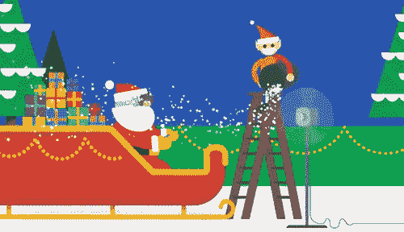

# 放弃的礼物

> 原文：<https://dev.to/chromiumdev/the-gift-of-giving-up-1lgl>

我是[谷歌圣诞老人追踪器](https://santatracker.google.com)(在网上)的工程主管，这是一个为每个人提供的节日主题体验。这个团队由 20%的人组成(这是谷歌内部描述“内部志愿者”的一个概念)，尽管有一些核心工程师在 12 月 25 日之前在网站上工作了几个月。

在圣诞老人追踪器上工作绝对是一种享受。我们的截止日期很紧——精灵为我们提供了圣诞老人的飞行计划，总是在世界协调时 24 日 10:00 开始。但我们也在 12 月初推出圣诞老人村，它充满了教育和有趣的体验，如基于块的[编码](https://santatracker.google.com/codeboogie.html) [游戏](https://santatracker.google.com/codelab.html)和[打雪仗](https://santatracker.google.com/snowball.html)。

2018 年的圣诞老人基本上是一个基于聚合物 2.0 的网站，其中包括长达十年的代码。它将[应用外壳](https://developers.google.com/web/fundamentals/architecture/app-shell)模型发挥到了极致——我们有大约 50 个独特的场景和游戏供用户导航。一些场景在整个 12 月的不同日子开放，例如追踪者本身，它只在圣诞老人飞行时开放。

就技术栈而言，Polymer 让我们构建了网站的“chrome”——菜单、边栏、按钮和导航体验(我制作了一个视频)📹关于这个去年)。它使用 Web 组件，这意味着我们还为旧浏览器导入了阴影 DOM 和自定义元素 polyfills。在常青树中，这只是意味着优势，而[在 2019 年](https://blogs.windows.com/windowsexperience/2018/12/06/microsoft-edge-making-the-web-better-through-more-open-source-collaboration/)这可能不会成为问题。这不是一个布道的帖子，但是 WCs 帮助我们以一种基于标准的方式快速构建连接的组件。

# 重写

因此，Polymer 2.0 使用 HTML 导入来引入其依赖项——这是 Chrome 推动的事情，但从未获得广泛采用。它将在 2019 年 3 月左右被 Chrome 移除，JavaScript 控制台会很高兴地通知你。

重要的是，我们怀疑圣诞老人追踪器将会在三月份对 Chrome 用户停止工作。⚠️😱

解决方案是[使用 ES 模块](https://www.youtube.com/watch?v=fIP4pjAqCtQ&t=0s&list=PL5vCN4IjFTd40C6QRiHfs6h4MOdjbRo3B&index=14)。聚合物本身很大程度上不受影响，但我们需要迁移到它的 3.0 版本，这是 2.0 的机械转换，以使用 ES 模块代替。

我们在每年 10 月左右开始开发圣诞老人追踪器，工作两个月直到 12 月，然后在整个 12 月发布较小的更新(有时是错误修复，有时是新游戏或视频)。

今年，我们从启动 ES 模块迁移开始，并通过现代化圣诞老人追踪器来实现这一点:也就是重写整个系统。这是所有工程师都喜欢做的事情，但我们觉得最初在 2013 年左右构思的基于聚合物的版本正在显示其年龄:构建需要 20 多分钟，并且它使用的工具已经被很好地取代。开始一个新的代码库是有意义的。

这种情况持续了几个星期。我上面说的“App Shell”大多是移植过来的。我们选择使用 [lit-element](https://github.com/Polymer/lit-element) 而不是 Polymer 3.0。但是迁移我们 50 个单独场景中的每一个，有时是十年前的代码，进展相当缓慢。挑战包括:

*   我们将每个场景移动到它自己的`<iframe>`(为了性能和安全)，而不是将代码放入父帧

*   一些现代场景是专门使用 Polymer 2.0 编写的，而不是可移植的 JavaScript

*   与以前的构建系统紧密耦合

压力很大。它比我们需要的要慢——因为我们实际上有 50 个工作单元，相对于 12 月 1 日来看项目是如何跟踪的是相当琐碎的。这将是必要的船舶缩小版本的圣诞老人追踪器给我们的用户。

因此，在重写了几个星期后...

我们停下了。

在 12 月 1 日前一周多一点的时候，我们刚刚决定不值得这么做。我们关注的是*开发者体验*——新的代码库是🌈令人惊异的🌈:它用 1/10 的时间编译了我们的代码，它正确地使用了 ES 模块，等等。—但发售它会损害我们用户的利益，他们只会认为它缺少游戏或功能。

# 拯救之恩

精明的用户可能已经注意到我们挽救了一些新的代码库。今年的一个新游戏，[精灵制造者🧝‍♀️](https://santatracker.google.com/elfmaker.html) ，通过旧代码库加载了*新的*代码库——你可以通过它的`<iframe>`用途以及游戏内部如何使用 lit-element 来看到这一点。

尽管感觉有点脆弱——为了构建和发布圣诞老人追踪器，我们现在有了两个完全独立的库，它们通过一个巧妙的组合被结合在一起，这个组合由`gulp`、手写的构建脚本和 bash 组成——这个*比任何人预期的都做得好。*

虽然团队认为完全重写是最有意义的，但我们开始时有一点工程上的自大:当然这是正确的决定，代码库已经过时了，等等。通过“放弃”完全重写，但仍然发布*一些*新东西，我们学到了很多*而没有*负面影响用户体验。

必须在 2019 年 3 月之前迁移到 ES 模块。但是现在，我们有了更多的数据，可以做出明智的决策。

# 是的，但我们还是得这么做

我们推迟了一个问题。圣诞老人追踪网站需要在 2019 年 3 月前移植，但我们现在有一个更好的位置来这样做。

虽然圣诞老人追踪器是一个假日景点，我们的大多数用户在整个 12 月都会来拜访我们，但我们全年都可以联系到。对于我们的教育游戏来说尤其如此，我们知道教育者们全年都在使用这些游戏。在我居住的悉尼，寒冷的主题在一年中完全不同的季节都有意义，12 月 25 日是☀️ 30 摄氏度以上，这一点可能尤其如此。

这意味着我们希望在 10 月份正常的圣诞老人追踪器开发周期之前完成工作。但是，通过做出艰难的决定，不发布新的代码库*现在*，不仅仅为了回到我们开始的地方*，我们可以正确地完成它，而不需要巨大的压力。*

我承认我处于一个特权的位置:大多数工程师不会在假日主题网站上工作，而是受制于他们的客户，或者商业需求和时间表。但在许多方面，圣诞老人追踪器都有类似的特点——谷歌每年都做，因为它很有趣，因为人们喜欢它，但我们有同样的艰难期限——圣诞老人和假日季节实际上是我们的客户。

# 放弃的礼物

圣诞老人追踪小组现在要好好休息一下了:就像圣诞老人和他的团队一样。

是的，我们将不得不在 2019 年初回到工作岗位，为几乎整整一年后的假期做准备。但是我们可以做得很好，而且不需要牺牲我们的用户体验。对我来说，这是正确的技术债务。

我希望你能给自己一个礼物，放弃这些假期，以减轻你的压力，同时让你的用户也同样快乐。

🎅🤶🎄🎁

感谢今年所有帮助圣诞老人追踪系统的人。