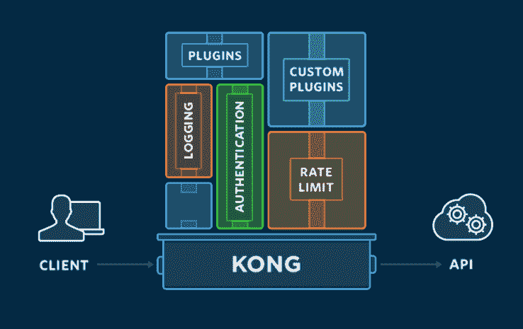
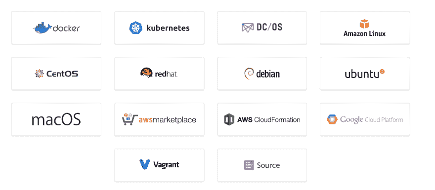
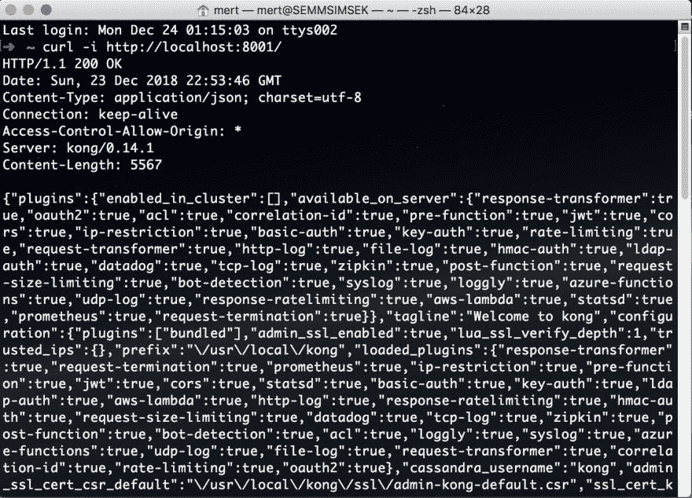
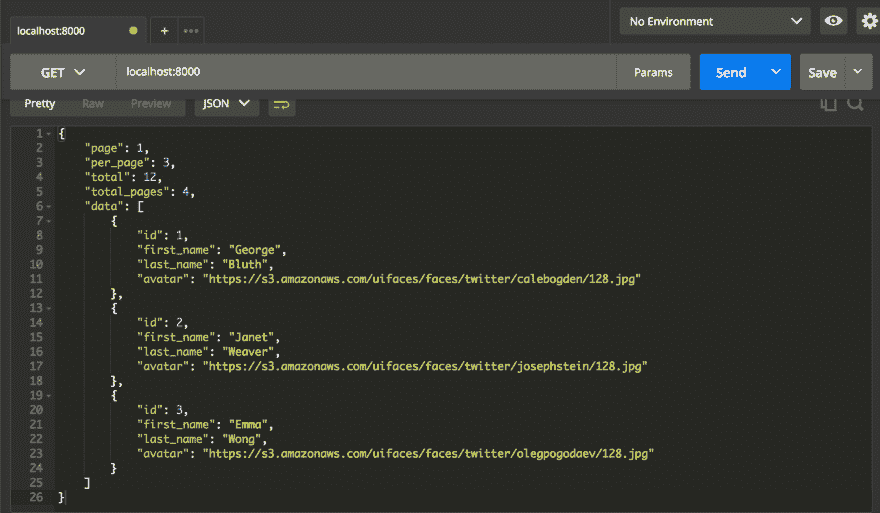
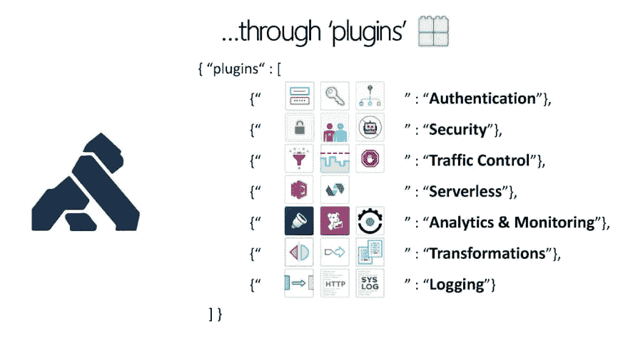
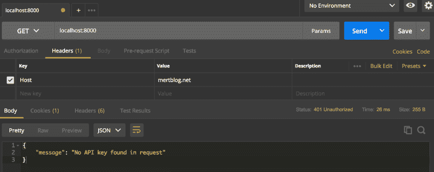
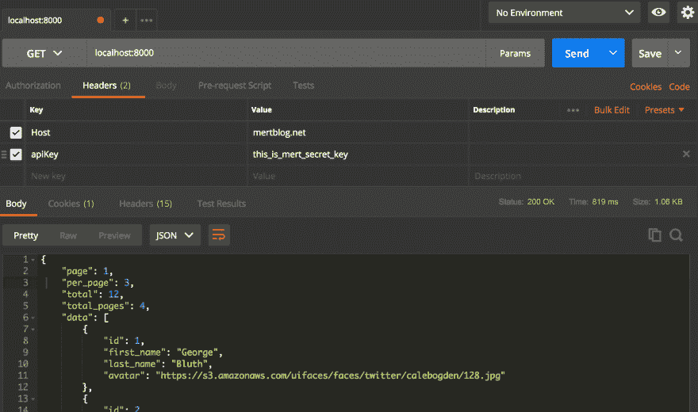

# Kong 微服务 Api 网关与 Docker

> 原文：<https://dev.to/_mertsimsek/kong-microservices-api-gateway-with-docker-12g5>

近年来，我们所有人都提到微服务，尝试在我们的公司中以这种方式提及。说到微服务，管理我们的服务有很多主题。它们是认证、安全、日志、缓存系统、代理服务、响应速率限制、请求大小限制等。针对这些插件，Mashape 公布了 Kong 微服务 api 网关。所有的插件都准备好了。此外，你可以根据你的场景编写单独的插件。太酷了！

[](https://res.cloudinary.com/practicaldev/image/fetch/s--oqtrLWQd--/c_limit%2Cf_auto%2Cfl_progressive%2Cq_auto%2Cw_880/https://thepracticaldev.s3.amazonaws.com/i/5nszenm2bcqu0gae134h.png)

首先，让我们用 Docker 安装 Kong 我们的工作空间。Docker 是你的电脑必须安装的。另一方面，我将用 Docker 直接演示孔的安装。还有另一个系统安装了孔。

[](https://res.cloudinary.com/practicaldev/image/fetch/s--qRcQwdlz--/c_limit%2Cf_auto%2Cfl_progressive%2Cq_auto%2Cw_880/https://thepracticaldev.s3.amazonaws.com/i/oygfzdsrd72egeqi3s7v.png)

我们应该为孔创建一个专门的码头工人网络。我用这个命令创建了一个网络。我已经定义了**孔网**的名字。

```
docker network create kong-net 
```

要使用孔，我们需要一个数据库。为此，我使用 Postgres。

```
docker run -d --name kong-database \
               --network=kong-net \
               -p 5432:5432 \
               -e "POSTGRES_USER=kong" \
               -e "POSTGRES_DB=kong" \
               postgres:9.6 
```

从现在开始，我可以拉孔的码头工人形象了。这个图像将是关于 **kong-net** 网络和 **postgres** 数据库。

```
docker run --rm \
     --network=kong-net \
     -e "KONG_DATABASE=postgres" \
     -e "KONG_PG_HOST=kong-database" \
     -e "KONG_CASSANDRA_CONTACT_POINTS=kong-database" \
     kong:latest kong migrations up 
```

下一步是用这个命令运行我们的容器。相关端口对我们的本地机器开放。你可以在下面看到它们。然后，我设置了日志文件来观察日志。

```
docker run -d --name kong \
     --network=kong-net \
     -e "KONG_DATABASE=postgres" \
     -e "KONG_PG_HOST=kong-database" \
     -e "KONG_CASSANDRA_CONTACT_POINTS=kong-database" \
     -e "KONG_PROXY_ACCESS_LOG=/dev/stdout" \
     -e "KONG_ADMIN_ACCESS_LOG=/dev/stdout" \
     -e "KONG_PROXY_ERROR_LOG=/dev/stderr" \
     -e "KONG_ADMIN_ERROR_LOG=/dev/stderr" \
     -e "KONG_ADMIN_LISTEN=0.0.0.0:8001, 0.0.0.0:8444 ssl" \
     -p 8000:8000 \
     -p 8443:8443 \
     -p 8001:8001 \
     -p 8444:8444 \
     kong:latest 
```

只要一切顺利，你就可以看到孔这个命令的效果。

```
curl -i http://localhost:8001/ 
```

[](https://res.cloudinary.com/practicaldev/image/fetch/s--5WhKAR-z--/c_limit%2Cf_auto%2Cfl_progressive%2Cq_auto%2Cw_880/https://thepracticaldev.s3.amazonaws.com/i/td0jce85p8lavtup2vqt.png)

### 服务

首先，我们需要学习服务。你可以认为像我们的 API 这样的服务。每个服务一个 api。通过这种方式，我们可以定义由孔管理的所有服务。嗯，我将创建一个如下所示的服务。

```
curl -i -X POST \
  --url http://localhost:8001/services/ \
  --data 'name=mertblog-service' \
  --data 'url=https://reqres.in/api/users?page=2' 
```

在我们开始向服务发出请求之前，我们需要向它添加一个路由。路由指定请求到达 Kong 后如何发送到它们的服务。一个服务可以有许多路由。

```
curl -i -X POST \  
  --url http://localhost:8001/services/mertblog-service/routes \         
  --data 'hosts[]=mertblog.net' 
```

从现在开始，孔会正确地将请求转发给我们服务。

[](https://res.cloudinary.com/practicaldev/image/fetch/s--lvMEAdDp--/c_limit%2Cf_auto%2Cfl_progressive%2Cq_auto%2Cw_880/https://thepracticaldev.s3.amazonaws.com/i/2qoop9o8853a9vr881v9.png)

### 插件

我们需要谈谈插件。外挂是孔的艺术杰作。因为，你可以根据你的场景选择任何一个外挂。因此，你选择的插件很容易适应你的项目。它们允许您轻松地向服务添加新功能，或者使服务更易于管理。

[](https://res.cloudinary.com/practicaldev/image/fetch/s--R9wiy2nR--/c_limit%2Cf_auto%2Cfl_progressive%2Cq_auto%2Cw_880/https://thepracticaldev.s3.amazonaws.com/i/xmx7k1mh5o7fiy1ytzy1.jpg)

我们要开始做演示了。有很多认证插件。我宁愿告诉 **key-auth 插件**。最简单了。你应该在报头中发送一个密钥。

要为我们在 Kong 中配置的服务配置 key-auth 插件，发出以下 cURL 请求。

```
curl -i -X POST \
  --url http://localhost:8001/services/mertblog-service/plugins/ \
  --data 'name=key-auth' 
```

在此之后，我检查我们的端点，我不能达到，因为该插件。状态为 **401 未授权**并有消息。

[](https://res.cloudinary.com/practicaldev/image/fetch/s--rNxKk1Jg--/c_limit%2Cf_auto%2Cfl_progressive%2Cq_auto%2Cw_880/https://thepracticaldev.s3.amazonaws.com/i/y1i923mmy73jm3xtl393.png)

### 消费者

我们学习了如何给孔添加插件。我们将学习如何向您的 Kong 实例添加消费者。消费者与使用您的服务的个人相关联，可用于跟踪、访问管理等。

创建一个名为**梅尔特**的用户如下请求。

```
curl -i -X POST \
  --url http://localhost:8001/consumers/ \
  --data "username=Mert" 
```

酷！我们有我们需要的消费者。现在，我们应该为我们的消费者梅尔特创建一个密钥。

```
curl -i -X POST \
  --url http://localhost:8001/consumers/Mert/key-auth/ \
  --data 'key=this_is_mert_secret_key' 
```

现在，我们能够检查我们的服务。如您所见，我已经添加了带值的 **apiKey** 参数。太酷了。我够得着。

[](https://res.cloudinary.com/practicaldev/image/fetch/s--xwrTYuCZ--/c_limit%2Cf_auto%2Cfl_progressive%2Cq_auto%2Cw_880/https://thepracticaldev.s3.amazonaws.com/i/5cejdxyn9cf19a6y458b.png)

### 得出结论

在本文中，目前，我们已经了解了添加服务、路线、消费者和启用插件的基础知识。然而，孔有更多的功能供我们发现，如果我们需要，我们可以开发自己的插件。