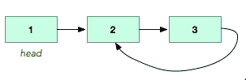

# 编程挑战:不仅仅是脑筋急转弯

> 原文：<https://dev.to/_morgan_adams_/programming-challenges-more-than-just-brain-teasers-mi1>

# 当你只有一把锤子时

“当你只有一把锤子时，一切看起来都像钉子”。这被称为“工具定律”或“马斯洛之锤”(加上其他一些绰号)。这背后的意思是，有时我们对某个工具变得熟悉或舒适，并倾向于使用该工具来解决问题。这篇文章讲述了我最近的一次经历，我放下了我的一把锤子，给我的精神工具带添加了一些新的东西。

我在学习的早期就偏离了编程，转向了一个更具操作性的角色。一件显而易见的事情是，我所了解的工具和系统处理问题的效率各不相同。MySQL 并不总是最好的数据库。Nginx 不是最好的负载均衡器，即使你能让它达到负载均衡。我能写一个 1000 行的 bash 脚本并不意味着我应该写。

最终，我不得不继续学习解决问题的新方法。我订阅了各种博客，观看了发布在网上的会议演讲，在 Twitter 上关注了工程领导者，甚至放弃了 Perl(这是大约 8 年前的事了:)。

我最近又开始关注我的编程技能，但是在我谈论这个之前，先回顾一下我十几岁时开始编程的时候。

# 一种模式

给定一个代表迷宫的 m×n 2D 数组，返回一个代表迷宫导航解决方案的索引列表。

作为一个 17 岁的 Java 编程新手，我被难住了。每次我运行一些测试，“ArrayIndexOutOfBoundsException”或“错误:返回的解决方案有 0 个条目”。把我的脸砸在键盘上，然后说了几句脏话...我放弃了。

这是一次艰难的经历，但我记得最清楚的是另一个程序员向我展示了他如何用同样大小的 2D 布尔数组标记他走过的路径，以追踪他去过的地方。我认为这是有史以来最棒的解决方案。很明显我没怎么出去过，但这就像是我脑海中的一盏灯亮了起来。我清楚地记得他说过“有时候使用一个独立的结构来跟踪事情会更容易”。请注意，他说的是“有时”，而不是“总是”，因为我当时并没有。

我很快发现了其他编程挑战，在这些挑战中，维护另一个结构来跟踪“已访问”的项目被证明非常方便。我第一次重用这种方法是在我写一个程序在一个 [Boggle](https://en.wikipedia.org/wiki/Boggle) 板上寻找单词的时候。得心应手！但这并不总是奏效，甚至让问题变得更加困难。

# 当前日期

快进到今天...我很高兴地说，我现在又在努力提高我的编程技能了！我爱建筑！

Hackrank 是我目前花费大量时间解决各种编程挑战和阅读相关讨论的地方，这些讨论是关于其他人如何解决我正在处理的问题的(这实际上是这些挑战中我最喜欢的事情之一)。

## 周期检测

*剧透警告——我在这里讲述了解决黑客排名挑战的一些细节*

最近，我遇到了一个挑战，促使我发表了这篇文章:“周期检测”。在这个挑战中，你应该检测一个单链表中的循环。我就知道这种模式！我只需要用我访问过的节点保存一个单独的结构，如果我穿越了这些节点中的一个，就可以检测到循环。

幸运的是，我处理的所有这些问题的边缘案例让我大脑中的齿轮开始转动。这个解决方案似乎有些不对劲。这没有错，但是如果我有一个有一百万个节点的链表呢？如果它有更多呢？有没有解决这个问题的其他方法？

提交我的解决方案后，我翻到“讨论”部分，在那里我睁开了眼睛，我对别人简短而优雅的解决方案垂涎三尺。

他们只是用另一个指针以两倍的速度遍历列表。如果第一个指针和第二个指针完全相同，那么链表中就会出现循环。聪明，比我的解决方案简单多了！

我还可以在哪里看到碰撞类型的问题？也许我刚刚发现了另一种模式...我不经意地把它添加到我的精神工具带上。当我想到这个解决方案以及如何在网络中使用这两种技术时，我觉得很有趣。

# 你的精神工具带

学习基础知识非常有趣。更好的是，当你开始在各种基本面之间建立联系时，你会看到一个更大的图景。学习不同的解决问题的方法会让你有更多的工作可以做，让你超越你的锤子——或者更确切地说，它会帮助你识别锤子什么时候是合适的工作工具。

让你我在工作中做得更好的是学习如何解决问题和学习解决问题的新方法！即使是简单的事情。即使我们变得越来越先进和发展专业知识，重要的是要放下我们的偏见(锤子)，看看我们还能做些什么。

你除了锤子还有别的东西吗？你看到太多钉子了吗？继续磨练你的技艺，尝试新的东西，探索新的主题，阅读另一本书，阅读另一篇开发人员文章——无论你做什么...继续学习！