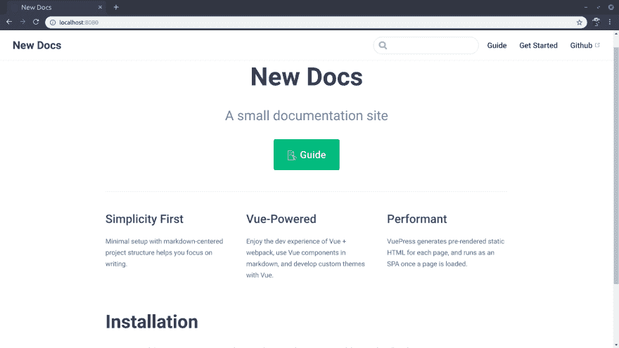
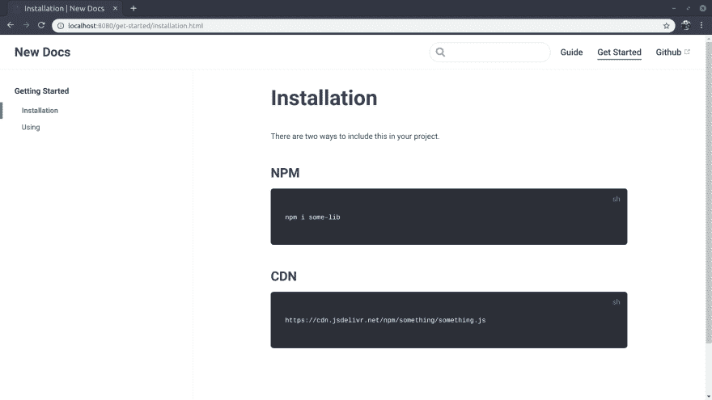
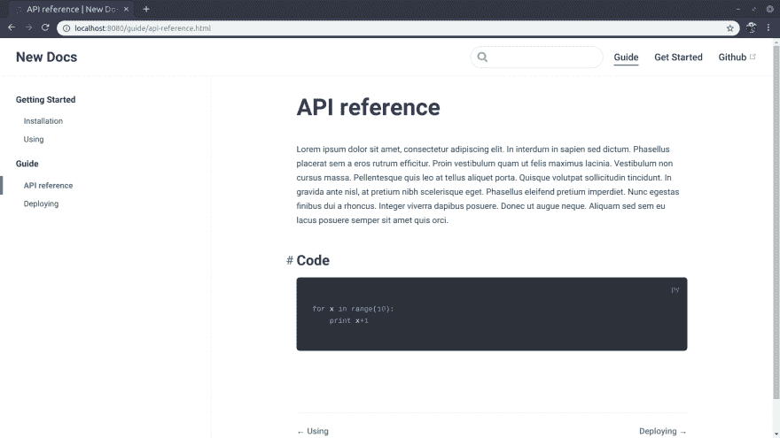
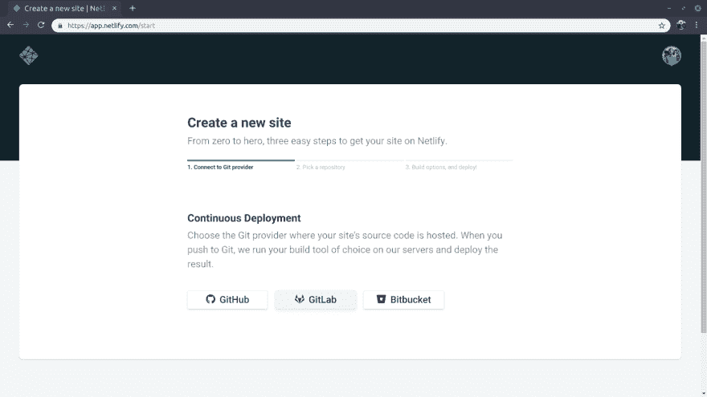
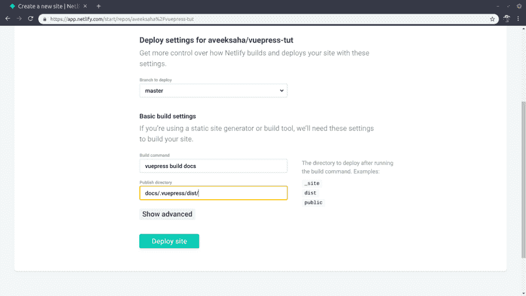
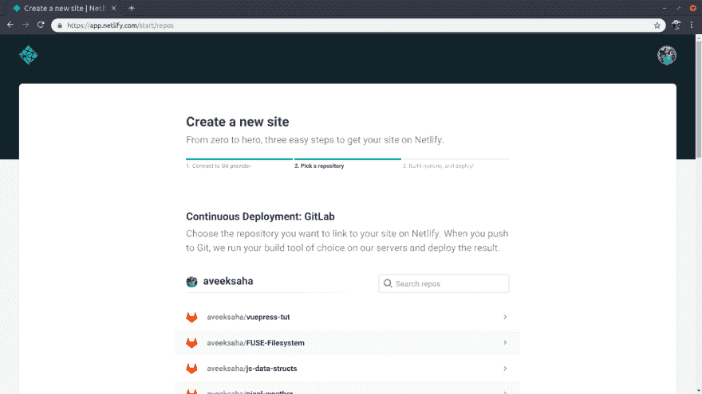

# 用 vexpress 建立一个文档网站

> 原文：<https://dev.to/aveeksaha/build-a-documentation-website-with-vuepress-3fj0>

关于如何构建和部署 vexpress 站点的初学者教程

# 简介

[VuePress](https://vuepress.vuejs.org/) 是由 Vue 供电的静态现场发电机。VuePress 使用 markdown 生成页面，这样您就可以专注于写作。此外，它允许您在 markdown 中使用 Vue 组件，并使用自定义主题。默认情况下，VuePress 带有一个响应式主题，这就是我们将在这个项目中使用的。

所有这些特性使 VuePress 成为构建文档网站的理想选择。本教程将向您展示如何在 15 分钟内建立并运行一个文档网站。

# 安装

对于这个项目，你需要节点和 npm。然后，我们将在全球范围内安装 VuePress，这样我们就可以在部署时使用 cli，也可以在本地安装。

```
npm install -g vuepress
npm install -D vuepress 
```

Enter fullscreen mode Exit fullscreen mode

# 设置

创建一个新的项目文件夹，并将当前工作目录更改到该文件夹。

```
mkdir doc-tut && cd doc-tut 
```

Enter fullscreen mode Exit fullscreen mode

然后用`package.json`
初始化这个项目

```
npm init -y 
```

Enter fullscreen mode Exit fullscreen mode

创建一个名为`docs`的文件夹

```
mkdir docs 
```

Enter fullscreen mode Exit fullscreen mode

在这个`docs`文件夹中创建一个名为`.vuepress`的新文件夹，并在其中添加一个名为`config.js`的文件。然后在`docs`文件夹中创建一个`readme.md`文件。

我们添加到 docs 文件夹的每个子文件夹都成为一个子路径。我们将添加两个名为`guide`和`get-started`的新文件夹，并将一个`readme.md`文件添加到这两个文件夹中。这意味着我们现在有两条分路线指向`/guide/`和`/get-started/`。

文件夹中的每个降价文件都变成 HTML 文件，路径是父文件夹，`readme.md`文件变成该子路径的`index.html`文件

您当前的文件结构应该是这样的

```
 doc-tut
   |----docs
   |    |--readme.md // index.html for the root directory
   |    |----.vuepress
   |    |    |
   |    |    |--config.js // configuration file for the default theme 
   |    |
   |    |----getting-started
   |    |    |
   |    |    |--readme.md
   |    |
   |    |----guide
   |        |
   |        |--readme.md
   |
   |--package.json 
```

Enter fullscreen mode Exit fullscreen mode

在`config.js`文件中放置以下代码。

```
 module.exports = {
    title: 'New Docs', // Title of the website
    // appears in the meta tag and as a subtitle
    description: "A small documentation site", 
    // Google Analytics tracking code
    ga: "Analytics code", 
    themeConfig: {
        nav: [
            // links that will appear in the top navbar
            { text: 'Guide', link: '/guide/' },
            { text: 'Get Started', link: '/get-started/' },
            // external link
            { text: 'Github', link: 'https://github.com/Aveek-Saha' }, 
        ],
        sidebar: [
            // These links will appear in the sidebar
            // Create heading groups
            {
                title: 'Getting Started',
                collapsable: false,
                children: [
                    // These are pages we'll add later
                    '/get-started/installation', 
                    '/get-started/using'
                ]
            },
            {
                title: 'Guide',
                collapsable: false,
                children: [
                    // These are pages we'll add later
                    '/guide/api-reference', 
                    '/guide/deploying',
                ]
            }
        ]
    }
} 
```

Enter fullscreen mode Exit fullscreen mode

# 首页

现在我们要为我们的网站创建首页。你可以在这里阅读更多关于默认主题配置的信息。

在`docs/readme.md`中放置以下代码

```
---
home: true
actionText: 📝 Guide 
actionLink: /guide/api-reference
features:
- title: Simplicity First
  details: Minimal setup with markdown-centered project structure helps you focus on writing.
- title: Vue-Powered
  details: Enjoy the dev experience of Vue + webpack, use Vue components in markdown, and develop custom themes with Vue.
- title: Performant
  details: VuePress generates pre-rendered static HTML for each page, and runs as an SPA once a page is loaded.
footer: Made with 💚 by Aveek Saha
---

# Installation

Lorem ipsum dolor sit amet, consectetur adipiscing elit. 
In interdum in sapien sed dictum. Phasellus placerat sem a eros rutrum efficitur. 
Proin vestibulum quam ut felis maximus lacinia. 
Vestibulum non cursus massa. Pellentesque quis leo at tellus aliquet porta. 
```

Enter fullscreen mode Exit fullscreen mode

要实时观看，请在您的终端运行中打开项目目录

```
vuepress dev docs 
```

Enter fullscreen mode Exit fullscreen mode

一旦它完成编译，进入 [http://localhost:8080/](http://localhost:8080/) 查看我们刚刚创建的主页。它应该是这样的

[](https://res.cloudinary.com/practicaldev/image/fetch/s--jbjkUOgH--/c_limit%2Cf_auto%2Cfl_progressive%2Cq_auto%2Cw_880/https://home.aveek.io/blog/vuepress/screenshot1.png)

# 添加其他页面

## 开始使用

如果你还记得，我们在`config.js` ( `/get-started/installation`和`/get-started/using`)的侧边栏组中添加了两个孩子。

所以我们将把这些文件添加到`get-started`子目录中。创建两个文件，`installation.md`和`using.md`。

把这个复制到两个文件中

```
---
title: Installation
---

<!-- change the title to Using in using.md -->

# Installation
There are two ways to include this in your project.

## NPM
 ```
    npm i some-lib
    ```   ## CDN
 ```
    https://cdn.jsdelivr.net/npm/something/something.js
    ``` 
```

Enter fullscreen mode Exit fullscreen mode

一旦您添加了代码，站点应该看起来像这样

[](https://res.cloudinary.com/practicaldev/image/fetch/s--BC2xo3Zc--/c_limit%2Cf_auto%2Cfl_progressive%2Cq_auto%2Cw_880/https://home.aveek.io/blog/vuepress/screenshot2.png)

## 向导

我们创建的另一个侧边栏组 Guide 也有两个子组，`'/guide/api-reference'`和`'/guide/deploying'`。

所以我们将把这些文件添加到`guide`子目录、`api-reference.md`和`deploying.md`中。

```
 ---
title: API reference
--- 
# API reference

Lorem ipsum dolor sit amet, consectetur adipiscing elit. In interdum in sapien sed dictum. 
Phasellus placerat sem a eros rutrum efficitur. 
Proin vestibulum quam ut felis maximus lacinia. Vestibulum non cursus massa. 
Pellentesque quis leo at tellus aliquet porta. Quisque volutpat sollicitudin tincidunt. 
In gravida ante nisl, at pretium nibh scelerisque eget. Phasellus eleifend pretium imperdiet. 
Nunc egestas finibus dui a rhoncus. Integer viverra dapibus posuere. 
Donec ut augue neque. Aliquam sed sem eu lacus posuere semper sit amet quis orci.

### Code
 ```
    for x in range(10):
        print x+1
    ``` 
```

Enter fullscreen mode Exit fullscreen mode

一旦你完成了，这个网站应该看起来像这样

[](https://res.cloudinary.com/practicaldev/image/fetch/s--zeqYPPEi--/c_limit%2Cf_auto%2Cfl_progressive%2Cq_auto%2Cw_880/https://home.aveek.io/blog/vuepress/screenshot3.png)

# 部署到网络生活

首先我们要添加一个只有一行的`.gitignore`-

```
node_modules 
```

Enter fullscreen mode Exit fullscreen mode

在 GitHub 或 GitLab (Bitbucket 也可用)上创建一个新项目，然后 cd 到您的项目文件夹并运行下面的

```
git init
git remote add origin <git URL of your project>
git add .
git commit -m "Initial commit"
git push origin master 
```

Enter fullscreen mode Exit fullscreen mode

在你的浏览器中打开 [Netlify](https://www.netlify.com/) ，如果你还没有账户的话，注册一个。去你的[站点](https://app.netlify.com/account/sites)点击`New site from Git`然后按照步骤操作

1.  选择您的 git 提供商。

*   选择您刚刚创建并提交的存储库。
*   在构建选项下，转到基本构建设置，并填写以下两个字段:
    *   构建命令

```
vuepress build docs 
```

Enter fullscreen mode Exit fullscreen mode

*   发布目录

```
docs/.vuepress/dist/ 
```

Enter fullscreen mode Exit fullscreen mode

下面是这个过程的一些截图。

<figure>

[](https://res.cloudinary.com/practicaldev/image/fetch/s--rLQ7RnjJ--/c_limit%2Cf_auto%2Cfl_progressive%2Cq_auto%2Cw_880/https://home.aveek.io/blog/vuepress/screenshot4.png)

<figcaption>

第一步

</figcaption>

</figure>

<figure>

[](https://res.cloudinary.com/practicaldev/image/fetch/s---HjgbhIC--/c_limit%2Cf_auto%2Cfl_progressive%2Cq_auto%2Cw_880/https://home.aveek.io/blog/vuepress/screenshot5.png)

<figcaption>

第二步

</figcaption>

</figure>

<figure>

[](https://res.cloudinary.com/practicaldev/image/fetch/s--87yV5iH8--/c_limit%2Cf_auto%2Cfl_progressive%2Cq_auto%2Cw_880/https://home.aveek.io/blog/vuepress/screenshot6.png)

<figcaption>

第三步

</figcaption>

</figure>

然后单击部署。第一次部署可能需要一段时间，所以不要屏住呼吸。当部署完成后，访问概述中给出的站点 url，它应该看起来像这样[演示](https://vuepress-tut.netlify.com/)

# 代号&演示

活生生的例子- [`Demo`](https://vuepress-tut.netlify.com/)

本项目代号- [`Code`](https://gitlab.com/aveeksaha/vuepress-tut)