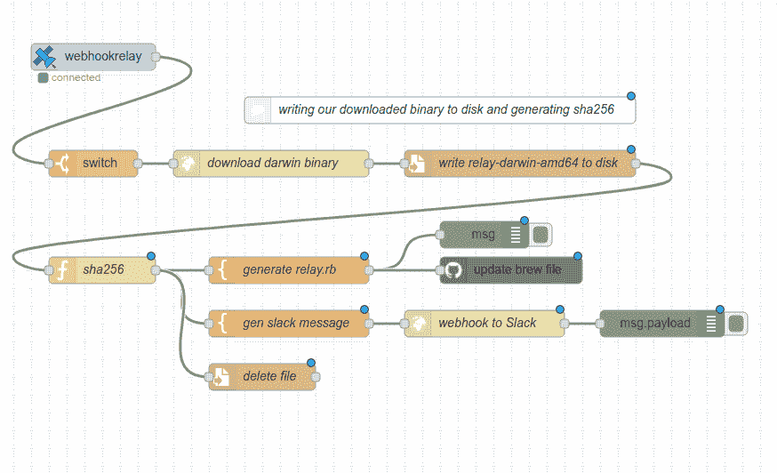

# 使用 Node-RED 自动化 GitHub 任务

> 原文：<https://dev.to/webhookrelay/automating-github-tasks-with-node-red-3cgc>

## 一些背景

虽然大多数 [Node-RED](https://nodered.org/) 社区似乎对家庭自动化感兴趣(我也是，但只是一点点，而且我真的认为它比其他家庭自动化解决方案领先几光年)，但我作为开发人员/工程师主要关注自动化我的运营任务，如更新集群资源，为此我编写了 [Keel](https://github.com/keel-hq/keel) ，通过持续交付更新 CLI 客户端，manifests。

Homebrew 是一个用于 MacOS 的软件包管理器，任何人都可以在其中创建自己的应用程序清单，以便于分发和安装。但是，brew 公式有多种工作方式，例如在安装期间编译或下载二进制文件。我的安装方法是下载一个预编译的二进制文件，但我必须时刻记得用最新的 sha 256[https://github . com/webhook relay/home brew-tap/blob/master/relay . Rb # L5](https://github.com/webhookrelay/homebrew-tap/blob/master/relay.rb#L5)更新公式。如果发布一个没有更新清单的新版本，通过自制软件安装将会失败:)嗯，有几次我忘记了:D

## 免责声明

这个流程不能直接为您重用，因为它在我的基础设施周围工作。目的是展示一些模板生成，webhookrelay node 和我还设法在 crypto node 中发现了一个问题(后面会详细介绍)。

## 堆栈

RPI 上的 Node-RED，带有[node-RED-contrib-webhookreprelay](https://flows.nodered.org/node/node-red-contrib-webhookrelay)，这样我就不需要将它暴露给互联网、 [GitHub 帐户+ node](https://flows.nodered.org/node/node-red-contrib-github) 和 Slack(这确实是可选的，但是很有帮助，因为我将大量更新推送到我的 Slack 频道)。

## 水流

实际流程如下所示:

[](https://res.cloudinary.com/practicaldev/image/fetch/s--zL57Gj-m--/c_limit%2Cf_auto%2Cfl_progressive%2Cq_auto%2Cw_880/https://thepracticaldev.s3.amazonaws.com/i/e7bcuace8q410xbviw08.png)

我在这里上传过流量:[https://gist . github . com/rusenask/93 DBD 94479 FBD 6 f1 E3 DCF 3308 da 4 ec1b](https://gist.github.com/rusenask/93ddb94479fbd6f1e3dcf3308da4ec1b)。

1.  最初，工作流是由一个构建任务触发的，这个构建任务是由 [Google Cloud Builder](https://cloud.google.com/cloud-build/docs/) 执行的，一个 webhook 是通过[这个小应用](https://github.com/webhookrelay/webhook-dispatcher)发送的
2.  流由到 webhookrelay.com 端点的 webhook 触发，该端点通过隧道路由到此处的[节点](https://flows.nodered.org/node/node-red-contrib-webhookrelay)，然后被转换为节点红色事件。
3.  然后，Flow 下载二进制文件并保存到磁盘。
4.  `sha256`由于我在通过`node-red-contrib-crypto-js`生成自定义函数节点时发现了一个问题，所以实际上需要自定义函数节点。我怀疑这个问题是由于数据被输入到加密节点的方式(不是一次性的，而是以流的形式)。即使将其设置为“一字节缓冲区”,它仍然会出现错误的 sha。所以，我不得不:

在 settings.js 中启用`require`，因为我们将需要额外的加密库:

```
 functionGlobalContext:  {  require:  require  }, 
```

然后读取文件并计算摘要:

```
var require = global.get('require');
var crypto = require('crypto');
var fs = require('fs');

var algo = 'sha256';
var shasum = crypto.createHash(algo);

var file = '/tmp/relay-darwin-amd64-nr';
var s = fs.ReadStream(file);

s.on('data', function(d) { shasum.update(d); });
s.on('end', function() {
    var sum = shasum.digest('hex');
    node.send({payload: sum});

});

return; 
```

1.  一旦我们有了 sha256 sum，我们就创建两个模板:一个用于 GitHub brew 公式模板，一个用于 Slack。
2.  对于 Github，我们只做了简单的覆盖，因为文件很小，只有 sha 和会改变。
3.  至于 Slack，我选择用他们的 webhook 集成做一个简单的 HTTP 请求，因为对于这样一个微小的需求，可用的 Slack 节点似乎有点太重了。看看需要发送的有效载荷:

```
{  "response_type":  "in_channel",  "text":  "Brew formula SHA updated to: {{payload}}"  } 
```

您可以扩展它来添加图片、按钮、附件等等，但是在这个例子中，我只需要看到一个通知。

## 总而言之

到目前为止，我对 Node-RED 非常满意。尽管用 Go/JS/Python 写所有东西非常简单，但出于某种原因，用 Node-RED 会更有趣:)我会用它来自动化越来越多的附带项目任务。还有，`function` node 是救命恩人！