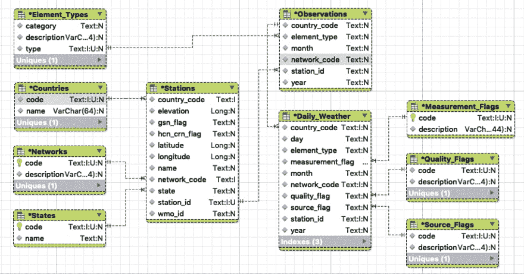
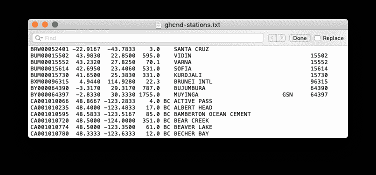
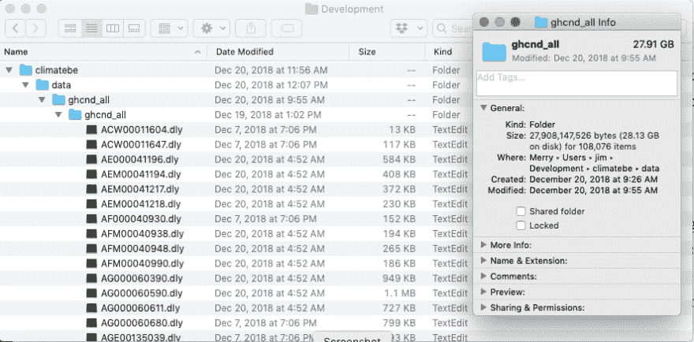
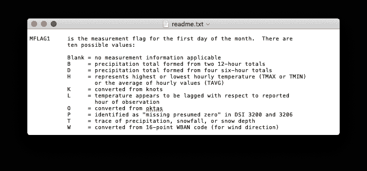
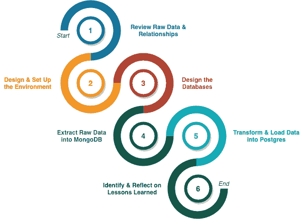

# 如何用 MongoDB 和 Postgres 进行 ETL(第 1 部分)

> 原文：<https://dev.to/chingu/how-to-etl-with-mongodb-and-postgres-part-1-5775>

第一部分，了解地形

<figure> 

<figcaption>照片由[苏珊娜·威廉姆斯](https://unsplash.com/photos/VMKBFR6r_jg?utm_source=unsplash&utm_medium=referral&utm_content=creditCopyText)上传 [Unsplash](https://unsplash.com/search/photos/transformation?utm_source=unsplash&utm_medium=referral&utm_content=creditCopyText)</figcaption>

</figure>

### 走出舒适区

有一个[舒适区](https://www.psychologytoday.com/us/blog/the-tools/201205/the-comfort-zone)真好。你的舒适区给你一个在困难和不确定的时候可以撤退的地方。它是你的避风港，是你需要思考、反思和计划时可以去的地方。但是和大多数事物一样，它也有阳光 [*阳*](https://personaltao.com/taoism/what-is-yin-yang/) 的一面，也有黑暗 [*阴*](https://personaltao.com/taoism/what-is-yin-yang/) 的一面。

当你的舒适区被用作藏身之处而不是退路时，它的阴暗面就开始发挥作用了。在那里花太多时间会抑制精神和智力的发展。鉴于 Javascript 生态系统的广度、深度和变化速度，对于 Web 开发人员来说，将走出舒适区作为学习策略的一部分尤为重要。

> "只有那些敢于冒险走得太远的人，才有可能发现自己能走多远。"——艾略特

扩展你的知识并为未来的成就打下基础的一个方法是设定一个[延伸目标](https://hbr.org/2017/01/the-stretch-goal-paradox)。延伸目标包含了“T2”难度“T3”的概念，以此来提高你的能力，以及“T4”新奇感“T5”的概念来提供动力。做一些困难的事情，如果是吸引人的和有趣的，总是更令人愉快和有回报的。

### 设定我们的延伸目标

所需的巨大容量是现代应用软件区别于前几十年开发的应用软件的一个特征。数据可视化、机器学习、科学、电子商务以及[前台和后台办公应用](https://en.wikipedia.org/wiki/Front_and_back_office_application)都需要大量数据来实现其增加[用户价值](https://www.interaction-design.org/literature/article/customer-and-user-perception-of-value-and-what-it-means-to-designers)的目标。

对前端开发人员的要求和后端开发人员的必要条件是理解与处理大量信息相关的陷阱和技术。这不仅是为了性能，也是为了实现可靠性、可用性和可维护性( [RAS](https://pdfs.semanticscholar.org/8a9d/75d6affb7c3ea65aa425a8aafecc61272163.pdf) )。

该项目首先假设，在将数据加载到操作数据库(如 SQL DBMS)进行永久存储之前，使用临时区域快速捕获、清理和组织数据是将大量数据接收到应用程序的最佳方式。这源于大量信息以及它们之间的关系对性能和运营效率的影响。

一个解决方案是开发一个提取、转换和加载( [ETL](https://www.dataintegration.info/etl) )过程，将原始数据添加到一个临时区域，比如 MongoDB 数据库，而不考虑数据质量或它们之间的关系。一旦进入临时区域，就可以在将数据移动到永久的位置(如 Postgres SQL 数据库)之前对其进行检查和清理。该策略可以实施为包含两个不同的加载过程—初始一次性大容量加载和新数据的定期加载。

### 了解原始数据的来源和格式

在开始之前，我们有必要花时间了解要进行暂存、转换和加载的原始数据。

> "不合理的匆忙是通向错误的直接道路."—莫里哀

该项目将使用由[美国国家海洋和大气管理局](https://www.noaa.gov/) (NOAA)提供的[全球历史气候网络——每日](https://catalog.data.gov/dataset/global-historical-climatology-network-daily-ghcn-daily-version-3) (GHCND)数据集中的数据。选择这个数据是因为它的容量(28GB)，而不是它的内容。目标不是使用这些数据，而是探索有效处理大量数据的技术。

GHCND 将来自全球 90，000 个地面站的 30 个不同来源的每日天气观测数据合并为一个单一的数据源。这些观测大部分是降水测量，但也可能包括每日最高和最低温度、观测时的温度、降雪量和积雪深度。

下列文件中天气数据格式的格式和关系在它们所附带的 readme.txt 文件中有记录。

*   `ghcnd-all.tar.gz`:日常观察文件。每个文件包含单个观测站的测量结果。
*   `ghcnd-countries.txt`:国家代码(FIPS)和名称列表
*   `ghcnd-inventory.txt`:列出每个站和元件记录周期的文件
*   `ghcnd-stations.txt`:站点列表及其元数据(如坐标)
*   `ghcnd-states.txt`:美国州和加拿大省代码列表

检查原始数据的结构和格式可以创建一个实体关系图，描述不同的信息组以及它们之间的关系。请记住，此时这不是一个数据库设计。它仅仅是一个工具，用来理解各种数据元素、它们的属性以及它们之间的关系。

<figure> 

<figcaption>图 1 —实体关系图</figcaption>

</figure>

每日观测包含一个标识号，定义为一个聚合字段，由国家代码、识别观测站使用的编号系统的网络代码和站标识符组成。该字段用于将站点与其观测值相关联。

<figure> 

<figcaption>图 2 —原始气象站数据</figcaption>

</figure>

测量的年份和月份以及元素类型用于限定每个观察值。元素类型有助于描述观测对象——降水、降雪、温度等。

<figure> 

<figcaption>图 3 —原始气象观测数据</figcaption>

</figure>

一个包含 31 个元素的数组包含观察值，每个月的每一天一个。观察值由以下部分组成:

*   代表一个月中第*天的数字*
*   *测量标志*描述了测量值(例如，由两个 12 小时总量形成的总降水量)
*   一个*质量标志*定义了是否成功进行了测量，如果没有，则定义了检测到的错误(例如，重复检查失败)。
*   定义观测起源的*源标志*(例如，美国自动表面观测系统)
*   包含测量值的*值*

问题的范围变得很明显，因为天气观测目前包含在超过 108K 个独特的文件中。仅此一点就强调了对数据加载过程进行深思熟虑的分析和设计的必要性。

<figure> 

<figcaption>图 4 —气象观测文件目录</figcaption>

</figure>

除了每日天气观测文件之外，其他文件包含描述观测和台站的各种属性的元数据，这可能是显而易见的，也可能是不明显的。例如，`ghcnd-countries.txt`定义了国家代码及其对应的名称。

观察结果中也有没有正式定义的数据。具体来说，`readme.txt`文件定义了元素类型的值以及度量、质量和源标志的值，但是这些代码没有机器可读的定义。

<figure> 

<figcaption>图 5 —测量标志值</figcaption>

</figure>

### 接近

> "计划不太重要，但规划是必不可少的."温斯顿·丘吉尔

该项目分为如下所示的六个高级步骤，每个步骤都包含详细的任务，必须完成这些任务才能认为该步骤已完成。与任何项目一样，从高层次步骤中获得的结果和经验教训将用于改进后续步骤。

<figure> 

<figcaption>图 6 —高级步骤</figcaption>

</figure>

遵循[敏捷](https://agilemanifesto.org/principles.html)方法，每一步所需的详细规范和设计将被推迟到需要时。这可以防止浪费时间为我们还不知道的事情制定详细的计划，或者抵制变化，因为它可能会改变“计划”

### “凤凰必须燃烧才能出现”

<figure> 

<figcaption>照片由[马库斯·达尔科尔](https://unsplash.com/photos/Slq6WuNVeAc?utm_source=unsplash&utm_medium=referral&utm_content=creditCopyText)上[下](https://unsplash.com/search/photos/wipeout?utm_source=unsplash&utm_medium=referral&utm_content=creditCopyText)</figcaption>

</figure>

珍妮特·菲奇(Janet Fitch)一定很清楚扩大自己舒适区范围的必要性，所以她说:“凤凰必须燃烧才能出现。”在个人发展的持续过程中，一定要超越自己的界限。不管你选择的职业是什么，是[晶圆厂操作员](https://dot-job-descriptions.careerplanner.com/WAFER-MACHINE-OPERATOR.cfm)还是网络开发人员，使用像“延伸目标”这样的工具来增加你的知识，拓宽你的经验，以及[向前失败](https://www.forbes.com/sites/mikemaddock/2012/10/10/if-you-have-to-fail-and-you-do-fail-forward/#4bb8075158e5)都是至关重要的。

> “失败应该是我们的老师，而不是我们的承担者。失败是拖延，而不是失败。这是暂时的迂回，不是死路一条。失败是我们只有通过什么都不说、什么都不做、什么都不是才能避免的。”—丹尼斯·威特利

在本文中，我们已经为一个处理大量数据、NoSQL 和 SQL 的雄心勃勃的 ETL 项目搭建了舞台。从这个起点开始，没有成功的保证，因为有相当多的未知，我们将使用不熟悉的技术和技巧。然而，这个旅程将是有益的，犯错误将是过程中受欢迎的一部分，但是我们作为结果学到的东西将帮助我们成为更好的开发人员。

***接下来—第二部分，设计&布置环境。*T3】**

* * *