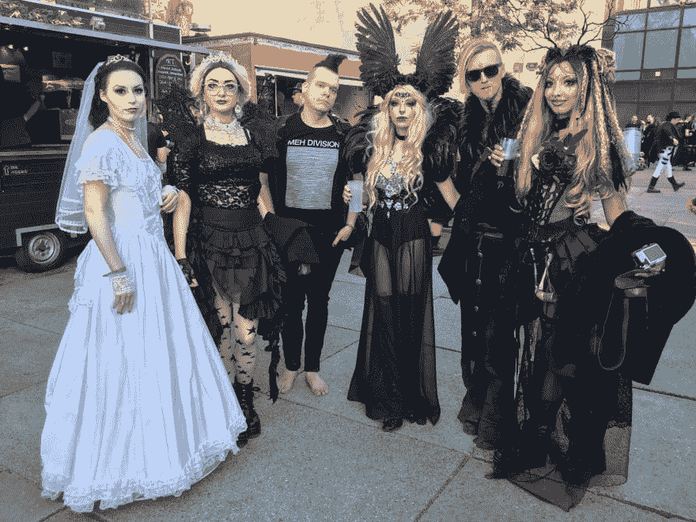

# 2018 年我做了什么

> 原文：<https://dev.to/kayis/what-did-i-do-in-2018-339f>

*[封面图片由瑞安·哈维在 Flickr 上](https://www.flickr.com/photos/ryanh/)*

2018 年就要结束了，想回顾一下这一年做了什么。我认为回顾是有好处的，因为通常你并没有意识到你真正完成了什么。

## 一月

2018 年对我来说是以一个项目的结束开始的，一个本该在 2017 年 6 月开始的项目，却在 8 月开始了。它也应该在 10 月份结束，但却在 1 月份结束。胡猜想这就是自由职业者的生活吧？

我也试着买过车，但不知何故一直没有，lol。

## 二月

我得到了一些硕士学习的咨询，希望这能让我在 2018 年完成硕士学位。猜猜，什么？我没有。23 个学期还在继续。

但我也做了第一次非大学的公开演讲。这是在多角恋和单性恋的人面前讲述的一夫多妻制，他们很喜欢这个故事<

## 三月

这个月我完成了另一个始于 2017 年的项目，应该已经完成了，但是 whelp...

我还去了一场 IAMX 演唱会。

## 四月

我去了一个“如何开始一个商业聚会”，这是一个不错的聚会，主持这个聚会的人真的尽力给我实际的帮助。遗憾的是没有足够的时间给我一些建议，我也没有时间再去那里。

但是四月底我拿到了 AWS 证书，所以至少:D 发生了一些事情

## 五月

我参加了[推手大赛](https://dev.to/devteam/announcing-the-pusher-contest-winners-1dlo)，希望和[一局](https://github.com/kay-is/startup-clix)拿下这个东西。最后我只得到一个亚军的价格。嗯，我不得不承认这个游戏没那么好玩。从那时起，我仍然有我赢得的 AdaFruit 的东西，我应该最终用它来建立一些东西:)

我让我的一个朋友设计了一件衬衫。我想在“Wave Gothik Treffen”音乐节上穿它，我做到了。

出于营销目的，我把其中一些送给了我的朋友，但我一件衬衫也没卖出去，还损失了大约 200 欧元。猜测那就是创业 XD

## 六月

我 2016 年创作的 Github 教程 [React from Zero](https://github.com/kay-is/react-from-zero) 得到了上千颗星，我申请了 CodementorX 计划。

我给自己买了一个沙发作为生日礼物，还去看了动漫展。

## 七月

美国的一家小出版商给了我一份出书合同。他们看了我的 React 教程，很喜欢。

我也用 [CodementorX](https://www.codementor.io/) 完成了我的面试过程，在关于 React 的技术面试中，面试官在过去几周的新闻中看到了我的 React 教程，所以面试进行得很顺利，哈哈。

我还参加了一个游戏开发者聚会和克里斯托弗街日。

## 八月

我参加了 CodementorX 项目的第一次面试，这似乎是今年唯一一次。没有任何结果。

这是我决定 100%专注于这本书的时候，希望至少会有所收获。

## 九月

写作，写作，写作...

## 十月

完成了主要的写作，并增加了额外的内容，如截图和测验。而且，从预售中获得了第一大笔钱。

我也开始重新面试项目。

得到了一个跟进项目，可能还有一个新客户，但他们后来跟了别人，因为我的跟进项目花了太长时间。

## 十一月

新书发布和黑色星期五的销售带来了一些所需的额外收入，因为我那个月刚开始做项目工作，要到 12 月份才能拿到工资。

此外，一些读过这本书的人写信给我说，他们用学到的技能找到了一份工作。让我很开心:)

我还参加了一个复古派对，他们有一个舞池和一个游戏室，里面有老式游戏机和一台虚拟现实系统:D

## 十二月

我完成了后续项目的一大块，那就是将 iOS React-Native 应用移植到 Android 上。

这是一个非常有趣的项目，因为我已经有两年没有接触那个项目的`android`目录了，并且有很多原生模块(视频、应用内购买、通知等等。)需要被换出。

在这里了解了很多关于 iOS/Android 的区别。如果我们把两者的优点结合起来，它们可以成为一个很好的平台...现实 XD

我也是 React 综述播客的嘉宾，在那里我谈论了 React-Hooks、我的书《从零开始反应》和作者生活。我觉得该集会在 2019 年 1 月上映。

这也很有趣，只是和一些有趣的人聊天。虽然我自己不听播客，但我很乐意再次用播客来说话。

我也开始录制“从零开始反应”的视频课程，这是我以前尝试过的，但现在想更专业地学习。

## 整体

我把大部分时间投入到我的人际关系中，可能有太多不协调的时间投入到我的生意中。

我今年瘦了 8 公斤，这是一件好事，因为在过去的几年里我变得有点超重，这使我的打鼾更严重。

我没有像我喜欢的那样写博客或进行培训，主要是因为我投入到业务中的所有不协调的时间。

## 明年

首先，我将完成所有从零开始的反应。包括反馈、出版、完成视频课程。

我还计划了一本以 AWS 为重点的新书和/或视频课程，但我仍需敲定细节。

我想订购所有的商务用品，这样我就不会老是想着它。

也许播客会给我介绍新的有趣的人和机会？谁知道呢。

反正我是炒作未来会带来什么。