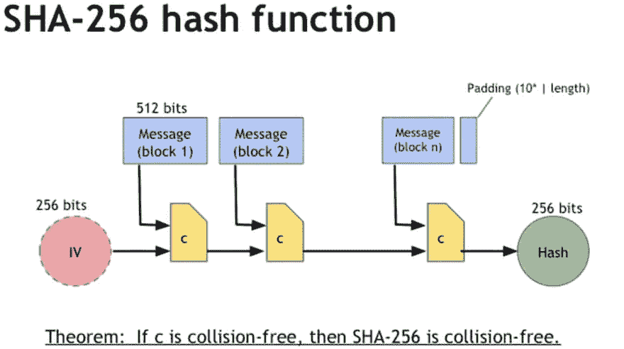

# "加密哈希函数"

> 原文：<https://dev.to/zhaohuabing/-----cryptographic-hash-function-3710>

> 这一系列文章是我在博客[zhaohuabing.com](https://zhaohuabing.com)上发表的“比特币和加密货币技术”在线课程的笔记

## 哈希函数

哈希函数是一个数学函数: *H(X)=Y*

*   h:接受输入值并计算输出值的散列函数
*   x:散列函数的输入，它可以是任何长度的任何数据
*   y:哈希函数的输出:一个固定大小的位(，它可以是 256，384，516...，比特币使用 256)

## 密码属性

用于加密目的的哈希函数应该具有以下属性:

### 无碰撞

**定义:**

如果:

不可能找到两个值 X1 和 X2，那么 *X1！=X2* ，然而 *H(X1)=H(X2)*

或者换句话说，

不可能找到能够产生相同输出的两个输入。

**说明:**

冲突确实存在，因为输入可以是任何数据，而输出只有 2 到 256 种可能性。

但是对于一个好的散列函数来说，在一个可接受的时间框架内找到它们是不可能的，即使使用地球上所有的计算机来一起解决这个问题。

我们可以利用散列函数的这一特性为给定的数据创建一个摘要。通过比较哈希摘要，我们可以判断一个大文件在传输过程中是否被修改或损坏，这通常用于下载软件。

### 隐藏

**定义:**

一个散列函数 H 是隐藏的，如果:

当一个秘密值 R 是从一个高度分散的分布中选取的，那么给定散列结果 *H( R/|X)* ，不可能找到 X。/|意味着两个字符串的连接。

**我们要解决的问题:**

我们想要一个散列函数，通过它的输出来找出输入是不可行的。

问题是，如果只有几个输入值，那么通过简单地尝试所有可能的输入值并查看它们是否与输出匹配，就可以很容易地通过输出来确定输入是什么。

**解决方案:**

将输入与随机 R 连接起来，随机 R 是从高度分散的分布中随机选择的，如下: *H( R/|X)*

**说明:**

随着 R 附加到输入中，现在通过遍历所有的值来计算输入是不可行的，因为有太多的可能性。

R 用于隐藏输入，通过使用 R，哈希函数可以隐藏输入，同时暴露输出。

#### 隐藏属性的两种用途

##### 1。承诺

隐藏属性的这种用法在讲座中有解释。

**场景:**

我们想做出承诺，保守秘密，以后再透露给别人。

**要求:**

*   这种承诺只有在揭示出来后才能被看到
*   承诺不能改变。
*   一旦承诺被披露，其他人可以核实

**实施:**

*hash(message/| key)= commitment*

*   寄语:我们想要做出的承诺，可能只有几个值。
*   密钥是从用于隐藏消息的展开分布中生成的值
*   承诺:与密钥连接的消息的散列

**说明:**

1.  你想对别人做出承诺，传递信息。可能是任何信息。
2.  您选择一个生成的密钥来隐藏消息。
3.  您得到了关键消息组合的散列。
4.  您将散列结果(即承诺)发布给其他人，而仅将密钥和消息留给自己。所以其他人知道你做出了承诺，但他们不知道具体是什么。
5.  过了一会儿，你决定公开这个承诺，所以你发布了这个密钥和消息。
6.  其他人可以使用哈希函数 *hash(message/|key)* 计算哈希结果，与你之前发布的 hash(commitment)进行比较。如果是一样的，他们可以验证你没有改变已经做出的承诺。

> *   Because a key is used to hide the message, others can't figure out what the message is until you reveal it.
> *   Because of the collision-free feature, you can't find a message that' makes *hash (message'/| key) = hash (message/| key)* , so the submitted message cannot be changed after it is published.

##### 2。安全密码

隐藏哈希属性的另一个常见用途是保护密码。

**场景:**

当用户登录时，网站需要验证用户密码。一种更安全的方法不是将密码存储在系统中，而是只存储密码的哈希，并比较哈希来验证用户。这样，即使系统被攻击者破解，用户密码也不会有危险，因为攻击者不能通过散列得到密码。

但是仍然有一个问题，许多人倾向于使用简单的单词作为他们的密码。攻击者可以列出一长串人们常用的密码，预先计算这些密码的哈希，并使用这些哈希来攻击系统，以找出密码是什么。这叫彩虹攻击。

**解决方案:**

使用随机生成的“salt”来保护密码。

*hash(password/| salt)= output*

**说明:**

为了解决这个问题，我们可以在密码后面附加一个生成的随机值，这个值通常被称为“salt”。Salt 与散列密码一起保存在系统中。因此，系统可以从用户密码和 salt 的组合中获得哈希，将其与存储的哈希进行比较，以验证用户身份。

通过在密码后添加 salt，攻击者就不能再使用预先计算好的密码哈希映射来攻击系统。即使两个用户碰巧选择了相同的字符串作为他们的密码，系统中存储的哈希也是不同的，因为他们的盐不同，这是随机生成的。

**举例:**

> 这个例子摘自[维基百科](https://en.wikipedia.org/wiki/Salt_(cryptography))

| 用户名 | 密码 | 盐值 | 要哈希的字符串 | 哈希值= SHA256(密码+ Salt 值) |
| --- | --- | --- | --- | --- |
| 用户 1 | 密码 123 | E1F53135E559C253 | 密码 123+E1F53135E559C253 | 72ae 25495 a 7981 c 40622d 49 F9 a 52 e4f 1565 c 90 f 048 f 59027 BD 9 c 8 c 8900 D5 C3 d 8 |
| 用户 2 | 密码 123 | 84B03D034B409D4E | 密码 123+84B03D034B409D4E | b4b 6603 ABC 670967 e 99 c 7e 7 f 1389 e 40 CD 16 e 78 ad 38 EB 1468 EC 2 aa 1e 62 b 8 bed 3a |

如上表所示，不同的 salt 值将创建完全不同的散列值，即使明文密码完全相同。此外，字典攻击在一定程度上得到了缓解，因为攻击者实际上无法预先计算散列。但是，salt 不能防止常见的或容易猜到的密码，因为攻击者仍然可以将 salt 与字典中所有可能的密码组合起来，并尝试将组合的散列与存储在附加目标中的散列值进行匹配。salt 只是使攻击更加困难，因为攻击者需要两个额外的步骤:1 .找出被攻击目标的盐 2。每次都计算散列值

### 益智型

**定义:**

如果:

给定从高度分散的分布中选择的 R 和目标集合 Y。

试图找到一个解 X，使得 *H(R/|X) $$/in$$ Y* 。没有比尝试 X 的每一个可能值更好的求解策略了。

**用法:**

益智友好属性用于比特币挖矿。挖掘器需要找出一个特定的数 R，与块的数据串接，组合的 hash 要落在一定的范围内。第一个解决这个难题的人可以将未完成的交易添加到区块链中，并获得比特币作为奖励。

比特币智力拼图:找到 R 使得*H(R/| block data)$ $/in $ $ valid range*

## SHA-256

SHA-256 是比特币中使用的哈希函数，具备所有三个必要属性。
[T3】](https://res.cloudinary.com/practicaldev/image/fetch/s--6Jywk8zr--/c_limit%2Cf_auto%2Cfl_progressive%2Cq_auto%2Cw_880/http://img.zhaohuabing.com/in-post/2018-05-09-cryptocurrency-week1-cryptographic-hash-function/sha-256.PNG)