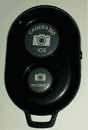

# AB 快门 3 上的键码

> 原文：<https://dev.to/wincentbalin/key-codes-on-ab-shutter-3-2n0h>

AB 快门 3 是一个小型遥控快门。

它可以作为蓝牙键盘连接到您的手机。但是它会向设备发送哪些键码呢？

为了回答这个问题，我简单地将快门连接到我的 Android 设备上，启动一个编辑器，然后按下按钮。

按钮 **iOS** 发送键码**音量增大**。按钮**安卓**发送键码**回车+音量调高**。

请注意:有可能发送了一些未被注意到的其他关键代码。