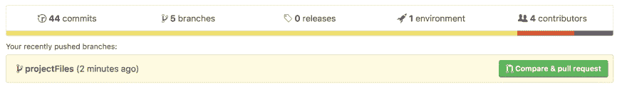

# 参考指南:拉式请求

> 原文：<https://dev.to/kymiddleton/reference-guide-pull-requests-5an9>

我的系列文章的下一部分将讨论“拉请求”。共享存储库模型允许组织和团队通过共享单个存储库进行协作，该存储库具有用于开发特性和隔离变更的分支。“拉式请求”提供了一种通知项目维护人员所做变更的方式，并启动代码审查过程。

对于任何初次接触代码协作的人来说，请为成功做好准备，并使用参考指南来帮助您完成如下概述的步骤。

**向主分支**
创建一个拉取请求，一旦项目准备好生产，需要完成`pull request`以将变更合并到`master branch`中。

**将请求拉至未受保护的`master`分支:**
访问 GitHub 中的资源库。最近推送的变更应该出现在存储库主页的突出显示部分，在突出显示部分的右侧有一个绿色按钮`compare and pull request`。

*   选择`compare and pull request`
*   选择`merge pull request`

**将请求拉至受保护的`master`分支:**
在协作者在具有受保护的`master`分支的存储库中工作的组环境中，执行以下操作:

*   进入 GitHub 并选择项目资源库
*   找到指示最新`pushed changes`的高亮部分

*   选择`compare and pull request`
*   选择一个`Reviewer`
    *   这将是添加到初始项目的贡献者之一
*   选择`Create pull request`
    *   该步骤将创建拉取请求，并指示需要审查，并且在审查完成之前合并将被阻止。
    *   此时，GitHub 将向选中的评审者发送电子邮件请求，通知他们有一个待定的评审。为了加快这个过程，最好直接给选定的贡献者发送一条消息，通知他们请求已经提出。

如果你错过了之前的帖子，你可以在这里查看:

*   第一部分:参考指南:终端常用命令。
*   第二部分:创建一个 GitHub 存储库
*   第三部分:提交变更
*   [第四部分:](https://dev.to/kymiddleton/reference-guide-committing-changes-with-branches-2f8d)提交分支机构变更

接下来:[进行代码评审](https://dev.to/kymiddleton/reference-guide-conducting-a-code-review-k6m)

对于完整的参考指南系列:

*   第一部分:参考指南:终端常用命令。
*   第二部分:创建一个 GitHub 存储库
*   第三部分:提交变更
*   [第四部分:](https://dev.to/kymiddleton/reference-guide-committing-changes-with-branches-2f8d)提交分支变更- [第五部分:](https://dev.to/kymiddleton/reference-guide-merge-conflicts-6op)合并冲突
*   第六部分:拉取请求
*   [第七部分:](https://dev.to/kymiddleton/reference-guide-conducting-a-code-review-k6m)进行代码评审- [第八部分:](https://dev.to/kymiddleton/reference-guide-complete-and-merge-a-pull-request--12n4)完成并合并一个拉请求