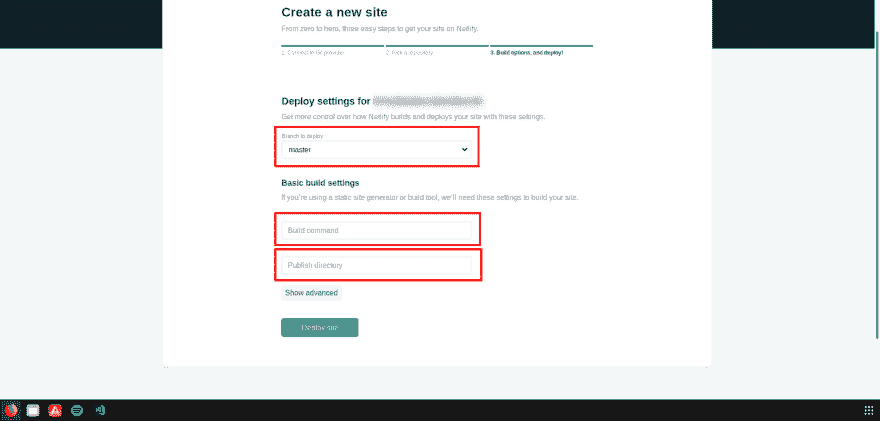

# 将 Next.js 项目部署到 Netlify

> 原文：<https://dev.to/kozakrisz/deploy-nextjs-project-to-netlify-4bd5>

我刚刚用 [Netlify](https://www.netlify.com/) 完成了自己的测试。它是一个静态页面提供者，拥有 Git deploy 集成机会(GitHub，GitLab，Bitbucket)。Netlify 有很好的性能，它提供了 https 认证，我们可以在项目中使用我们自己的域。因此，我们已经得到了启动项目所需的一切。下面来一个简要的指南！

我们下一个优秀的工具是 [Next.js](https://nextjs.org/) ！它为我们提供了服务器端渲染应用开发工具。Next.js 可以逐页导出我们的完整应用。因此它可以表现为服务器端呈现的应用程序，但没有 Node.js 服务器。

**🔥重要提示:** Netlify 只能服务静态页面！因此，如果您的应用程序中有多个路由，那么您需要导出它们中的每一个！这不是一篇 Next.js 指南文章，但是我会给你一个提示，如何做:

你只需要添加三个额外的脚本到你的 *package.json* :

```
{
  "scripts": {
    "build: "next build", "export": "next export", "deploy": "npm run build && npm run export" }
} 
```

Enter fullscreen mode Exit fullscreen mode

在*“NPM run export”*命令之后，Next.js 会处理剩下的事情。它将把你的每个页面和子页面生成为一个静态应用程序。

**🤔好，接下来是什么？！**

将您的项目部署到 GitHub/GitLab 或 Bitbucket。之后，您可以创建您的 Netlify 项目并将其连接到您的存储库。

[](https://res.cloudinary.com/practicaldev/image/fetch/s--b7PbtTnv--/c_limit%2Cf_auto%2Cfl_progressive%2Cq_auto%2Cw_880/https://thepracticaldev.s3.amazonaws.com/i/85n9jgo9qg0gtpblcpwc.jpg)

正如您所看到的，您可以选择分支，在那里您想要观察变化。Netlify 将在提交后复制每个新版本，然后您可以给出一个负责构建过程的命令。在我们的例子中，我们可以使用*“NPM run deploy”*作为构建命令。

表单中有一个发布目录选项，您可以在其中给出生成的构建的文件夹名称。在 Next.js 的例子中，我们需要使用*“out”*，因为 Next 会将所有内容导出到那个文件夹中。

仅此而已！完成这些设置后，Netlify 将在您选择的分支上负责托管和构建过程。

👨‍💻编码快乐！