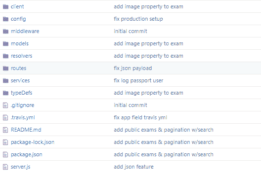
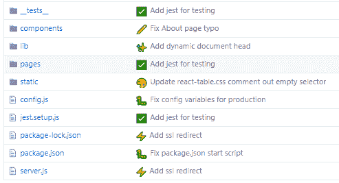
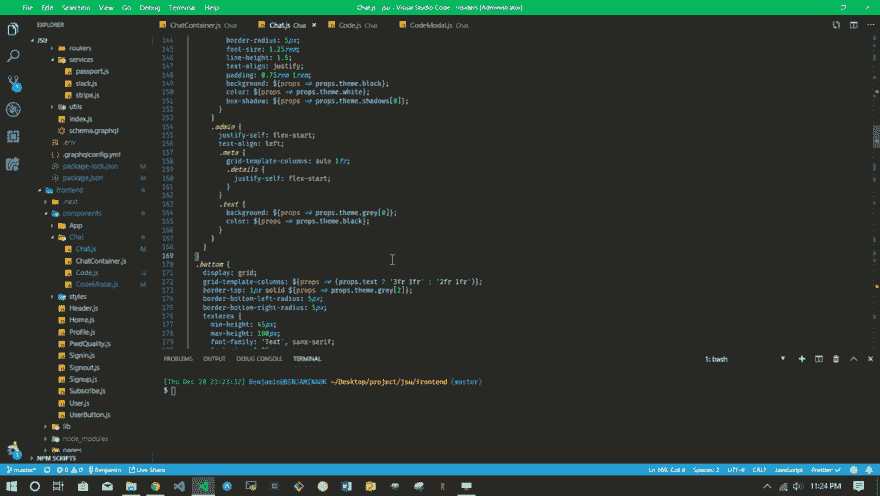

# 某地某人使用的东西...有时

> 原文：<https://dev.to/benjaminadk/something-someone-somewhere-uses-sometimes-1kab>

🌌最近，我发现自己在一个团队中编写代码，团队决定所有提交消息都以表情符号开始。 [Gitmoji](https://gitmoji.carloscuesta.me/) 定义了每个表情符号的含义。✨或`:sparkles:`代表一项新功能💩或者`:hanky:`是需要改进的坏代码...你明白了。原来有很多这样的东西-我数了一下有 62 个。我承认，这增加了一个有趣的元素，repos 看起来更时尚。Gitmoji 说:

> **在**提交消息**上使用表情符号**为**识别提交**的目的或意图提供了一种简单的方法，只需查看使用的表情符号。

| 常态 | 金藤寺 |
| --- | --- |
|  |  |

所以这个项目的编码开始了，是时候开始提交了。我浏览了一下 **Gitmoji** ,试图找到最好的表情符号。当我学习这个系统时，这需要一段时间。我在使用 Windows 10 表情符号工具(`windows button + ;`)将表情符号插入终端时也遇到了问题。当提交消息到达 **GitHub** 时，表情符号看起来像ࢊ，也就是什么都没有。所以这简直是浪费时间，严重扰乱了我的心流。

> 此时我还不知道 gitmoji-cli

我没有运行`npm i -g gitmoji-cli`，我仍然没有运行，而是花了一天的剩余时间做了一个 **VS 代码**扩展，没有继续我的项目。我不知道自己在做什么，但是 **VSC** 非常神奇，它有一个工具可以帮助搭建扩展。

```
npm install -g yo generator-code
yo code 
```

Enter fullscreen mode Exit fullscreen mode

`yo`安装[约曼](https://yeoman.io/)和`generator-code`是 **VSC** 工具，生成一个扩展，➕一个你好世界所需的所有文件。

无论如何，我发现文档和 api 都是用户友好的。另一个🤙老兄，激进的特性是， **VSC** 会自动知道工作空间是用于扩展开发的(我相信这是基于代码生成器生成的`~.vscode/launch.json`文件)。不需要运行 npm 脚本什么的，只需按下`F5`就会打开一个全新的窗口和一个调试器。我感觉我崇拜我的代码编辑器的主题正在形成...我不知道...我们经常在一起。

几个小时后，我已经为我的问题建立了一个解决方案，集成到我最喜欢的代码编辑器中。它的工作原理是在命令面板中有一个包含所有表情符号及其定义的大列表。VS Code 的 api 是这样的，我甚至不必为搜索编写逻辑，只需处理结果。工作少了，多好啊。无论如何，在表情符号被选中后，提示需要提交信息。我真正做的是将用户选择的表情符号与列表匹配，并用一个字符串文字将它们组合在一起....最后，所有东西都会在集成终端中弹出(或者创建一个)。

```
// pseudo code
const choice = '🚀 Deploying stuff'

const gitmoji = () => {
...
   if(choice.match('🚀')) return ':rocket:'
...
}
const commitText = 'Deploy app to Heroku'

send.to.terminal(`git commit -m ${gitmoji} ${commitText}`) 
```

Enter fullscreen mode Exit fullscreen mode

因此终端中的最后一个字符串可能类似于:

```
 git commit -m ':rocket: Deploy app to Heroku' 
```

Enter fullscreen mode Exit fullscreen mode

然后你按回车键。

下面这张 gif 比我解释的更好:

[](https://res.cloudinary.com/practicaldev/image/fetch/s--l5MS75PE--/c_limit%2Cf_auto%2Cfl_progressive%2Cq_66%2Cw_880/https://thepracticaldev.s3.amazonaws.com/i/74aa7j8srvdnroofskn0.gif)

下一步是将扩展发布到市场上。没什么大不了的。有一个命令。和💥我的分机对整个社区开放。大约一周后，它已经被安装了 30 次，这并不是什么惊天动地的事情，但就我的职业生涯而言，我认为任何使用我参与过的任何东西的人都是成功的。我只能想象在一个拥有数百万用户的大 app 上工作是什么感觉。我的大脑会爆炸。

归根结底，为用户提供价值才是编写软件的真正目的。虽然大多数时候我只是喜欢提出想法和解决问题，迷失在自己的小世界里。

所以，如果你想试一试，只需在扩展中搜索`gitmoji commit`。

专业提示——不要去调色板选择`Gitmoji Commit`命令，直接将命令映射到一个键绑定。我用`Ctl/Cmd + K G`。

##  [本杰明达克](https://github.com/benjaminadk) / [表情符号](https://github.com/benjaminadk/emojigit)

### 用于编写 gimtoji 提交消息的 vs 代码扩展

<article class="markdown-body entry-content container-lg" itemprop="text">

# gimtoji 提交

停止浪费时间查找 git 提交消息表情符号。这个扩展可以帮助你找到正确的表情符号，并帮助你撰写提交消息，所有这些都不需要留下 VS 代码。你甚至可以提供自己的自定义表情映射，以满足你和/或你的团队的需求。

## 内容

*   [Gitmoji 提交](https://raw.githubusercontent.com/benjaminadk/emojigit/master/#gitmoji-commit)
    *   [内容](https://raw.githubusercontent.com/benjaminadk/emojigit/master/#content)
    *   [用途](https://raw.githubusercontent.com/benjaminadk/emojigit/master/#usage)
        *   [创建提交消息](https://raw.githubusercontent.com/benjaminadk/emojigit/master/#create-commit-message)
        *   [备忘单](https://raw.githubusercontent.com/benjaminadk/emojigit/master/#cheat-sheet)
        *   [提示](https://raw.githubusercontent.com/benjaminadk/emojigit/master/#tips)
        *   [突变](https://raw.githubusercontent.com/benjaminadk/emojigit/master/#breaking-changes)
    *   [配置](https://raw.githubusercontent.com/benjaminadk/emojigit/master/#configuration)
        *   [表情符号语法](https://raw.githubusercontent.com/benjaminadk/emojigit/master/#emoji-syntax)
        *   [自动提交](https://raw.githubusercontent.com/benjaminadk/emojigit/master/#auto-commit)
        *   [自动关闭](https://raw.githubusercontent.com/benjaminadk/emojigit/master/#auto-close)
        *   [多行提交](https://raw.githubusercontent.com/benjaminadk/emojigit/master/#multiline-commit)
        *   [自定义表情符号](https://raw.githubusercontent.com/benjaminadk/emojigit/master/#custom-emoji)
        *   [自定义表情图](https://raw.githubusercontent.com/benjaminadk/emojigit/master/#custom-emoji-map)
    *   [未来计划](https://raw.githubusercontent.com/benjaminadk/emojigit/master/#future-plans)
    *   [变更日志](https://raw.githubusercontent.com/benjaminadk/emojigit/master/#changelog)
    *   [演示](https://raw.githubusercontent.com/benjaminadk/emojigit/master/#demo)
    *   [其他信息](https://raw.githubusercontent.com/benjaminadk/emojigit/master/#other-info)
    *   [贡献者](https://raw.githubusercontent.com/benjaminadk/emojigit/master/#contributors)

## 使用

目前， **Gitmoji Commit** 向 VS 代码添加了两个命令。

### 创建提交消息

通过提示用户提交类型和提交消息文本，自动创建提交消息。选择的提交类型决定了表情符号。表情符号作为 unicode(例如`✨`)或 GitHub 表情符号标记冒号语法(例如`:sparkles:`)插入提交消息。

到了打字的时候…

</article>

[View on GitHub](https://github.com/benjaminadk/emojigit)