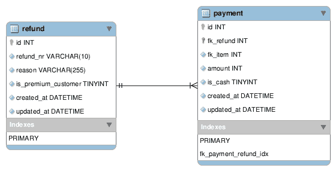

# 对于初学软件的工程师来说，最重要的提示是…

> 原文：<https://dev.to/geshan/the-most-important-tip-for-beginner-software-engineers-is-21nd>

你到目前为止读过或看过的大部分教程通常做一件事，填鸭式。这对于学习新东西是“可以的”,但是当你需要解决一项任务时就不好了。任务通常包括通过解决问题来达到目标。这篇文章为所有初学软件的工程师揭示了最重要的“提示”。

[](img/9bb666c35acb4c975a55140ff4a823f3.png) ](https://res.cloudinary.com/practicaldev/image/fetch/s--X-sQrtg1--/c_limit%2Cf_auto%2Cfl_progressive%2Cq_auto%2Cw_880/https://cdn-images-1.medium.com/max/2000/0%2A51w5PrZhQMGtEJ1F.jpg) *图片来自*

## TL；速度三角形定位法(dead reckoning)

> *首先，解决问题。然后，编写代码。—约翰·约翰逊*

换句话说。

> 逐步在纸上写出解决方案，然后开始编写代码。不要纠结于代码和软件设计。

## 那么会发生什么呢

我多次从初学者甚至初级软件工程师那里听到这种说法。我可以很好地跟随教程，并认为我理解这个概念。但是，当我试图在我喜欢的项目上做类似的事情时，我做不到。发生这种情况主要有两个原因。首先，你在某个地方失去了你的思路，无法建立一个链。第二，你在代码中纠缠不清，以至于你试图解决的主要问题变得模糊不清。

这个问题也发生在软件工程师甚至高级软件工程师身上。好的一面是有了经验，你知道什么时候该停下来或者休息一下。然后，带着不同的说明回到问题上，更快地找到解决方案。

> 你们中的许多人可能都有过这样的经历:花了几个小时努力解决一个问题。你休息了一会儿或者睡了一觉，下一次会议几分钟内就有了解决方案。

这不是魔术，这是从另一个角度看问题。

## 我们来举例说明

你必须做一个任务，这是创建一个退款与付款。退款总是有一个原因，如损坏，延迟交货等，该项目的付款最多为 2。一种是现金，另一种是信用(商店信用)。您还会看到数据库模式。这是一个后端任务，您需要创建一个过帐/退款 API 来创建退款及其相关付款。数据库结构如下:

[](https://res.cloudinary.com/practicaldev/image/fetch/s--6mryppIa--/c_limit%2Cf_auto%2Cfl_progressive%2Cq_auto%2Cw_880/https://cdn-images-1.medium.com/max/2000/0%2ADBOwDM4Gq6DJ00sg.png)

您也可以与团队成员之一讨论 API 有效负载，并就以下 JSON 有效负载达成一致:

```
POST /refunds

{
 reason: "damaged",
 premium_customer: true,
 payments: [
  {
     item_id: 20,
     amount: 5000,
     is_cash: true    
  },
  {
     item_id: 20,
     amount: 7250,
     is_cash: false
  }
 ]
}

//decide on the response format 
```

Enter fullscreen mode Exit fullscreen mode

### 通常的场景

大多数初学软件的工程师会做的是开始扫描代码库，如果有的话。他们将立即开始编写一些代码。如果有适当的测试文化，也许可以写一些自动化测试代码。

> 这是大多数初学者甚至一些有经验的软件工程师容易犯的错误。没有解决问题就不要写代码。

### 适当的一步

在我看来，最合适的步骤是坐下来，一步一步地解决纸上的问题。所以你要求自己在数据库上写退款及其相关款项，我需要做什么。你一步一步地想出一个计划，然后调整它。

> 如果你有比你更资深的人，你可以验证你的步骤并获得反馈。

这也将大大减少代码审查时间，因为双方已经就解决方案的形式达成一致。

### 那么怎么做呢

前面提到的任务是编写一个创建/发布 API，其中可以创建付款退款。每笔退款最多可以有两种支付方式，一种是现金，另一种是信用卡。它也可以是仅用现金或信用卡支付一次的退款。我会这样在纸上写下以下步骤:

1.  创建一个方法来从用户发送的控制器获取数据

2.  验证所有输入的值、退款类型和原因。

3.  如果所有验证都通过，则生成退款表中不存在的长度为 10 的随机字母数字(递归检查)

4.  如果验证未能以正确的验证失败消息进行响应，则确定响应结构

5.  启动数据库事务

    1.  将与退款相关的值“退款编号”、“原因”、“原因”、“保险费”,插入退款表中
    2.  插入成功时，获取最后一次插入的 id
    3.  使用退款标识，将与付款相关的 fk _ 退款、fk _ 项目、金额、is_cash 值插入付款表
6.  如果一切顺利，提交数据库事务

7.  如果回滚数据库事务有任何问题

8.  根据具有适当结构的数据库事务的成功，用成功或失败消息进行响应

9.  接线控制器和该方法

### 按照计划中的步骤，现在编写代码

有了循序渐进的计划后，你就可以开始写代码了。然后，您可以更深入地了解方法名称、如何获得数据库连接以及其他细节。

> 根据语言和框架的不同，你也可以决定验证码应该放在哪里。

如果公司和文化支持和鼓励，你甚至可以编写测试。

当你的解决方案在脑海中清晰可见，并且在纸上有了一步一步的行动计划，现在你就可以写代码了。

> 你甚至可以用更容易完成和连接的方式分解零件。

例如，测试逻辑可以是可以单独编写并独立测试的东西。它考虑的是可以连接在一起形成解决方案的独立部分。

## 结论

当你面临下一个任务时，不要一开始就写代码。首先，找到问题所在，然后设计一个解决方案，最好不要在纸上屏幕前完成这些步骤。然后完善你的解决方案，并与他人讨论。当您满意时，将该解决方案转化为代码。这有点有条不紊，但非常有效。

> 代码永远是解决方案的媒介，而不是解决方案本身。

* * *

*最初发表于[geshan.com.np](https://geshan.com.np/blog/2018/12/the-most-important-tip-for-beginner-software-engineers-is/)。*