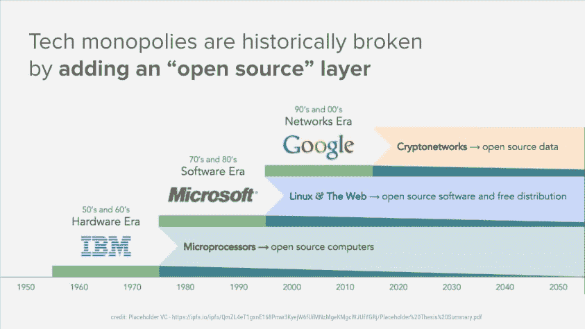
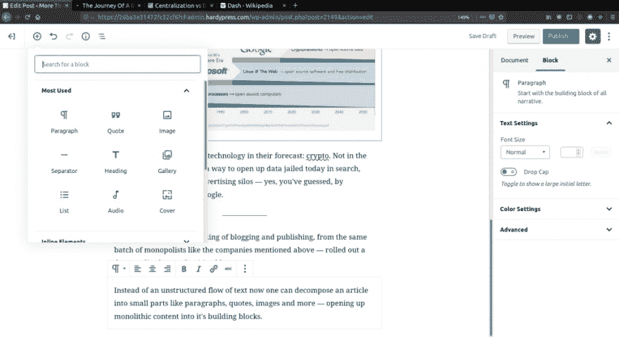
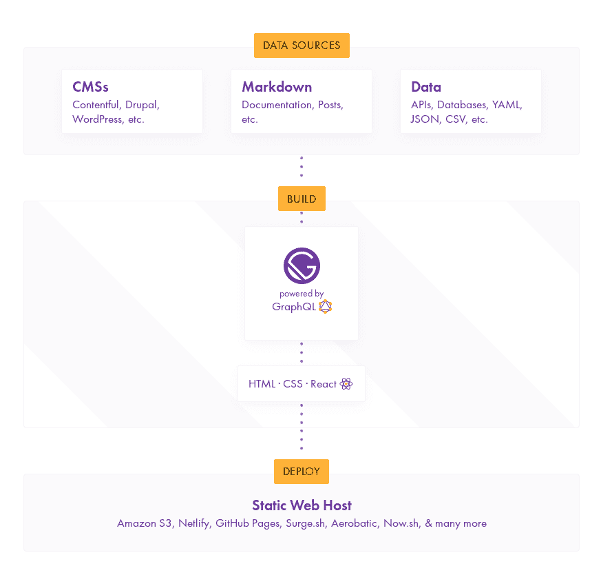

# 一篇博文在 202X 年的旅程

> 原文：<https://dev.to/metamn/the-journey-of-a-blog-post-in-202x-49ph>

## 现任者

本·埃文斯(Ben Evans)在上个月举行的安德森·霍洛维茨(Andreessen Horowitz)年度技术会议上的讲话中明确指出:我们正在从搜索和社交、电子商务和广告转向其他一切。比如机器学习和密码。

Union Square Ventures 的 Fred Wilson 在上周的[集权与分权](https://avc.com/2018/12/centralization-vs-decentralization/)中表示:

> 如果你是一名研究技术史的学生，你就不会对去中心化也是在正确的时间出现的正确技术感到惊讶，它可以解决科技行业目前面临的一些最具挑战性的政策问题。

他还指出，去中心化是通过开源实现的。

两人在预测中分享了一项共同的技术:加密。不是在硬币炒作的意义上，而是一种打开今天被禁锢在搜索、社交、电子商务和广告筒仓中的数据的方式——是的，你已经猜到了，是亚马逊、脸书和谷歌。

## 发布者

本周，博客和出版之王 WordPress 推出了一种去中心化的写博客的方式，该公司与上述公司属于同一批垄断者。

现在，人们可以将一篇文章分解成小部分，如段落、引用、图片等，而不是无结构的文本流，从而将整体内容分解成其构建块。

到目前为止，博客文章是一个单一的实体，现在它是一个子部分的集合，甚至可以重复使用。内容以某种方式转化为数据。

## 独立创作

上周，我创建了一个对 IndieWeb 的快速概述，IndieWeb 是语义网的一种实现，是万维网的一个理论层，旨在通过将内容转换为数据来提供更好的网络体验。

他们超越了使用古腾堡区块的 WordPress，并且说:

1.  创建的每一个内容都必须有一个经过验证的作者。
2.  内容应该用元数据进行注释，使机器而不仅仅是人类能够理解。
3.  内容应该在互联网上自由流通，在那里它可以成长，为自己增值，并把它还给作者。

这个概念和网络本身一样古老。每个人都知道信息想要免费，但却忘记了这句话的第二部分——同一时间的信息想要昂贵。

> 一方面，信息想要变得昂贵，因为它太有价值了。在正确的地方获得正确的信息会改变你的生活。另一方面，信息希望免费，因为获取信息的成本越来越低。所以你让这两个互相争斗。
> 炖品艺术品牌，早在 1984 年

也许你最近听说了网络之父蒂姆·伯纳斯·李爵士正在致力于一个重塑网络的新项目。是的，[他是](https://www.inrupt.com/)，通过将 it 状态向上转移到价值创造者而不是现任筒仓。

## jam stack

如果你是一个技术人员，你应该知道今天网络和移动的一切都围绕着 Javascript——jam stack。所有内容都绕过了无头内容管理系统。

十年前，一切都围绕着灯堆。脸书 WordPress 是用。Linux 是一种操作系统，Apache 是一种服务器，MySQL 是一种集中式数据库，PHP 是一种老式编程语言。难怪最终结果是铁板一块，从基础设施到用户体验都由一个垂直解决方案或公司控制。

JAMStack 不一样。它是 Javascript——一种诞生于前端的现代化编程语言，首先赋予用户体验，然后处理后端；它是 API——独立于操作系统、底层服务器和数据库的数据接口；它是标记——以与设备无关的方式编译的内容，可以在任何地方独立运行，无论是在线还是离线。

用 JAMStack 构建的网站和应用程序是去中心化的，它们开放数据，让数据自由流通。

## 博文之旅开始了

您启动了一个可视化内容编辑器，称为 Headless CMS。它可以是新的 WordPress / Gutenberg，也可以是今天出现的几十个新的。

你通过混合简单的块/组件来设计你的内容:标题、段落、引用、图片、列表、图库。它们中的每一个都有大量的元数据和可调整的属性——它们已经充当了数据片段和带注释的内容块。

使用报价时，可视化编辑器会自动通知其来源。当从外部源添加图像时，图像元数据将在图像作者的仪表板上使用新的使用信息进行更新。当你写下一段话时，你肯定它会自动地在推特上发布，被引用，被其他人重复使用，你会立即得到通知，你的学分也会被给予。

随着内容的增长，您也将随之增长。

当你出版的时候，奇迹发生了。新的博文会出现在您的所有渠道中，包括您的博客、您的社交网络订阅源、您的直接电子邮件订阅者和订阅源订阅者，以及您重复使用其内容的作者的指示板。

联合和再联合。充当数据的联合内容。作为你今天的推文、帖子和图片，但现在为你而不是其他人工作。喜欢和分享会反馈给你，你可以直接访问你的追随者，从所有的网络，没有网络。

知识的完全自由和资本化。如果你是优秀的，你就会成长，而不是储存你的创造力和为广告技术出售你的个性的筒仓。

记住，广告是我们赋予机器力量的方式。也许我们想先增强自己的能力。

## 是乌托邦吗？

不，今天就可以完成。以各种方式。通过一点黑客技术。对于 WordPress 的粉丝来说，这是一种方式，还有许多其他方式:

1.  你可以通过 WordPress Gutenberg 添加内容块。
2.  你为 Tim Berners Lee 的 Solid 编写了一个 WordPress 插件，目的是:a .)让所有人都知道你是一个作者。b .)用元数据注释你的块，让机器把它传播到可以生长的地方。c .)在编辑器中取回增长结果。
3.  你编写/使用一个插件来为你的 blocks 提供喜欢、分享、评论的功能，这些功能会反馈给你。
4.  创建一个新的 Gatsby / React / React Native 主题，从 1 收集您的所有数据。, 2.第三。整合到一个统一的图层中，您可以轻松地在网络上显示，甚至作为移动应用程序显示。

预计时间？为一个设计师和开发者工作几个月，你就进入了未来。