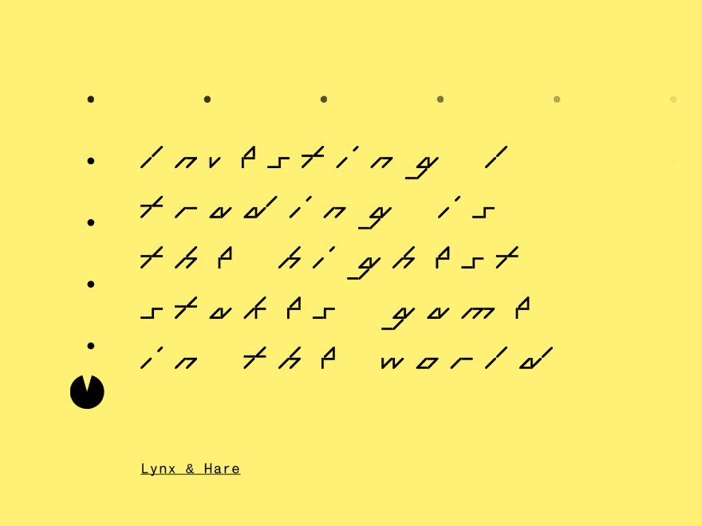
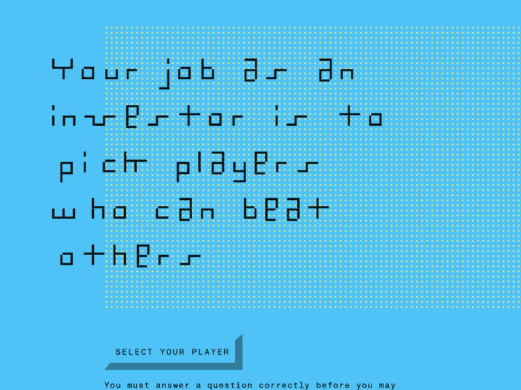
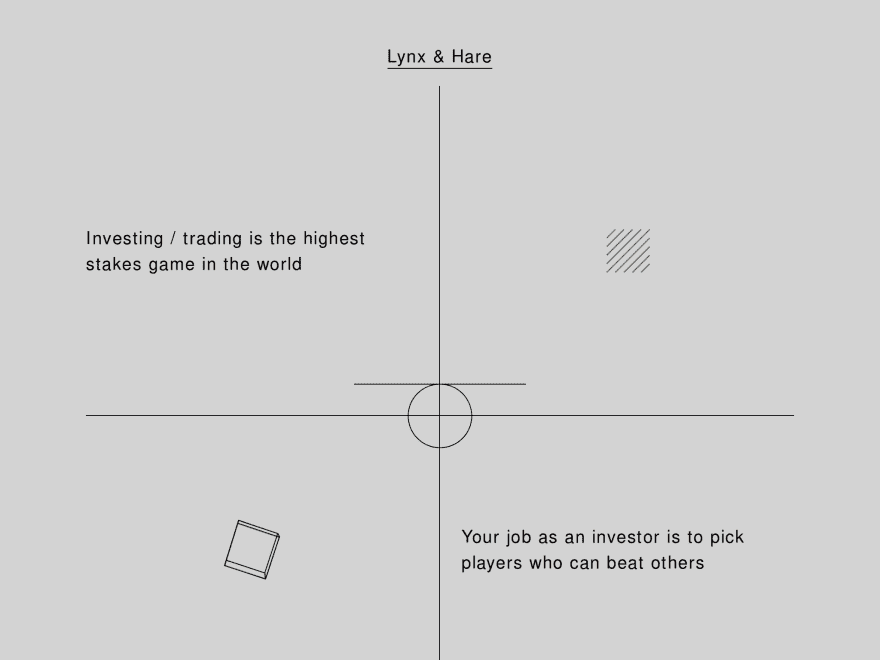
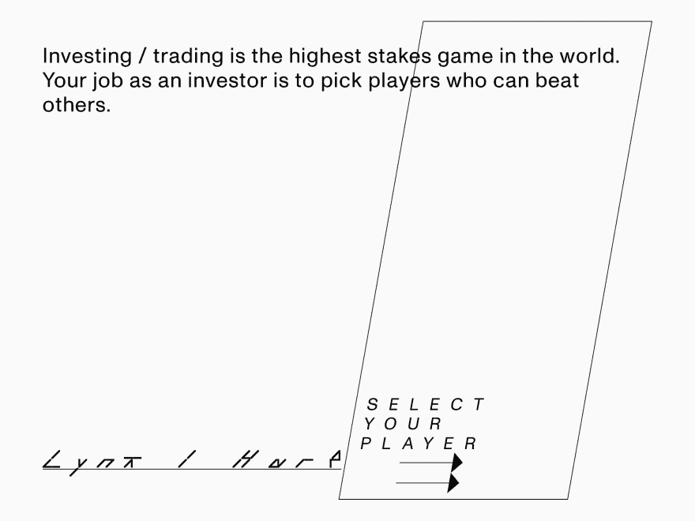
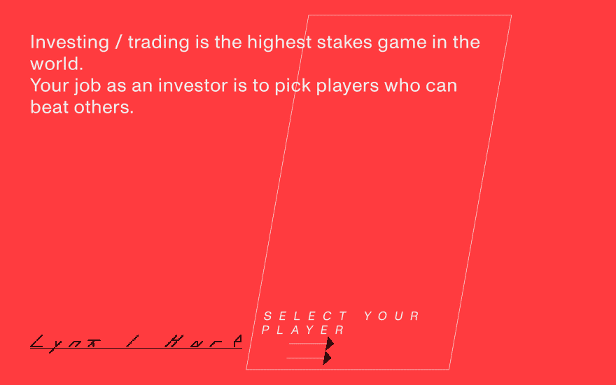
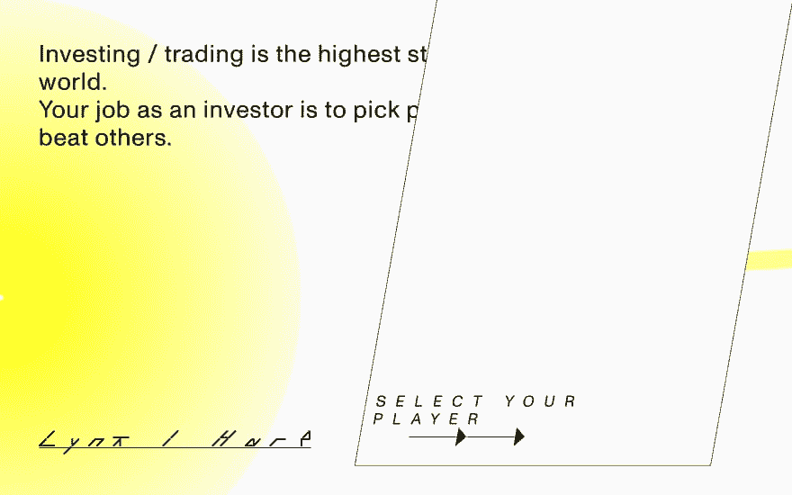
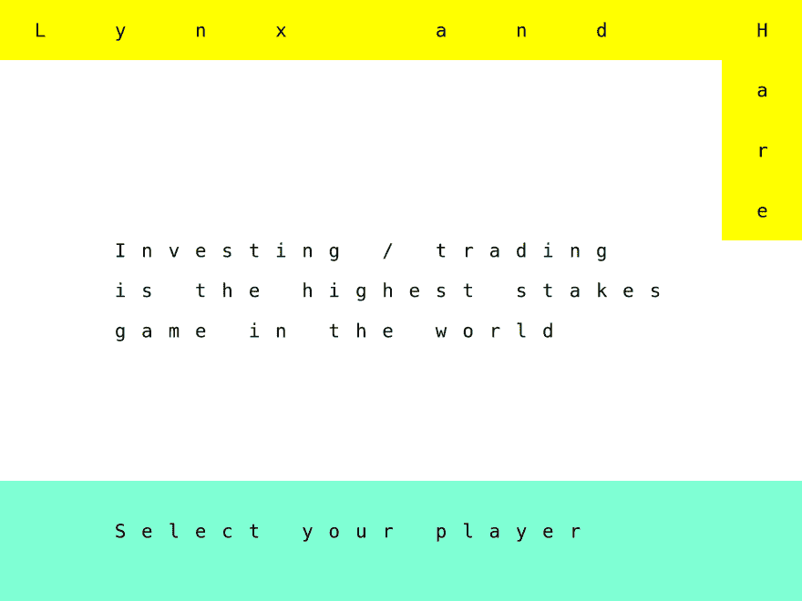
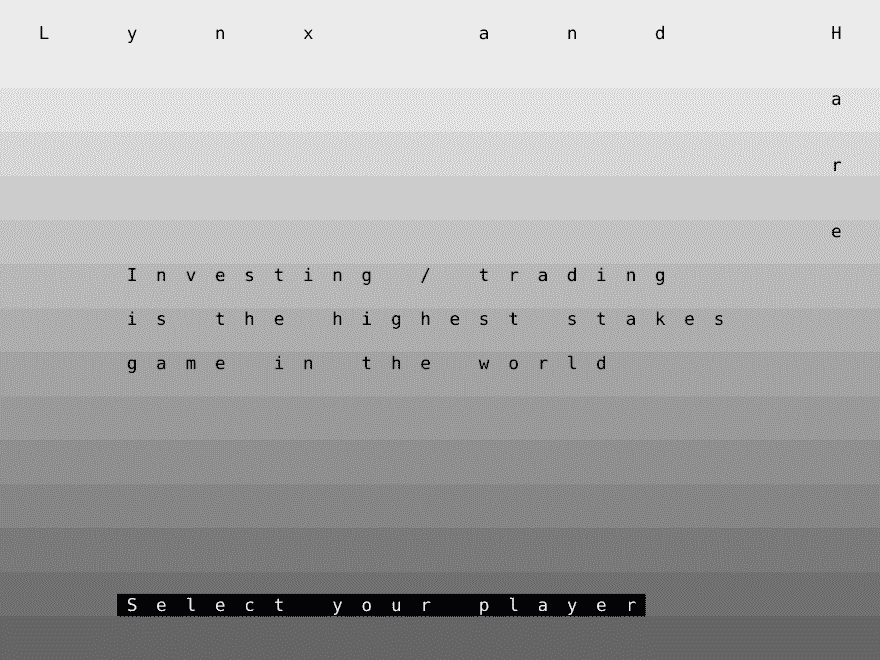
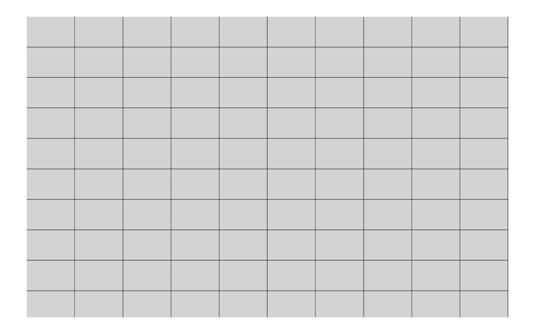

# 用故事书设计

> 原文：<https://dev.to/metamn/designing-with-storybook-1gh2>

我无法想象当我们没有故事书或其他选择时，会损失多少创造力。

Storybook ( [live on metamn](http://metamn.io/mr-ui/) )是一个用户界面开发环境。到目前为止，除了 UI 之外，我们已经为任何类型的开发提供了集成开发环境(IDE)。

现在，使用 Storybook，您可以:

1.  **调整**在工作中寻找边缘案例。
2.  **在背景和视口等不同环境中即时测试**。
3.  立即获得**可访问性**反馈。
4.  **用美丽的方式记录**你的工作和实验。
5.  **保存**你做的每一个实验，为了好奇，以后再用。

这个名单还在不断扩大。对我来说，最好的部分是保存实验。

我正在创建实验性的用户界面，屏幕上的每一个用户界面都是手工制作的。此外，每一个用户界面都适合不同网站、不同品牌的潜在内容。

这需要大量的实验。只要看看 Lynx & Hare，我最近创建的一个登陆页面，不幸的是没有 React 和 Storybook。

对于这个项目，我没有任何投入(设计简介中回答的问题为零)，只是“让它像复古游戏和金融之间的东西”。

在我草拟了第一个版本后，方向突然变得最小化，我的风格，我甚至加了一个吃豆人！！！我不得不扔掉它。再加上那个复古的按钮，带回了 90 年代的感觉。

创建完*我的风格*...

...结果仍然不够好，所以我创造了第三个变种。

我希望在设计时就有故事书。现在，我所有的工作都将被很好地分类、记录，按钮将与其他按钮粘在一起，字体以同样的方式，配色方案与另一种配色方案，
在 plus 中，我将把所有这些变化都记录下来，我现在只是将它们作为截图保存在硬盘的某个地方。

红色的变体:

这个有画布背景和随着光标移动的粒子。

或者这些，在动态单元矩阵上设置类型的全新迭代。

在灰色背景上:

...和下面的细胞基质。我没有旋转和倾斜的截屏——它们很整洁！

现在我已经[将项目保存到 Storybook](http://metamn.io/mr-ui/?selectedKind=Playground&selectedStory=Lynx%20%26%20Hare&full=0&addons=1&stories=1&panelRight=0&addonPanel=storybook-addon-background%2Fbackground-panel&background=beige) 中，至少是布局。可以玩直播。将来我会将它作为整个 UI 库的演示项目。

只是为了提醒我每次使用故事书都要心存感激。