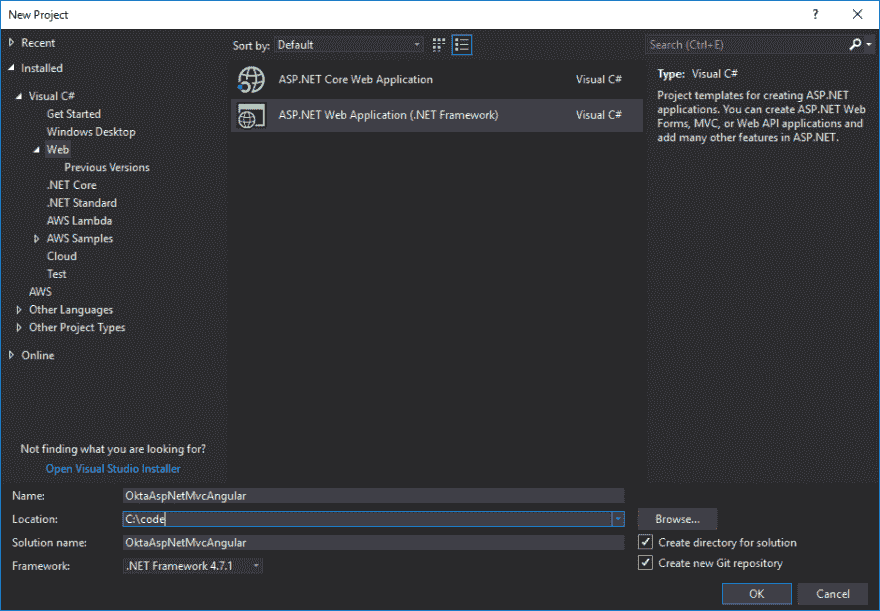
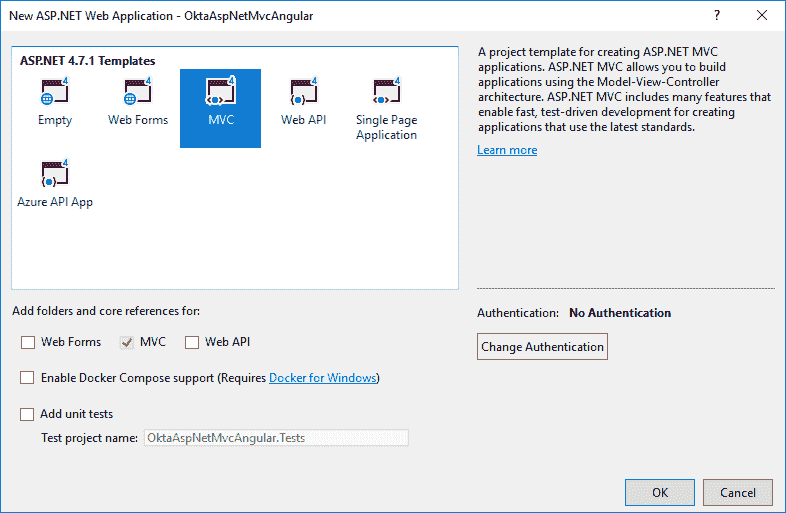
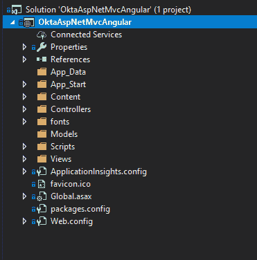
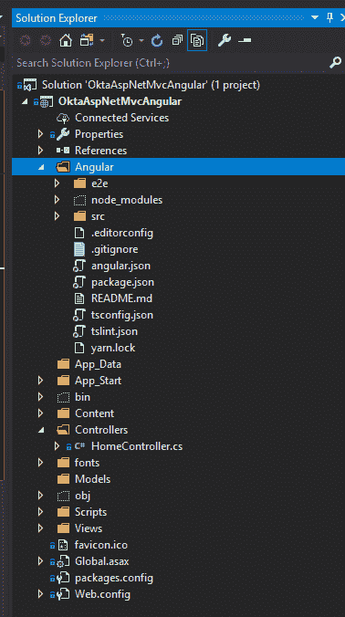
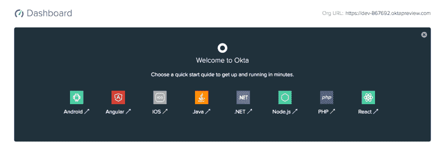
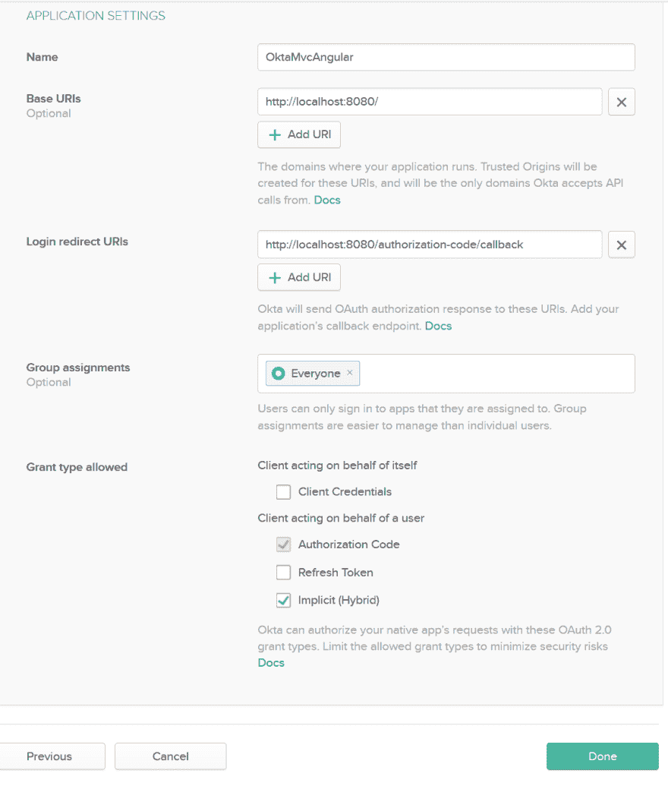
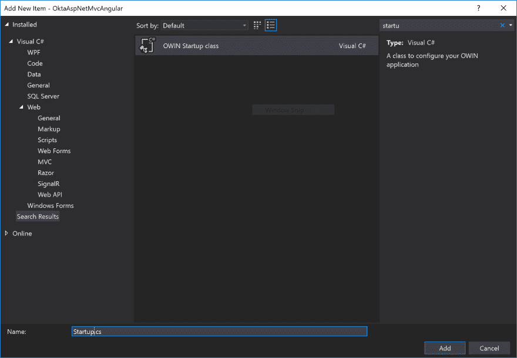
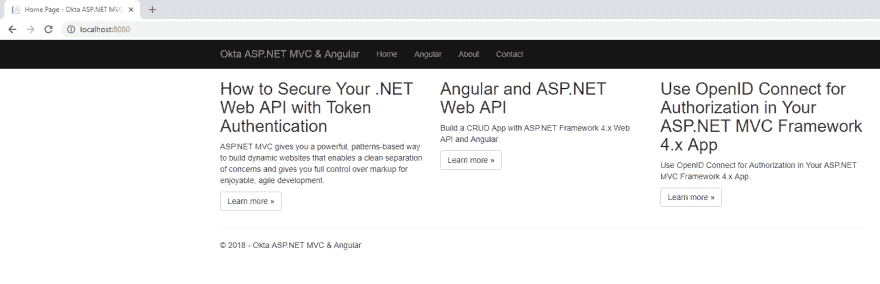
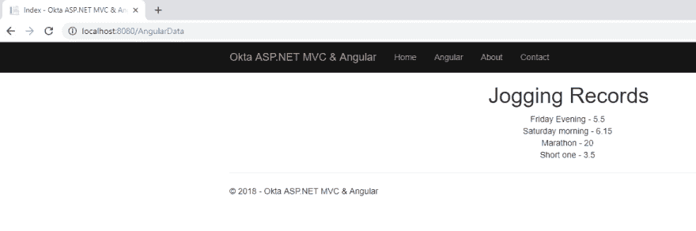
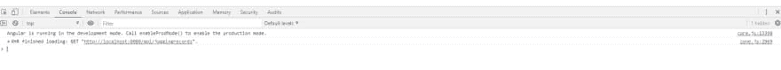

# 用 ASP.NET MVC 和 Angular 搭建一个基本的网站

> 原文：<https://dev.to/oktadev/build-a-basic-website-with-asp-net-mvc-and-angular-4kdo>

ASP.NET 已经存在很长时间了。当微软引入 ASP.NET MVC 时，它改变了许多开发人员处理代码库的方式。这是一个很好的关注点分离，一个 TDD 友好的框架，容易与 JavaScript 集成，同时保持对呈现的 HTML 的完全控制。在客户端，很多。NET 开发人员更喜欢 Angular，因为它附带了 TypeScript，与普通 JavaScript 相比，它更接近 C#语言。Angular 是构建企业级、功能丰富的应用程序的优秀框架。

你将会使用。NET Framework 4.7.1，并且应该安装了最新版本的 Visual Studio 2017。此外，您应该安装节点和 npm，因为您将使用需要节点和 npm 的角度工具。

## ASP.NET MVC 入门

使用 Visual Studio 中的内置模板创建 API。你将从头开始。

在 Visual Studio 中，选择**文件**->-**新建项目**。

选择 Web，ASP.NET Web 应用程序(。NET 框架)。

[](https://res.cloudinary.com/practicaldev/image/fetch/s--4nKGtxHk--/c_limit%2Cf_auto%2Cfl_progressive%2Cq_auto%2Cw_880/https://d33wubrfki0l68.cloudfront.net/f873c5b2c80bd16c44ac6582f507b267fbc947fd/7b777/assets-jekyll/blog/mvc-angular/vs-file-new-project-993b0dc6b8f5997a22fbcad8b2d059d938044682e5ec48e21cbddece370a5706.png)

在下面的屏幕上，选择 MVC:

[](https://res.cloudinary.com/practicaldev/image/fetch/s--1GP4xXEM--/c_limit%2Cf_auto%2Cfl_progressive%2Cq_auto%2Cw_880/https://d33wubrfki0l68.cloudfront.net/bdffe22ab94af6677dfa8a74b065835d7dd12f65/a9802/assets-jekyll/blog/mvc-angular/vs-mvc-project-c789cb0af6945034efe28cd5886b416b0fa4a15f0a081b6889e6efa8585dd001.png)

你现在应该有一个新的 ASP.NET MVC 应用程序了，所有的文件夹和文件如下图所示:

[](https://res.cloudinary.com/practicaldev/image/fetch/s--iyDxJ3Fy--/c_limit%2Cf_auto%2Cfl_progressive%2Cq_auto%2Cw_880/https://d33wubrfki0l68.cloudfront.net/95140225372dc7b55bb17df25ec09ff4cc511d46/a1d74/assets-jekyll/blog/mvc-angular/vs-mvc-file-structure-2be6b679b1c592aec534a7204726fa9bc2ebaeb3551989857f888636a6dc2b39.png)

此时，在您的项目中，您有一些您不会使用的 NuGet 包。你可以很快摆脱它们。在软件包管理器控制台中运行以下命令。

```
Uninstall-Package Microsoft.ApplicationInsights.Web
Uninstall-Package Microsoft.ApplicationInsights.WindowsServer
Uninstall-Package Microsoft.ApplicationInsights.WindowsServer.TelemetryChannel
Uninstall-Package Microsoft.ApplicationInsights.PerfCounterCollector
Uninstall-Package Microsoft.ApplicationInsights.DependencyCollector
Uninstall-Package Microsoft.ApplicationInsights.Agent.Intercept
Uninstall-Package Microsoft.ApplicationInsights 
```

此外，确保您删除了`ApplicationInsights.config`文件。

完成后，你应该有一个干净的项目和完美的起点。

## 创建一个角度项目

使用 Angular CLI 是开始使用 Angular 应用程序的最佳方式。使用 Angular CLI 工具，您可以轻松地创建新项目、更新现有项目、向代码库添加不同的组件，并通过在终端中输入几个命令来完成所有这些工作。您还可以在开发环境中运行应用程序，并将其发布到生产环境中。省去了你设置配置和 Webpack 的麻烦。它还可以为你做所有的优化，压缩和缩小。强烈建议使用 Angular CLI 为生产环境准备您的应用程序。

您可以通过在您喜欢的终端中输入以下命令来安装 Angular CLI:

```
npm install -g @angular/cli@7.1.0 
```

之后，导航到你的 MVC 项目的文件夹，在那里打开你的终端，输入如下:

```
ng new Angular --skip-tests --style=scss 
```

这将在 MVC 项目中的 Angular 文件夹下创建一个新的 Angular 项目。`--skip-tests`参数将确保 CLI 跳过创建规范文件。

您应该在 MVC 项目中包含 Angular 文件夹。为此，点击解决方案浏览器中的**显示所有文件**按钮。您现在可以导航到 **Angular** 文件夹，并包含除`node_modules`之外的所有文件夹和文件。之后，你应该有一个文件夹结构，如下图所示:

[](https://res.cloudinary.com/practicaldev/image/fetch/s--3HdYXGLp--/c_limit%2Cf_auto%2Cfl_progressive%2Cq_auto%2Cw_880/https://d33wubrfki0l68.cloudfront.net/6914670affaba0f845d72f03433339a0ff171960/a193c/assets-jekyll/blog/mvc-angular/vs-file-structure-angular-cbb3c32c929132ddba483042d39afe6aa9a5bbac532828cebdd7d694f7517c5e.png)

## 为 ASP.NET 建立一个数据库

您将使用 Entity Framework (EF) 6 作为您的对象关系映射器(ORM)，这是微软提供的一个成熟的解决方案。EF 6 非常容易设置和运行，并且您不需要知道任何 SQL 来让它为您的应用程序工作。可以把它看作是数据库的适配器或桥梁。所有的数据库查询都将通过实体框架。

中心点是您的`DbContext`类，这是您定义连接字符串和数据库表的地方。EF 6 使用`DbSet`集合类型来表示数据库中的一个表。您需要做的就是创建一个连接字符串，创建一个继承自`DbContext`的新类，创建数据模型，并在`DbContext`中为这些模型创建适当的属性。这些属性将表示数据库中的表。从这一点来看，通过使用语言集成查询(LINQ)，获取和更新现有数据是相当容易的。

您应该首先安装 EF 6，在包管理器控制台中运行下面的代码:

```
Install-Package EntityFramework -Version 6.2.0 
```

### 添加连接字符串

您可以通过向您的`Web.config`文件添加一个连接字符串来开始。确保将其添加到`<configuration>`部分，并在`<configSections></configSections>` :
之后

```
<connectionStrings>
  <add name="OktaConnectionString"
    connectionString="Data Source=(LocalDb)\MSSQLLocalDB;Initial Catalog=JoggingTracker;Integrated Security=SSPI;AttachDBFilename=|DataDirectory|\WeightTracker.mdf"
    providerName="System.Data.SqlClient"
  />
</connectionStrings> 
```

### 在 Angular 中创建你的 DbContext 和数据模型

首先，创建一个记录慢跑的模型。在`Models`目录下创建一个名为`JoggingRecord.cs` :
的文件

```
using System;

namespace OktaAspNetMvcAngular.Models
{
  public class JoggingRecord
  {
    public int Id { get; set; }

    public float Distance { get; set; }

    public string Description { get; set; }

    public DateTime CreatedAt { get; set; }
  }
} 
```

这里没有什么特别的，一个标准的`Id`属性表示表中每一行的唯一标识符，实体框架将使用一个命名约定，并自动将其设置为该表的主键。您肯定需要用`Distance`属性来跟踪您的慢跑，用`Description`属性来描述慢跑，用`CreatedAt`属性进行审计跟踪。

接下来，在名为`Data`的新文件夹中创建一个`ApplicationDbContext`类。现在，这将是非常简单的:

```
using System.Data.Entity;
using OktaAspNetMvcAngular.Models;

namespace OktaAspNetMvcAngular.Data
{
  public class ApplicationDbContext : DbContext
  {
    public ApplicationDbContext() : base("OktaConnectionString")
    {
    }

    public static ApplicationDbContext Create() => new ApplicationDbContext();

    public DbSet<JoggingRecord> JoggingRecords { get; set; }
  }
} 
```

调用基类`DbContext`的这段代码用于设置连接字符串。还有我之前提到的属性`DbSet`，它将用于从表中获取记录，更新和删除这些记录。

### 在您的 ASP.NET 项目中启用并运行迁移

打开软件包管理器控制台，运行以下命令来启用迁移:

```
Enable-Migrations 
```

现在您可以添加您的初始迁移，它将包含`JoggingRecords`表的创建:

```
Add-Migration Initial 
```

现在，您可以更新数据库:

```
Update-Database -Verbose 
```

verbose 标志将允许您查看生成的 SQL 语句，这可以帮助您解决任何出现的错误。

### 种子数据库

更新数据库后，通过在`Configuration`类的`Seed`方法中添加代码来添加迁移。

首先，添加模型名称空间的 using:

```
using OktaAspNetMvcAngular.Models; 
```

之后，为种子方法添加以下代码:

```
protected override void Seed(OktaAspNetMvcAngular.Data.ApplicationDbContext context)
{
  context.JoggingRecords.AddOrUpdate(x => x.Id,
    new JoggingRecord { Id = 1, Description = "Friday Evening", Distance = 5.5f, CreatedAt = new DateTime(2018, 5, 1) },
    new JoggingRecord { Id = 2, Description = "Saturday morning", Distance = 6.15f, CreatedAt = new DateTime(2018, 4, 4) },
    new JoggingRecord { Id = 3, Description = "Marathon", Distance = 20, CreatedAt = new DateTime(2018, 5, 13) },
    new JoggingRecord { Id = 4, Description = "Short one", Distance = 3.5f, CreatedAt = new DateTime(2018, 6, 6) }
  );

  // This method will be called after migrating to the latest version.

  // You can use the DbSet<T>.AddOrUpdate() helper extension method
  // to avoid creating duplicate seed data.
} 
```

## 为您的 Angular 应用程序添加认证

处理认证从来都不是一件容易或舒适的任务。如果您想快速方便地处理您的应用程序的身份验证，您可能需要 Okta 这样的解决方案。这也是为什么那么多开发者爱用 [Okta](https://developer.okta.com) 的原因，他们再也不想构建 auth，很乐意把它留给我们。

要开始使用 Okta，注册一个[永远免费的开发者账户](https://developer.okta.com/signup/)或者([登录](https://login.okta.com/?SAMLRequest=fc%2B7CsJAEAXQXvAflu1NNJUMeZBGELTx1a%2FrYILJTtyZGD%2FfSBRiYzlw77lMnD3rSj3Qc0ku0YtgrhU6S5fSXRN9PKxmS52l00nMpq6iBvJWCrfDe4ss6vStRe9aDzmGIZfo1jsgwyWDMzUyiIV9vt1AH4XGk5ClSvewUgMNa%2BYW%2FVj5jxhm9NLP67QQaSAMu64L6CYmsFSHlnzT4ZlLwTgcL6Sf8%2FeX9AU%3Dhttps://login.okta.com/?SAMLRequest=fc%2B7CsJAEAXQXvAflu1NNJUMeZBGELTx1a%2FrYILJTtyZGD%2FfSBRiYzlw77lMnD3rSj3Qc0ku0YtgrhU6S5fSXRN9PKxmS52l00nMpq6iBvJWCrfDe4ss6vStRe9aDzmGIZfo1jsgwyWDMzUyiIV9vt1AH4XGk5ClSvewUgMNa%2BYW%2FVj5jxhm9NLP67QQaSAMu64L6CYmsFSHlnzT4ZlLwTgcL6Sf8%2FeX9AU%3D)如果你已经有一个的话)。

[](https://res.cloudinary.com/practicaldev/image/fetch/s--Z9yJywZP--/c_limit%2Cf_auto%2Cfl_progressive%2Cq_auto%2Cw_880/https://d33wubrfki0l68.cloudfront.net/c42a01626d346a41dcb4de3bc62a154dd3c527f6/4eb6f/assets-jekyll/blog/mvc-angular/okta-signup-accab135cb5e7cb06a3446679d6aef0958ea31b3b9444d87ffb2f70e5882d045.png)

您应该看到仪表板，在右上角，应该有您唯一的组织 URL。留着以后用。

[](https://res.cloudinary.com/practicaldev/image/fetch/s--VaTzxq4s--/c_limit%2Cf_auto%2Cfl_progressive%2Cq_auto%2Cw_880/https://d33wubrfki0l68.cloudfront.net/5af536f7929e0ecf2bf84ec823e74636253fde09/7393e/assets-jekyll/blog/mvc-angular/okta-org-url-c4043a91b2e40b8bb69fa886de2afd1a831156a8d710b1ae2a9e30fa5bdc26b7.png)

现在您需要创建一个新的应用程序，方法是浏览到 Applications 选项卡，点击 Add Application，从向导的第一页选择**单页应用程序**。

在设置页面上，输入`OktaMvcAngular`作为您的名称值，并选择隐式(混合)。

[](https://res.cloudinary.com/practicaldev/image/fetch/s--4HJ5ejS2--/c_limit%2Cf_auto%2Cfl_progressive%2Cq_auto%2Cw_880/https://d33wubrfki0l68.cloudfront.net/d91ddd0c8e33281226cb9a4b97026724da0d126b/85966/assets-jekyll/blog/mvc-angular/okta-app-settings-e7c6960160a52965064459f7a22189d2e6604bdf75a160efb7f2401be4ea2bae.png)

既然您的应用程序已经创建，请将客户端 ID 和客户端密码值复制到下一页，您很快就会需要它们(当然，您的会有所不同)。

[](https://res.cloudinary.com/practicaldev/image/fetch/s--s1wF-PSV--/c_limit%2Cf_auto%2Cfl_progressive%2Cq_auto%2Cw_880/https://d33wubrfki0l68.cloudfront.net/75c3021f347a48e86bfe86bcbd7dc9e296253d0a/44557/assets-jekyll/blog/mvc-angular/okta-client-credentials-fc61b85256ab539cc2ae02a699b7397e8147843458538dcce09d1270b24eb5b2.png)

在 Okta 的帮助下，给 ASP.NET MVC 添加认证是相当容易的。

将以下内容添加到您的`Web.config`文件中，在`<appSettings></appSettings>`的内部:

```
<!-- 1\. Replace these values with your Okta configuration -->
<add key="okta:ClientId" value="{yourClientId}" />
<add key="okta:ClientSecret" value="{yourClientSecret}" />
<add key="okta:OrgUri" value="https://{yourOktaDomain}/oauth2/default" />

<!-- 2\. Update the Okta application with these values -->
<add key="okta:RedirectUri" value="http://localhost:8080/authorization-code/callback" />
<add key="okta:PostLogoutRedirectUri" value="http://localhost:8080/Account/PostLogout" /> 
```

安装所需的 NuGet 包:

```
Install-Package Okta.AspNet -Version 1.1.1 
Install-Package Microsoft.Owin.Host.SystemWeb -Version 4.0.0
Install-Package Microsoft.Owin.Security.Cookies -Version 4.0.0 
```

添加启动类。右键单击项目->添加新项-> OWIN 启动类:

[](https://res.cloudinary.com/practicaldev/image/fetch/s--rWlsk4MP--/c_limit%2Cf_auto%2Cfl_progressive%2Cq_auto%2Cw_880/https://d33wubrfki0l68.cloudfront.net/4ea03df8555d26512c60ef22ffe2c7779f190e61/b3c10/assets-jekyll/blog/mvc-angular/vs-add-owin-startup-99d01663a1b095c29819a5b7282d2c984cb183c814e464d33ba2a5b59321d5f0.png)

用以下代码替换该文件的内容:

```
using IdentityModel.Client;
using Microsoft.IdentityModel.Protocols.OpenIdConnect;
using Microsoft.IdentityModel.Tokens;
using Microsoft.Owin;
using Microsoft.Owin.Security;
using Microsoft.Owin.Security.Cookies;
using Microsoft.Owin.Security.OpenIdConnect;
using Owin;
using System;
using System.Collections.Generic;
using System.Configuration;
using System.Security.Claims;
using System.Threading.Tasks;

[assembly: OwinStartup(typeof(OktaAspNetMvcAngular.Startup))]

namespace OktaAspNetMvcAngular
{
  public class Startup
  {
    // These values are stored in Web.config. Make sure you update them!
    private readonly string clientId = ConfigurationManager.AppSettings["okta:ClientId"];
    private readonly string redirectUri = ConfigurationManager.AppSettings["okta:RedirectUri"];
    private readonly string authority = ConfigurationManager.AppSettings["okta:OrgUri"];
    private readonly string clientSecret = ConfigurationManager.AppSettings["okta:ClientSecret"];
    private readonly string postLogoutRedirectUri = ConfigurationManager.AppSettings["okta:PostLogoutRedirectUri"];

    public void Configuration(IAppBuilder app)
    {
      // For more information on how to configure your application, visit https://go.microsoft.com/fwlink/?LinkID=316888
      app.SetDefaultSignInAsAuthenticationType(CookieAuthenticationDefaults.AuthenticationType);
      app.UseCookieAuthentication(new CookieAuthenticationOptions());
      app.UseOpenIdConnectAuthentication(new OpenIdConnectAuthenticationOptions
      {
        ClientId = clientId,
        ClientSecret = clientSecret,
        Authority = authority,
        RedirectUri = redirectUri,
        ResponseType = OpenIdConnectResponseType.CodeIdToken,
        Scope = OpenIdConnectScope.OpenIdProfile,
        PostLogoutRedirectUri = postLogoutRedirectUri,
        TokenValidationParameters = new TokenValidationParameters
        {
          NameClaimType = "name"
        },

        Notifications = new OpenIdConnectAuthenticationNotifications
        {
          AuthorizationCodeReceived = async n =>
          {
            // Exchange code for access and ID tokens
            var tokenClient = new TokenClient(authority + "/v1/token", clientId, clientSecret);
            var tokenResponse = await tokenClient.RequestAuthorizationCodeAsync(n.Code, redirectUri);

            if (tokenResponse.IsError)
            {
              throw new Exception(tokenResponse.Error);
            }

            var userInfoClient = new UserInfoClient(authority + "/v1/userinfo");
            var userInfoResponse = await userInfoClient.GetAsync(tokenResponse.AccessToken);
            var claims = new List<Claim>();
            claims.AddRange(userInfoResponse.Claims);
            claims.Add(new Claim("id_token", tokenResponse.IdentityToken));
            claims.Add(new Claim("access_token", tokenResponse.AccessToken));

            if (!string.IsNullOrEmpty(tokenResponse.RefreshToken))
            {
              claims.Add(new Claim("refresh_token", tokenResponse.RefreshToken));
            }

            n.AuthenticationTicket.Identity.AddClaims(claims);

            return;
          },
          RedirectToIdentityProvider = n =>
          {
            // If signing out, add the id_token_hint
            if (n.ProtocolMessage.RequestType == OpenIdConnectRequestType.Logout)
            {
              var idTokenClaim = n.OwinContext.Authentication.User.FindFirst("id_token");
              if (idTokenClaim != null)
              {
                n.ProtocolMessage.IdTokenHint = idTokenClaim.Value;
              }
            }

            return Task.CompletedTask;
          }
        },
      });
    }
  }
} 
```

在`Controllers`文件夹中添加一个新的 MVC 5 空控制器。您可以将其命名为`AccountController`，并在其中粘贴以下代码:

```
using Microsoft.Owin.Security.Cookies;
using Microsoft.Owin.Security.OpenIdConnect;
using System.Web;
using System.Web.Mvc;

namespace OktaAspNetMvcAngular.Controllers
{
  public class AccountController : Controller
  {
    public ActionResult Login()
    {
      if (!HttpContext.User.Identity.IsAuthenticated)
      {
        HttpContext.GetOwinContext().Authentication.Challenge(OpenIdConnectAuthenticationDefaults.AuthenticationType);
        return new HttpUnauthorizedResult();
      }

      return RedirectToAction("Index", "Home");
    }

    [HttpPost]
    public ActionResult Logout()
    {
      if (HttpContext.User.Identity.IsAuthenticated)
      {
        HttpContext.GetOwinContext().Authentication.SignOut(CookieAuthenticationDefaults.AuthenticationType, OpenIdConnectAuthenticationDefaults.AuthenticationType);
      }

      return RedirectToAction("Index", "Home");
    }

    public ActionResult PostLogout()
    {
      return RedirectToAction("Index", "Home");
    }
  }
} 
```

### 向布局添加登录部分

在`Views/Shared`文件夹中创建一个名为`_LoginPartial`的新局部视图，并将以下代码粘贴到其中:

```
@if (Context.User.Identity.IsAuthenticated)
{
  <ul class="nav navbar-nav navbar-right">
    <li>
      <p class="navbar-text">Hello, <b>@Context.User.Identity.Name</b></p>
    </li>
    <li>
      <a onclick="document.getElementById('logout_form').submit();" style="cursor: pointer;">Log out</a>
    </li>
  </ul>
  <form action="/Account/Logout" method="post" id="logout_form"></form>
}
else
{
  <ul class="nav navbar-nav navbar-right">
    <li>@Html.ActionLink("Log in", "Login", "Account")</li>
  </ul>
} 
```

## 设置你的 ASP.NET API 端点

您将使用控制器作为 API 的端点源。在您的`Controllers`文件夹中添加一个名为`JoggingRecordsController.cs`类的新 Web API 控制器，并粘贴以下代码:

```
using OktaAspNetMvcAngular.Data;
using OktaAspNetMvcAngular.Models;

using System.Data.Entity;
using System.Data.Entity.Infrastructure;
using System.Linq;
using System.Net;
using System.Threading.Tasks;
using System.Web.Http;
using System.Web.Http.Description;

namespace OktaAspNetMvcAngular.Controllers
{
  public class JoggingRecordsController : ApiController
  {
    private ApplicationDbContext db = new ApplicationDbContext();

    // GET: api/JoggingRecords
    public IQueryable<JoggingRecord> GetJoggingRecords() => db.JoggingRecords;

    // GET: api/JoggingRecords/5
    [ResponseType(typeof(JoggingRecord))]
    public async Task<IHttpActionResult> GetJoggingRecord(int id)
    {
      JoggingRecord joggingRecord = await db.JoggingRecords.FindAsync(id);
      if (joggingRecord == null)
      {
        return NotFound();
      }

      return Ok(joggingRecord);
    }
  }
} 
```

上面的代码添加了两个端点。第一个将从数据库中获取所有 JoggingRecords。在您的应用程序中，您可能需要某种分页和过滤。第二个端点将基于客户端将传递给 API 的参数`id`获取各个 JoggingRecords 实例。该参数将与数据库中的`JoggingRecords`表中的`Id`相匹配。

## 为 ASP.NET Web API 2 设置默认格式化程序

不幸的是，ASP.NET Web API 2 被设置为使用 XML 作为默认格式化程序。删除它，并确保 JSON 格式化程序是默认的。在`WebApiConfig.cs`文件中的`Register()`方法的末尾添加以下代码:

```
// Set JSON formatter as default one and remove XmlFormatter

var jsonFormatter = config.Formatters.JsonFormatter;
jsonFormatter.SerializerSettings.ContractResolver = new CamelCasePropertyNamesContractResolver();
config.Formatters.Remove(config.Formatters.XmlFormatter);
jsonFormatter.SerializerSettings.DateTimeZoneHandling = Newtonsoft.Json.DateTimeZoneHandling.Utc; 
```

您还需要为 JSON 序列化程序添加下面的`using`语句到文件中:

```
using Newtonsoft.Json.Serialization; 
```

您还需要为您的 ASP.NET 应用程序指定端口。您需要知道确切的地址，以便能够从您的 Angular 应用程序与 API 进行通信。为此，在解决方案浏览器中右键单击项目，然后单击**属性**。在主属性窗口中，从左侧菜单中选择 **Web** ，并将**项目 Url** 属性设置为`http://localhost:8080`。

## 为 ASP.NET MVC 设置角度应用

因为您将让您的 ASP.NET MVC 应用程序处理路由，所以您可以删除`app-routing.module.ts`文件及其在`AppModule`中的引用。您的`app.module.ts`文件应该是这样的:

```
import { BrowserModule } from '@angular/platform-browser';
import { NgModule } from '@angular/core';

import { AppComponent } from './app.component';

@NgModule({
  declarations: [
    AppComponent
  ],
  imports: [
    BrowserModule,
  ],
  providers: [],
  bootstrap: [AppComponent]
})
export class AppModule { } 
```

完成后，从`app.component.html`中删除`<router-outlet></router-outlet>`代码。

您还需要确保 Angular CLI 将文件输出到适当的文件夹。在你的角度文件夹中打开`angular.json`文件，改变`outputPath`设置:

```
"outputPath":  "../Bundles/AngularOutput", 
```

在 ASP.NET MVC 应用程序中，您将为 Angular 添加一个新的 JS 和 CSS 包。在`App_Start`文件夹中找到`BundleConfig.cs`文件，在`RegisterBundles`函数的末尾添加以下代码:

```
// Angular bundles
bundles.Add(new ScriptBundle("~/bundles/Angular")
  .Include(
    "~/bundles/AngularOutput/inline.*",
    "~/bundles/AngularOutput/polyfills.*",
    "~/bundles/AngularOutput/scripts.*",
    "~/bundles/AngularOutput/vendor.*",
    "~/bundles/AngularOutput/runtime.*",
    "~/bundles/AngularOutput/main.*"));

bundles.Add(new StyleBundle("~/Content/Angular")
  .Include("~/bundles/AngularOutput/styles.*")); 
```

为此，您需要在视图中使用这些包。您应该首先为 Angular 应用程序创建一个新的 MVC 视图。在名为`AngularData`的`Views`文件夹中新建一个文件夹，并在其中新建一个`Index.cshtml`文件:

```
@{
  ViewBag.Title = "Index";
}

@Styles.Render("~/Content/Angular")

<app-root>test</app-root>

@Scripts.Render("~/bundles/Angular") 
```

上面的代码将实际呈现我们的 angular 应用程序生成的 JS 包。Angular 将找到`<app-root>`标签，并呈现 App 组件及其内部的所有内容。

要访问这个视图，您需要创建一个匹配的控制器。在`Controllers`文件夹中创建一个名为`AngularDataController` :
的新 MVC 5 控制器

```
using System.Web.Mvc;

namespace OktaAspNetMvcAngular.Controllers
{
  public class AngularDataController : Controller
  {
    public ActionResult Index()
    {
      return View();
    }
  }
} 
```

您还应该更新布局文件，以便可以从菜单栏访问角度应用程序。在`Views/Shared`文件夹中找到`_Layout.cshtml`文件。确保你的导航栏看起来像这样:

```
<ul class="nav navbar-nav">
  <li>@Html.ActionLink("Home", "Index", "Home")</li>
  <li>@Html.ActionLink("Angular", "Index", "AngularData")</li>
  <li>@Html.ActionLink("About", "About", "Home")</li>
  <li>@`Html.ActionLink("Contact", "Contact", "Home")</li>
</ul> 
```

要让 Angular 应用程序输出内容，请在`Angular`文件夹中导航，并打开您最喜欢的终端。输入以下命令:

```
ng build --extractCss --watch 
```

上面的命令将确保每当您更改 Angular 代码库的任何代码时都会生成一个新的包，并且它还会将 CSS 从全局样式提取到 CSS 文件中，而不是 JS 文件中。

## 为你的 Angular 应用创建一个模型和 API 服务

您的应用程序只包含一个根模块`AppModule`和一个组件`AppComponent`。因为您将在这里创建的应用程序很小，所以您不需要创建额外的模块。一旦应用程序变得越来越复杂，你应该引入新的模块，共享模块来更好地组织你的代码。应用程序本身将只显示来自 API 的一些记录。但是，由于您的 Angular 应用程序正在与服务器交互，因此您应该为此创建一个单独的 Angular 服务。

您还可以为`JoggingRecord`创建一个类型脚本模型。首先，在`app`文件夹中创建一个`shared`文件夹，这是 Angular CLI 创建的 Angular 应用程序的一部分。

在`shared`文件夹中创建一个新文件— `JoggingRecord.ts` :

```
export default class JoggingRecord {
  id: number;
  distance: number;
  description: string;
  createdAt: string;
} 
```

上面的类将允许你在你的 Angular 应用程序中为`JoggingRecord`建立一个强类型模型。

现在，您可以在`shared`文件夹中创建 API 服务。将文件命名为`api.service.ts` :

```
import { Injectable } from '@angular/core';
import { HttpClient } from '@angular/common/http';
import { Observable } from 'rxjs';

import JoggingRecord from './JoggingRecord';

@Injectable()
export default class ApiService {
  public API = 'http://localhost:8080/api';
  public JOGGING_RECORDS_ENDPOINT = `${this.API}/joggingrecords`;

  constructor(private http: HttpClient) { }

  getAll(): Observable<Array<JoggingRecord>> {
    return this.http.get<Array<JoggingRecord>>(this.JOGGING_RECORDS_ENDPOINT);
  }
} 
```

`ApiService`类是 Angular 应用程序和 Web API 端点之间的桥梁。你需要它从我们的服务器上获取数据。

通过更新`app.module.ts`文件中的`providers`数组，将服务添加到 App 模块中。你还需要导入`HttpClientModule`。您的`app.module.ts`文件应该看起来像这样:

```
import { BrowserModule } from '@angular/platform-browser';
import { NgModule } from '@angular/core';
import { HttpClientModule } from '@angular/common/http';

import { AppComponent } from './app.component';
import ApiService from '../shared/api.service';

@NgModule({
  declarations: [
    AppComponent
  ],
  imports: [
    HttpClientModule,
    BrowserModule,
  ],
  providers: [ApiService],
  bootstrap: [AppComponent]
})
export class AppModule { } 
```

## 从 ASP.NET API 端点获取数据

用以下内容更新`app.component.ts`文件:

```
import { Component, OnInit } from '@angular/core';

import JoggingRecord from '../shared/JoggingRecord';
import ApiService from '../shared/api.service';

@Component({
  selector: 'app-root',
  templateUrl: './app.component.html',
  styleUrls: ['./app.component.scss']
})
export class AppComponent implements OnInit {
  joggingRecords: Array<JoggingRecord>;

  constructor(private apiService: ApiService) {
  }

  ngOnInit() {
    this.apiService.getAll().subscribe(data => {
      this.joggingRecords = data;
    });
  }
} 
```

上面的代码将把`ApiService`从服务器获取的数据分配给`joggingRecords`属性。

您还需要更新该组件的模板(`app.component.html` ):

```
<div style="text-align:center">
  <h1>
    Jogging Records
  </h1>

  <span *ngFor="let record of joggingRecords">
    {{record.description}} - {{record.distance}}
    <br />
  </span>
</div> 
```

## 测试您的 ASP.NET 和角度应用

因为您已经在`Bundles/AngularOutput`文件夹中有了 Angular CLI 输出您的 Angular 应用程序的代码更改，并且您的 MVC 应用程序正在使用该文件夹，您可以简单地启动 MVC 应用程序并在其中预览 Angular 应用程序。

在您的 Visual Studio 中，使用`CTRL+F5`启动您的浏览器应该打开的应用程序，您应该会看到以下屏幕:

[](https://res.cloudinary.com/practicaldev/image/fetch/s--o1Dz-GOc--/c_limit%2Cf_auto%2Cfl_progressive%2Cq_auto%2Cw_880/https://d33wubrfki0l68.cloudfront.net/64786a2b99fe7abe1b8531913da2198b57e3db8b/f926a/assets-jekyll/blog/mvc-angular/app-homepage-edf9b86a3a3f10c3958a3f8297813cdc4baf2064746eeaf6bc556b43b8cd7ea9.png)

点击菜单中的 Angular 链接，实际上会呈现 Angular 应用程序的 MVC 视图，从那时起，Angular 负责呈现。角页应该是这样的:

[](https://res.cloudinary.com/practicaldev/image/fetch/s--5dvKGApl--/c_limit%2Cf_auto%2Cfl_progressive%2Cq_auto%2Cw_880/https://d33wubrfki0l68.cloudfront.net/8dc68857dec86042263aebb534e72ff4bad2fea2/92eac/assets-jekyll/blog/mvc-angular/app-jogging-records-16d746e60574f16bb90d29c16f656b1a147bcd457cc275682e970954f875f3e4.png)

如果你在编辑器上打开开发工具，你应该看到 Angular 应用程序实际上点击了 ASP.NET API:

[](https://res.cloudinary.com/practicaldev/image/fetch/s--dib6Lxkw--/c_limit%2Cf_auto%2Cfl_progressive%2Cq_auto%2Cw_880/https://d33wubrfki0l68.cloudfront.net/bdb729d1061abf7f87e96d59e720dc8e05f92da9/62cc2/assets-jekyll/blog/mvc-angular/app-dev-tools-1a89dca385fea5e4e6e5e8a4176d0d7fafe94a27a9a7e3ec53b796afa71f1f24.png)

## 了解更多 ASP.NET 芯和棱角

你可以在 [GitHub](https://github.com/oktadeveloper/aspnet-mvc-angular-example) 上找到完整应用的源代码。

如果你喜欢用 Angular 构建这个 ASP.NET MVC，请查看 Okta 的更多全栈应用帖子。

*   [用 ASP.NET 框架 4.x Web API 和 Angular 构建 CRUD App](https://developer.okta.com/blog/2018/07/27/build-crud-app-in-aspnet-framework-webapi-and-angular)
*   [Angular 7:有什么新鲜值得关注的+ OIDC 善良](https://developer.okta.com/blog/2018/12/04/angular-7-oidc-oauth2-pkce)
*   [ASP.NET 核心中的令牌认证—完整指南](https://developer.okta.com/blog/2018/03/23/token-authentication-aspnetcore-complete-guide)
*   [使用 ASP.NET 内核构建一个安全的 CRUD 应用程序并做出反应](https://developer.okta.com/blog/2018/07/02/build-a-secure-crud-app-with-aspnetcore-and-react)

和往常一样，如果你对这篇文章有任何问题、评论或担忧，欢迎在下面留下你的评论。有关 Okta 开发团队的其他精彩内容，请在 Twitter [@OktaDev](https://twitter.com/oktadev) 、[脸书](https://www.facebook.com/oktadevelopers)、 [LinkedIn](https://www.linkedin.com/company/oktadev/) 和 [YouTube](https://www.youtube.com/channel/UC5AMiWqFVFxF1q9Ya1FuZ_Q) 上关注我们！