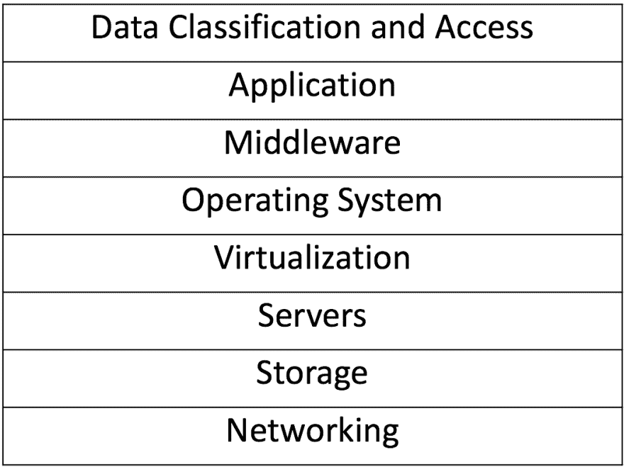
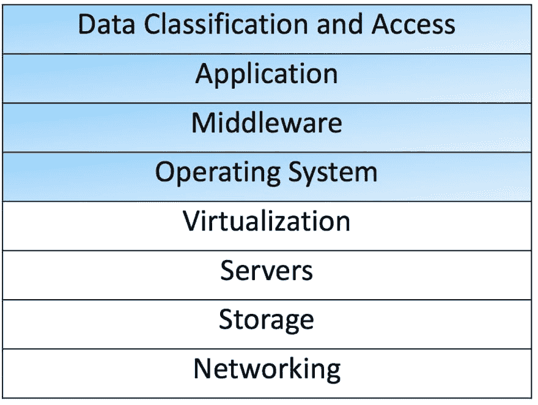

# 如何在云中保持安全

> 原文：<https://dev.to/aditichaudhry92/how-to-be-secure-in-the-cloud-2pnp>

这篇文章最初发表在 Medium 上。你可以在这里看一看它[。](https://medium.com/@aditi.chaudhry92/how-to-be-secure-in-the-cloud-613846412db1)

近年来，云计算已经成为一个热门词汇，导致一些人对它的好处持怀疑态度。云计算有很多好处，但大多数都集中在成本效益和速度上。很少有人提到安全性是迁移到云的一个好处。现实情况是，云可以是安全的，也可以是不安全的，就像你创造它一样。然而，如果架构得当，在云中拥有高度弹性、可伸缩、安全和合规的应用程序是可能的。

迁移到云的第一个好处是，保护云环境的责任由客户和云供应商共同承担。在内部环境中，客户处理所有的安全性问题(图 1)。在云环境中，客户只负责操作系统及其以上的安全性(图 2 中浅蓝色阴影部分)。迁移到云让客户能够将精力集中在构建一个强大而安全的应用程序上。

*图 1:*

*图二:*

**可扩展性&弹性**
在云中托管应用程序使您能够利用随需应变的可扩展性。应用程序缺乏可伸缩性会带来客户体验问题和安全威胁。随着应用程序越来越受欢迎，很难预测客户将在一天中的什么时间访问网站。一台服务器无法处理数百万个请求，但是让数百台服务器在一天中的低需求时段闲置也不是一个理想的解决方案。随着应用程序的增长，您不必购买更多的硬件和软件资源，而是可以按需配置资源，并且只为您需要的资源付费。这样可以省钱，因为您只需为您使用的东西付费。

让我们想象这样一种情况，你有一个电子商务网站，你的一个项目突然非常受欢迎。当互联网喜欢你的产品时，运营团队发现网络流量激增，服务器突然达到了最大容量。订单得不到处理，下载速度慢得令人难以置信，客户也不满意。在云环境中，我们可以利用自动伸缩和弹性负载平衡来确保这种情况不会成为现实。当负载平衡器遇到过多负载时，它可以触发自动扩展策略来启动新的服务器。当需求减少时，我们可以缩减我们的服务器，确保我们不会为未使用的资源付费。这样，所有订单都完成了，下载时间也没有受到影响，从而产生了满意的客户。

扩展不仅是一种经济高效的方法，还能使应用程序具有弹性。如果您只有一台物理服务器，并且该服务器曾经遇到过某种类型的硬件故障，那么更换服务器并让应用程序备份和运行将需要时间。在云中，如果一台服务器出现问题，它可以很容易地被终止，不到 5 分钟就可以创建一台新的。它甚至可以是一个自动化的过程，让你的生活更轻松。

类似地，如果您的应用程序遭受 DDoS 攻击，挫败这种企图的希望很小。然而，在云环境中，我们可以扩大规模，吸收 DDoS 攻击的负载。DDoS 攻击背后的关键策略是将基础设施带到一个临界点。该战略假设您无法通过扩展来应对攻击，其成功取决于这一假设。因此，挫败这种策略的最简单的方法是将基础设施设计为在需要时进行水平和垂直扩展。我们可以利用扩展的四大优势来缓解 DDoS 攻击:

1.  攻击扩散到更大的区域。
2.  攻击者必须对新的规模进行反击，占用更多的资源。
3.  扩展为我们赢得了分析攻击并采取适当对策的时间。
4.  扩展为我们提供了额外的冗余级别。

在云中按需扩展可提供弹性，并以经济高效的方式保护应用免受网络流量增加、硬件故障和 DDoS 攻击的影响。接下来，我们将讨论云环境如何实现更好的身份和访问管理流程。

**身份和访问管理**
IAM 的目的是供应、管理和取消供应有权访问您的云环境基础架构的身份。借助 IAM，您可以集中管理用户、安全凭证、访问密钥和权限策略，以控制用户可以访问哪些服务和资源。这很重要，因为如果没有帐户权限策略，任何人都有能力运行特权命令。无意和有意的情况都可能发生，有人可能会使用特权命令破坏系统。在云环境中设置身份和访问管理(IAM)有助于确保这种情况不会发生。

目标是永远不需要以 root 用户的身份登录。IAM 有四个组件，可以实现对基础设施和应用程序的安全和最低权限访问。

1.  中央用户存储库—存储身份信息并将其交付给其他服务。
2.  身份验证—这通过询问您是谁并使用一个或多个身份验证因素验证身份声明来建立身份。
3.  授权—这将评估您在身份验证后有权访问您尝试访问的任何内容。
4.  用户管理—管理用户生命周期(入职、离职、角色变更、身份/密码变更)。

通过使用联合身份管理(FIM ),云中的身份认证变得非常简单。当使用 FIM 时，应用程序不需要关注识别和验证，只需要授权。有不同的联盟标准可用于身份验证，包括单点登录(SSO)、SAML、Oauth、OpenID Connect 和 WS-Federation。这些标准可用于确保用户、开发人员和管理员只拥有他们需要的访问权限，执行最小特权原则。

IAM 帮助我们管理谁有权访问数据，但我们也需要注意我们如何在云中保护数据。

**数据保护**
举一个电子商务应用程序的例子，如果硬件故障导致数据丢失，您丢失的不仅仅是应用程序代码。您的应用程序可能包含敏感的客户信息，如个人身份信息(PII)和信用卡信息，这些信息也可能会丢失。

在云中通过快照创建备份很容易。我们可以为数据库和存储卷创建快照，并在必要时从这些快照中恢复数据。许多云提供商也有存储选项，包括归档存储，具有高耐用性，可以作为我们备份策略的一部分。

我们还希望确保通过应用程序存储或处理的任何敏感信息的安全。因此，我们应该对传输中的数据和静态数据进行加密。要加密静态数据，我们应该加密存储数据的整个磁盘或卷。当数据在传输时，我们应该使用 TLS 或 VPN 来加密数据。

我们还希望保护应用程序免受常见的 web 攻击，如 SQL 注入和跨站点脚本，这些攻击可能会危及安全性或影响可用性。我们希望过滤掉已知的坏 IP 地址，并监控 HTTP 和 HTTPs 请求。我们可以使用 web 应用程序防火墙(WAF)来做到这一点。通常，防火墙内置于云环境中，默认拒绝，这为我们的应用程序和数据提供了额外的保护层。

保护我们的数据是不够的，我们还需要确保我们遵守任何法律法规。

**符合性**
假设我们的示例应用程序处理信用卡信息，我们需要确保我们符合 PCI-DSS。我们可以选择符合 PCI-DSS 标准的云提供商，如 AWS，或者确保我们存储、处理或传输持卡人数据的方式符合标准的云提供商。我们还应该确保遵守任何现有的数据保留政策。生命周期规则可用于某些存储解决方案，以满足任何数据保留策略。

如果应用程序通过了审核，您将不必花费数小时来准备审核，因为资产清单和审核工具是内置的云服务。由于云环境中的每个调用都是一个 API 调用，因此有大量的 API 调用日志记录。日志可能包含控制台/API 登录、高速率的 API 活动、新种类的 API 活动和访问数据库的新 IP 地址。这些日志在发生数据泄露或网络攻击时也很有用。

只有在实际应用代码安全的情况下，建立安全的基础设施、保护我们的数据并确保合规性才是有用的。随着向云的转移，开发人员可以开始接受 DevSecOps 及其与安全编码实践相关的原则。

**安全编码实践**
遵循 DevSecOps 原则可以产生健壮的补丁策略和安全的代码。DevSecOps 的一个原则是“自动化安全更新”这是一个重要的原则，因为它适用于使用自动化工具来修补操作系统、核心服务和应用程序本身。开发人员可以使用 Puppet 和 Chef 等工具在云环境中实现持续修补。

另一个 DevSecOps 原则声明，“从一开始就集成和自动化安全扫描。”为了建立安全的编码实践，我们可以通过自动化工具和手工代码审查来进行代码分析。每当代码库中有有意义的变化时，我们都应该检查代码。此外，我们应该对我们的代码进行静态和动态渗透测试，以找到任何漏洞，然后在将代码发布到产品中之前减轻它们。

**结论**
如您所见，云的许多特性非常适合于安全性。我们可以使用 autoscaling 来提供可伸缩性和弹性，使用 IAM 来管理用户和资源访问，使用云服务来实现数据保护和合规性，使用 DevSecOps 来实现安全编码实践。因此，在云环境中拥有安全的应用程序是可能的。

这是我的“什么是”科技博客系列的第十二篇文章。我会每周在这里和我的博客上写更多！