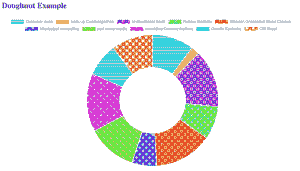

# 图表、颜色和补语:天啊！

> 原文：<https://dev.to/stephencweiss/charts-colors-and-complements-oh-my-3b3n>

> 图表是编程的黑洞。

有人警告过我，但我还是想研究图表。那是我的第一个错误。

一般来说，人类倾向于比文本更好地理解图形信息。但是以一种引人注目的方式视觉呈现信息不仅不容易(T2)，也不容易(T3)。这是**硬**。

如果我没有被说服，我最近的经历让我几乎没有怀疑。

在添加简单图表的过程中，我进入了许多兔子洞进行探索…并迷失其中。

这篇文章旨在记录这一过程中的三个主要收获:

1.  图表很难；相应地安排你的时间
2.  纯粹随机的颜色可能会不和谐；互补色可以用黄金分割率来推导
3.  将颜色转换为 RGB、HSV、HSL 和十六进制表示背后的数学原理非常有趣，不需要每次都重新定义。

# 绘制图表

为了在我的应用程序中绘制图表，我使用了 [chart.js](https://www.chartjs.org/) 。我正在构建一个 React app，那里的*是* [react-chartjs-2](https://www.npmjs.com/package/react-chartjs-2) ，React 的一个`chart.js`包。

然而，我在试图将它合并到项目中时遇到了一些奇怪的错误，所以我采用了 MVP 方法，并使用了基本包。

我计划在未来进行重构，使用 React 版本，因为它似乎对组件有更好的支持，但同时，我让它工作了。

<figure> 

<figcaption>其中一张图表我最终得以呈现。</figcaption>

</figure>

我使用了[patterno mally](https://github.com/ashiguruma/patternomaly)包，它通过在图表中包含模式来帮助解决可访问性问题。

# 随机化颜色

在这一点上，我没有一个设计师来帮助我的应用程序。我也没有可以支持几十种颜色的样式指南。

在这种情况下，我应该做最简单的事情来为我的图表随机化颜色。看起来应该是这样的: