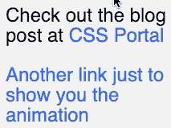
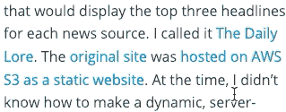

# 带 CSS 的动画多行链接下划线

> 原文：<https://dev.to/dguo/animated-multiline-link-underlines-with-css-hk0>

从头开始建立我的个人网站而不是使用别人制作的[主题](https://themes.gohugo.io/)的一个好处是，我可以从浏览器的默认设置开始，逐渐添加我自己的华丽元素。我努力保持我的网站精简，但使它个人化也是一个要点。在一端的[黑客新闻](https://news.ycombinator.com/)和 [Craigslist](https://newyork.craigslist.org/) 的简朴页面和另一端的[旧 MySpace](https://news.codecademy.com/myspace-coding-legacy/) 的超负荷感官之间，存在着一系列不必要的接触。

我偶然发现了一个网站，它为链接添加了有趣的动画下划线，我想给我的网站添加一个类似的效果。使用纯 CSS 解决方案对我来说很重要。对于这种琐碎的事情，我不想添加可能导致性能问题或令人沮丧的行为的 JavaScript(参见[滚动劫持](https://envato.com/blog/scroll-hijacking/))。

这是现在的效果。

[](https://res.cloudinary.com/practicaldev/image/fetch/s--SBb72fiS--/c_limit%2Cf_auto%2Cfl_progressive%2Cq_66%2Cw_880/https://thepracticaldev.s3.amazonaws.com/i/yf8as7sn1ovzkdp2zx5x.gif)

## 实现

网页上在文本下画线的话题可能会[出奇地复杂](https://medium.design/crafting-link-underlines-on-medium-7c03a9274f9)，这取决于你愿意[偏离`text-decoration: underline`多远](https://css-tricks.com/styling-underlines-web/)以及你关心哪些细节(比如[清除下行符](https://stackoverflow.com/q/40008990/1481479))。

我研究了几种方法:

*   [动画链接下划线](http://tobiasahlin.com/blog/css-trick-animating-link-underlines/)
*   [CSS 动画下划线链接](http://www.cssportal.com/blog/css-animated-underline-links/)

这两个工具都从本质上移除了默认的文本修饰，并使用[伪元素](https://developer.mozilla.org/en-US/docs/Web/CSS/Pseudo-elements)添加了一个模拟边框。然后边框被 [CSS 过渡](https://developer.mozilla.org/en-US/docs/Web/CSS/CSS_Transitions/Using_CSS_transitions)动画化。不幸的是，这些解决方案有一个缺点:如果链路跨越多条线路，它们就不能正常工作。下划线只出现在第一行。

[](https://res.cloudinary.com/practicaldev/image/fetch/s--9A5C-aYM--/c_limit%2Cf_auto%2Cfl_progressive%2Cq_66%2Cw_880/https://thepracticaldev.s3.amazonaws.com/i/x6a51n5ai9i0ow83c95x.gif)

我最终找到了一个没有这个缺陷的[肖](https://twitter.com/shshaw)的 [CodePen](https://codepen.io/shshaw/pen/pdyJBW) 。我修改 CSS，直到我找到一个对我来说不错的解决方案。

[](https://res.cloudinary.com/practicaldev/image/fetch/s--EjjHBMS1--/c_limit%2Cf_auto%2Cfl_progressive%2Cq_66%2Cw_880/https://thepracticaldev.s3.amazonaws.com/i/9m2i9sjm9g43mxbn387g.gif)

下面是相关代码。你可以用[这个 repl](https://repl.it/@dyguo/animated-multiline-link-underlines) 来摆弄它。

```
a {
    text-decoration: none;
    background-image: linear-gradient(currentColor, currentColor);
    background-position: 0% 100%;
    background-repeat: no-repeat;
    background-size: 0% 2px;
    transition: background-size .3s; 
}

a:hover, a:focus {
    background-size: 100% 2px; 
} 
```

Enter fullscreen mode Exit fullscreen mode

让我们一部分一部分地研究这个方法。首先，我们关闭链接的默认`text-decoration`。

我们想使用[背景图像](https://developer.mozilla.org/en-US/docs/Web/CSS/background-image)，因为它可以跨越多行。虽然我们可以提供一个实际的图像，但我们只想画一条线，所以我们使用[线性梯度](https://developer.mozilla.org/en-US/docs/Web/CSS/linear-gradient)，它为我们生成一个图像。通常，它用于创建两种不同颜色之间的渐变，但是我希望下划线和链接的颜色一样，所以我使用 [currentColor](https://developer.mozilla.org/en-US/docs/Web/CSS/color_value#currentColor_keyword) 作为渐变的开始和结束。`currentColor`告诉浏览器使用元素的计算的[颜色](https://developer.mozilla.org/en-US/docs/Web/CSS/color)属性。

我们使用[背景位置](https://developer.mozilla.org/en-US/docs/Web/CSS/background-position)将图像放置在左下角。`0%`设置水平位置，`100%`设置垂直位置。

我们关闭[背景-重复](https://developer.mozilla.org/en-US/docs/Web/CSS/background-repeat)来防止它创建图像的多个实例来填充链接的整个背景。

我们使用[背景尺寸](https://developer.mozilla.org/en-US/docs/Web/CSS/background-size)使图像的宽度为零像素，高度为两像素。它的宽度为零，因为下划线应该只在悬停时出现。

我们在`background-size`上设置了一个[转换](https://developer.mozilla.org/en-US/docs/Web/CSS/transition)，因此对属性的任何更改都将花费`0.3`秒来完成。

在链接[悬停](https://developer.mozilla.org/en-US/docs/Web/CSS/:hover)时，我们将图像的宽度改为`100%`，创建一个完整的下划线，然后`transition`处理动画。正如 [nickels55 建议](https://www.reddit.com/r/web_design/comments/a7y701/animated_multiline_link_underlines_with_css/ec6pwel/)的那样，我们也希望这种效果发生在那些使用键盘导航的人的焦点上。感谢 nickels55 将[可访问性](https://en.wikipedia.org/wiki/Web_accessibility)牢记在心。

就是这样！我很高兴看到[承诺](https://github.com/dguo/dannyguo.com/commit/14e51391329163fa414ac55d77fdf6da521ab644)最终变得如此之小。如果你想在你的网站上添加一些类似的东西，请随意使用这个实现，或者查看一些其他的[动画下划线效果](https://speckyboy.com/underline-text-effects-css/)来获得灵感。

*最初发表于[www.dannyguo.com](https://www.dannyguo.com/blog/animated-multiline-link-underlines-with-css/)。*

*发现错误或错别字？请随时在 [GitHub](https://github.com/dguo/dannyguo.com/blob/master/content/blog/animated-multiline-link-underlines-with-css.md) 上打开拉取请求。*