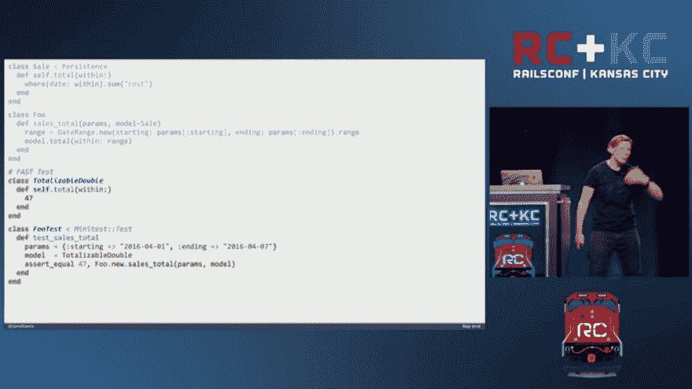

# 快速稳定地测试导轨

> 原文：<https://dev.to/chenge/test-rails-fast-and-stable-ik5>

在这个 Metz 的视频 [RailsConf 2016 -闻一闻 Sandi Metz](https://www.youtube.com/watch?v=PJjHfa5yxlU) 的视频中，她演示了如何通过假对象进行重构并使测试快速稳定。

```
class Foo --> class Sale 
```

用假货销售来试探 Foo。

代码在这里:

[](https://res.cloudinary.com/practicaldev/image/fetch/s--RGC6tSmr--/c_limit%2Cf_auto%2Cfl_progressive%2Cq_auto%2Cw_880/https://thepracticaldev.s3.amazonaws.com/i/noicqltg41rfsqr5y0jl.png)

# 测试任何缓慢或不稳定的 API

你可以用这个方法来测试任何我认为。