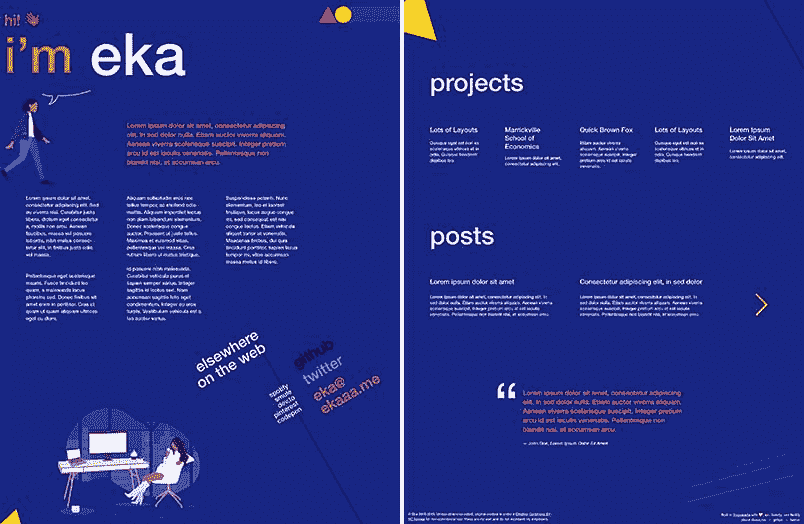
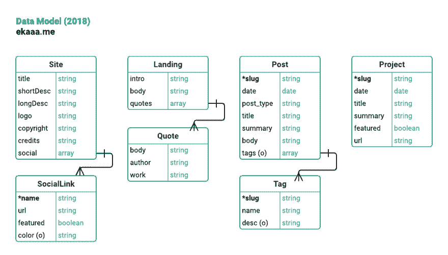
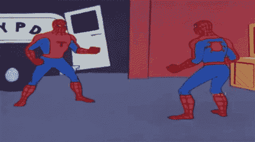
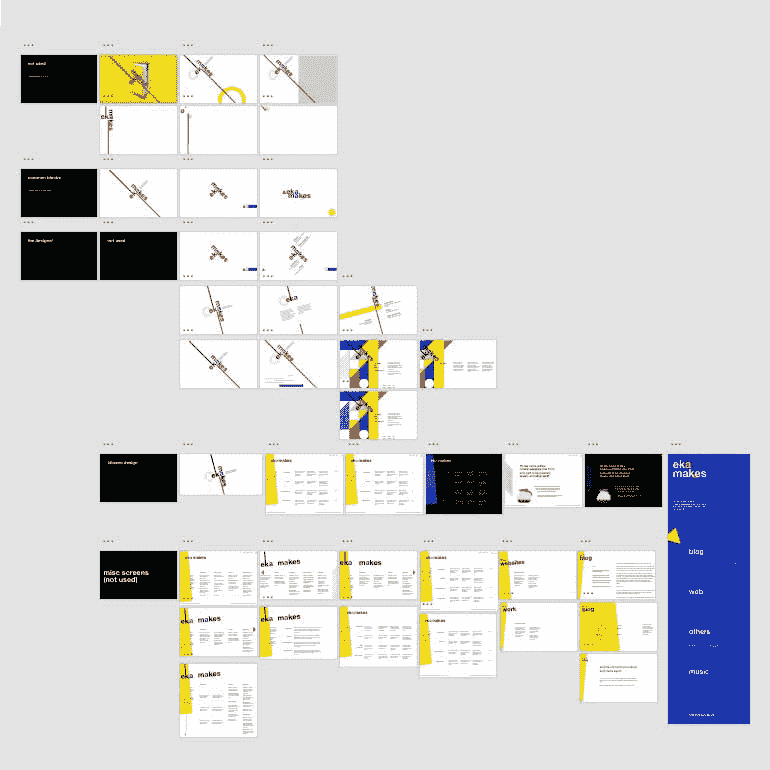
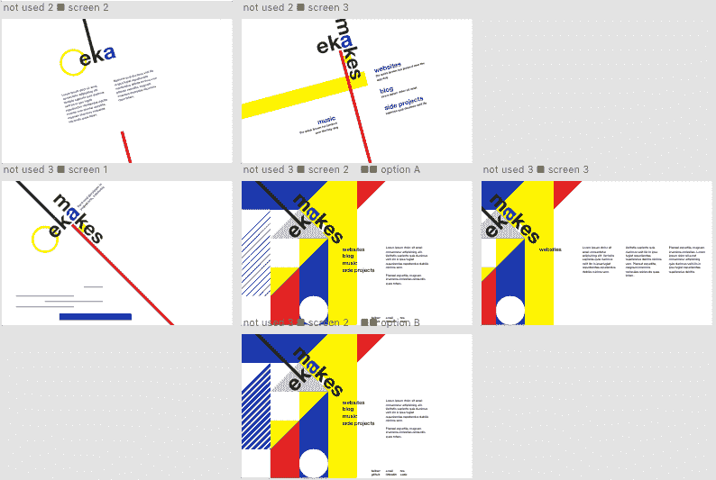
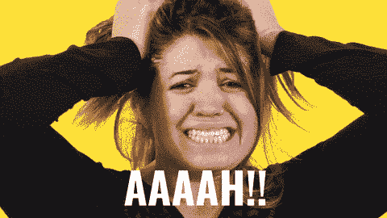
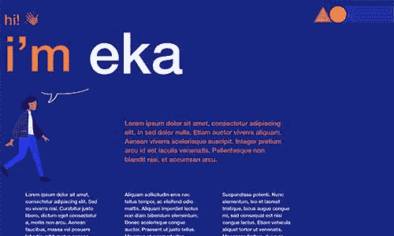
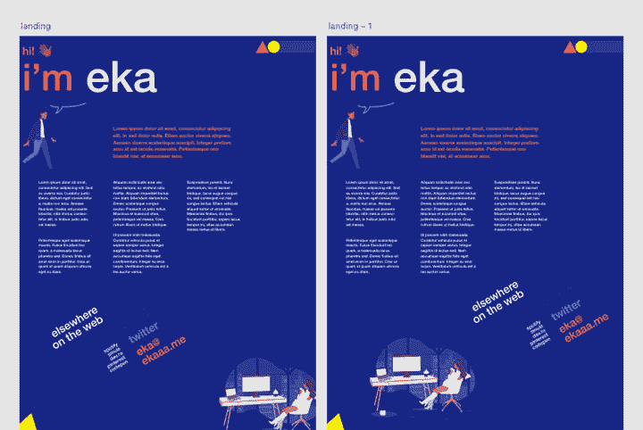

# 构建我的个人网站——第 1 部分:规划和设计

> 原文：<https://dev.to/ekafyi/building-my-personal-site--part-1-planning-and-designing-4fm>

<figure>

<figcaption>Work in progress</figcaption>

</figure>

年初的时候，我还没有网站。所以我把“建立一个个人网站”作为我 2018 年的目标之一。快进到 2018 年 12 月中旬...我仍然没有一个网站，由于恶习(拖延、担忧、完美主义)和生活事件的结合(得到了我的第一份正式开发工作！).请跟随我创建一个简单的登录页面，这样我就可以检查今年的至少一个目标！🤦🏽‍♀️✅

🔗在这篇文章的末尾找到一个有用的资源列表！

## 获取域名

我宁愿不用全名，也不想要假名。我最初摆弄过*ekamak . es*——我喜欢重复的字母(“makes”包含来自“Eka”的所有字母)，以及类似句子的 URL(【ekamak.es/websites】)的可能性。但我的目标是一个更通用的名字，不一定与“制造者”的形象联系在一起。

我在推特上对*的 ekamak.es* 和*的 ekaeka.me* 进行了投票，后者赢了。最后，我选择了…都不是。我在地址栏输入 *ekaaa.me* ，一见钟情，马上就买了。\ *(ツ)* /

## 数据建模

**数据模型**是“信息世界所涉及的不同数据元素之间的逻辑关系和数据流”( [Techopedia](https://www.techopedia.com/definition/18702/data-model) )的模型。最常见的类型是**关系数据模型**，它将数据分类成表格、列和行。**实体关系图(ERD)** 是关系数据库的可视化，它“说明了‘实体’如人、对象或概念在一个系统中如何相互关联”( [Lucidchart](https://www.lucidchart.com/pages/er-diagrams) )。

我计划用来自 JSON 和 Markdown 文件的数据在 Gatsby 上建立我的站点，因此没有数据库。我没有创建一个完整的 ERD，但我做了一个初步的图表作为自己的参考。

<figure>

<figcaption>Basic data model diagram for my personal site</figcaption>

</figure>

虽然我不打算使用大型数据库(⚠️ *这不是一个准确的数据库表实体关系图！*)，甚至可能不会 100%忠实地实现这个图，创建这个图让我可以鸟瞰我的站点数据，这将有助于我以后设计数据。

如你所见，我的网站 2018 年迭代不会有太多内容。它只有一个页面，即**登录页面**，其中包含:

*   关于我和我的工作的文本
*   3 篇最新的**博文**(其中一篇将是*这篇*的帖子！)，链接到单个`Post`视图
*   x 个最新的**项目**，它们链接到 Github 或 Glitch 上的外部项目 URL(我正在编写这一部分，但不会将它包含在 deploy 中)
*   随机显示一条**最喜欢的语录**,只是因为

包含通用的站点范围的数据，用于所有页面，包括搜索引擎优化元数据和“站点信息”部分(即页脚/侧栏)。

当我们在下一部分设置网站时，我们将再次讨论这个问题！

## 在 Adobe XD 上制作设计原型

对我来说，视觉设计是网页开发中最令人沮丧的部分。我很好地理解了基本要素(对称、接近、对比、网格等)，并且我*能够*做出用户喜欢的基本布局和用户界面。但是我讨厌我不能做出复杂的设计，通过恰当的选择颜色、字体、形状等来表达特殊的情绪和特征。我讨厌在自己喜欢的事情上做得不好——只是过得去。

过去，我会把它藏在地毯下面，完全避开它。直到最近我才意识到这是我需要忘记的事情。所以我决定忍气吞声，尽力设计我的个人网站。如果有的话，我可以确切地知道我的设计能力的程度(从现在起一年后重访会很有趣！).不过，除此之外，我会变得足够优秀，以便在拥有优秀 UI/视觉设计师的公司或客户那里工作。😉

#### 设计简介

<figure>

<figcaption>Designer: Me, Client: Me</figcaption>

</figure>

我不确定一份真正的设计概要需要什么；我用这些指导性的观点来代替一个摘要。

网站目标:

*   为我的在线形象创建视觉品牌
*   告知我是谁，我做什么，我的兴趣
*   展示我的前端开发和 UX 技能
*   获得参与，如评论或分享

观众:

*   朋友和熟人
*   我与之互动的技术、设计或音乐社区
*   未来的潜在雇主、竞赛评委等

情绪和语气:

*   定制，而不是“模板 y”
*   干净但不正式
*   引人注目，有趣，但结构良好

设计风格和主题:

*   现代主义、瑞士、包豪斯、德国风格、约瑟夫·穆勒-布罗克曼、[工厂记录](https://www.factoryrecords.org/designers.php)海报
*   几何形状和线条
*   大号无衬线字体

*(没有特别的理由，除了它们是我个人的最爱，我从来没有在其他地方玩过)*

#### Enter Adobe XD

[Adobe XD](https://www.adobe.com/products/xd.html) 是 Adobe 用于 UX 设计和原型制作的应用。在我尝试过的其他一些图形原型应用程序中，这是感觉最直观和最放心的。

一些我特别喜欢的功能:

*   使用云同步离线工作(这是我选择它而不是 Figma 的主要原因)
*   [可定制的网格](https://helpx.adobe.com/xd/help/artboards-grids.html)
*   [重复元素](https://theblog.adobe.com/exploring-repeat-grid-in-adobe-xd/)(对“卡片”和帖子摘录非常有用)
*   [资产库](https://helpx.adobe.com/xd/help/assets-symbols.html)(保存颜色和排版样式，点击即可更改所有实例)
*   复杂的“快照”功能，让移动物品变得轻松愉快

事实上，搬东西是我自七月下旬以来唯一完成的事情。我会创建一个新的画板，添加内容，移动东西，这通常会产生一些小的变化。然后我会得到一个不同方向的想法，添加另一个画板，等等。

<figure>

<figcaption>These don’t even include ones that got discarded along the way</figcaption>

</figure>

一直以来，有时我会喜欢某个版本，但第二天就会转向另一个版本。然而，我对其中任何一个都没有足够强烈的感情来决定我的选择。这些设计——除了一些“实验性”的碍眼之外—*确实满足了基本要求(层次清晰，大小和颜色清晰，用户可以很容易地浏览/获取他们想要的信息)。我该如何选择？*

 *<figure>

<figcaption>Me: *reads an art book once...*</figcaption>

</figure>

从这个过程中，我发现*相对于前端开发的其他部分，到底是什么让视觉设计对我来说很难:**我分不清什么时候行得通，什么时候行不通，如何得出最佳解决方案**。当然，用户测试/采访是理想的答案，但并不总是可能的。*

 *相比之下，在获取数据集并将其提供给用户的许多方法中(例如)，我可以根据一组标准(最快、最有效地利用资源、最干净和/或最少的代码量、最不容易出错、以我喜欢的语言/语法等)来决定解决方案。如果我不知道怎么做，我可以搜索 Stack Overflow(或者 dev.to！)并调整其他人的解决方案以适应我的需求。这些在视觉设计中是不可能的。

我为此一直努力工作到八月。士气越来越低；我越来越忙。在接下来的两个月里，我每周只尝试继续设计一次，直到上周才再次尝试。

这场地狱般的冒险的结局是由我上周的域名搜索带来的。在苦思这些名字的时候，我打开了 XD，想看看哪个在排版时看起来最好看。我决定不在设计中写域名，但我也有了一个新的设计想法，我用以前最强设计的部分拼凑而成。接下来的几天我不得不离开它去处理更紧迫的事情，但是昨天我回到了那里，花了几个小时在网格和其他事情上，就这样...我知道我完了。🤷🏽‍♀️

<figure>

<figcaption>I’ll let the illustrator choose whichever version suits her artwork better (screenshot above uses placeholder)</figcaption>

</figure>

最上面的图片来自巴勃罗·斯坦利令人敬畏的《人类》片场。它是 SVG 格式的，所以编辑很容易！中间的图像是来自 [Undraw](https://undraw.co) 的临时占位符——我让我的插画家朋友制作了一个艺术品，同时我将开始开发这个网站。

如果你读到这里，谢谢你的耐心！在下一部分，我将记录我是如何在 React 和 Storybook 上开发 UI 组件的。让乐趣开始吧！😎

* * *

## 资源

领域

*   域名选择广泛，迄今为止服务良好
*   [Random.org 抛硬币人](https://www.random.org/coins/)——取个好名字

数据模型和 ERD

*   [Lucidchart](//lucidchart.com) —我用这个做上图。提供免费层。他们也有关于 [ERD](https://www.lucidchart.com/pages/er-diagrams) 和[数据库模型](https://www.lucidchart.com/pages/database-diagram/database-models)的好文章。
*   [ERDPlus](https://erdplus.com) —专注于 ERD 的 Lucidchart 的替代产品；更好的技术特性，但视觉效果不太好

样机研究

*   [Adobe XD](https://www.adobe.com/products/xd.html) —免费下载
*   巴勃罗·斯坦利的自由人插图
*   Katerina Limpitsouni 的大量开源插图
*   [shape factory 的颜料](https://pigment.shapefactory.co/) —简单、漂亮的双色调色板生成器。找到这个之后，我就不再使用其他颜色选择器了。
*   [Coolors.co](https://coolors.co/)——另一款出色的配色方案生成器
*   [可访问的颜色](http://accessible-colors.com/) —颜色对比检查器(AA 和 AAA，可定制字体大小和粗细)
*   snook.ca 的色彩对比检查——另一个具有更多技术细节的色彩对比检查器

给不情愿的设计师的设计建议

*   网页设计速成班:从一个非设计师到另一个——阿里·斯皮特尔
*   重构用户界面——亚当·瓦森&史蒂夫·舒格
*   更好排版的五分钟指南——皮尔里克·卡尔维兹
*   [UX 法律——乔恩·亚布隆斯基](https://lawsofux.com/)
*   制作和打破网格:一个平面设计布局研讨会——蒂莫西·萨马拉——不是设计技巧，而是包含了大量网格用法的例子**