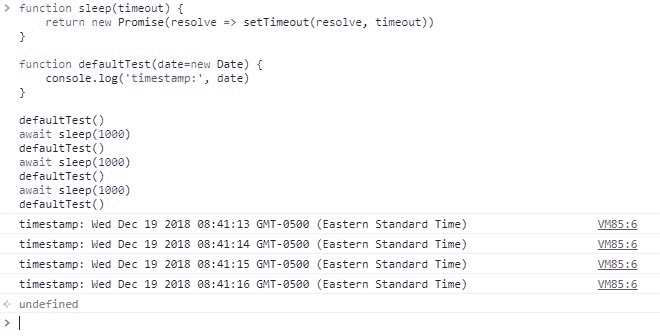

# JavaScript 与 Python:默认函数参数值

> 原文：<https://dev.to/kenbellows/javascript-vs-python-default-function-parameter-values-7dc>

昨天，我在推特上表达了我对 JavaScript 处理函数参数默认值的方式的兴奋之情:

> Ken Bellows@ Ken _ Bellows我很高兴[# JavaScript](https://twitter.com/hashtag/javascript)function param 默认值是在每次函数调用时动态计算的，而不是在函数声明时。这经常让我在 [#Python](https://twitter.com/hashtag/Python) 中出错，这里默认值被评估一次。
> 
> [# es next](https://twitter.com/hashtag/ESNext)[# TC39](https://twitter.com/hashtag/TC39)[# web dev](https://twitter.com/hashtag/webdev)2018 年 12 月 19 日下午 13:50[](https://twitter.com/intent/tweet?in_reply_to=1075387922210308096)[](https://twitter.com/intent/retweet?tweet_id=1075387922210308096)4[](https://twitter.com/intent/like?tweet_id=1075387922210308096)2

我想对这条推文进行扩展，并更详细地讨论我给出的两段代码，比较 JavaScript 和 Python 中该功能的行为。

## 背景:Python 如何做默认值

回想过去，尤其是在我的大学时代，我写了很多 Python。我仍然是 Python 的忠实粉丝，尽管最近我不怎么用它了。

总之，有一天我在做一些大的 Python 项目，我对某个函数的一个参数使用了默认值。这是几年前的事了，所以我不记得任何细节，但重要的是默认值是一个`dict`。让我们想象它是这样的:

```
def doSomething(o={'name':'Ken'}):
  o['timesSeen'] = o.get('timesSeen') or 0
  o['timesSeen'] += 1
  return o 
```

下面是我多次运行该函数时所期望看到的结果:

```
> print(doSomething())
{'name': 'Ken', 'timesSeen': 1}
> print(doSomething())
{'name': 'Ken', 'timesSeen': 1}
> print(doSomething())
{'name': 'Ken', 'timesSeen': 1} 
```

下面是我看到的:

```
> print(doSomething())
{'name': 'Ken', 'timesSeen': 1}
> print(doSomething())
{'name': 'Ken', 'timesSeen': 2}
> print(doSomething())
{'name': 'Ken', 'timesSeen': 3} 
```

当然，不同之处在于`'timesSeen'`条目每次都是递增的。

我的实际代码要比这微妙得多，效果也不那么明显，所以我最终花了一天时间，IIRC，才弄明白发生了什么。而答案是:**默认值只求值一次，在函数声明的时候！**

当第一次评估`def`语句时，评估作为`o`参数默认值的对象，并且仅在那时，而不是(如我所料)每次调用函数时不为`o`提供值。因此，默认对象成为该函数多次运行的共享引用，并且在给定运行中对其所做的更改会被带到下一次运行中。

这种只评估一次的行为以不同的方式反映在我推文中包含的示例代码中:

[https://repl.it/@KenBellows/LoyalFractalScope?lite=true](https://repl.it/@KenBellows/LoyalFractalScope?lite=true)

这段代码运行一个打印时间戳的函数，使用当前时间(由`datetime.datetime.now()`提供)作为默认值。它运行此功能 4 次，每次运行之间有 1 秒钟的暂停(`time.wait(1)`)。如果每次调用函数时都重新计算默认值，那么每次调用函数时，您都会看到时间戳的第二个字段增加 1。相反，我们看到的是相同的时间戳打印了 4 次。

这就是它在 Python 中的工作方式。一旦你知道了它，它基本上是好的，很容易解决，但不是直观的，而且我觉得不如每次都重新评估表达式有价值。对于像数字和字符串这样的原语，或者在只从对象中读取而不更新它的情况下，它工作得很好，但是如果你想更新一个对象并在以后使用它，不要使用默认的对象值。

## 新增花式:ES6 默认参数值

ECMAScript 2015 规范，俗称 ES6，定义了[默认函数参数](https://developer.mozilla.org/en-US/docs/Web/JavaScript/Reference/Functions/Default_parameters)，这给了 JavaScript 类似于 Python(和其他几种语言)中默认参数值的功能。

但是 Python 和 JavaScript 默认参数有一个至关重要的区别: **JS 默认表达式是在每次运行函数时计算的！**

为了演示，让我们试试上面 JavaScript:
中的`doSomething()`函数

```
function doSomething(o={name:'Ken'}) {
  o.timesSeen = o.timesSeen || 0
  o.timesSeen += 1
  return o
} 
```

让我们看看它在多次运行中的表现:

```
> doSomething()
{name: "Ken", timesSeen: 1}
> doSomething()
{name: "Ken", timesSeen: 1}
> doSomething()
{name: "Ken", timesSeen: 1} 
```

嘿！它做了我之前期望的事情！厉害！当函数被定义时，它不计算默认值表达式，而是懒惰地只在需要时计算，这更符合我的期望，我不知道你的期望。

回到我的 tweet，让我们用 JavaScript 实现时间戳打印功能:

[https://repl.it/@KenBellows/CornyCarelessHashmap?lite=true](https://repl.it/@KenBellows/CornyCarelessHashmap?lite=true)

输出现在显示了我们上次所期望的:每次调用函数时,`new Date`时间戳的第二个字段都会增加，因为每次调用函数时,`new Date`表达式都会被重新计算！厉害！

## 最后的想法

现在应该很清楚，尽管我很喜欢 Python，但我更喜欢 JavaScript 处理默认参数值的方式。我喜欢默认表达式是延迟求值的:如果它包含一个函数调用，比如`new Date`，那么这个函数调用是延迟求值的，允许它反映系统的当前状态，以及自上次调用该函数以来所做的任何更新。

(**免责声明:**副作用会咬你，尽量少用！)

但是你的想法是什么？你更喜欢 Python 的做事方式吗？你对默认表达式的期望和我不同吗？

我绝对肯定这是 Python 的维护者有意为之，特别是因为这种行为是从 Python 2.x 延续到 Python 3.x 的，当时还做了其他几个大的语法更改，所以我很好奇是否有人知道他们的理由。