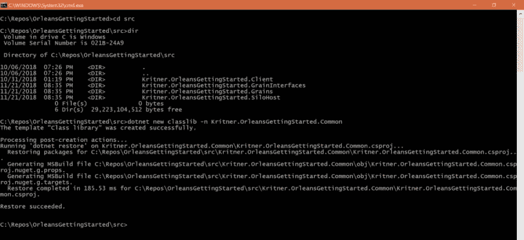
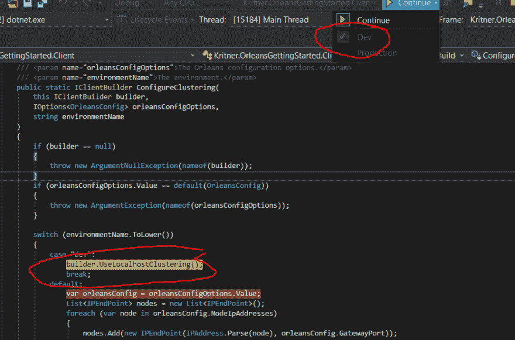
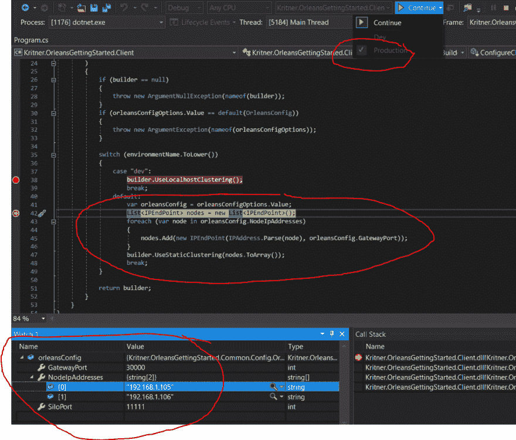
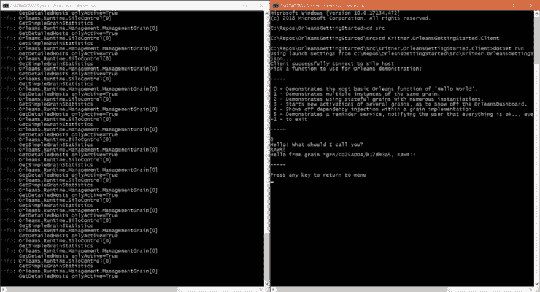

# Microsoft Orleans —在“开发”和“生产”配置之间轻松切换。

> 原文：<https://dev.to/kritner/microsoft-orleanseasily-switching-between-development-and-production-configurations-43h5>

### 微软奥尔良—轻松在“开发”和“生产”配置之间切换。

[](https://res.cloudinary.com/practicaldev/image/fetch/s--9t84Tn9F--/c_limit%2Cf_auto%2Cfl_progressive%2Cq_auto%2Cw_880/https://cdn-images-1.medium.com/proxy/0%2AJnJHfNGV4tkv8UPw.png) 

<figcaption>奥尔良标志</figcaption>

在本地托管奥尔良服务器与在生产场景中部署有一些不同。在本帖中，我们将使用之前学到的一些技能，来帮助我们实现托管生产就绪型奥尔良集群。

在这篇文章中，我们将涉及的一些概念包括:appsettings、`IOptions<T>`、构建器模式、扩展方法和 Orleans 本身。

### 我们将处理什么样的差异？

我们已经讨论了许多不同的“选项”,但是从来没有讨论过如何处理这些差异。根据您使用的奥尔良功能，您可能会遇到一些不同之处，包括:

*   集群配置——无论你使用什么样的其他特性，这个问题似乎都会遇到，所以我们将在这篇文章中讨论它。集群配置的选项包括(但不一定限于)Localhost、Azure、Db。
*   谷物状态储存
*   提醒服务
*   可能是其他的(但是这些是到目前为止已经在帖子中介绍过的特性。)

我们已经看到了 Orleans 如何大量使用构建器——一种[创造模式](https://en.wikipedia.org/wiki/Creational_pattern),我们将利用它以及我以前写过的其他几篇文章，为多种环境设置我们的应用程序。

我们将利用在以下课程中学到的一些知识:

[。net core 控制台应用`IOptions<T>`配置](https://dev.to/kritner/net-core-console-application-ioptionst-configuration-42od)

更新我们的 Orleans 应用程序，以便在多种配置下运行。

### 当前本地配置

对于我们的本地配置，我们让`IClientBuilder`和`ISiloHostBuilder`使用 LocalHostClustering 构建我们的集群和客户端。那看起来像:

客户:

```
IClusterClient client;
client = new ClientBuilder()
 .UseLocalhostClustering() // <--- this guy
 .Configure<ClusterOptions>(options =>
 {
  options.ClusterId = "dev";
  options.ServiceId = "HelloWorldApp";
 })
 .ConfigureApplicationParts(parts => parts.AddApplicationPart(typeof(IGrainInterfaceMarker).Assembly).WithReferences())
 .Build();

await client.Connect(RetryFilter);
Console.WriteLine("Client successfully connect to silo host");
return client; 
```

SiloHost:

```
var builder = new SiloHostBuilder()
 .UseLocalhostClustering() // <--- this guy
 .Configure<ClusterOptions>(options =>
 {
  options.ClusterId = "dev";
  options.ServiceId = "HelloWorldApp";
 })
 .Configure<EndpointOptions>(options => options.AdvertisedIPAddress = IPAddress.Loopback)
 .AddMemoryGrainStorage(Constants.OrleansMemoryProvider)
 .ConfigureApplicationParts(parts =>
 {
  parts.AddApplicationPart(typeof(IGrainMarker).Assembly).WithReferences();
 })
 .ConfigureServices(DependencyInjectionHelper.IocContainerRegistration)
 .UseDashboard(options => { })
 .UseInMemoryReminderService()
 .ConfigureLogging(logging => logging.AddConsole());

var host = builder.Build();
await host.StartAsync();
return host; 
```

对于本地测试，`UseLocalhostClustering`就足够了。然而，我们不会在生产场景中使用它。

我们能做些什么来解决这个问题？几步:

*   将配置文件引入我们的应用程序。这些应用程序文件将包含我们运行环境之间的配置差异。
*   利用`IOptions<T>`的配置类。
*   根据使用的环境，改变我们的客户端和筒仓的构建。

### 更新我们的解决方案，为在奥尔良使用配置做准备

我们将应用很多来自[https://medium . com/@ krit ner/net-core-console-application-io options-t-configuration-AE 74 BF AFE 1c 5](https://dev.to/kritner/net-core-console-application-ioptionst-configuration-42od)的相同想法，所以我可能会跳过一些细节。

#### 配置 POCOs 项目

首先，我们将引入一个新的公共项目，它将容纳 POCOs 和我们应用程序的引导。

运行`dotnet new classlib -n Kritner.OrleansGettingStarted.Common`创建新项目:

[](https://res.cloudinary.com/practicaldev/image/fetch/s--kyAfkeuR--/c_limit%2Cf_auto%2Cfl_progressive%2Cq_auto%2Cw_880/https://cdn-images-1.medium.com/max/1024/1%2As4XazB7eX4MLkNOd_7B3iQ.png)

#### 介绍配置 POCO

我们将需要一个 POCO 来代表我们的奥尔良配置，具体取决于环境。我们需要跟踪的几件事(至少以我计划的方式)包括:

*   思洛存储器 IP 地址
*   思洛端口(思洛到思洛通信的端口)
*   网关端口(客户端与思洛存储器通信的端口)

请注意，这些信息大部分基于位于[https://dot net . github . io/Orleans/Documentation/clusters _ and _ clients/configuration _ guide/typical _ configuration s . html](https://dotnet.github.io/orleans/Documentation/clusters_and_clients/configuration_guide/typical_configurations.html)的文档。我们也可以应用同样的逻辑来使用 Azure 集群，但是我没有任何 Azure 学分，所以用它来做演示。

我们的配置 POCO:

```
/// <summary>
/// Contains properties utilized for configuration Orleans
/// Clients and Cluster Nodes.
/// </summary>
public class OrleansConfig
{
 /// <summary>
 /// The IP addresses that will be utilized in the cluster.
 /// First IP address is the primary.
 /// </summary>
 public string[] NodeIpAddresses { get; set; }
 /// <summary>
 /// The port used for Client to Server communication.
 /// </summary>
 public int GatewayPort { get; set; }
 /// <summary>
 /// The port for Silo to Silo communication
 /// </summary>
 public int SiloPort { get; set; }
} 
```

#### 更新控制台应用程序以利用配置文件

在我们的新类库中，我们将创建几个类来帮助“引导”我们的两个控制台应用程序，用于拉入配置文件，并设置配置(在本例中为`IOptions<OrleansConfig>`)。

让我们添加几个新的配置文件:

应用程序设置. json

```
{  "OrleansConfig"  :  {  "NodeIpAddresses"  :  ["192.168.1.105",  "192.168.1.106"],  "GatewayPort"  :  30000,  "SiloPort"  :  11111  }  } 
```

我将使用上述内容作为生产配置。上面的配置指定我们的集群有两个节点(SiloHosts ),主节点是阵列中的第一个节点，辅助节点是第二个节点(可以有两个以上)。对于我们将使用的集群配置，需要指定一个主服务器；对于其他配置类型，如 azure 表存储，没有“主”节点，因此通常具有更高的可用性(HA)。

appsetting . dev . JSON

```
{  "OrleansConfig"  :  {  "NodeIpAddresses"  :  ["0.0.0.0"],  "GatewayPort"  :  -1,  "SiloPort"  :  -1  }  } 
```

在上面的配置中，我们将用于我们的开发环境(本地测试)，我们并没有真正给出“有效”的配置值，因为这些相同的属性根本没有用于 LocalhostClustering。我添加这些值的原因主要是为了展示特定环境配置文件的加载。

我已经设置了配置文件，以便它们可以同时用于客户端和 silohost，因此我们只希望保留每个配置文件的一个副本，所以我将它们放在/src/_appsettings/*中。

为了让两个项目都“使用”这些文件，我们将在 csproj 中链接它们。可以通过向客户端和 silohost 项目的 csproj 文件添加以下内容来实现链接:

```
<ItemGroup>
 <Content Include=".._appsettingsappsettings.json" Link="appsettings.json" CopyToOutputDirectory="PreserveNewest" CopyToPublishDirectory="PreserveNewest" />
 <Content Include=".._appsettingsappsettings.dev.json" Link="appsettings.dev.json" CopyToOutputDirectory="PreserveNewest" CopyToPublishDirectory="PreserveNewest" />
</ItemGroup> 
```

接下来，我们需要一种加载配置文件的方法，并设置我们的`IOptions<T>`。下面的方法可行，但是我不知道这是不是正确的方法——让我知道！

控制台配置器:

```
public static class ConsoleAppConfigurator
{
 public static IServiceProvider BootstrapApp()
 {
  var environment = GetEnvironment();
  var hostingEnvironment = GetHostingEnvironment(environment);
  var configurationBuilder = CreateConfigurationBuilder(environment);

  var startup = new Startup(hostingEnvironment, configurationBuilder);
  IServiceCollection serviceCollection = new ServiceCollection();
  startup.ConfigureServices(serviceCollection);

  return serviceCollection.BuildServiceProvider();
 }

 private static string GetEnvironment()
 {
  var environmentName = Environment.GetEnvironmentVariable("ASPNETCORE_ENVIRONMENT").ToLower();
  if (string.IsNullOrEmpty(environmentName))
  {
   return "Production";
  }

  return environmentName;
 }

 private static IHostingEnvironment GetHostingEnvironment(string environmentName)
 {
  return new HostingEnvironment
  {
   EnvironmentName = environmentName,
   ApplicationName = AppDomain.CurrentDomain.FriendlyName,
   ContentRootPath = AppDomain.CurrentDomain.BaseDirectory,
   ContentRootFileProvider = new PhysicalFileProvider(AppDomain.CurrentDomain.BaseDirectory)
  };
 }

 private static IConfigurationBuilder CreateConfigurationBuilder(string environmentName)
 {
  var config = new ConfigurationBuilder()
   .SetBasePath(AppDomain.CurrentDomain.BaseDirectory)
   .AddJsonFile("appsettings.json", optional: false, reloadOnChange: true)
   .AddJsonFile($"appsettings.{environmentName}.json", optional: true, reloadOnChange: true)
   .AddEnvironmentVariables();

  return config;
 }
} 
```

启动:

```
public class Startup
{
 public IHostingEnvironment HostingEnvironment { get; }
 public IConfiguration Configuration { get; }

 public Startup(
  IHostingEnvironment hostingEnvironment, 
  IConfigurationBuilder configurationBuilder
 )
 {
  HostingEnvironment = hostingEnvironment;
  Configuration = configurationBuilder.Build();
 }

 public void ConfigureServices(IServiceCollection serviceCollection)
 {
  serviceCollection.AddOptions();
  serviceCollection.Configure<OrleansConfig>(Configuration.GetSection(nameof(OrleansConfig)));
 }
} 
```

在这一点上，我们可以测试我们的配置文件被成功加载，以及我们的`OlreansConfig`类。

在其中一个`Program.Main`中，我们可以添加以下内容，以确认我们的对象正在被填充(在`o`中确认)。)

```
static int Main(string[] args)
{
 ServiceProvider = ConsoleAppConfigurator.BootstrapApp();

 var orleansConfig = ServiceProvider.GetService<IOptions<OrleansConfig>>();
 var o = orleansConfig.Value;
 return RunMainAsync().Result;
} 
```

### 更新客户端和 SiloHost

这比我预想的要长得多…但是我发誓，只剩下一点了！

如前所述，我们希望将`LocalhostClustering`用于一个环境(Dev ),将开发/静态集群用于另一个环境(Production)。

因为我们实际上使用了两种不同的方法来配置我们的集群，所以我们将引入一种扩展方法来基于环境以不同的方式配置集群。我走这条路的全部原因是为了避免客户机/silohost 构建器中的分支逻辑污染。

这些是扩展方法，它们非常简单明了…

IClientBuilderExtensions:

```
public static class IClientBuilderExtensions
{
 /// <summary>
 /// Configures clustering for the Orleans Client based on
 /// the Orleans environment.
 /// </summary>
 /// <param name="builder">The client builder.</param>
 /// <param name="orleansConfigOptions">The Orleans configuration options.</param>
 /// <param name="environmentName">The environment.</param>
 public static IClientBuilder ConfigureClustering(
  this IClientBuilder builder, 
  IOptions<OrleansConfig> orleansConfigOptions, 
  string environmentName
 )
 {
  if (builder == null)
  {
   throw new ArgumentNullException(nameof(builder));
  }
  if (orleansConfigOptions.Value == default(OrleansConfig))
  {
   throw new ArgumentException(nameof(orleansConfigOptions));
  }

  switch (environmentName.ToLower())
  {
   case "dev":
    builder.UseLocalhostClustering();
    break;
   default:
    var orleansConfig = orleansConfigOptions.Value;
    List<IPEndPoint> nodes = new List<IPEndPoint>();
    foreach (var node in orleansConfig.NodeIpAddresses)
    {
     nodes.Add(new IPEndPoint(IPAddress.Parse(node), orleansConfig.GatewayPort));
    }
    builder.UseStaticClustering(nodes.ToArray());
    break;
  }

  return builder;
 }
} 
```

ISiloHostBuilderExtensions:

```
public static class ISiloHostBuilderExtensions
{
 /// <summary>
 /// Configures clustering for the Orleans Silo Host based on
 /// the Orleans environment.
 /// </summary>
 /// <param name="builder">The silo host builder.</param>
 /// <param name="orleansConfigOptions">The Orleans configuration options.</param>
 /// <param name="environmentName">The environment.</param>
 public static ISiloHostBuilder ConfigureClustering(
  this ISiloHostBuilder builder, 
  IOptions<OrleansConfig> orleansConfigOptions, 
  string environmentName
 )
 {
  if (builder == null)
  {
   throw new ArgumentNullException(nameof(builder));
  }
  if (orleansConfigOptions.Value == default(OrleansConfig))
  {
   throw new ArgumentException(nameof(orleansConfigOptions));
  }

  switch (environmentName.ToLower())
  {
   case "dev":
    builder.UseLocalhostClustering();
    break;
   default:
    var orleansConfig = orleansConfigOptions.Value;
    builder.UseDevelopmentClustering(
     new IPEndPoint(
      IPAddress.Parse(orleansConfig.NodeIpAddresses[0]),
      orleansConfig.SiloPort
     )
    );
   break;
  }

  return builder;
 }
} 
```

在上面，对于我们的“dev”环境，我们简单地使用 UseLocalHostClustering，而对于所有其他环境(假设您有不止“dev”和“prod”)，我们将使用由实际的 Orleans 配置指定的配置值。在许多情况下，公司会有类似“测试”、“qa”、“uat”等的环境..使用单独的 appsettings。{env}。json 允许单独的配置，而不必使用旧的 web.config 转换，或者“记住复制适当的配置文件”。按照这种方式，您只需要在托管代码的机器上配置正确的环境变量。

现在为了测试，我们将引入一些新的跑步模式，如…

launchsettings.json

```
{  "profiles":  {  "Dev":  {  "commandName":  "Project",  "environmentVariables":  {  "ASPNETCORE_ENVIRONMENT":  "Dev"  }  },  "Production":  {  "commandName":  "Project",  "environmentVariables":  {  "ASPNETCORE_ENVIRONMENT":  "Production"  }  }  }  } 
```

我们的客户端和 SiloHost 项目都需要这一点，因为它们是我们的可运行项目。例如，当通过控制台运行时，您还可以通过类似于`set ASPNETCORE_ENVIRONMENT=dev`的命令传入环境变量。

接下来，我们将更新我们的客户端构建(和竖井构建)以使用新的扩展方法

最初的 ClientBuilder:

```
client = new ClientBuilder()
 .UseLocalhostClustering() // Going to be removing this, and replacing with our new extension method
 .Configure<ClusterOptions>(options =>
 {
  options.ClusterId = "dev";
  options.ServiceId = "HelloWorldApp";
 })
 .ConfigureApplicationParts(parts => parts.AddApplicationPart(typeof(IGrainInterfaceMarker).Assembly).WithReferences())
 // I don't want the chatter of logging from the client for now.
 //.ConfigureLogging(logging => logging.AddConsole())
 .Build(); 
```

变得…

```
client = new ClientBuilder()
 .ConfigureClustering(
  ServiceProvider.GetService<IOptions<OrleansConfig>>(), 
  Startup.HostingEnvironment.EnvironmentName
 )
 .Configure<ClusterOptions>(options =>
 {
  options.ClusterId = "dev";
  options.ServiceId = "HelloWorldApp";
 })
 .ConfigureApplicationParts(parts => parts.AddApplicationPart(typeof(IGrainInterfaceMarker).Assembly).WithReferences())
 // I don't want the chatter of logging from the client for now.
 //.ConfigureLogging(logging => logging.AddConsole())
 .Build(); 
```

在上面，我们用新的`ConfigureClustering`扩展方法替换了`UseLocalHostClustering`。这个方法接受我们解析的`IOptions<OrleansConfig>`以及环境名。SiloHost 构建器也有类似的变化。

### 试探一下

现在，我们可以使用我们单独的运行配置文件来展示这样一个事实，即我们的新构建器扩展方法正在被使用，并且客户端/silohost 正在根据环境进行不同的配置。

当作为“开发”配置运行时:

[](https://res.cloudinary.com/practicaldev/image/fetch/s--FNb5ZRB0--/c_limit%2Cf_auto%2Cfl_progressive%2Cq_auto%2Cw_880/https://cdn-images-1.medium.com/max/934/1%2ALebO0Fn5xkr5UOEbFMesJQ.png)

在上面你可以看到我们的扩展方法正确地打开了开发环境，并继续使用`UseLocalhostClustering`。

再次运行客户端，这次是作为生产:

[](https://res.cloudinary.com/practicaldev/image/fetch/s--X3l6W1_Q--/c_limit%2Cf_auto%2Cfl_progressive%2Cq_auto%2Cw_880/https://cdn-images-1.medium.com/max/1024/1%2AVyaSy0A-yU3P-ngTMbQtCw.png)

在上面的例子中，您可以看到我们的生产逻辑集群正在被命中，并且`orleansConfig`对象拥有我们正确的水合对象。

只是为了好玩，让我们运行 silohost 和 client，只是为了确保一切都还在工作:

[](https://res.cloudinary.com/practicaldev/image/fetch/s--pD5BD7hy--/c_limit%2Cf_auto%2Cfl_progressive%2Cq_auto%2Cw_880/https://cdn-images-1.medium.com/max/1024/1%2AE5WeEAtnCc2jyFEqCZ7bjA.png)

在那里！

在这篇文章中，我们希望学到更多关于使用 appsettings、`IOptions<T>`、builder 模式、扩展方法和 Orleans 配置的知识。

这篇文章(以及之前与奥尔良相关的文章)中的所有代码都可以找到:

[krit ner-Blogs/OrleansGettingStarted](https://github.com/Kritner-Blogs/OrleansGettingStarted/releases/tag/v.50)

### 相关

*   [微软奥尔良入门](https://medium.com/@kritner/getting-started-with-microsoft-orleans-882cdac4307f?source=friends_link&sk=1fc3451d71a19dcb49f2c8bbeb6b079e)
*   [微软奥尔良——再利用谷物和谷物状态](https://medium.com/@kritner/microsoft-orleans-reusing-grains-and-grain-state-136977facd42?source=friends_link&sk=f19cfa3f17665c3d700bfe0df56e27a9)
*   [微软奥尔良—报告仪表板](https://medium.com/@kritner/microsoft-orleans-reporting-dashboard-16465d255199)
*   使用多态性更新新奥尔良项目，为新奥尔良范例做好准备！
*   [微软奥尔良—依赖注入](https://medium.com/@kritner/microsoft-orleans-dependency-injection-6379d52a7169?source=friends_link&sk=6c3883a5213d65eb251b56c717e0e4f2)
*   [。网络核心控制台应用程序选项配置](https://medium.com/@kritner/net-core-console-application-ioptions-t-configuration-ae74bfafe1c5?source=friends_link&sk=c5bcab4f7f10c97175ad68fc12cb9cc6)
*   发布时的代码—[https://github . com/krit ner-Blogs/OrleansGettingStarted/releases/tag/v . 50](https://github.com/Kritner-Blogs/OrleansGettingStarted/releases/tag/v.50)