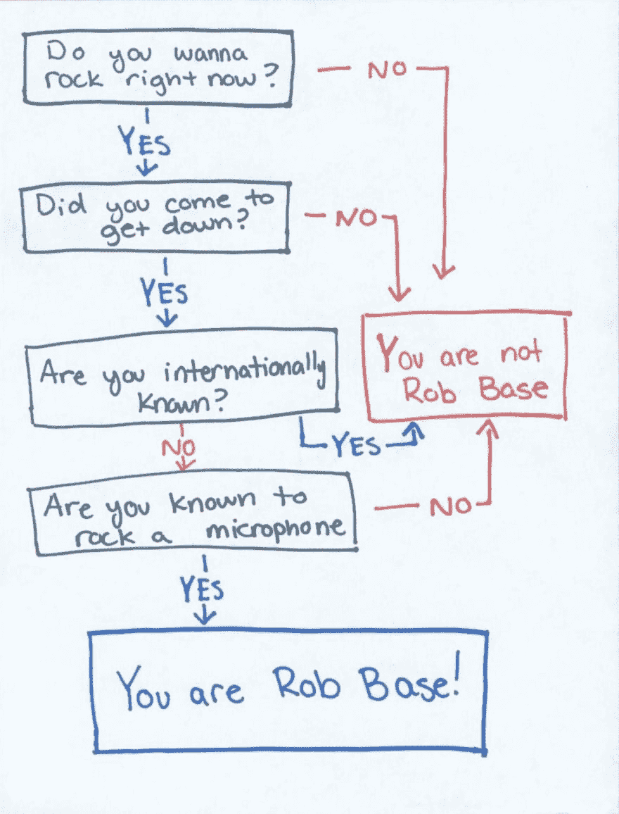
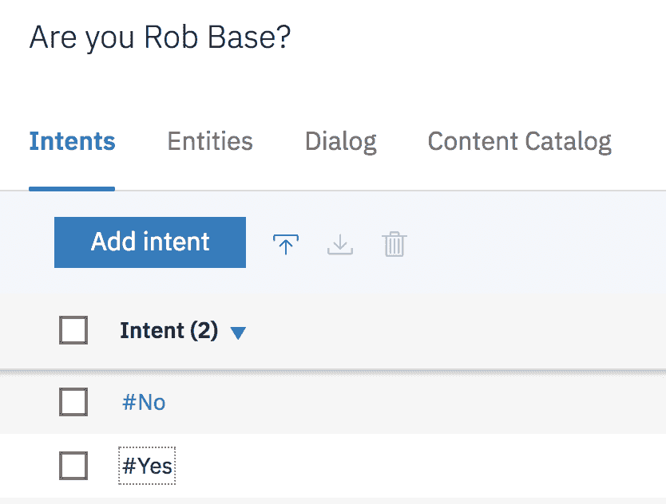
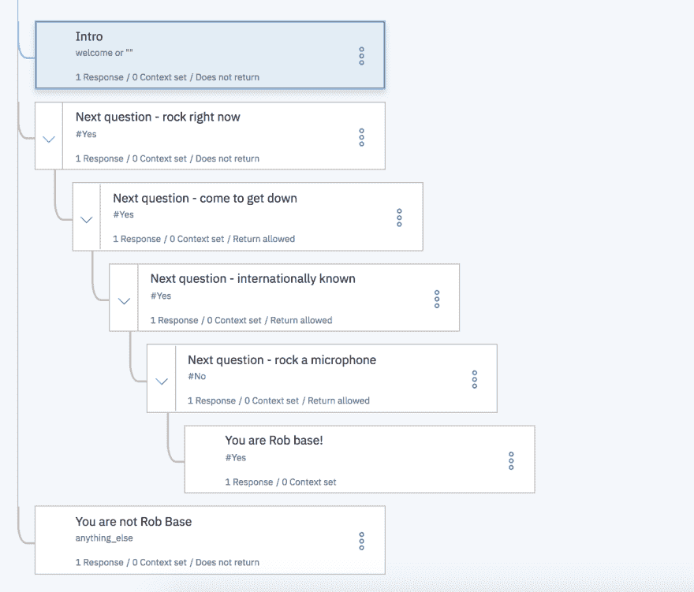

# 使用 React Native 和 Watson Assistant 构建聊天机器人

> 原文：<https://dev.to/tonydiaz/building-a-chatbot-using-react-native-and-watson-assistant-3adj>

最近，我在北卡罗来纳州罗利的“万物开放大会”( allthingsopen.org)上参加了一个关于 React Native 的讲座。我想在一个简单的项目中尝试这个新框架。因为我在做一个提供对话式人工智能助手的项目，所以我决定把它们结合起来。

免责声明:我在 IBM 做沃森助手...

我需要一个简单的会话流程用于这个项目，所以我决定使用“你是罗布基地？”流程图

# 培训助理

我不会深入讨论沃森助手。如果你感兴趣的话，有很多相关的文档。([https://console.bluemix.net/docs/services/conversation/](https://console.bluemix.net/docs/services/conversation/)

**注意:**该技能的所有信息都在源代码中的 JSON 文件中提供，可以在创建对话技能时导入。

## 意图

因为这是一个流程图，我们的机器人只需要理解两个回答“是”和“否”

我在工具中定义了#Yes 和#No 意图。你可以提供更多截图中的例子，这将有助于更好地训练助手识别用户回答问题的其他方式。

## 实体:

在这个用例中不需要它们。

## 对话框:

这里是您构建对话流的地方。因为这是一个流程图，所以如何构建它是相当简单的。我将流嵌套在每个节点中，这样一个响应将导致下一个响应。任何不正确的回答都会给你一个“无所不包”的回答，告诉你你没有被抢劫。
[T3】](https://res.cloudinary.com/practicaldev/image/fetch/s--4J5hKjVD--/c_limit%2Cf_auto%2Cfl_progressive%2Cq_auto%2Cw_880/https://thepracticaldev.s3.amazonaws.com/i/m80q5do4sv6dqofrr5r2.png)

现在我有了一个根据流程图做出响应的机器人。我需要一种用户可以与之交互的方式。这就是 React 本机代码的用武之地。

# 反应原生:

作为一个没有接触过 react native 的人，我注意到[入门文档](https://facebook.github.io/react-native/docs/getting-started)现在指向使用 expo.io。我按照这些说明设置了一个样板应用程序。Expo 提供了一些很好的方法来运行你的应用程序，既可以在本地开发，在 iOS/Andriod 模拟器上运行，也可以通过他们的应用程序在你的手机上查看。

我查看了是否有任何包可以在 React Native 中提供聊天 UI。我惊喜地看到有一个。这是一个巨大的时间节省，不必从头开发一个 UI 聊天面板。这个包叫做`react-native-gifted-chat`。我安装了它以及 Watson `watson-developer-cloud`的包，以便更容易地与 Watson Assistant APIs 交互。在对聊天机器人和 Watson APIs 进行了一些整合之后，我有了一个可以工作的聊天机器人。就是这样！

在很短的时间内，任何人都可以使用 Expo.io 和 Watson Assistant 在 Andriod 和 iOS 上部署强大的机器人。它真的允许很多可能的应用，而不需要了解很多 Objective-C、Java 或 Swift。

## 查看源代码:

[https://github.com/tonydiaz/wa-react-native-minimal](https://github.com/tonydiaz/wa-react-native-minimal)

### 当然，这篇文章如果没有链接听点抢基就不完整了！

