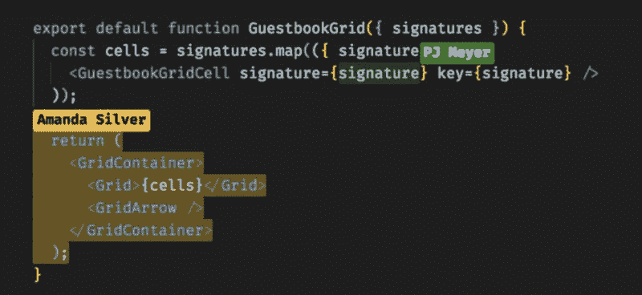
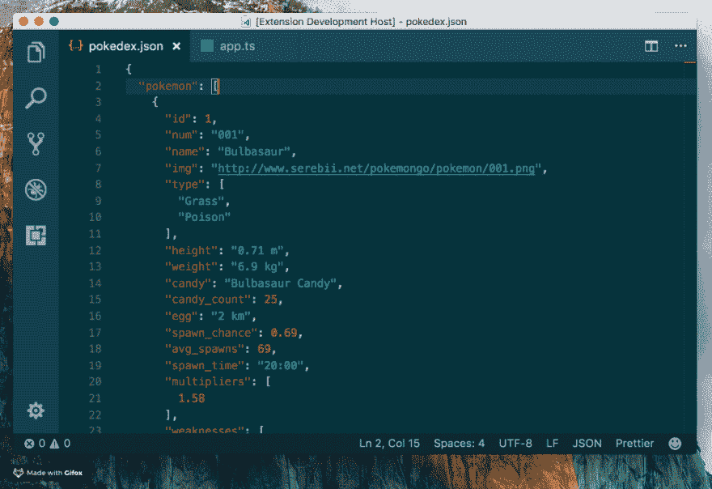
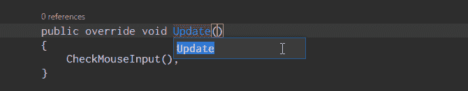
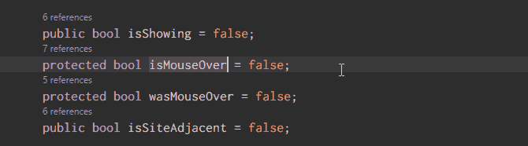
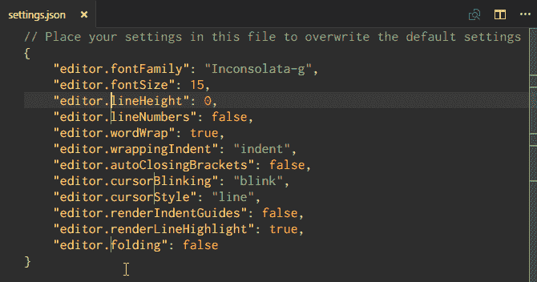
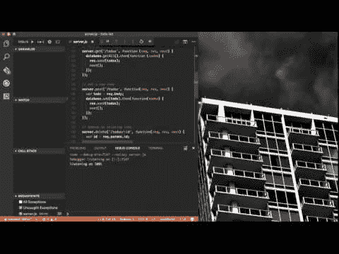
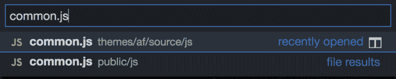

# 让 Visual Studio 代码在 2018 年变得高效的专业技巧👨🏻‍💻

> 原文：<https://dev.to/iankurbiswas/pro-tips-for-visual-studio-code-to-be-productive-in-2018--1jek>

在过去的几年里， [Visual Studio 代码](https://code.visualstudio.com)在开源 IDE 市场上变得非常流行。根据 [2018 年堆栈溢出调查](https://insights.stackoverflow.com/survey/2018/#development-environments-and-tools)，VS 代码于 2015 年公开发布，目前有 35%的开发者在使用。在这篇文章中，我将分享一些 VS 代码的技巧和窍门，帮助你提高工作效率。

### Git 和 Gitlens

Git 是最受开发者欢迎的软件。从 IDE 中管理 Git 比命令行容易得多。Git 面板允许您暂存、提交、存储和撤销更改。[git lens](https://marketplace.visualstudio.com/items?itemName=eamodio.gitlens)VS 代码扩展为你提供了更多。GitLens 最有用的特性是，它向您显示项目中每一行代码的提交者和提交时间。

### 直播分享

[VS Code Live Share](https://visualstudio.microsoft.com/services/live-share/) 是一个全新的功能，仍然只是在开发者预览版。它允许你实时共享你的工作空间，实时编辑，锁定用户跟随他们的光标，组调试等等。如果您远程工作，或者当您需要与不在身边的人协作时，这真的很有帮助。

### JSON 代码

您是否曾经在 TypeScript 中使用过 API，并且希望能够在您的项目中将其响应强类型化？[将 JSON 粘贴为代码](https://marketplace.visualstudio.com/items?itemName=quicktype.quicktype)通过一个命令将 JSON 转换成可用于强类型语言的接口。

### 重命名所有事件

重构是编写和维护干净代码的一个必要方面，但它可能是非常令人头痛的——尤其是当您重构一个大模块或一大块代码时。因此，不要仅仅为了重命名一个变量或方法而在几十个文件中搜寻，让 VS 代码为您做这件事。

如果你选择一个变量/方法并点击 **F2** ，你可以编辑它的名称，它将改变当前整个工作项目中该变量名称的每一个实例。

如果你只想在当前文件中改变，使用**命令+ F2(在 Mac 上)**或 **Ctrl + F2(在 Windows 上)**键盘快捷键，VS 代码将在当前文件的每个实例中产生一个光标。

### 去定义

当你在编程或编写脚本时，经常会遇到你不认识的变量或方法。那你是做什么的？你可以花几分钟来搜索正确的文件，或者你可以按下 **Command(在 Mac 上)**或 **Ctrl(在 Windows 上)**键并用鼠标点击变量/方法。VS 代码会马上带你去看它的定义。

或者你可以将光标悬停在变量/方法上，同时按下**命令(在 Mac 上)**或 **Ctrl(在 Windows 上)**键，它会在光标所在的位置显示定义。

### 一次编辑多行

如果您需要在整个文档中插入或删除多个文本实例，您所要做的就是创建**多个光标**。你可以通过按住**选项(在 Mac 上)**或 **Alt(在 Windows 上)**并点击文本中的任何地方来实现。每次单击都会创建一个新光标。

这对于 HTML 之类的东西特别有用，在这种情况下，您可能想要添加同一个类的许多实例或者改变几个超链接的格式。

### 调试器

调试器值得拥有一个视频——谢天谢地，VS Code 已经制作了一个。

### 按键和命令调色板

如果你想快速完成工作，记住你的热键。您可以查看[备忘单](https://code.visualstudio.com/shortcuts/keyboard-shortcuts-windows.pdf)中的要点，或者打开键盘绑定页面。

指挥官是你最好的朋友。可以用**Command+P(Mac 上)**或者**Ctrl+P(Windows 上)**打开。作为一名开发人员，您可能会同时处理许多文件。开始输入文件名并从工作区获得全文搜索结果，这比在目录树中单击要快得多。

*   您可以开始键入>来获得可用任务的列表。
*   或者以@开头来获取当前文件中的符号列表。

### 自定义按键绑定

VS 代码中缺少的一个有用的 keybinding 是 Save All。让我们用 **Command + Shift + S(在 Mac 上)**或 **Ctrl + Shift + S(在 Windows 上)**创建自己的 keybinding 来保存工作区中所有修改过的文件。

如果你觉得这很有帮助，别忘了留下一些掌声👏🏻别忘了与你的朋友和关注者分享这些！如果你有一些关于 VS 代码的提示，欢迎发表评论

顺便说一句，我也在中号上。点击查看[。](https://medium.com/@i_AnkurBiswas)