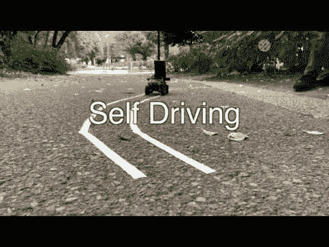
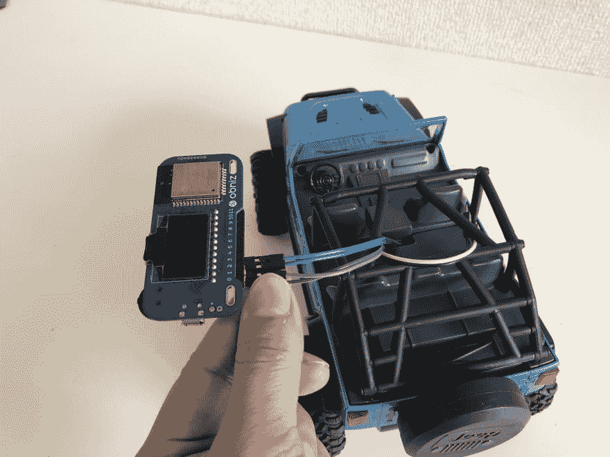

# 自动驾驶机器人

> 原文：<https://dev.to/obniz_io/self-driving-robot-53bp>

# 自动驾驶机器人

## 材料

*   obniz 和电池
*   无线电控制汽车(大约 5v)

## 如何制作

将前后电机连接到 obniz。
然后用电池装在车上。

## 程序

它处理智能手机摄像头拍摄的图像。
该程序正在使用 OpenCV.js

## 程序

[https://obniz.io/explore/43](https://obniz.io/explore/43)