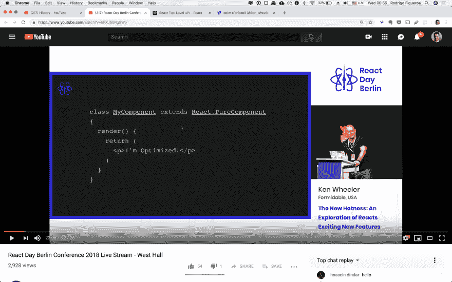
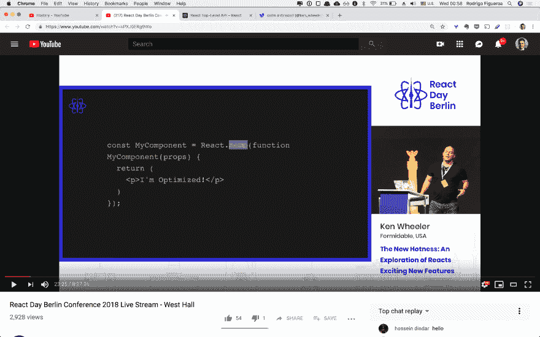
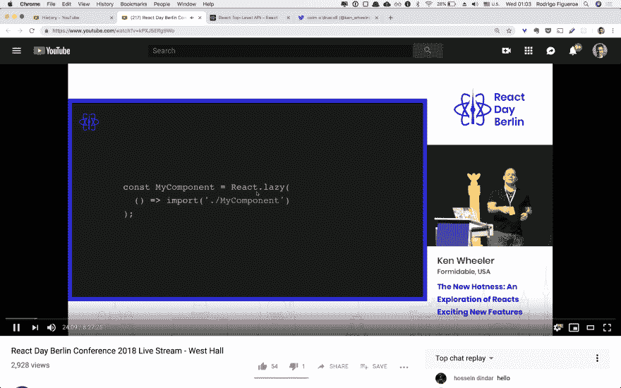
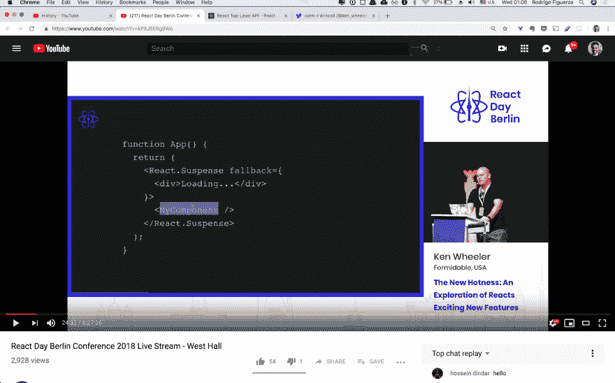
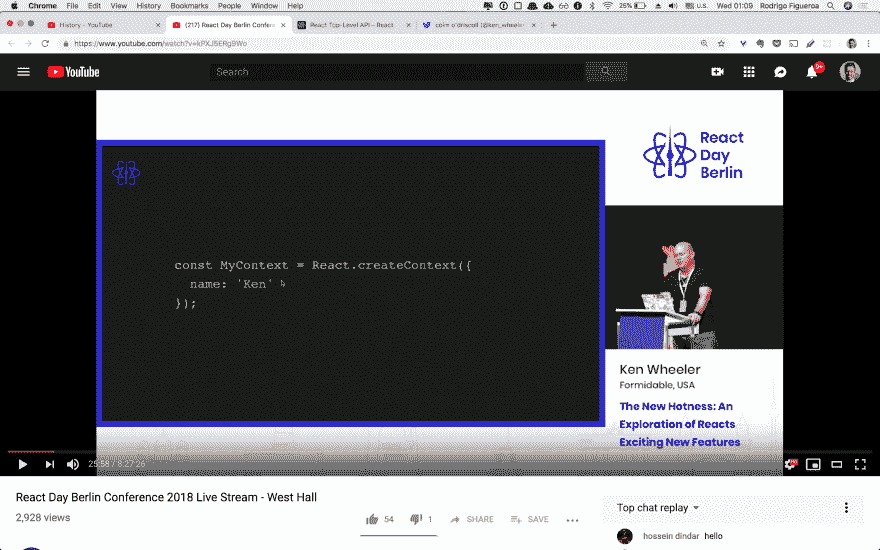
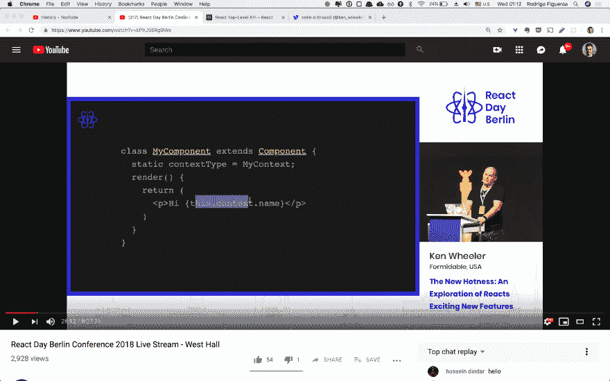
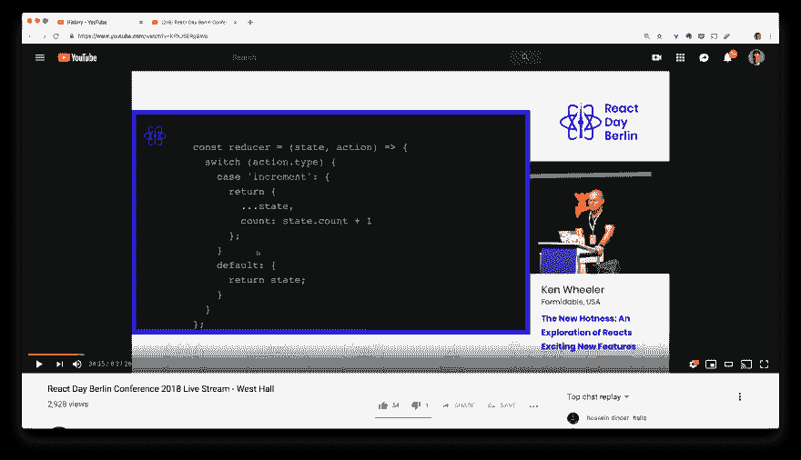
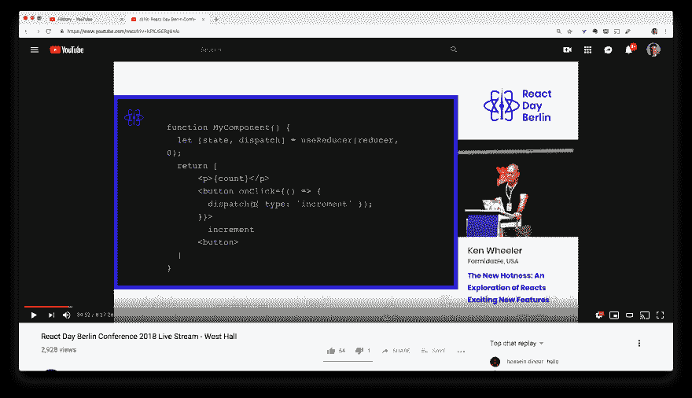

# React Day Berlin 2018 Notes-The New Hotness:探索 React 令人兴奋的新功能- Ken Wheeler

> 原文：<https://dev.to/bidah/react-day-berlin-2018-notes---the-new-hotness-an-exploration-of-react-exciting-new-features----ken-wheeler-4j5m>

[https://youtu.be/kPXJ5ERg9Wo?t=1216](https://youtu.be/kPXJ5ERg9Wo?t=1216)

Ken Wheeler 给了我们一个从 React 16.6 到 16.7-alpha 这段时间里 React 的所有新内容。

* * *

## 反应 16.6

### React.memo

如果你想优化类组件，你可以使用`React.pureComponent`
[](https://res.cloudinary.com/practicaldev/image/fetch/s--8ITk3tUm--/c_limit%2Cf_auto%2Cfl_progressive%2Cq_auto%2Cw_880/https://i.imgur.com/9XVv2Y9.png)

但是对于功能组件，你没有这种优化。
现在，如果你将功能组件包装在`React.memo`中，它就变成了一个纯组件。
T3T5】

### React .懒惰

`React.lazy`的参数是一个函数，它返回一个带有导入的组件。
进口指令告诉您的捆扎机进行代码分割。
T3T5】

用一个膨松剂把这个包起来。现在你的代码分割被中止了。

如果你在这个例子中抛出一个组件，它会先等待加载。
[T3】](https://res.cloudinary.com/practicaldev/image/fetch/s--_D4f8pvS--/c_limit%2Cf_auto%2Cfl_progressive%2Cq_auto%2Cw_880/https://i.imgur.com/oSUpKLx.png)

### 上下文类型

开始获取顶层上下文对象
[](https://res.cloudinary.com/practicaldev/image/fetch/s---Orv755_--/c_limit%2Cf_auto%2Cfl_progressive%2Cq_auto%2Cw_880/https://i.imgur.com/dGptvyv.png)

在一个类组件中，你可以设置`static contextType`属性，并提供给它顶级上下文对象，现在它在`this.context`
[](https://res.cloudinary.com/practicaldev/image/fetch/s--PNF__K1U--/c_limit%2Cf_auto%2Cfl_progressive%2Cq_auto%2Cw_880/https://i.imgur.com/WapR5wA.png) 可用

## 反应 16.7

### 悬念

[https://youtu.be/kPXJ5ERg9Wo?t=1663](https://youtu.be/kPXJ5ERg9Wo?t=1663)

用贾里德·帕尔默的这段话来玩悬念。
[http://github.com/palmerhq/the-platform](http://github.com/palmerhq/the-platform)

### 挂钩

一种用类组件能力编写基于函数的组件的方法。

[16.7.0-alpha](https://www.npmjs.com/package/react/v/16.7.0-alpha.0) 中的新特性

用@next 安装。

要玩它:安装 create react app `create-react-app appName` & `yarn add react@next react-dom@next`，或者打开一个代码沙箱，将这些包更新到最新版本。

有不同的钩子。我们将研究这四种:`useState`、`useEffect`、`useRef`、`useContext`

#### 使用状态

您可以在函数中设置状态:

```
function MyComponent() {
   let [count, setCount] = useState(0);
   return [
    <p>{count}</p>
    <button onClick={() => {
      setCount(count => count + 1)
    }}>
      increment
    </button>
   ]
} 
```

Enter fullscreen mode Exit fullscreen mode

我们有数组析构`let [count, setCount] = useState(0);`
`useState(0)`钩子返回一个对象，用`count`作为你的值，用`setCount`作为值的设置者。在`useState(0)`中的论点是你的初始状态。

`setCount`的工作原理类似于`setState`

好的是我可以不止一次的做。

```
function MyComponent() {
   let [count, setCount] = useState(0);
   let [enabled, setEnabled] = useState(false); // <-
   return [
    <p>{count}</p>
    <button onClick={() => {
      setCount(count => count + 1)
    }}>
      increment
    </button>
   ]
} 
```

Enter fullscreen mode Exit fullscreen mode

### useReducer

也就是状态挂钩方便了另一个叫`useReducer`的挂钩，这是 Redux 的一种内置。

如果你使用 Redux 你可能已经习惯了这种风格的减速器:
[](https://res.cloudinary.com/practicaldev/image/fetch/s--kYnWCuxF--/c_limit%2Cf_auto%2Cfl_progressive%2Cq_auto%2Cw_880/https://i.imgur.com/X9GkK5n.png)

接受你的减速器作为第一个参数，初始状态作为第二个参数。
论析构`dispatch`是你的二传手。
[T6】](https://res.cloudinary.com/practicaldev/image/fetch/s--dxLlH6ai--/c_limit%2Cf_auto%2Cfl_progressive%2Cq_auto%2Cw_880/https://i.imgur.com/yz5dTx6.png)

这就是了。在 Redux 中构建。

> 钩子上有一些陷阱。当你用`useState`调用 set 时，https://youtu.be/kPXJ5ERg9Wo?t=2129 的
> [不会合并](https://youtu.be/kPXJ5ERg9Wo?t=2129)

### 使用效果

这是在功能组件内部产生副作用的一种方式。从技术上来说，它是对`componentDidMount`、`componentDidUpdate`和`componentWillUnmount`、**的替代，但**远不止于此。

在下面的代码`console.log`中，当组件挂载或更新
时，它将被调用

```
function MyComponent() {
  useEffect(() => {
    console.log('mount/update')
  });

  return (
    <p>Hey!</p>
  )
} 
```

Enter fullscreen mode Exit fullscreen mode

在你作为参数传递给`useEffect`的函数中，如果你返回一个函数，那就是你的卸载。
因此，如果您订阅了订阅，这是您取消订阅的地方。

```
function MyComponent() {
  useEffect(() => {
    console.log('mount/update');
    return () => console.log('unmount')
  });

  return (
    <p>Hey!</p>
  )
} 
```

Enter fullscreen mode Exit fullscreen mode

你传递给`useEffect`的第二个参数叫做依赖。如果这些依赖关系中的任何一个发生变化，函数(也就是您的第一个参数)就会运行。不改就跑不了。无论有没有第二个参数，它都将至少运行一个，但是如果您添加了第二个参数，它将作为重新运行它的触发器。

### useRef

可能你会经常用到它。
不仅仅是组件上的 ref。您可以使用`ref`来获取对任何值的引用。

典型的引用用例:定义`useRef`并将其作为引用传递给输入。

```
function MyComponent() {
  const myRef = useRef(null)
  return(
    <input ref={myRef}>
  )
} 
```

Enter fullscreen mode Exit fullscreen mode

然后你可以做你需要的，用它。例如聚焦它。

### 使用上下文

在树的更高层有一个提供者，然后创建一个上下文。之后，您可以输入相同级别的上下文对象，并从中获取最新的值。

```
function MyComponent() {
  const { name } = useContext(MyContext)
  return (
    <p>{name}</p>
  )
} 
```

Enter fullscreen mode Exit fullscreen mode

### 规则的钩子

1.  只调用顶层的钩子。你不想用 if 或任何条件逻辑来包装它们。你在函数的顶层调用它

2.  仅从 React 函数调用挂钩(组件或自定义挂钩)

### 自定义挂钩

自定义钩子只是带有钩子的函数。

这里你可以在同一个函数中使用`useEffect`和`useState`。

```
function useMounted() {
  let [mounted, setMount] = useState(false);
  useEffect(() => {
    setMount(true);
    return () => {
      setMount(false)
    }
  })
  return mounted
} 
```

Enter fullscreen mode Exit fullscreen mode

你可以回也可以不回，想怎么做就怎么做。

要使用它:

```
function App() {
  let mounted = useMounted();
  return mounted ? <p>suh dude</p> : null; } 
```

Enter fullscreen mode Exit fullscreen mode

### 为什么钩子是驼子

1.  Clases 很难优化。这种钩子风格为优化打开了大门。

2.  编写和编译端的代码更少。

3.  可读性更强，组织更好
    你的价值观的组织和更新更好。

### 演示时间

[https://youtu.be/kPXJ5ERg9Wo?t=2544](https://youtu.be/kPXJ5ERg9Wo?t=2544)
真正酷的鼓机演示与完整的代码库之旅。你会发现钩子模式从钩子**和更多**返回组件本身。

### 资源

查看更多挂钩结账的例子[http://github.com/rehooks](http://github.com/rehooks)