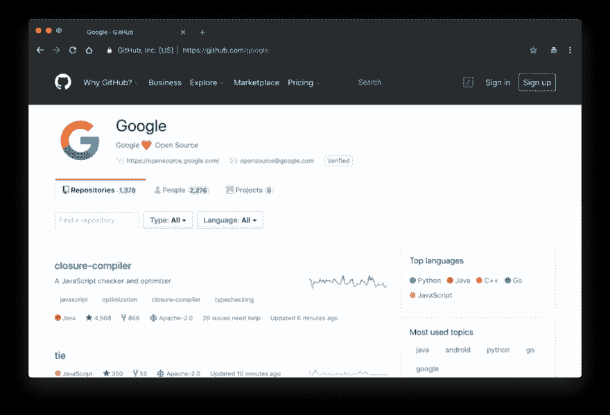

# 如何使用开源软件找到工作

> 原文：<https://dev.to/vnbrs/how-to-land-a-job-using-open-source-1kgg>

招聘工作的方式已经改变了。你的技能远比你的学位更有价值。在接受《纽约时报》采访时，前谷歌人力运营副总裁拉兹洛·布洛克表示，谷歌员工中没有受过大学教育的比例这些年来一直在稳步上升。

雇主现在关注的是候选人能够做什么，而不是他毕业于哪所大学。为了衡量申请人的适合程度，招聘人员主要着眼于:

1.  解决问题的技巧
2.  各种背景和行业
3.  经验

 

<figcaption>照片由[格伦·卡斯滕斯-彼得斯](https://unsplash.com/@glenncarstenspeters?utm_source=medium&utm_medium=referral)于 [Unsplash](https://unsplash.com?utm_source=medium&utm_medium=referral)</figcaption>

招聘人员需要知道你是否具备职位描述中所描述的相关专业技能。让我们假设你现在是一名 Java 开发人员，想要使用微软的堆栈。你已经学了一些课程，也许还获得了 C#语言的证书。但是现在你要证明经验，**只有课程和认证做不到**。

幸运的是，有一些方法可以让你在没有具体技术工作经验的情况下获得一份突出的简历。根据 GitLab 的说法，为 T2 开源做贡献是你现在可以利用的最有效的求职技巧。这里有一些关于如何使用开源作为一个强大的求职工具的提示:

### 为开源项目做贡献

通过对开源做出贡献，你将有机会使用**产品代码**，参与稳定的项目。开源贡献环境是多样化的，你将向招聘人员展示你可以在**多元文化团队**中工作。此外，通过贡献，你将有助于**项目和人员管理**，通过解决冲突，优先化工作，组织团队，等等。这对雇主来说是有价值的。

领先的开源贡献网站是 [GitHub](https://github.com/) 。如果你还没有账户，那你就错过了很多。找一个你感兴趣的项目，开始做贡献。有很多仓库在寻找维护者:

*   火狐浏览器背后的非营利组织 Mozilla
*   跨平台桌面应用框架(C++)
*   Sinatra ，一个 Ruby 的 web 微框架(Ruby)
*   phpMyAdmin ，MySQL 和 MariaDB (Java)的 web 接口
*   最强大的搜索引擎之一(PHP)
*   Vim 的未来

### 公司定向贡献

例如，如果你的目标是在谷歌找到一份工作，你可以在 GitHub 上参与[谷歌项目。当你开始贡献时，你将**掌握产品**的知识，它们的工作方式和背后的故事。这真的会让你从其他候选人中脱颖而出，因为它**缩短了你的入职时间**，为面试官赢得了很多加分。](https://github.com/google)

### 大型项目贡献

如果你想在一家大公司获得面试机会，他们可能需要你有大规模高可用性项目的经验。如果你实际上没有这方面的经验，你可以**挑选一个你可以从中受益的大型开源项目**。有许多大型项目需要帮助，例如:

*   [火箭。聊天](https://github.com/RocketChat/Rocket.Chat)，一个开源的 Slack
*   Django ，一个 Python 网络框架
*   Ruby on Rails ，Ruby 的网络应用框架

### 建立旁站工程

 

<figcaption>照片由[里克·梅森](https://unsplash.com/@egnaro?utm_source=medium&utm_medium=referral)于 [Unsplash](https://unsplash.com?utm_source=medium&utm_medium=referral)</figcaption>

从本质上来说，我们，软件开发人员，是好奇的人。无论你是想建立一个新的 JavaScript 框架，一个带 Arduino 的咖啡机，还是一个新的创业公司:[建立它](https://github.com/danistefanovic/build-your-own-x)！但是别忘了让它开源。技术招聘人员将能够**检查你的项目、你的编码风格以及你在兼职中做出的决定**。

在一次采访中，*“用 Python 和 sklearn，我建立了一个机器学习模型，预测了我家附近的出租房价格”*和*“我已经学习机器学习 X 个月了”*之间的区别很明显。这将有助于你展示你可以**从头做起**，并且你知道你正在使用的工具。

### 打造个人品牌

当你开始为开源做贡献时，你将会建立一个在线声誉。当雇主看到你是社区的积极成员时，就会增加信任。这就是为什么员工推荐仍然是一件事。

此外，在 stack overflow 上拥有在线形象也能帮你获得那份工作。这表明你关心社区，并且**愿意帮助**其他开发者。

### 面试时提及开源

当你改变你的技术组合时，招聘人员通常会问你为什么。这并不是说你使用的技术有多重要，而是要了解如果你以前从未使用过这种语言，你是如何学会这种语言的。

这就是开源贡献介入的地方。你不需要实际的工作经验来证明你知道 C#或者你想使用的语言，如果你以前使用过的话。LinkedIn 的首席执行官杰夫·韦纳说，如果人们愿意在不同的地方发现这种人才，那么就会有如此多的人才。这意味着无论你是通过大学、网络课程还是开源软件学习都没关系。**重要的是你是否有这个技能。**

### 下一步

从学徒到绝地，每个人都越来越容易获得开源贡献。是时候用你的技能回馈社区了。

1.  [创建一个 GitHub 账户](https://github.com/join)，如果你还没有
2.  [选择一个项目](https://github.com/MunGell/awesome-for-beginners)这样你就可以帮助或者[创建你自己的](https://help.github.com/articles/create-a-repo/)
3.  合并您的第一个拉取请求，万岁！

* * *

### 在[推特](http://twitter.com/vnbrs_)上关注我，并查看[我的一些其他帖子](https://medium.com/@vnbrs):

*   [我的推特(@vnbrs_)](https://twitter.com/vnbrs_)
*   [每个程序员都应该读的书](https://hackernoon.com/the-book-every-programmer-should-read-33b5ef2e532a)
*   [如何利用开源软件找到工作](https://hackernoon.com/how-to-land-a-job-using-open-source-3f5b2744a3d4)
*   [不要做这种开发者](https://hackernoon.com/do-not-be-this-kind-of-developer-480072581f1b)