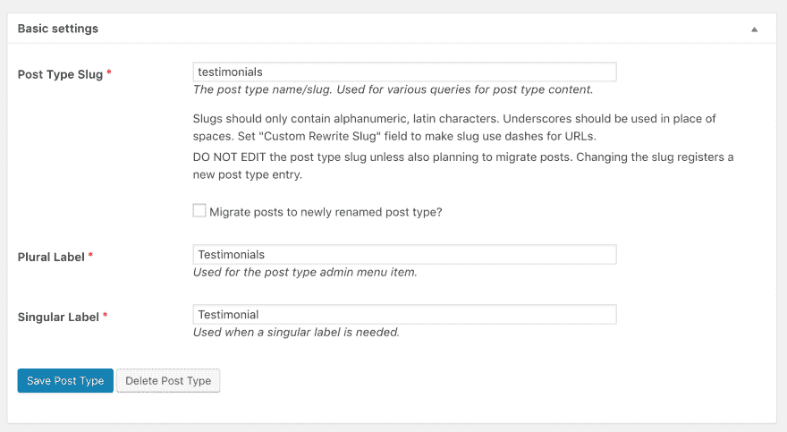
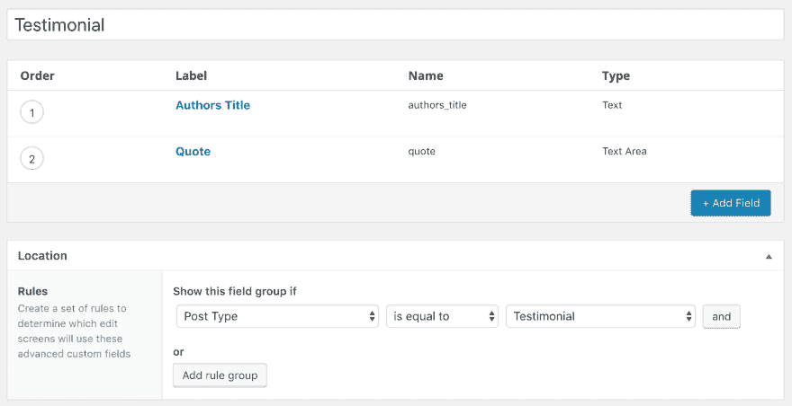
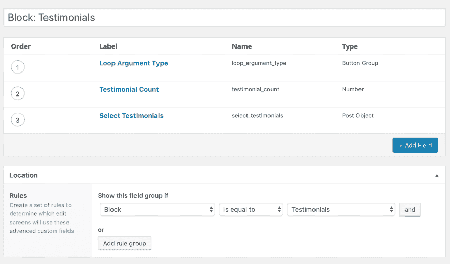
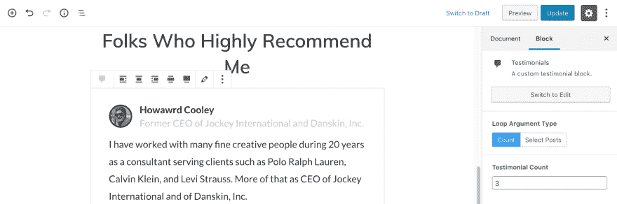
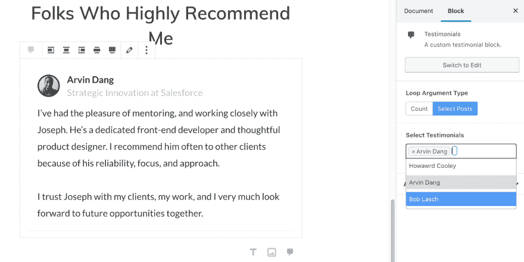

# 自定义 Post 循环作为古腾堡块

> 原文：<https://dev.to/joey_farruggio/custom-post-loop-as-a-gutenberg-block-45k3>

这篇文章出现在马特·莫楞威格在 WCUS 2018 上的 SOTW 演讲中。多酷啊。

这篇文章最初发表在我的博客上。

首先，让我们快速看一下我们将一起构建什么。下图显示了我的可定制 CPT 模块前端的输出。在本教程中，我使用基本的标记来输出一个简单而巧妙的推荐列表，但是您可以随意地按照自己喜欢的方式来设计它。

[](https://res.cloudinary.com/practicaldev/image/fetch/s--dpeUwQxi--/c_limit%2Cf_auto%2Cfl_progressive%2Cq_auto%2Cw_880/https://joeyfarruggio.com/wp-content/uploads/2018/12/image-1024x747.png)

因此，为了花更多时间熟悉古腾堡，我想把我的静态首页转换成古腾堡页面。作为一个块，其中一个方便的元素是我的推荐自定义 post 类型循环。

事实证明这很容易做到。我还在块编辑器中添加了一些控件，用于少量的配置。

在我之前的文章中，我介绍了如何使用高级定制字段的 **acf_register_block()创建一个定制的[古腾堡块](https://joeyfarruggio.com/wordpress/custom-gutenberg-block-advanced-custom-fields/)。**

在本教程中，Gutenberg 还没有被添加到核心中，所以我们需要 Gutenberg 插件。我们还需要 ACF Pro 的测试版，目前是 5.8.0 测试版。为了快速原型化我的推荐模板，我使用了 Tailwind.css。

*   [高级定制字段](https://advancedcustomfields.com/)–5 . 8 . 0 测试版
*   [古腾堡插件](https://wordpress.org/plugins/gutenberg/)或更新至 WordPress 5.0+
*   [Tailwind.css](https://tailwindcss.com)

## 设置 CPT

我使用免费的 [CPT UI](https://wordpress.org/plugins/custom-post-type-ui/) 插件来快速设置自定义文章类型。

[](https://res.cloudinary.com/practicaldev/image/fetch/s--PtaxXoRI--/c_limit%2Cf_auto%2Cfl_progressive%2Cq_auto%2Cw_880/https://joeyfarruggio.com/wp-content/uploads/2018/11/image-10.png)

对于这个 CPT，我想主要使用自定义字段。所以这意味着没有经典编辑或古腾堡。为了在 CPT 上禁用 Gutenberg，您需要将“在 REST API 中显示”设置为 false。如果您想使用古腾堡编辑器，请将其设置为 true。

[](https://res.cloudinary.com/practicaldev/image/fetch/s--SfPgpGUa--/c_limit%2Cf_auto%2Cfl_progressive%2Cq_auto%2Cw_880/https://joeyfarruggio.com/wp-content/uploads/2018/11/image-11.png)

## 创建自定义字段

在高级定制字段中，我只为证明创建了两个字段；作者的名字和引文。我将使用文章标题作为作者的名字，使用特写图片作为作者的个人资料图片。

[](https://res.cloudinary.com/practicaldev/image/fetch/s--XTV9barF--/c_limit%2Cf_auto%2Cfl_progressive%2Cq_auto%2Cw_880/https://joeyfarruggio.com/wp-content/uploads/2018/11/image-12.png)

## 登记证明块

在我们的 functions.php 文件中，我们将注册我们的推荐块。

**functions.php**

```
// Register Custom Blocks
add_action('acf/init', 'my_acf_init');
function my_acf_init() {

    // check function exists
    if( function_exists('acf_register_block') ) {

        // register a testimonials block
        acf_register_block(array(
            'name'              => 'testimonials',
            'title'             => __( 'Testimonials', 'wprig' ),
            'description'       => __( 'A custom testimonial block.', 'wprig' ),
            'render_callback'   => 'my_acf_block_render_callback',
            'category'          => 'formatting',
            'icon'              => 'admin-comments',
            'keywords'          => array( 'testimonial' ),
        ));

        // register other blocks
        acf_register_block(array(
            ...
        ));
    }
} 
```

## 创建证明块字段

我希望在我的推荐模块上有一些配置。根据我使用它的地方，我想要么用‘posts _ per _ page’循环推荐来设置限制，要么我想手动选择显示哪些推荐。

回到高级自定义字段，我们将创建三个字段来创建此功能。

[](https://res.cloudinary.com/practicaldev/image/fetch/s--5qsgU9mg--/c_limit%2Cf_auto%2Cfl_progressive%2Cq_auto%2Cw_880/https://joeyfarruggio.com/wp-content/uploads/2018/11/image-13.png)

在这个字段组中，我创建了一个按钮组，允许用户在用一个数字限制 post 循环或从已发布的推荐列表中选择之间进行选择。

“客户评价计数”和“选择客户评价”字段都有一个条件参数，只根据“循环参数类型”的选择显示。

选择证明文章对象字段应该设置为只返回文章 ID。

## 构建推荐模板

在 template-parts/blocks/content-references . php 中，我将创建我的模板并添加一些 Php 来动态设置循环中的参数类型。

**模板-零件/区块/内容-证明书. php**

```
<?php
/**
 * Block Name: Testimonials
 *
 * This is the template that displays the testimonials loop block.
 */

$argType = get_field( 'loop_argument_type' );
if( $argType == "count" ) :
  $args = array( 
    'orderby' => 'title',
    'post_type' => 'testimonials',
    'posts_per_page' => get_field( 'testimonial_count' )
  );
else:
  $testimonials = get_field( 'select_testimonials' );
  $args = array( 
    'orderby' => 'title',
    'post_type' => 'testimonials',
    'post__in' => $testimonials
  );
endif;

$the_query = new WP_Query( $args ); 
```

接下来，我将开始循环，并在模板中填充我们的证明字段。

**模板-零件/区块/内容-证明书. php**

```
<?php
// Continued code

if ( $the_query->have_posts() ) : while ( $the_query->have_posts() ) : $the_query->the_post(); ?>

  <div class="rounded border-b border-solid border-grey-lighter px-6 py-4 mb-2 max-w-md">
    <div class="flex items-center">
        " class="h-12 w-12 rounded-full" />
        <div class="flex flex-col ml-4">
            <b class="font-bold text-black"><?php the_title(); ?></b>
            <span class="text-grey"><?php echo get_field( 'authors_title', get_the_ID() ); ?></span>
        </div>
    </div>
    <p class=" mt-3 mb-1 leading-normal text-base">
      <?php echo get_field( 'quote', get_the_ID() ); ?>
    </p>
  </div>

<?php endwhile; ?>
<?php else: __( 'Sorry, there are no testimonials to display', 'wprig' );  endif; ?> 
```

有一件事我需要在这里指出来，让你免于一些挫折。当在 Gutenberg 块中遍历文章时，在使用“get_field()”时，必须添加文章 ID 作为第二个参数。

**将帖子 ID 设置为第二参数**

```
<?php echo get_field( 'quote', get_the_ID() ); ?> 
```

## 使用奖状块

我想在我的主页上添加推荐，所以我在编辑器中添加了一个推荐块。我将循环参数类型设置为 Count，然后将证明计数设置为 3。

[](https://res.cloudinary.com/practicaldev/image/fetch/s--EZE9yq1d--/c_limit%2Cf_auto%2Cfl_progressive%2Cq_auto%2Cw_880/https://joeyfarruggio.com/wp-content/uploads/2018/11/image-14.png)

如果我想手动选择要显示的推荐，我可以将循环参数类型设置为选择帖子:

[](https://res.cloudinary.com/practicaldev/image/fetch/s--Vx4XPgXr--/c_limit%2Cf_auto%2Cfl_progressive%2Cq_auto%2Cw_880/https://joeyfarruggio.com/wp-content/uploads/2018/11/image-15.png)

这是一个多选字段，所以我可以随意添加。

[](https://res.cloudinary.com/practicaldev/image/fetch/s--YHDMVlyA--/c_limit%2Cf_auto%2Cfl_progressive%2Cq_auto%2Cw_880/http://joeyfarruggio.com/wp-content/uploads/2018/11/image-16.png)

我们做到了！我们的自定义帖子类型是循环的，并应用于自定义模板，该模板可作为块在任何帖子或页面中进行配置和重用。

-

## 自私销售塞预警

想雇我为你的古腾堡启用主题建立一个自定义古腾堡块？

有兴趣了解你的 WordPress 主题是否已经准备好并与 Gutenberg 兼容吗？

在[joey@joeyfarruggio.com](mailto:joey@joeyfarruggio.com)向我问好