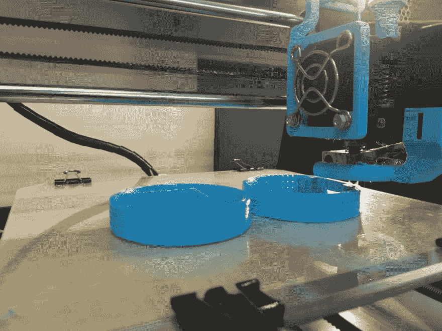
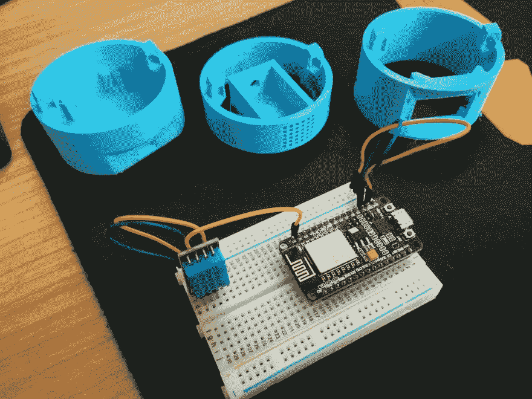
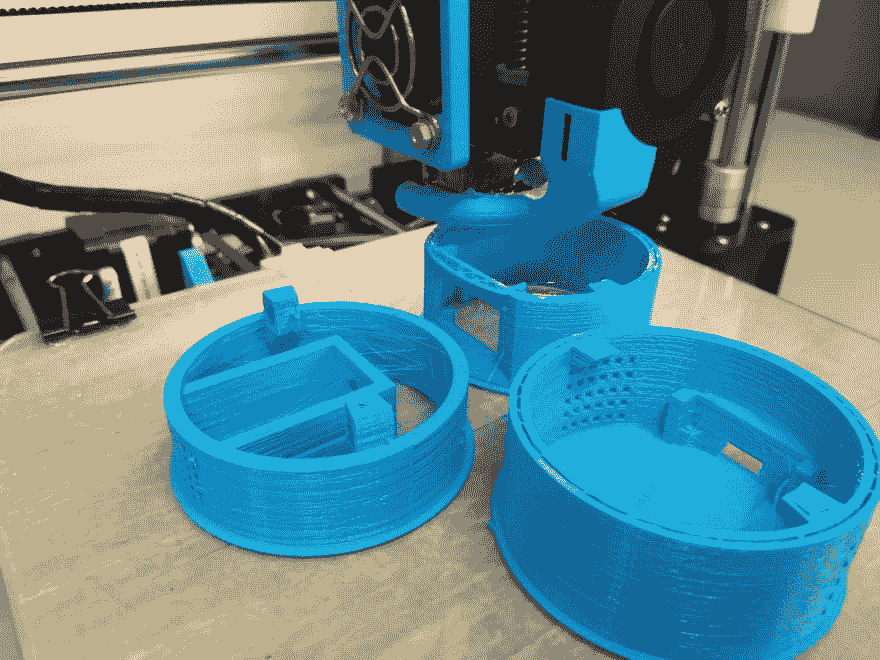
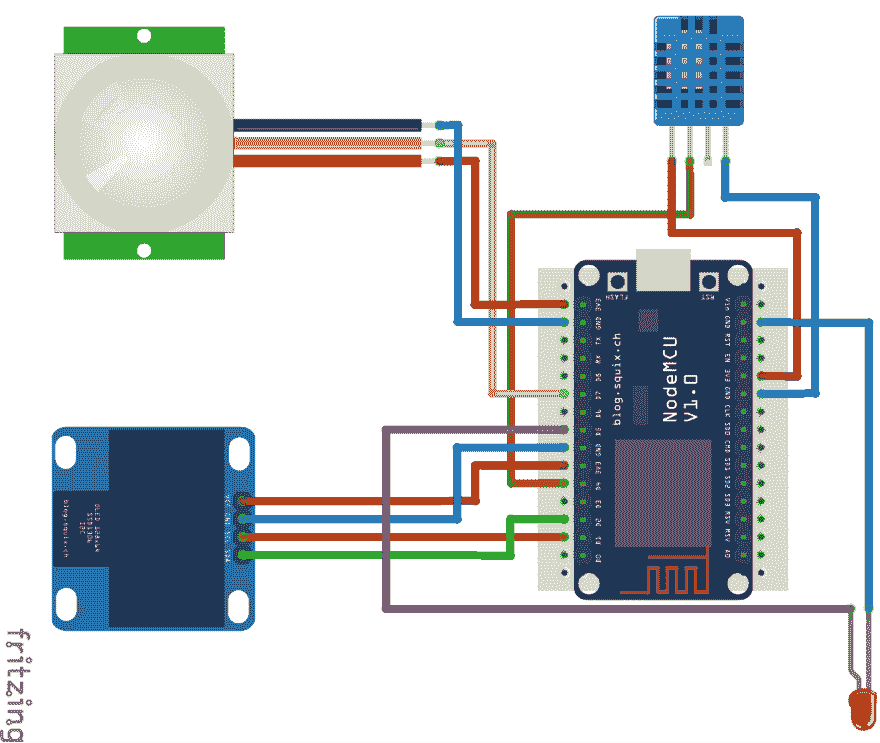
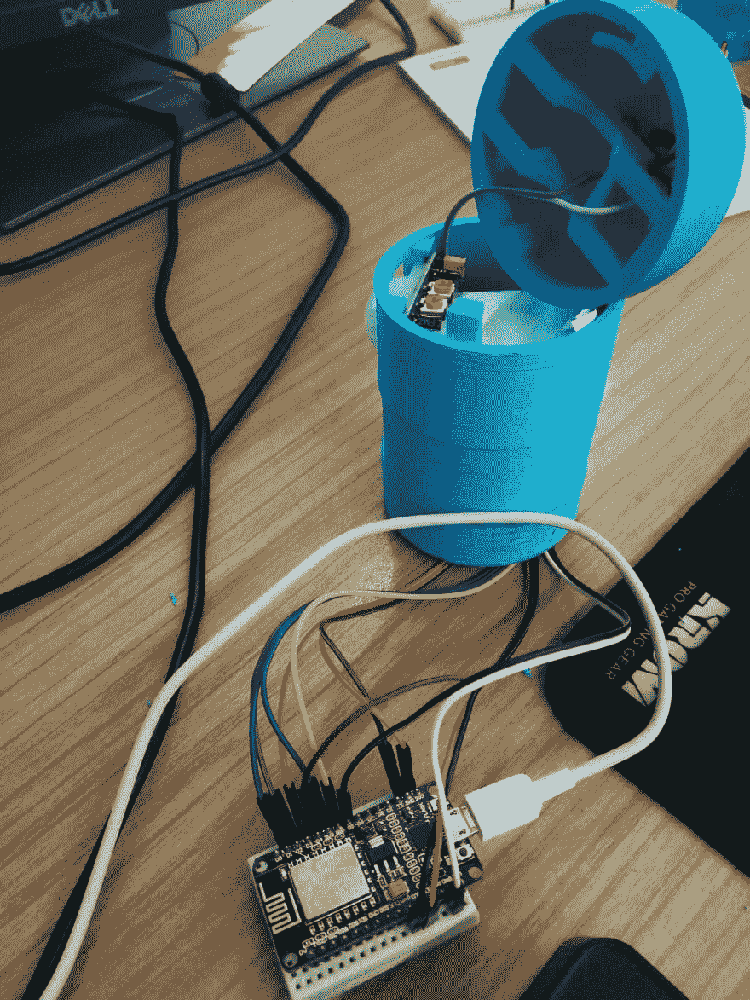
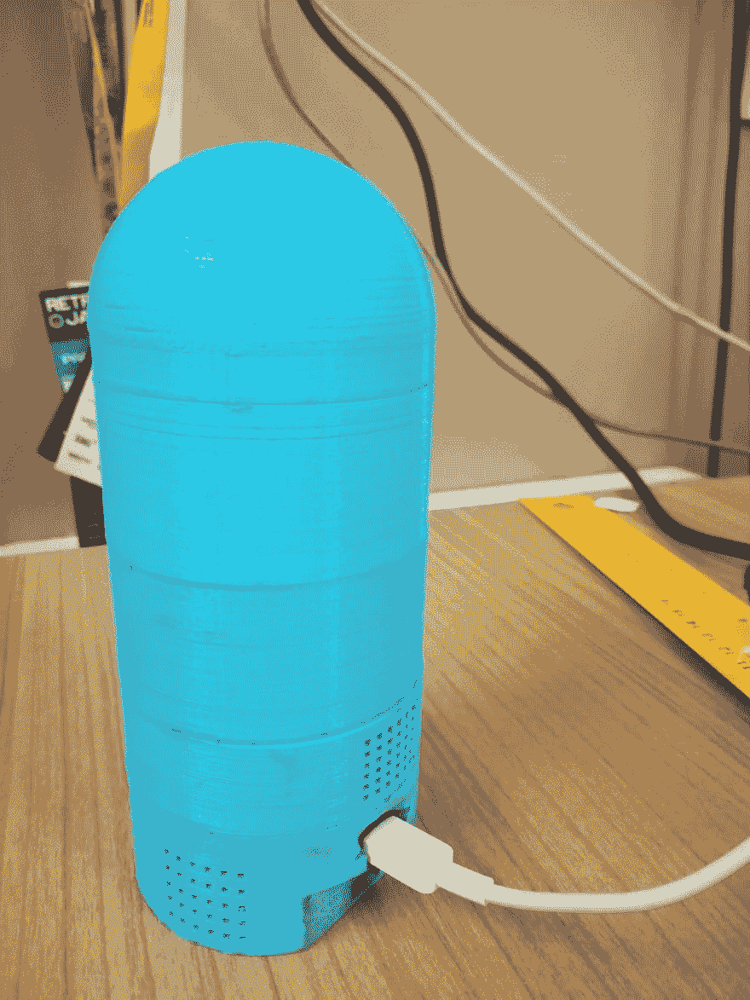
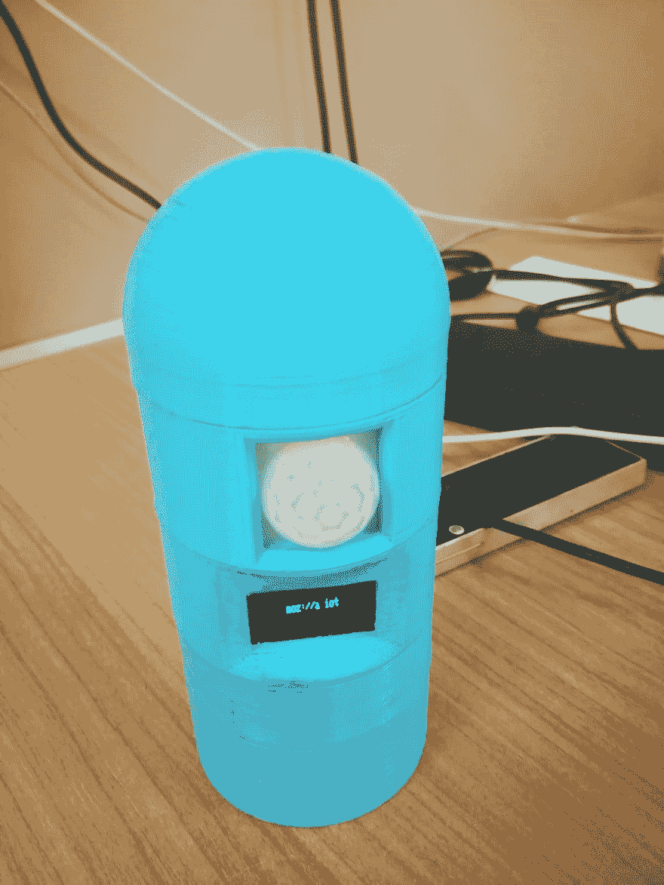

# 由 Mozilla Things Framework 支持的室内传感中枢

> 原文：<https://dev.to/jpdias/indoor-sensing-hub-powered-by-mozilla-things-framework-5e4m>

*物联网*旨在以一种真正开放、灵活、可扩展的方式构建物联网，使用 Web 作为其应用层。为了实现这一想法，Mozilla 一直在为物联网标准而努力，为最常见的语言提供了网关实现和库。在这篇博文中，我们将经历*将*变成物联网设备的过程。

[](https://res.cloudinary.com/practicaldev/image/fetch/s--HjWnK0zU--/c_limit%2Cf_auto%2Cfl_progressive%2Cq_auto%2Cw_880/https://jpdias.img/indoorsensing/mozilla_iot_wordmark.png)

在进入物联网 <sup id="fnref:7">[1](#fn:7)</sup> 的细节之前，必须先提出它的起源，物联网。物联网可以被视为嵌入日常物品中的计算设备通过互联网互联的结果，使它们能够发送和接收数据。这种范式转变引发了连锁反应，将日常物品转变为*智能*物品，从而在应用领域得到广泛传播。

这种模式的转变为新的市场机会打开了一扇窗户，导致一些公司为这些新的市场创造新产品，如智能家居。然而，尽管有无缝家庭自动化的乌托邦式愿景，智能家庭技术市场像其他市场一样，是支离破碎的。几家公司、机构和其他实体(包括政府实体)一直在致力于制定标准，以确保物联网的互操作性并减少物联网的技术碎片。

作为物联网倡议的一部分，物联网(Web of Things)提出通过在网络上给事物提供 URL 以使它们可链接和可发现，并定义标准数据模型和 API 以使它们可互操作 <sup id="fnref:4">[4](#fn:4)</sup> ，来创建分散的物联网。

Mozilla 作为*“保持互联网对所有人开放和可访问”*使命的捍卫者，致力于建设一个更好的互联网 <sup id="fnref:1:1">[2](#fn:1)</sup> 已经接受了物联网倡议，并创建了**项目物联网** <sup id="fnref:4:1">[4](#fn:4)</sup> 。这个项目不同于其他标准化项目，因为它建立在现有的 web 标准之上，如 HTTP、REST、JSON、WebSockets 和 TLS。

**Project Things**<sup id="fnref:4:2">[4](#fn:4)</sup>是 Mozilla 的一个实验性软件和服务框架，用于将“东西”连接到网络，将由三个主要组件组成:

*   物联网 API:物联网的通用数据模型和 API。
*   物联网网关:物联网网关的一个实现，利用了 Web 物联网 API。
*   物云:物联网云服务集合。
*   事物框架(Things Framework):用于构建 Web 事物的可重用软件组件的集合，直接公开 Web 事物 API。

> 这个项目的目标是构建一个物联网设备，能够通过测量温度、湿度和感知运动来感知周围环境。*加上*能够在有机发光二极管屏幕上显示任何信息，在 LED 上显示运行状态。

## 硬件

### 3D 打印传感集线器盒

在搜索了 [Thingiverse](https://www.thingiverse.com/) 之后，我们发现了这个很酷的 [3D 打印模块化外壳，用于 NodeMCU ESP8266](https://www.thingiverse.com/thing:2627220) 微控制器。因为它符合我拥有多个组件的目标，甚至，如果需要的话，用更多的组件升级它，这是一个好主意。

| 数数 | 3D 零件 |
| --- | --- |
| 1x | Base_NodeMCU |
| 1x | 圆屋顶 |
| 1x | 温度传感器模块 |
| 1x | 小 _ 有机发光二极管 _ 屏幕 _ 模块 |
| 1x | PIR _ 模块 |

[](https://res.cloudinary.com/practicaldev/image/fetch/s--GL7ddXLR--/c_limit%2Cf_auto%2Cfl_progressive%2Cq_auto%2Cw_880/https://jpdias.img/indoorsensing/3d1-min.jpg)

[](https://res.cloudinary.com/practicaldev/image/fetch/s--6sZQjhnT--/c_limit%2Cf_auto%2Cfl_progressive%2Cq_auto%2Cw_880/https://jpdias.img/indoorsensing/3d2-min.jpg)

[](https://res.cloudinary.com/practicaldev/image/fetch/s--gq4dt4Bx--/c_limit%2Cf_auto%2Cfl_progressive%2Cq_auto%2Cw_880/https://jpdias.img/indoorsensing/3d3-min.jpg)

打印后对该模型进行了一些修改，以便将试验板安装到 *Base_NodeMCU* 中。所有的打印都是用 Anet A8 打印机完成的。

### 零件和电路

| 数数 | 部分 |
| --- | --- |
| 1x | NodeMCU ESP8266 |
| 1x | 发光二极管(红色) |
| 1x | PIR 运动传感器 |
| 1x | DHT11 温度/湿度传感器 |
| 1x | 0.96 英寸 I2C 有机发光二极管 128x64 屏幕 |
| *x | 跳线(公母) |
| 1x | 迷你试验板 |

NodeMCU 板之所以被选中，是因为它便宜，有内置的无线屏蔽，并且与几乎所有 Arduino 库和脚本兼容。

所有的零件都装在易贝号上。你可以在*速卖通*、*亚马逊*或任何其他硬件配件卖家上轻松找到类似的。

[](https://res.cloudinary.com/practicaldev/image/fetch/s--RmfACOJU--/c_limit%2Cf_auto%2Cfl_progressive%2Cq_auto%2Cw_880/https://jpdias.img/indoorsensing/indoorsensing_circuit.png)

[烧结原理图下载](img/indoorsensing/indoorsensing_circuit.fzz)

## 软件

使用 Mozilla Things 框架就像在 PlatformIO 项目中添加`webthing-arduino`和`ArduinoJson`库一样简单。此外，为了启动 NodeMCU 中的 web 服务器，使用了`ESP Async WebServer`。

为了简化从不同部分读取数据和向不同部分写入数据，使用了几个库，即:

*   `DHT sensor library`:从 DHT 传感器读取数据。
*   `Adafruit GFX Library`、`Adafruit_SSD1306`、`OneWire`:使用 I2C 连接<sup id="fnref:5">、 [5](#fn:5) 、</sup>在有机发光二极管屏幕上写数据。
*   `TaskScheduler`:用于调度周期性任务(由于 DHT 传感器的限制，我们无法一直读取数据，所以需要在 Arduino *循环*中调度)。

设置完依赖项后，让我们关注一下`main.cpp`。

### 设置互联网连接

使用 lib `ESP8266WiFi`我们可以设置无线。

**定义连接设置** :

```
char *ssid = WLAN_SSID;
char *password = WLAN_PASS; 
```

Enter fullscreen mode Exit fullscreen mode

**建立连接** :

```
void setup()
{
    ...
    WiFi.begin(ssid, password);
    ...
    while (WiFi.status() != WL_CONNECTED)
    {
        delay(500);
        digitalWrite(STATUSLED, PIN_STATE_HIGH);
        delay(500);
        digitalWrite(STATUSLED, PIN_STATE_LOW);
        delay(500);
    }

    Serial.print("Connected to ");
    Serial.println(ssid);
    Serial.print("IP address: ");
    Serial.println(WiFi.localIP());

    digitalWrite(STATUSLED, PIN_STATE_HIGH);
    ...
} 
```

Enter fullscreen mode Exit fullscreen mode

我们现在连上了本地网络。

### 创建一个新的 WebThingAdapter(我们的 *web thing*

```
WebThingAdapter *adapter;

void setup()
{
    adapter = new WebThingAdapter("indoorsensor", WiFi.localIP());
    adapter->begin();
} 
```

Enter fullscreen mode Exit fullscreen mode

从这一点开始，我们已经使用 mDNS <sup id="fnref:6">[6](#fn:6)</sup> 向本地网络宣布了我们的事情，并且我们可以使用地址:`http://indoorsensor.local`在我们的浏览器上访问该设备。结果页面显示了一个 JSON(由 Web Thing API 定义),其中包含与我们的东西连接的所有设备(组件)的信息。

### 向我们的适配器添加组件

这是一个如何将 DHT 传感器添加到*网络事物*的例子。所有其他部分都需要类似的过程。

```
const char *dht11Types[] = {nullptr};
ThingDevice indoor("dht11", "Temperature & Humidity Sensor", dht11Types);
ThingProperty indoorTempC("temperatureC", "", NUMBER, nullptr);
ThingProperty indoorHum("humidity", "", NUMBER, nullptr);

void readDHT11data()
{
  Serial.println("Updating DHT data.");
  /*Serial.println("f-readDHT11data");*/

  float h = dht.readHumidity();
  /*Read temperature as Celsius (the default)*/
  float t = dht.readTemperature();
  /*Read temperature as Fahrenheit (isFahrenheit = true)*/

  if (isnan(h) || isnan(t) || isnan(f))
  {
    Serial.println("Failed to read from DHT sensor!");
    return;
  }

  ThingPropertyValue value;

  value.number = t;
  indoorTempC.setValue(value);
  value.number = h;
  indoorHum.setValue(value);
}

void setup(){

  indoor.addProperty(&indoorTempC);
  indoor.addProperty(&indoorHum);
  adapter->addDevice(&indoor);

}

void loop(){
  readDHT11data();
  adapter->update();
} 
```

Enter fullscreen mode Exit fullscreen mode

**通过代码**:

*   首先我们用`ThingDevice`创建一个*事物*的组件
*   然后，我们通过几次`ThingProperty`调用来添加特定部分的属性。
*   我们定义一个函数来检索传感器数据`void readDHT11data()`:
    *   在这个函数中，我们创建了一个新的`ThingPropertyValue value;`
    *   对于我们想要更新或设置的每个值，我们用值`value.number = t;`创建一个临时变量，然后将这个值设置为各自的`ThingProperty`、`indoorTempC.setValue(value);`。
*   在每个循环中，我们检索调用相应函数的值，在本例中，是调用`readDHT11data()`函数。
*   最后，我们用来自传感器的新数据更新我们的适配器。

### 零件明细

由于组件的特殊性，连接所有不同的组件需要额外的工作。这些特性将在以下段落中描述。

#### 从 DHT 中读取数据

所有 DHT 传感器都需要设置读取之间的延迟。文件提到的时间大约是。读取间隔 2000 毫秒。但是每个*循环*的执行周期都比那个要低，而且不能保证精确的执行时间(可能取决于硬件和组件)。为了确保我们只是尝试以给定的周期(在 DHT 的情况下超过 2000 毫秒)从 DHT 读取数据，我们需要跟踪时间。

使用 lib `TaskScheduler`我们可以很容易地创建在给定时间执行的任务。作为例子，我们可以看到下面的代码:

```
/*create task for readDHT11data, 
that execute forever, at 5000 milliseconds intervals*/
Task t1(5000, TASK_FOREVER, &readDHT11data);
Scheduler runner; /*Setup of the task runner*/

void setup()
{
    ...
    runner.init();
    Serial.println("Initialized scheduler");

    runner.addTask(t1);
    Serial.println("added t1");
    ...

    t1.enable();
    Serial.println("Enabled task t1");
}

void loop(){
    runner.execute();
    ...
} 
```

Enter fullscreen mode Exit fullscreen mode

#### 连接有机发光二极管屏幕

有机发光二极管屏幕使用 I2C 通信(减少使用的引脚数量)。我们有一个 4 针连接，VCC，GND，串行数据线(SDA)和串行时钟线(SCL) <sup id="fnref:5:1">[5](#fn:5)</sup> 。使用`Adafruit_SSD1306`来连接到它，我们需要知道与它通信的硬件地址。为了找到它，我们可以使用 I2C 扫描仪([要点在这里](https://gist.github.com/tfeldmann/5411375))来检查所有的引脚。

在 NodeMCU 板中，建议将任何 I2C 器件连接到引脚 D1 和 D2(如上面的电路原理图所示)。

```
#define SCL_PIN 5 /*D1*/
#define SDA_PIN 4 /*D2*/
#define OLED_ADDR 0x3C

String lastText = "moz://a iot";

Adafruit_SSD1306 display(-1); /*-1 = no reset pin*/

void setup(){
  display.begin(SSD1306_SWITCHCAPVCC, OLED_ADDR);
  display.clearDisplay();
  display.display();

  displayString(lastText);
} 
```

Enter fullscreen mode Exit fullscreen mode

**通过代码**:

*   初始化`Adafruit_SSD1306`库。在我们的例子中，有机发光二极管屏幕没有 reset 引脚，所以我们需要向函数传递-1。
*   开始显示`display.begin(SSD1306_SWITCHCAPVCC, OLED_ADDR);`
*   清除显示器上的所有数据并显示数据。在这种情况下，屏幕必须保持空白。
*   调用写入屏幕的函数`displayString(lastText);`
*   字符串 *moz://a iot* 应该出现在屏幕上。

##### *奖励提示*

在我们的例子中，由于使用的屏幕和打印细节，我们颠倒了屏幕，所以我们创建了原始 Adafruit 库的一个 [fork](https://github.com/iotlivinglab/Adafruit_SSD1306) 并添加了一个 *void flip()* 函数，该函数可以在屏幕上重新绘制任何内容，使其在正确的方向上可读。

#### 检查运动

由于运动传感器可以在任何时候被触发，我们不能简单地检查*循环*中的运动。为此，我们可以使用中断 <sup id="fnref:8">[7](#fn:8)</sup> 。所以，我们必须使用`INPUT_PULLUP`标志，而不是使用公共的`pinMode(PIR, INPUT);`。这允许我们在 pin 值改变时挂钩一个函数(标志`CHANGE`)。由于我们使用的是数字输入，这意味着当它感应到运动并调用`motionDetectedInterrupt`函数时，数值会从 0 变为 1。

```
int state = false;

void motionDetectedInterrupt()
{
  Serial.println("Motion Detected!");
  state = !state;
}

void setup(){
  pinMode(PIR, INPUT_PULLUP);
  attachInterrupt(digitalPinToInterrupt(PIR), motionDetectedInterrupt, CHANGE);
}

```

我们的`motionDetectedInterrupt`函数在感知到运动时切换全局变量`state`的值，然后在停止感知时切换。然后，我们可以使用与 DHT 传感器相同的方法轻松读取该状态，通过调用相应的端点使布尔数据可用。

> 所有的代码都可以在 [GitHub](https://github.com/iotlivinglab/indoorsensinghub) 上找到。

## 最终结果

[](https://res.cloudinary.com/practicaldev/image/fetch/s--qjDTYAEI--/c_limit%2Cf_auto%2Cfl_progressive%2Cq_auto%2Cw_880/https://jpdias.img/indoorsensing/final1-min.jpg)

[](https://res.cloudinary.com/practicaldev/image/fetch/s--LtaW7jN5--/c_limit%2Cf_auto%2Cfl_progressive%2Cq_auto%2Cw_880/https://jpdias.img/indoorsensing/final2-min.jpg)

[](https://res.cloudinary.com/practicaldev/image/fetch/s--fmK8R9RV--/c_limit%2Cf_auto%2Cfl_progressive%2Cq_auto%2Cw_880/https://jpdias.img/indoorsensing/final3-min.jpg)

### 生成 JSON 模式

```
[
  {
    "name": "Text display",
    "href": "/things/textDisplay",
    "@context": "https://iot.mozilla.org/schemas",
    "@type": [
      "TextDisplay"
    ],
    "properties": {
      "text": {
        "type": "string",
        "href": "/things/textDisplay/properties/text"
      }
    }
  },
  {
    "name": "Temperature & Humidity Sensor",
    "href": "/things/dht11",
    "@context": "https://iot.mozilla.org/schemas",
    "@type": [],
    "properties": {
      "temperatureC": {
        "type": "number",
        "href": "/things/dht11/properties/temperatureC"
      },
      "temperatureF": {
        "type": "number",
        "href": "/things/dht11/properties/temperatureF"
      },
      "humidity": {
        "type": "number",
        "href": "/things/dht11/properties/humidity"
      },
      "heatIndex": {
        "type": "number",
        "href": "/things/dht11/properties/heatIndex"
      },
      "dewPoint": {
        "type": "number",
        "href": "/things/dht11/properties/dewPoint"
      }
    }
  },
  {
    "name": "PIR Motion sensor",
    "href": "/things/motion",
    "@context": "https://iot.mozilla.org/schemas",
    "@type": [],
    "properties": {
      "motion": {
        "type": "boolean",
        "href": "/things/motion/properties/motion"
      }
    }
  }
]

```

通过检查各自的`href`可以得到所有的数据，并且我们先验地知道*数据的类型。此外，我们可以利用 API 获得额外的数据，如描述。*

 *在以后的帖子中，我们将讨论如何访问室内传感中枢数据，存储这些数据，然后将其可视化。并且，还向它添加了 MQTT 支持。

#### 参考文献

1.  [物联网](https://webofthings.org/)
2.  [物联网需要碎片整理](https://www.oreilly.com/ideas/the-iot-needs-a-defrag)
3.  [碎片化是物联网的敌人](https://www.qualcomm.com/news/onq/2016/02/19/fragmentation-enemy-internet-things)
4.  [物联网](https://iot.mozilla.org/)
5.  [和](https://en.wikipedia.org/wiki/I%C2%B2C)的关系
6.  [组播域名系统](http://www.multicastdns.org/)
7.  [中断](https://en.wikipedia.org/wiki/Interrupt)*