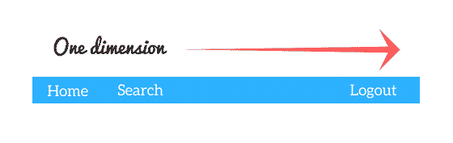
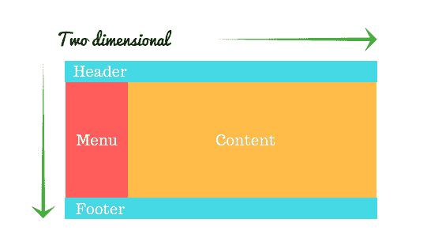
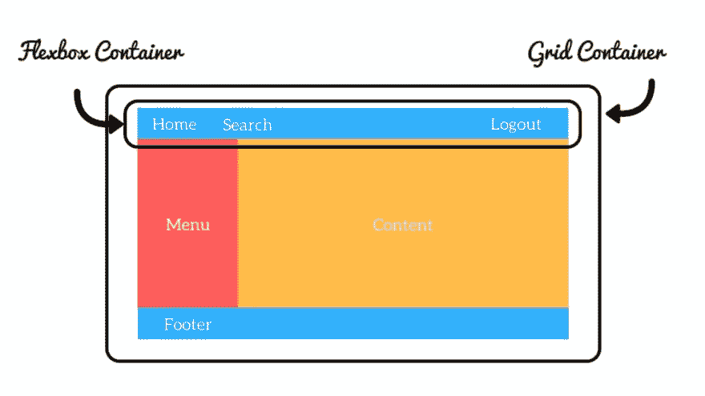

# CSS 网格与 Flexbox

> 原文：<https://dev.to/lmolivera/css-grid-vs-flexbox-1koi>

我想学习 CSS 的主要原因是因为我对响应式网页设计非常感兴趣。我试着使用“浮动”方法，直到[我发现它有点过时](https://stackoverflow.com/questions/9776840/are-floats-bad-what-should-be-used-in-its-place)并且网页布局有更好的选择。

我开始使用 Flexbox 来组织我的布局。直到我发现了 CSS 网格。但是我很困惑，因为 Flexbox 和 CSS Grid 非常相似，我不知道什么时候使用哪个。所以，让我告诉你我从我的新研究中学到了什么。

### 主要区别

" Flexbox 是为一维布局设计的，而 Grid 是为二维布局设计的."

### 更多差异

*   CSS Grid 的方法是布局优先，而 Flexbox 的方法是内容优先。
*   Flexbox 布局最适合应用程序的组件和小规模布局，而网格布局则适用于设计中非线性的大规模布局。
*   提示:您甚至可以组合这些布局模型。请注意，您可以在 CSS 网格容器中使用 Flexbox 容器(反之亦然！).

### 例子

我不久前创建了一个致敬页面，作为免费代码营课程的一个项目。反应灵敏，由 Flexbox 制成，如果你想检查如何使用它。【T2[https://codepen.io/LeWanderer/embed/eLdQdO?height=600&default-tab=result&embed-version=2](https://codepen.io/LeWanderer/embed/eLdQdO?height=600&default-tab=result&embed-version=2)

**编辑**:我也用 CSS Grid 做了同样的项目，看看吧。【T2[https://codepen.io/LeWanderer/embed/dwOLdQ?height=600&default-tab=result&embed-version=2](https://codepen.io/LeWanderer/embed/dwOLdQ?height=600&default-tab=result&embed-version=2)

### 两者都练！

[托马斯·帕克](https://github.com/thomaspark)创造了两个可爱的游戏来学习和练习 [Flexbox](https://flexboxfroggy.com) 和 [CSS 网格](https://cssgridgarden.com)。

### 当我有疑惑的时候

[CSS 窍门](https://css-tricks.com/)有使用 [Flexbox](https://css-tricks.com/snippets/css/a-guide-to-flexbox/) 和 [CSS 网格](https://css-tricks.com/snippets/css/complete-guide-grid/)的简单指南。每当我有疑问或不记得语法时，我都会检查它们。

### 浏览器兼容性

你可以在这里查看哪些浏览器支持 Flexbox [。检查](https://caniuse.com/#feat=flexbox)[这里](https://caniuse.com/#feat=css-grid)CSS 网格兼容性。

还要检查[在 Internet Explorer 中实现 CSS 网格](https://css-tricks.com/css-grid-in-ie-debunking-common-ie-grid-misconceptions/)

### 来源

*   [封面照片](https://www.canva.com/guptaji)
*   [报价和信息](https://hackernoon.com/the-ultimate-css-battle-grid-vs-flexbox-d40da0449faf)
*   [图像和信息](https://medium.com/youstart-labs/beginners-guide-to-choose-between-css-grid-and-flexbox-783005dd2412)

### 思想

你用的最多的是哪一个？

*感谢您的阅读。别忘了在 dev.to 和 Twitter 上关注我！*