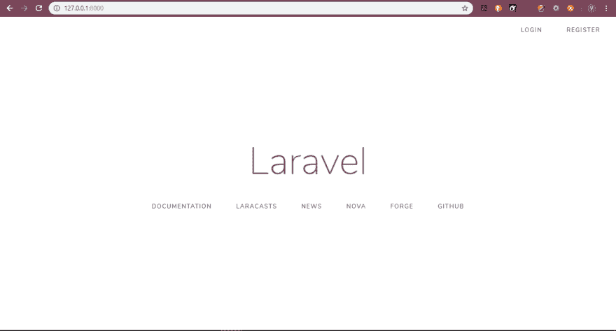
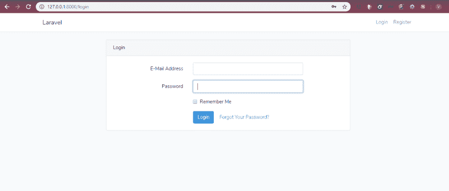
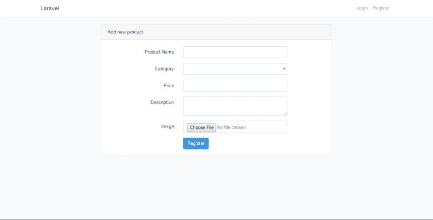

# 使用 Laravel 和 Cloudinary 构建校园市场

> 原文：<https://dev.to/victoryunusa/building-a-campus-marketplace-using-laravel-and-cloudinary-5ala>

[](https://res.cloudinary.com/practicaldev/image/fetch/s--wcff03g6--/c_limit%2Cf_auto%2Cfl_progressive%2Cq_auto%2Cw_880/https://thepracticaldev.s3.amazonaws.com/i/dst2ry3yfoaayu121bjy.PNG)

12 月 1 日，我在加纳阿克拉参加了由 Cloudinary 赞助的 HACK-API 黑客马拉松。黑客马拉松的目的是让 Cloudinary API 为加纳的技术生态系统所知。对于我们的黑客马拉松项目，我和我的团队为大学校园构建了一个市场应用程序。我们的目的有两个:提高校园内经营的小企业的意识，让人们更容易找到某些产品和服务。

一开始，我们的首要任务是找到一个有助于在 Cloudinary 上存储应用程序图像和视频的包。令人欣慰的是，在 Github 上彻底搜索之后，我找到了 Laravel，一种 PHP 编程语言的框架，它符合要求，然后我们用它开发了应用程序的后端。这是一次平稳的航行。

请继续阅读，逐步了解开发流程。

## 第一步:安装 Laravel

要安装 Laravel，请遵循其网站上的程序。安装后，设置您的`.env`变量，转到安装文件夹，并遵循以下步骤:

运行此命令以创建身份验证框架，例如登录和注册页面:

`php artisan make:auth`

运行以下命令:

`php artisan serve`

然后显示以下输出，表明服务器当前正在运行:

`Laravel development server started: http://127.0.0.1:8000`

转到浏览器上的 URL。

然后显示主页:

[](https://res.cloudinary.com/practicaldev/image/fetch/s--H0SZNviB--/c_limit%2Cf_auto%2Cfl_progressive%2Cq_auto%2Cw_880/https://thepracticaldev.s3.amazonaws.com/i/fn9tlo9sfk0vnhpmu9by.PNG)

点击右上角的登录进入登录页面:

[](https://res.cloudinary.com/practicaldev/image/fetch/s--u1PaVbd3--/c_limit%2Cf_auto%2Cfl_progressive%2Cq_auto%2Cw_880/https://thepracticaldev.s3.amazonaws.com/i/s4gi73tktkcjy18zpzsm.PNG)

## 步骤 2:为市场应用程序创建模型和迁移

marketplace 应用程序需要数据库中的以下表:

1.  用户表(已经在开始时创建)
2.  产品表
3.  类别表
4.  注释表

要为 products、category 和 comments 表创建迁移文件，请按列出的顺序运行这三个命令:

`php artisan make:migration create_products_table`
`php artisan make:migration create_categories_table`
T2】

然后，转到迁移文件的`database/migrations`文件夹，您将看到您刚刚创建的文件和由 Laravel 自动创建的文件的列表。
在文本编辑器中打开`products`迁移文件，复制并粘贴以下`up`函数的代码作为文件内容:

`public function up()
{
Schema::create('products', function (Blueprint $table) {
$table->increments('id');
$table->integer('user_id');
$table->string('product_name');
$table->integer('category');
$table->string('price');
$table->text('description')->nullable();
$table->text('image');
$table->timestamps();
});
}`

对`categories`和`comment`迁移文件进行同样的操作:

`public function up()
{
Schema::create('categories', function (Blueprint $table) {
$table->increments('id');
$table->string('category');
$table->timestamps();
});
}`

`public function up()
{
Schema::create('comments', function (Blueprint $table) {
$table->increments('id');
$table->integer('user_id');
$table->integer('product_id');
$table->string('comment');
$table->timestamps();
});
}`

## 第三步:为 Cloudinary 安装 Laravel 包

作为参考，请参见 Github 上 Laravel 包的文档。

请执行以下操作:

运行此命令安装 Cloudinary 所需的依赖项:

`composer require jrm2k6/cloudder`

编辑您的`.env`文件，从 Cloudinary 添加以下信息:

必需的
`CLOUDINARY_API_KEY=012345679890123
CLOUDINARY_API_SECRET=foobarfoobarfoob-arfoobarfo
CLOUDINARY_CLOUD_NAME=foobarcorp`
可选的
`CLOUDINARY_BASE_URL
CLOUDINARY_SECURE_URL
CLOUDINARY_API_BASE_URL`
因为 Laravel 5.5+特性包自动发现，所以不需要手动添加服务提供商(`ServiceProvider`)。要绕过自动发现，请将以下代码添加到`config/app.php`文件中:

`'providers' => array(
JD\Cloudder\CloudderServiceProvider::class,
);`

`'aliases' => array(
'Cloudder' => JD\Cloudder\Facades\Cloudder::class,
);`

最后，运行这个命令:
`php artisan vendor:publish --provider="JD\Cloudder\CloudderServiceProvider"`

## 第四步:创建控制器

Laravel 提供了一种生成快速简单的控制器的独特方法。只需运行下面的命令:
`Php artisan make:controller ProductsController`
注意:一定要将控制器的名字首字母大写:`Php`。
对类别和评论重复相同的命令。
接下来，转到`app/Http/Controllers`文件夹来存放你的控制器文件。将以下代码添加到`ProductsController.php`文件中:

```
<?php

    namespace App\Http\Controllers;
    use Illuminate\Http\Request;
    use App\User;
    use Hash;
    use Session;
    use Validator;
    use Illuminate\Support\Facades\Input;
    use DB;
    use Auth;
    use Cloudder;

    class ProductsController extends Controller
    {

     //This function handles the add listing page.

        public function Index(){

            return view('add');
        }
     // This function saves the form data to the database.

     public function save(Request $request)
         {

            $pic = $request->file('file');
            $name = trim($request['name']);
            $price = trim($request['price']);
            $category = trim($request['category']);
            $description = trim($request['description']);

            $upload = Cloudder::upload($pic);

            if($upload){

                $picId = Cloudder::getPublicId();

                DB::table('products')->insert([ 
                    'item_name'  => $name,
                    'description'=> $description,
                    'price'      => $price,
                    'category'   => $category,
                    'user_id'    => Auth::user()->id,
                    'image'      => $picId,
                 ]);

            }

            return redirect()->intended("add-listing");

        }

            //This function displays the items on the product-listing page.

        public function listings(){

            $data['products'] = DB::table('products')->get();
            return view('listings', $data);
        }

            //This function displays a single item in detail.

        public function details($id){

           $data['products'] = DB::table('products')->where('id', "=", $id)->first();
            return view('details', $data);
        }

} 
```

## 步骤五:创建视图

Laravel 是一个模型视图控制器(MVC)框架。我们在前面谈到了模型和控制器，现在将向您展示如何通过 Laravel 令人惊叹的模板引擎 Blade 来创建视图。

转到`resources/views`文件夹，用下面的代码创建一个名为`add.blade.php`的新文件:

```
 @extends('layouts.app')

    @section('content')
    <div class="container">
    <div class="row justify-content-center">
        <div class="col-md-8">
            <div class="card">
                <div class="card-header">Add new product</div>

                <div class="card-body">
                    <form method="POST" action="{{ url('save-item') }}" enctype="multipart/form-data">
                        @csrf

                        <div class="form-group row">
                       <label for="name" class="col-md-4 col-form-label text-md-right">Product Name</label>

                            <div class="col-md-6">
                                <input id="name" type="text" class="form-control{{ $errors->has('name') ? ' is-invalid' : '' }}" name="name" value="{{ old('name') }}" required autofocus>

                                @if ($errors->has('name'))
                                    <span class="invalid-feedback" role="alert">
                                        <strong>{{ $errors->first('name') }}</strong>
                                    </span>
                                @endif
                            </div>
                        </div>

                        <div class="form-group row">
                            <label for="email" class="col-md-4 col-form-label text-md-right">Category</label>

                            <div class="col-md-6">
                                <select class="form-control{{ $errors->has('email') ? ' is-invalid' : '' }}" name="email"  required>
                                  <option></option>

                                </select>

                                @if ($errors->has('email'))
                                    <span class="invalid-feedback" role="alert">
                                        <strong>{{ $errors->first('email') }}</strong>
                                    </span>
                                @endif
                            </div>
                        </div>

                        <div class="form-group row">
                            <label for="password" class="col-md-4 col-form-label text-md-right">Price</label>

                            <div class="col-md-6">
                                <input id="password" type="text" class="form-control{{ $errors->has('password') ? ' is-invalid' : '' }}" name="price" required>

                                @if ($errors->has('password'))
                                    <span class="invalid-feedback" role="alert">
                                        <strong>{{ $errors->first('password') }}</strong>
                                    </span>
                                @endif
                            </div>
                        </div>

                        <div class="form-group row">
                            <label for="password-confirm" class="col-md-4 col-form-label text-md-right">Description</label>

                            <div class="col-md-6">
                                <textarea id="password-confirm" type="text" class="form-control" name="description" required></textarea>
                            </div>
                        </div>

                        <div class="form-group row">
                            <label for="password-confirm" class="col-md-4 col-form-label text-md-right">Image</label>

                            <div class="col-md-6">
                                <input id="password-confirm" type="file" class="form-control" name="image" required>
                            </div>
                        </div>

                        <div class="form-group row mb-0">
                            <div class="col-md-6 offset-md-4">
                                <button type="submit" class="btn btn-primary">
                                    {{ __('Register') }}
                                </button>
                            </div>
                        </div>
                    </form>
                </div>
            </div>
        </div>
    </div>
</div>
@endsection 
```

这是该页面的外观:

[](https://res.cloudinary.com/practicaldev/image/fetch/s--6qiTQCvg--/c_limit%2Cf_auto%2Cfl_progressive%2Cq_auto%2Cw_880/https://thepracticaldev.s3.amazonaws.com/i/wtwv2hfoobbr7h0bsv3u.PNG)

结论
我希望这篇文章已经让你熟悉了 Laravel 框架和 Cloudinary 的一些强大功能，并且给你留下了深刻的印象。一定要将你所学到的知识应用到其他有用的应用中去。享受乐趣！