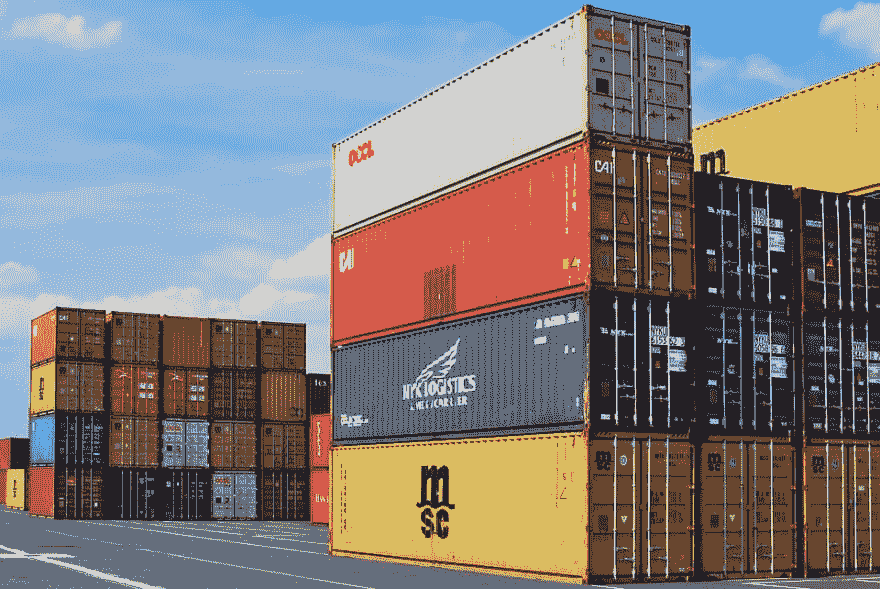

# 快速简单地生成有角度的容器组件

> 原文：<https://dev.to/chiangs/generating-container-components-the-fast-and-easy-way-4mjo>

你们中的一些人可能熟悉`container components`的概念。如果不是，那么它们是用来“包装”你的表示组件的组件，作为一个数据层来分离关注点并提高测试的速度。

[](https://res.cloudinary.com/practicaldev/image/fetch/s--jqkCik3l--/c_limit%2Cf_auto%2Cfl_progressive%2Cq_auto%2Cw_880/https://thepracticaldev.s3.amazonaws.com/i/63axx74eulbuhk8c7bl9.jpg)

这种结构还有很多其他好处，比如更容易调试和推理。我喜欢这种结构的另一个原因是，你可以通过 NgRx 来利用它，并通过切换到`OnPush detection strategy`来提高表示组件的效率，因为此时它们的所有数据都应该通过`@Input`传入，或者作为不可变的新对象从`Store`传入。

这是 Lars gyr up Brink Nielsen(@ layzeedk)写的一篇很棒的文章，我帮助评论了这个主题:[带角的容器组件](https://blog.angularindepth.com/container-components-with-angular-11e4200f8df)

在这篇文章中，Lars 带你踏上了一段精心编写的重构英雄之旅示例项目的旅程。

如果你正在寻找关于高级角度主题的真正伟大的信息，我建议给这个家伙一个关注:

![[deleted user] image](img/56fbc1337a9836e0802365a3a3022a53.png)

## [已删除的用户]

我不能比 Lars 更好地解释这个主题，但我认为从另一个角度添加另一个实际的例子会很有趣，因为他涉及到重构现有的项目。

那么，如果你从一个新项目开始，不需要重构，又会怎样呢？ 这是我在一个全新的项目中快速生成容器组件的方式，以使结构有一个良好的开端。

假设我有一个名为 ***auth.module.ts*** 的特性模块，我想生成一个名为 ***login*** 的组件。

## 生成容器组件

首先，我想生成容器组件，并将其注册到 auth 模块。因为它是一个容器组件，所以我很可能不需要单独的 HTML 文件，也不需要样式。只有`*.ts`和`*.spec.test`文件。

因此，为了一下子做到这一点，我们像这样利用`Angular CLI`:

```
> ng g c auth/login -t -s -m=auth.module 
```

Enter fullscreen mode Exit fullscreen mode

让我们仔细分析一下。你们大多数人都熟悉`ng`部分。

*   `g`是`generate`的简称。
*   `c`是`component`的简称。
*   接下来，我们指定生成组件文件的路径。
*   `-t`是`--inline-template`的简称；可选标志，表示跳过 HTML 文件，这样我们就可以使用内联模板(稍后会详细介绍)。
*   `-s`是`--inline-style`的简称；可选标志，表示跳过样式文件，这样我们就可以使用内联样式(稍后还会详细介绍)。
*   `-m`是`--module`的简称，我们将这个组件分配给 auth 模块

如果我们写出不带短别名的命令，它看起来像:

```
> ng generate component auth/login --inline-template --inline-style --module=auth.module 
```

Enter fullscreen mode Exit fullscreen mode

这将产生如下的文件结构:

```
auth\
   login\
    -login.component.spec.ts
    -login.component.ts 
```

Enter fullscreen mode Exit fullscreen mode

我这里和 Lars 文章的不同之处在于，文件仍然是`*.component.ts`而不是`*.container.ts`。只要你选择一个惯例并坚持下去，这真的没关系。由于我将要生成的表示组件在文件名和选择器中将有`UI`，我认为保留这个`*.component.ts`是可以的。

## 生成演示组件

因此，当生成登录表示组件时，我们有两种选择，在它自己的子目录中生成组件，或者在与容器组件相同的目录级别中生成组件。就我个人而言，我喜欢在子目录中生成它们，因为如果您有一个包含多个表示组件的容器组件，那么在查看文件结构时会更容易思考。例如，我可以将登录表示组件重构为登录表单子组件，或者忘记密码组件，等等。

```
> ng g c auth/login/login-ui 
```

Enter fullscreen mode Exit fullscreen mode

这导致了以下文件结构:

```
auth\
   login\
    -login.component.spec.ts
    -login.component.ts
    login-ui\
      -login-ui.component.html
      -login-ui.component.scss
      -login-ui.component.spec.ts
      -login-ui.component.ts 
```

Enter fullscreen mode Exit fullscreen mode

在容器组件中，我们在内联模板中编写 login-ui 组件选择器，然后连接它，只需在需要的地方指定输入和输出。

```
import { Component, OnInit } from '@angular/core';

@Component({
  selector: 'app-login',
  template: `<app-login-ui [inputs]="$inputs | async"></app-login-ui>`,
  styleUrls: []
})
export class LoginComponent implements OnInit {
  inputs$: Observable<boolean>;

  constructor(private store: Store) { }

  ngOnInit() {
        this.inputs$ = this.store.pipe(select(inputs));
  }
} 
```

Enter fullscreen mode Exit fullscreen mode

这看起来像是额外的工作，但是从长远来看，这种模式确实让复杂的应用程序变得更加简单。

请在评论中告诉我你们对这种模式的看法！

干杯！