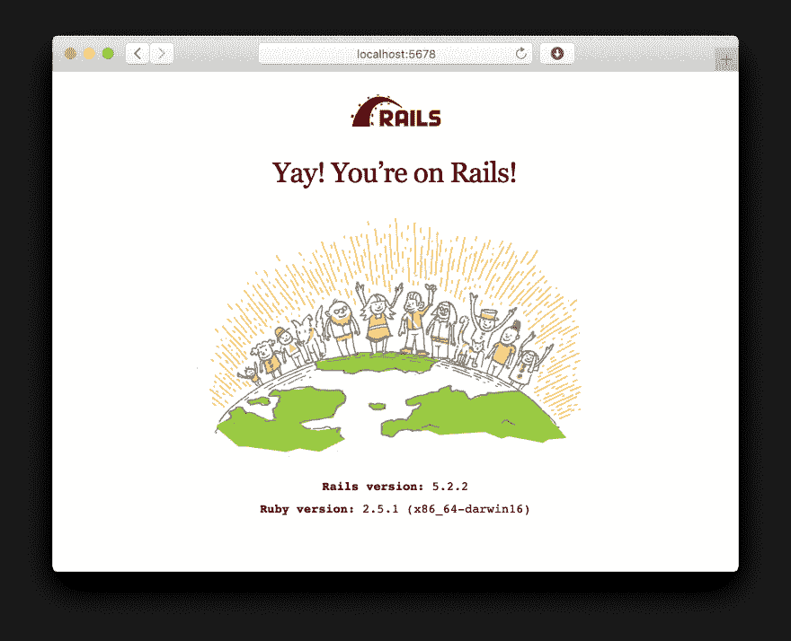
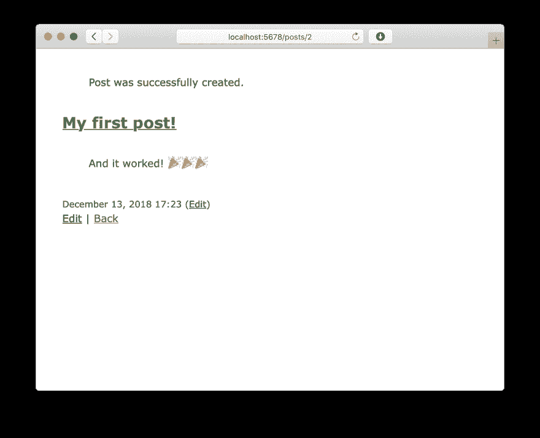

# running Rack:Ruby HTTP 服务器如何运行 Rails 应用程序

> 原文：<https://dev.to/appsignal/running-rack-how-ruby-http-servers-run-rails-apps-5bi5>

*原载于[blog . app signal . com/2017/01/24/ruby-magic-building-a-ruby-http-server-part-2-running-a-rails-app . html](https://blog.appsignal.com/2017/01/24/ruby-magic-building-a-ruby-http-server-part-2-running-a-rails-app.html)2017 年 1 月 24 日。*

在 Ruby Magic 系列中，我们喜欢把软件拆开来学习它是如何工作的。都是过程的问题；最终的结果不是你在生产中使用的东西，我们学习了 Ruby 语言的内部工作原理和它流行的库。我们大约每月发布一篇新文章，所以如果你也对这类事情感兴趣，一定要订阅我们的时事通讯。

在 Ruby Magic 的早期版本中，我们在 Ruby 中实现了一个 30 行的 HTTP 服务器。无需编写大量代码，我们就能够处理 HTTP GET 请求并提供一个简单的 Rack 应用程序。这一次，我们将把我们自制的服务器带得更远一些。当我们完成后，我们将有一个 web 服务器，可以服务 Rails 著名的 15 分钟博客，允许您创建、更新和删除帖子。

## 我们离开的地方

上一次，作为一个示例应用程序，我们实现了足够的服务器来服务于 [Rack::Lobster](https://github.com/rack/rack/blob/master/lib/rack/lobster.rb) 。

1.  我们的实现打开了一个 TCP 服务器，并等待一个请求进入。
2.  当发生这种情况时，解析请求行(`GET /?flip=left HTTP/1.1\r\n`)以获得请求方法(`GET`)、路径(`/`)和查询参数(`flip=left`)。
3.  请求方法、路径和查询字符串被传递给 Rack 应用程序，后者返回一个包含状态、一些响应头和响应体的三元组。
4.  使用这些，我们能够在关闭连接等待新请求到来之前，构建一个 HTTP 响应并发送回浏览器。

```
# http_server.rb
require 'socket'
require 'rack'
require 'rack/lobster'

app = Rack::Lobster.new
server = TCPServer.new 5678

#1
while session = server.accept
  request = session.gets
  puts request

  #2
  method, full_path = request.split(' ')
  path, query = full_path.split('?')

  #3
  status, headers, body = app.call({
    'REQUEST_METHOD' => method,
    'PATH_INFO' => path,
    'QUERY_STRING' => query
  })

  #4
  session.print "HTTP/1.1 #{status}\r\n"
  headers.each do |key, value|
    session.print "#{key}: #{value}\r\n"
  end
  session.print "\r\n"
  body.each do |part|
    session.print part
  end
  session.close
end 
```

我们将继续使用上次编写的代码。如果你想继续，这里是我们用结束的[代码。](https://gist.github.com/jeffkreeftmeijer/7f08d1f7e381b9c552666750914925eb)

## 齿条和导轨

像 Rails 和 Sinatra 这样的 Ruby 框架是建立在框架接口之上的。就像我们现在用来测试服务器的`Rack::Lobster`实例一样，Rails 的`Rails.application`是一个 Rack 应用程序对象。理论上，这意味着我们的服务器应该已经能够服务于 Rails 应用程序。

为了测试这一点，我准备了一个简单的 Rails 应用程序。让我们将它克隆到与我们的服务器相同的目录中。

```
$ ls
http_server.rb
$ git clone https://github.com/jeffkreeftmeijer/wups.git blog
Cloning into 'blog'...
remote: Counting objects: 162, done.
remote: Compressing objects: 100% (112/112), done.
remote: Total 162 (delta 32), reused 162 (delta 32), pack-reused 0
Receiving objects: 100% (162/162), 29.09 KiB | 0 bytes/s, done.
Resolving deltas: 100% (32/32), done.
Checking connectivity... done.
$ ls
blog           http_server.rb 
```

然后，在我们的服务器中，需要 Rails 应用程序的环境文件，而不是`rack`和`rack/lobster`，并将`Rails.application`放在`app`变量中，而不是`Rack::Lobster.new`。

```
# http_server.rb
require 'socket'
require_relative 'blog/config/environment'

app = Rails.application
server = TCPServer.new 5678
# ... 
```

启动服务器(`ruby http_server.rb`)并打开 [http://localhost:5678](http://localhost:5678) 向我们显示我们还没有完全到达那里。服务器没有崩溃，但是我们在浏览器中看到一个内部服务器错误。

[](https://res.cloudinary.com/practicaldev/image/fetch/s--lNdPYf3m--/c_limit%2Cf_auto%2Cfl_progressive%2Cq_auto%2Cw_880/https://blog.appsignal.cimg/blog/2017-01/500.png)

检查我们服务器的日志，我们可以看到我们遗漏了一个叫做`rack.input`的东西。事实证明，我们上次实现我们的服务器时很懒，所以在让这个 Rails 应用程序工作之前还有更多的工作要做。

```
$ ruby http_server.rb
GET / HTTP/1.1
Error during failsafe response: Missing rack.input
  ...
  http_server.rb:15:in `<main>' 
```

## 机架环境

当我们实现我们的服务器时，我们忽略了[机架环境](http://www.rubydoc.info/github/rack/rack/file/SPEC#The_Environment)，并且忽略了为机架应用提供适当服务所需的大部分变量。我们最终只实现了`REQUEST_METHOD`、`PATH_INFO`和`QUERY_STRING`变量，因为这些变量对于我们简单的 Rack 应用程序来说已经足够了。

正如我们在尝试启动新应用程序时从异常中看到的，Rails 需要`rack.input`，它被用作原始 HTTP POST 数据的输入流。除此之外，我们还需要传递一些变量，比如服务器的端口号和请求 cookie 数据。

幸运的是，Rack 提供了 [`Rack::Lint`](https://github.com/rack/rack/blob/master/lib/rack/lint.rb<Paste) 来帮助确保 Rack 环境中的所有变量都存在并且有效。我们可以用它来测试我们的服务器，方法是调用`Rack::Lint.new`并传递`Rails.application`，将我们的 Rails 应用程序封装在其中。

```
# http_server.rb
require 'socket'
require_relative 'blog/config/environment'

app = Rack::Lint.new(Rails.application)
server = TCPServer.new 5678
# ... 
```

`Rack::Lint`当环境中的变量缺失或无效时会抛出异常。现在，再次启动我们的服务器并打开 [http://localhost:5678](http://localhost:5678) 将会使服务器崩溃，`Rack::Lint`将会通知我们第一个错误:`SERVER_NAME`变量没有被设置。

```
~/Appsignal/http-server (master) $ ruby http_server.rb
GET / HTTP/1.1
/Users/jeff/.rbenv/versions/2.4.0/lib/ruby/gems/2.4.0/gems/rack-2.0.1/lib/rack/lint.rb:20:in `assert': env missing required key SERVER_NAME (Rack::Lint::LintError)
        ...
        from http_server.rb:15:in `<main>' 
```

通过修复每个抛给我们的错误，我们可以继续添加变量，直到`Rack::Lint`停止使我们的服务器崩溃。让我们检查一下`Rack::Lint`需要的每个变量。

*   `SERVER_NAME`:服务器的主机名。我们现在只在本地运行这个服务器，所以我们将使用“localhost”。
*   我们的服务器正在运行的端口。我们已经对端口号(5678)进行了硬编码，所以我们将把它传递给机架环境。
*   `rack.version`:作为整数数组的目标机架*协议*版本号。 [`[1,3]`](https://github.com/rack/rack/blob/master/lib/rack.rb#L14) 写作的时候。
*   `rack.input`:包含原始 HTTP post 数据的输入流。我们稍后会谈到这一点，但是现在我们将传递一个空的`StringIO`实例(使用 ASCII-8 位编码)。
*   `rack.errors`:供`Rack::Logger`写入的错误流。我们用`$stderr`。
*   `rack.multithread`:我们的服务器是单线程的，所以这个可以设为`false`。
*   `rack.multiprocess`:我们的服务器运行在一个单独的进程中，所以这个也可以设置为`false`。
*   `rack.run_once`:我们的服务器可以在一个进程中处理多个顺序请求，所以这也是`false`。
*   `rack.url_scheme`:没有 SSL 支持，所以这个可以设置为“http”而不是“https”。

添加完所有缺失的变量后，`Rack::Lint`将通知我们环境中的另一个问题。

```
$ ruby http_server.rb
GET / HTTP/1.1
/Users/jeff/.rbenv/versions/2.4.0/lib/ruby/gems/2.4.0/gems/rack-2.0.1/lib/rack/lint.rb:20:in `assert': env variable QUERY_STRING has non-string value nil (Rack::Lint::LintError)
        ...
        from http_server.rb:18:in `<main>' 
```

当请求中没有查询字符串时，我们现在将把`nil`作为`QUERY_STRING`传递，这是不允许的。在这种情况下，Rack 需要一个空字符串。在实现了缺少的变量并更新了查询字符串之后，这就是我们的环境的样子:

```
# http_server.rb
# ...
  method, full_path = request.split(' ')
  path, query = full_path.split('?')

  input = StringIO.new
  input.set_encoding 'ASCII-8BIT'

  status, headers, body = app.call({
    'REQUEST_METHOD' => method,
    'PATH_INFO' => path,
    'QUERY_STRING' => query || '',
    'SERVER_NAME' => 'localhost',
    'SERVER_PORT' => '5678',
    'rack.version' => [1,3],
    'rack.input' => input,
    'rack.errors' => $stderr,
    'rack.multithread' => false,
    'rack.multiprocess' => false,
    'rack.run_once' => false,
    'rack.url_scheme' => 'http'
  })

  session.print "HTTP/1.1 #{status}\r\n"
# ... 
```

重启服务器并再次访问 http://localhost:5678 ，我们将会看到 Rails 的问候:“您在 Rails 上！”-page，意味着我们现在在自制的服务器上运行实际的 Rails 应用程序！

[](https://res.cloudinary.com/practicaldev/image/fetch/s--aLiryQGf--/c_limit%2Cf_auto%2Cfl_progressive%2Cq_auto%2Cw_880/https://blog.appsignal.cimg/blog/2017-01/youre-on-rails.png)

## 解析 HTTP 帖子正文

这个应用程序不仅仅是索引页面。访问[http://localhost:5678/posts](http://localhost:5678/posts)会显示一个空的帖子列表。如果我们试图通过填写新帖子表单并点击“创建帖子”来创建一个新帖子，我们会遇到一个`ActionController::InvalidAuthenticityToken`异常。

发布表单时会发送真实性标记，用于检查请求是否来自可信来源。我们的服务器现在完全忽略 POST 数据，所以令牌没有被发送，请求也不能被验证。

当我们第一次实现 HTTP 服务器时，我们使用`session.gets`来获取第一行(称为[请求行](https://www.w3.org/Protocols/rfc2616/rfc2616-sec5.html#sec5.1)，并从中解析 HTTP 方法和路径。除了解析请求行，我们忽略了请求的其余部分。

为了能够提取 POST 数据，我们首先需要理解 HTTP 请求是如何构造的。看一个例子，我们可以看到这个结构类似于一个 HTTP 响应:

```
POST /posts HTTP/1.1\r\n
Host: localhost:5678\r\n
Accept: text/html,application/xhtml+xml,application/xml;q=0.9,*/*;q=0.8\r\n
Accept-Encoding: gzip, deflate\r\n
Accept-Language: en-us\r\n
Content-Type: application/x-www-form-urlencoded\r\n
Origin: http://localhost:5678\r\n
User-Agent: Mozilla/5.0 (Macintosh; Intel Mac OS X 10_12_1) AppleWebKit/602.2.14 (KHTML, like Gecko) Version/10.0.1 Safari/602.2.14\r\n
Cookie: _wups_session=LzE0Z2hSZFNseG5TR3dEVEwzNE52U0lFa0pmVGlQZGtZR3AveWlyMEFvUHRPeXlQUzQ4L0xlKzNLVWtqYld2cjdiWkpmclZIaEhJd1R6eDhaZThFbVBlN2p6QWpJdllHL2F4Z3VseUZ6NU1BRTU5Y1crM2lLRVY0UzdSZkpwYkt2SGFLZUQrYVFvaFE0VjZmZlIrNk5BPT0tLUpLTHQvRHQ0T3FycWV0ZFZhVHZWZkE9PQ%3D%3D--4ef4508c936004db748da10be58731049fa190ee\r\n
Connection: keep-alive\r\n
Upgrade-Insecure-Requests: 1\r\n
Referer: http://localhost:5678/posts/new\r\n
Content-Length: 369\r\n
\r\n
utf8=%E2%9C%93&authenticity_token=3fu7e8v70K0h9o%2FGNiXxaXSVg3nZ%2FuoL60nlhssUEHpQRz%2BM4ZIHjQduQMexvXrNoC2pjmhNPI4xNNA0Qkh5Lg%3D%3D&post%5Btitle%5D=My+first+post&post%5Bcreated_at%281i%29%5D=2017&post%5Bcreated_at%282i%29%5D=1&post%5Bcreated_at%283i%29%5D=23&post%5Bcreated_at%284i%29%5D=18&post%5Bcreated_at%285i%29%5D=47&post%5Bbody%5D=It+works%21&commit=Create+Post 
```

与响应非常相似，HTTP 请求包括:

*   一个请求行(`POST /posts HTTP/1.1\r\n`)，由一个方法标记(`POST`)、一个请求 URI ( `/posts/`)和一个 HTTP 版本(`HTTP/1.1`)组成，后跟一个 CRLF(回车符:\r，后跟换行符:\n)以指示行尾
*   标题行(`Host: localhost:5678\r\n`)。头键，后跟冒号，然后是值和 CRLF。
*   换行符(或双 CRLF)将请求行和标题与正文分开:(`\r\n\r\n`)
*   URL 编码的文章正文

在使用`session.gets`获取请求的第一行(请求行)之后，我们剩下一些标题行和一个主体。为了获取标题行，我们需要从会话中检索行，直到找到一个换行符(`\r\n`)。

对于每个标题行，我们将在第一个冒号处进行拆分。冒号前面的都是键，后面的都是值。我们`#strip`从末尾移除换行符的值。

为了知道我们需要从请求中读取多少字节来获得主体，我们使用“Content-Length”头，这是浏览器在发送请求时自动包含的。

```
# http_server.rb
# ...
  headers = {}
  while (line = session.gets) != "\r\n"
    key, value = line.split(':', 2)
    headers[key] = value.strip
  end

  body = session.read(headers["Content-Length"].to_i)
# ... 
```

现在，我们不是发送一个空对象，而是发送一个带有我们通过请求接收的主体的`StringIO`实例。此外，由于我们现在正在解析来自请求头的 cookies，我们可以将它们添加到 Rack 环境的`HTTP_COOKIE`变量中，以通过请求真实性检查。

```
# http_server.rb
# ...
  status, headers, body = app.call({
    # ...
    'REMOTE_ADDR' => '127.0.0.1',
    'HTTP_COOKIE' => headers['Cookie'],
    'rack.version' => [1,3],
    'rack.input' => StringIO.new(body),
    'rack.errors' => $stderr,
    # ...
  })
# ... 
```

我们走吧。如果我们重新启动服务器并再次尝试提交表单，您将看到我们成功地在博客上创建了第一篇文章！

[](https://res.cloudinary.com/practicaldev/image/fetch/s--jAVXeI13--/c_limit%2Cf_auto%2Cfl_progressive%2Cq_auto%2Cw_880/https://blog.appsignal.cimg/blog/2017-01/first-post.png)

我们这次认真升级了我们的网络服务器。我们现在不只是接受来自 Rack 应用程序的 GET 请求，而是提供一个完整的 Rails 应用程序来处理 POST 请求。而我们总共还没有写出超过五十行的代码！

如果你想玩我们新的和改进的服务器，[这里是代码](https://gist.github.com/jeffkreeftmeijer/43d46bca63de648436d6018c73bd436b)。如果您想了解更多，或者有具体问题，请告诉我们！