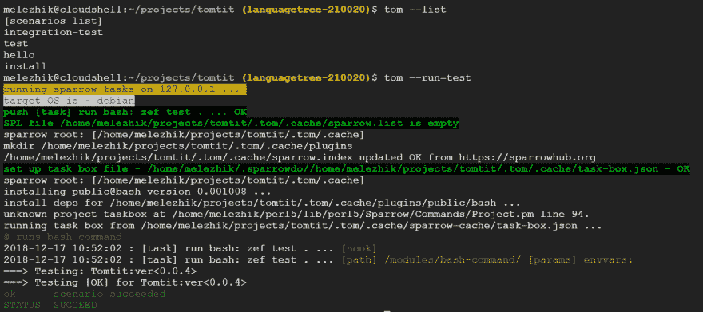

# 一只雄鸟成功了！

> 原文：<https://dev.to/melezhik/one-tomtit-for-it--1j3f>

[](https://res.cloudinary.com/practicaldev/image/fetch/s--QgE9rrFy--/c_limit%2Cf_auto%2Cfl_progressive%2Cq_auto%2Cw_880/https://www.goodfreephotos.com/albums/animals/birds/tomtit-stock-photo.jpg)

照片 via [好的免费照片](https://www.goodfreephotos.com/)

[](https://res.cloudinary.com/practicaldev/image/fetch/s--hc-8dKpR--/c_limit%2Cf_auto%2Cfl_progressive%2Cq_auto%2Cw_880/https://raw.githubusercontent.com/melezhik/tomtit/master/tomtit-output.png)

* * *

Tomtit 是一个带有许多插件的 Perl6 任务运行器，你可以用它作为许多任务运行器的替代品。

为什么？

*   它最适合 Perl5/Perl6 开发人员，因为它是在 Perl5/Perl6 上编写的
*   它有用于 Perl6 语言的编程 API
*   它有许多常见任务的快捷方式-运行 Bash 脚本、创建文件和启动/停止服务-[https://github . com/mele zhik/sparrow do/blob/master/core-DSL . MD](https://github.com/melezhik/sparrowdo/blob/master/core-dsl.md)
*   它有几十个插件-[http://sparrowhub.org](http://sparrowhub.org)-来解决更具体的任务
*   它是可扩展的——你可以用你最喜欢的语言写一个新的插件来满足你的特殊需求。

作为底线，它帮助你以最少的麻烦完成事情，但并不限制你使用静态 DSL，而是允许你用现代和强大的语言 [Perl6](http://perl6.org/) 编排你的场景。

那么，你准备好靠近了吗？

# 安装

Tomtit 作为 Perl6 模块安装。

`zef install Tomtit`

一旦成功安装，Tomcat 提供了`tom` -命令行客户端来执行场景。

# 自举

你需要一个系统引导来(*)安装 Tomtit 的内部任务运行器，不要害怕，这是一次性操作。

`tom --bootstrap`

(*)您将需要`sudo`权限来创建引导

一旦完成引导，您就可以执行场景，让我们来看看典型的 tomtit 工作流。

# Tomtit 工作流程

tomtit 通常的工作流程是定义场景，然后运行它们。它与以*项目为中心的*方法配合得特别好，在这种方法中，你检查应用程序的源代码并运行一些与*相关的任务*。

比方说，我们有一个应用程序源代码，其中我们执行 3 个标准操作:

*   建设
*   试验
*   并安装

我们以场景结束，然后命名为*构建*、*测试*和*安装*。

如果使用`make`工具来构建项目，它可能只是一个带有相关参数的`make`工具的 3 次调用。

让我们创建我们的第一个 Tomtit 场景:

```
git checkout $git-repo

mkdir .tom

nano .tom/build.pl6
nano .tom/test.pl6
nano .tom/install.pl6 
```

每个场景的代码都很简单，只需通过快捷方式`bash`运行`make`:

。tom/build.pl6:

```
bash "make" 
```

。tom/test.pl6:

```
bash "make test" 
```

。tom/install.pl6:

```
bash "sudo make install" 
```

# 编程 API

tomtit 场景是用 Perl6 编写的，基本上只是不同任务的调用，然而这些场景不一定是有限的任务调用，它们只是 Perl6 程序,在这里你可以用 Perl6 做任何事情。

Tomtit 中有两种语法上不同的任务类型。你通过`task-run`函数调用的第一个和第二个是*快捷方式*——与`task-run`非常相似，但是有助记的名字和有时更简单的签名。

在`make`实用程序的场景中，我们使用了`bash`快捷方式来调用一段 Bash 代码。呼叫详情快捷方式的完整列表在此-[https://github . com/mele zhik/sparrow do/blob/master/core-DSL . MD](https://github.com/melezhik/sparrowdo/blob/master/core-dsl.md)

# 任务和插件

换句话说，任务运行和快捷方式都只是调用小代码的一种方式，这些代码是从 SparrowHub - script 库下载的，然后由`tomtit`的`sparrow`内部脚本运行程序执行，我还没有告诉你，但是我们的 zoo-repository 中又多了一只鸟！

这些小脚本或者任务也叫麻雀插件。

Tomtits 场景基本上只是一个被执行的 Sparrow 插件或任务的列表。

# 命令行 API

通过运行`tom --list`，您将看到现在所有可用的场景:

```
[scenarios list]
build
test
install 
```

一旦场景被定义，你就可以通过`tom --run=$scenario`命令运行它们。

例如:

`tom run=build`

`tom run=test`

诸如此类。

使用`tom --last`命令回忆您运行的最后一个场景。

你可以在 Tomtit 的 gihtub 页面上找到关于`tom`命令行客户端使用的完整文档。

# 自定义任务

如我所说，您并不仅限于在 Tomtit 场景中运行 Bash。你可以运行任何任务，只要你找到相关的插件。

例如，让我们创建使用用户名和电子邮件等用户参数配置本地 git 存储库的场景。

当您刚刚克隆了一个新项目，进行了一些更改，并希望将一些更改推回到远程时，该任务通常很有用。Git 要求您将自己的身份设置为 commiter。

-= ytet-伊甸园字幕组=-翻译:粒粒粒尘紫月猫姐校对

```
task-run "set git", "git-base", %(
  email                => 'melezhik@gmail.com',
  name                 => 'Alexey Melezhik',
  config_scope         => 'local',
  set_credential_cache => 'on'
); 
```

通过设置 config_scope，我们要求 task 为本地 git 存储库进行设置，通过设置 set_credential_cache，我们还要求 git 缓存我们的密码，这样我们就不用每次都输入密码了`git push`

您可以在 Tomtit 场景中使用的插件列表可以在 [SparrowHub](http://sparrowhub.org) - sparrow 插件库获得。

在下一个场景示例中，我们创建一个任务，通过 [vsts-build](https://sparrowhub.org/info/vsts-build) 插件远程运行 VSTS 构建:

。tom/build-vsts.pl6:

```
task_run "run my build", "vsts-build", %(
    definition => "BackEndBuild"
) 
```

在 Tomtit 场景中，有许多其他插件可以作为任务使用。查看 SparrowHub 存储库。

# 总结

Tomtit 为您提供了大量日常工作中可能用到的小脚本或插件，尤其是在处理源代码管理和构建自动化时。

Tomtit 场景是生成已执行任务的动态列表的普通 Perl6 脚本——带参数的脚本。

有一个语法糖——预定义的内置函数集，你可以使用它而不用引用插件，这使得代码更加简洁易读。

如果由于某些原因，你没有找到插件来解决你的任务，你可以创建自己的插件，并立即开始使用。

* * *

Tomtit 易于使用，功能强大且有趣——试一试，并让我知道它是如何进行的。