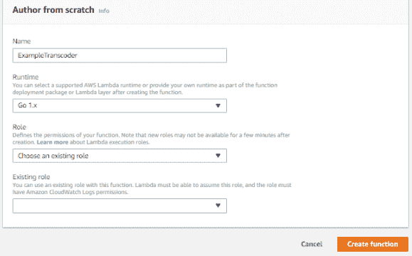
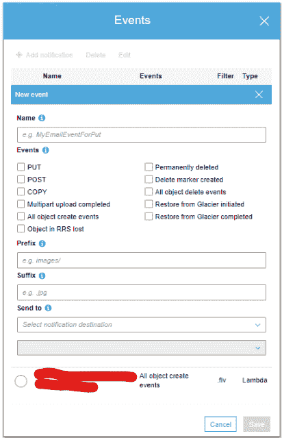
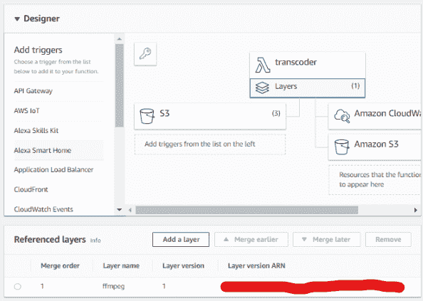

# 使用 AWS Lambda 构建一个超级便宜的代码转换器

> 原文：<https://dev.to/sydneybrokeit/building-a-super-cheap-transcoder-using-aws-lambda-1j76>

你有没有看过亚马逊弹性转码器的价格？如果你没有，我就不找了——如果视频被认为是“高清”的，视频转码每分钟 3 美分(美元)。如果你有一些视频，或者你需要很大的灵活性，弹性转码器是很酷的。

只有一个问题——如果这不是你的用例，弹性代码转换器会变得非常昂贵。比如我工作的公司，每个月要处理几十万个视频，我们的需求很简单——我们需要把特定类型的视频变成不同的特定类型的视频。这就是我们需要做的，不多也不少。

使用弹性转码器，我们的平均月账单高得真让人担心。虽然没有理由不使用正确的工具来完成这项工作，但弹性代码转换器对于我们的需求来说是多余的。

完成后，我们将有一个可用的，便宜的代码转换器，我们可以使用。虽然这确实有一些限制，但对于它的好处来说，它仍然是非常划算的，理解这一点可以帮助理解使用 S3 和 Lambda 的许多真正有趣的方面。

# 创建我们的λ函数

首先，我们需要创建我们将要使用的 Lambda 函数。登录 AWS，导航到 Lambda。点击`Create Function`并创建您的功能。任何能够调用系统命令的语言都应该工作得很好，尽管我以前在这里使用 Go，因为我喜欢它。就这么简单，它在这里没有提供主要优势。

[](https://res.cloudinary.com/practicaldev/image/fetch/s--P_pbpqp---/c_limit%2Cf_auto%2Cfl_progressive%2Cq_auto%2Cw_880/https://thepracticaldev.s3.amazonaws.com/i/ln53ledb4y3bgd5q7pus.png)

命名您的代码转换器，选择一种语言，并创建一个自定义角色——如果您不熟悉 AWS，这一部分可能会令人困惑。如果你想开始，这样的东西应该适合你的自定义角色:

```
{
    "Version": "2012-10-17",
    "Statement": [
        {
            "Sid": "VisualEditor0",
            "Effect": "Allow",
            "Action": [
                "s3:PutObject",
                "s3:GetObjectAcl",
                "s3:GetObject",
                "s3:DeleteObject",
                "s3:GetBucketAcl",
                "s3:PutObjectAcl"
            ],
            "Resource": [
                "arn:aws:s3:::testBucketName",
                "arn:aws:s3:::testBucketName/*"
            ]
        },
        {
            "Sid": "VisualEditor1",
            "Effect": "Allow",
            "Action": "s3:HeadBucket",
            "Resource": "*"
        }
    ]
} 
```

Enter fullscreen mode Exit fullscreen mode

在上面的例子中，注意您确实需要`testBucketName`和`testBucketName/*`——一组策略是针对 bucket 本身的，另一组是针对文件本身的。

# 编码我们的功能

在我们创建了函数之后，我们需要告诉它如何操作。这因语言而异，但总的要点是这样的:

*   从 S3 下载现有文件。在大多数情况下，文件名和存储桶是作为 S3 事件的一部分发送的，这取决于所使用的库。作为一个旁注，由于 Lambda 的工作方式，请确保您有一个唯一的视频标识符，否则您可能会以奇怪的错误结束。继续，问我怎么知道的。
*   使用 ffmpeg 进行代码转换——我们将利用一个更新的特性来使这个变得简单，并且可以移植到任何我们可能需要 ffmpeg 的功能中。目前，只期望使用`/opt/ffmpeg/ffmpeg`。
*   上传视频到 S3。

真的就这些了。这将因语言而异，但幸运的是 AWS 为此提供了非常有用的文档。

# 设置 S3 事件

现在我们已经写好了函数，我们需要做的最后一件主要事情是设置 S3 来实际发送事件给 Lambda。

转到您想要使用的 S3 存储桶，点击“属性”，在“高级”下，点击“事件”。现在点击“添加通知”，并选择应该触发转码的对象操作(很可能是“所有对象创建事件”)。

[](https://res.cloudinary.com/practicaldev/image/fetch/s--Gafw_Ii4--/c_limit%2Cf_auto%2Cfl_progressive%2Cq_auto%2Cw_880/https://thepracticaldev.s3.amazonaws.com/i/o30fjmh90hol2w0zrtxt.png)

如果您想要包含特定的文件夹，可以进入`prefix`；如果您正在查找特定的扩展名，请在`suffix`中进行设置。点击`Send To`下拉菜单:选择“Lambda Function”。将创建另一个下拉列表；在这里，选择您之前创建的函数。

# 创建图层

层是包含在 Lambda 函数的文件系统中的`.zip`文件。在这种情况下，我们使用的是静态编译(也就是说，一般来说，它不需要二进制以外的任何东西)版本的 ffmpeg。可以在这里找到我用过的:[https://johnvansickle . com/ffmpeg/builds/ffmpeg-git-amd64-static . tar . xz](https://johnvansickle.com/ffmpeg/builds/ffmpeg-git-amd64-static.tar.xz)。提取这个，你应该得到一个 ffmpeg 目录；将此文件添加到 zip 文件中。

转到你的 Lambda 函数，在树顶端的代码部分下，点击“层”。

[](https://res.cloudinary.com/practicaldev/image/fetch/s--f988TOxK--/c_limit%2Cf_auto%2Cfl_progressive%2Cq_auto%2Cw_880/https://thepracticaldev.s3.amazonaws.com/i/j7mctof6zio2c0m0gwo2.png)

点击“添加图层”并上传包含 ffmpeg 的 zip 文件。将其附加到函数上，就大功告成了。

# 搞定！

至少大部分是。一旦建立起来，就要在这里或那里做一些小的改动，这可能需要一点时间来找出在给定语言中做这件事的正确方法。

当一个视频被上传时，它将被发送到 Lambda 函数，该函数将对它进行代码转换并上传。

这个项目是作为降低成本的一种方法而设计的，所以让我们来看看这方面。

在这种设置下，10 分钟的视频大约需要 105 秒进行转码。有了 Lambda，我们可以给它更多的内存，对于更长或更高分辨率的视频，我们绝对需要更多的内存；我将我们当前的配置设置为 1280MB。

如果我们的代码转换器需要 1280MB 和 105 秒，我们可以很容易地计算出代码转换 10 分钟视频的成本:

给我们一秒钟运行函数的成本。这相当于每秒大约 0.000021 美元。将它乘以运行时间 105，得到的数字是 0.0022 美元。请记住，使用弹性转码器，10 分钟的视频将是 0.30 美元。这意味着我们运行在 Lambda 上的代码转换器可以提供比弹性代码转换器高 99%的折扣。

这确实有一些限制:

*   这将更好地工作在较短的视频；由于 Lambda 的运行时间限制，我怀疑任何超过 45 分钟到 1 小时的代码转换是否值得这样做。
*   较长的视频将需要更多的内存，所以节省的空间会有所下降——但即使内存最大到 4GB，它仍然比弹性转码器便宜 97%以上。
*   它不是很灵活——尽管这可以用一点创造力来克服。

对于我们的需求来说，这是完美的，但请记住，所有的工程都是了解您的限制，并从您现有的资源中获取最佳资源。