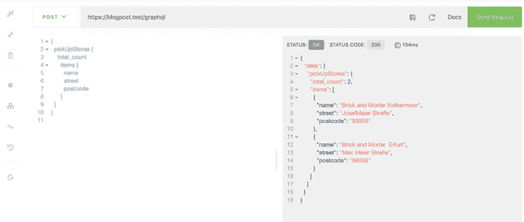

# 为 Magento 2.3 创建 GraphQL 端点—第 1 部分

> 原文：<https://dev.to/larsroettig/create-graphql-endpoint-for-magento-2-3-part-1-3mi>

在本教程中，我们将实现一个具有基本端点的示例模块，而不使用数据库。在教程 2 中，我们将使用声明性模式为新表扩展测试模块，使用数据补丁导入示例数据以获得更动态的端点。

但是在我们简要了解什么是 GraphQL 之前，对我来说，它是一种强大的 API 查询语言，对于 javascript 或渐进式 Web 应用解决方案(PWA)来说非常方便。Magento 2 使用 GraphQL 连接新的 PWA-Theme[(Venia store front)](https://magento-research.github.io/pwa-studio/venia-pwa-concept/setup/)和 Magento。

要求:

*   已安装 [Magento 2.3](https://devdocs.magento.com/guides/v2.3/install-gde/composer.html)
*   PHP 7.1 或 7.2

推荐(开发):

*   `bin/magento deploy:mode:set developer`

让我们从您安装的 magento 中的 **app/code/Test/GraphQL** 下的新文件夹开始。

**1。创建新模块 registration.php 路径:(app/code/Test/graph QL/registration . PHP)**

```
<?php

declare(strict_types=1);

// register our new Test_GraphQL
\Magento\Framework\Component\ComponentRegistrar::register(
    \Magento\Framework\Component\ComponentRegistrar::MODULE,
    'Test_GraphQL',
    __DIR__
); 
```

**2 新建 module . XML-Path:(app/code/Test/graph QL/etc/module . XML)**

```
<?xml version="1.0" ?>
<config xmlns:xsi="http://www.w3.org/2001/XMLSchema-instance" xsi:noNamespaceSchemaLocation="urn:magento:framework:Module/etc/module.xsd">
   <module name="Test_GraphQL" setup_version="0.0.1">
      <sequence>
         <module name="Magento_GraphQl"/>
      </sequence>
   </module>
</config> 
```

**3。创建一个 GraphQL 模式文件-路径:(app/code/Test/graph QL/etc/Schema . graph qls)**

```
type Query {
    pickUpStores:pickUpStoresOutput @resolver(class: "\\Test\\GraphQL\\Model\\Resolver\\Store") @doc(description: "")
}
type pickUpStoresOutput {
    total_count: Int @doc(description: "")
    items: [pickUpStore] @doc(description: "")
}
type pickUpStore {
    name: String @doc(description: ""),
    street: String @doc(description: ""),
    street_num: String @doc(description: ""),
    city: String @doc(description: ""),
    postcode: String @doc(description: ""),
} 
```

**4。实现一个服务类来处理客户端的请求-Path(app/code/Test/graph QL/Model/Resolver/store . PHP)**

*！ *schema.graphqls* 中的 import*T0 必须是来自 php 服务类的 [PS-0](https://github.com/php-fig/fig-standards/blob/master/accepted/PSR-0.md) 路径。

```
<?php
declare(strict_types=1);

namespace Test\GraphQL\Model\Resolver;

use Magento\Framework\GraphQl\Config\Element\Field;
use Magento\Framework\GraphQl\Query\ResolverInterface;
use Magento\Framework\GraphQl\Schema\Type\ResolveInfo;

class Store implements ResolverInterface
{
    /**
     * @inheritdoc
     */
    public function resolve(
        Field $field,
        $context,
        ResolveInfo $info,
        array $value = null,
        array $args = null
    ) {
        $stores = [
            [
                'name' => 'Brick and Mortar Kolbermoor',
                'street' => 'JosefMeier Straße',
                'street_num' => '1002',
                'postcode' => '83059',
            ],
            [
                'name' => 'Brick and Mortar Erfurt',
                'street' => 'Max Meier Straße',
                'street_num' => '102',
                'postcode' => '99338',
            ],
        ];
        return [
            'total_count' => count($stores),
            'items' => $stores
        ];
    }
} 
```

*安装:*

```
bin/magento module:enable Test_GraphQL
bin/magento setup:upgrade 
```

**测试您的新端点(客户端示例调用)**

我推荐使用 [Altair GraphQL 客户端](https://altair.sirmuel.design/)作为测试客户端工具

[](///static/3d8fad0f73996f9b2d1483944afd833a/00212/grapql.png)

* * *

端点 Url:**[https://your _ domain . test/graph QL](https://your_domain.test/graphql)**

**一个测试查询:**

```
{
  pickUpStores {
    total_count
      items {
        name
        street
        street_num
        postcode
      }
  }
} 
```

* * *

**示例模块:**

*   **https://gitlab.com/larsroettig/test_graphql/tree/v1**