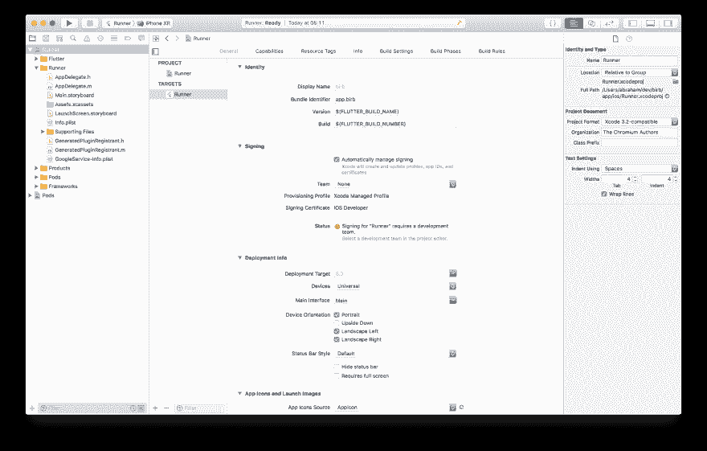
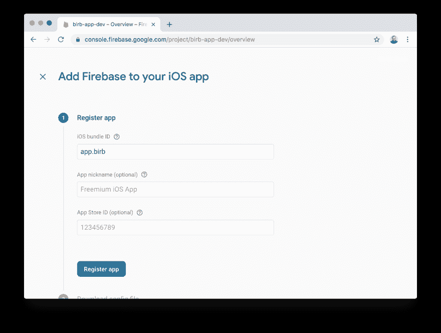
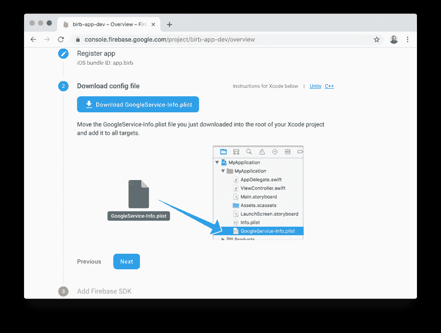

# 动荡的一个月:配置 Firebase Auth 以便在 iOS 上登录 Google

> 原文：<https://dev.to/abraham/a-month-of-flutter-configure-firebase-auth-for-sign-in-with-google-on-ios-3n34>

*最初发表于[bendyworks.com](https://bendyworks.com/blog/a-month-of-flutter-configure-sign-in-with-google-ios)。*

昨天我在安卓系统上配置了谷歌登录。今天的情况大同小异，但在 iOS 领域。

从`app`目录，我运行`open ios/Runner.xcworkspace`在 Xcode 中打开 iOS 项目。然后在 Xcode 中，我选择了左边栏中“项目导航器”下的[“跑步者”,然后选择了主内容区中“目标”下的“跑步者”。这里我将“包标识符”设置为`app.birb`。](https://codelabs.developers.google.com/codelabs/flutter-firebase/index.html#6)

[](https://res.cloudinary.com/practicaldev/image/fetch/s--HXgrp5Vv--/c_limit%2Cf_auto%2Cfl_progressive%2Cq_auto%2Cw_880/https://thepracticaldev.s3.amazonaws.com/i/2q0oqhz5e7qrpj69xxw1.png)

使用昨天的开发 [Firebase 项目](https://firebase.google.com/)，我使用相同的捆绑 ID 添加了一个新的 iOS 应用程序。

[](https://res.cloudinary.com/practicaldev/image/fetch/s--W9IhvWGH--/c_limit%2Cf_auto%2Cfl_progressive%2Cq_auto%2Cw_880/https://thepracticaldev.s3.amazonaws.com/i/qaow9smxq9ck8ex5azvw.png)

然后 Firebase 提示我下载一个`GoogleService-Info.plist`文件。

[](https://res.cloudinary.com/practicaldev/image/fetch/s--Ecin6MZc--/c_limit%2Cf_auto%2Cfl_progressive%2Cq_auto%2Cw_880/https://thepracticaldev.s3.amazonaws.com/i/rtba20pse8vuyvrefow9.png)

下载完成后，我将 plist 文件拖到 Xcode“project navigation”侧栏的“Runner”目录中，紧挨着`Info.plist`。通过将它拖到 Xcode 中，它会被注册以便在构建过程中包含。文件中没有任何敏感信息，但对于一个开源项目来说，每个开发人员需要不同的信息，所以我将它添加到`.gitignore`。

[](https://res.cloudinary.com/practicaldev/image/fetch/s--HXgrp5Vv--/c_limit%2Cf_auto%2Cfl_progressive%2Cq_auto%2Cw_880/https://thepracticaldev.s3.amazonaws.com/i/2q0oqhz5e7qrpj69xxw1.png)

然后我跳过了第三步“添加 Firebase SDK”和第四步“添加初始化代码”。

从到`ios/Runner/Info.plist`有一个[的重要变化:配置一个`CFBundleURLSchemes`。该值可以从`GoogleServiceInfo.plist`文件中复制。我不想硬编码，但我目前没有更好的选择。](https://pub.dartlang.org/packages/google_sign_in#ios-integration)

```
<array>
  <dict>
    <key>CFBundleTypeRole</key>
    <string>Editor</string>
    <key>CFBundleURLSchemes</key>
    <array>
      <!-- Copied from GoogleServices-Info.plist key REVERSED_CLIENT_ID -->
      <string>com.googleusercontent.apps.483795507272-cavro2su6d78ldumt6003lo2krdrb2dd</string>
    </array>
  </dict>
</array>
~~~

Starting the app should give Firebase the all set signal.


And the Sign in with Google button still doesn't do anything but maybe tomorrow it really will.

## Code changes

- [#47 Configure Firebase Auth iOS](https://github.com/abraham/birb/pull/47) 
```

Enter fullscreen mode Exit fullscreen mode