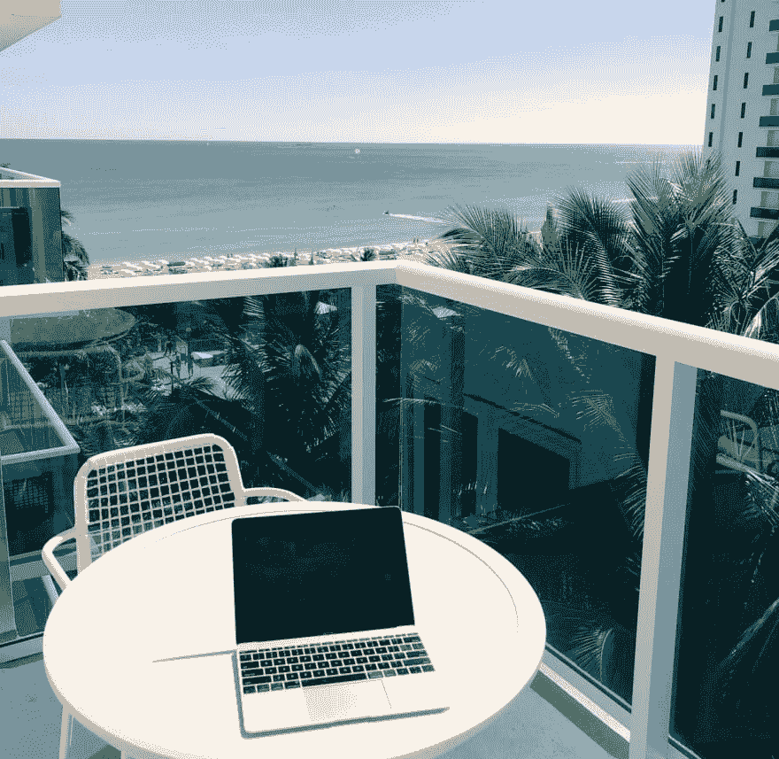

# 在家工作最好的远程工作是令人愉快的乏味

> 原文：<https://dev.to/ben/the-best-remote-work-is-delightfully-unglamorous-4h5f>

这是我今天在推特上看到的:

> 布里安·凯莫💬[@ briannekimmel](https://dev.to/briannekimmel)远程工作是我最喜欢的工作2018 年 12 月 17 日下午 17:48

布里安庆祝这种情况有多棒是对的。如果你必须工作，你最好在一个极好的环境中工作。从我个人对她的了解来看，她在这里过着最好的生活，这很好。

但对我来说，这不是远程工作的理想目标。我目前在我的家庭办公室工作。我无聊的家庭办公室。

我的设置最棒的一点是，所有的东西都插上了电源，我所有的音频/视频都工作正常，我每天都有相同的设置。最棒的是，我不用通勤，真的可以像我想的那样高效。“从任何地方”进行远程工作都很难取得成功。

我可以在 95%的时间里，坐在同一张桌子前，连接着相同的外围设备，进行大幅优化。

有关“为 95%优化”的更多信息，请点击此处:

 [## 为 95%而不是 5%优化您的编程决策

### nick Janetakis 12 月 5 日 186 分钟阅读

#beginners #devops #productivity #webdev](/nickjj/optimize-your-programming-decisions-for-the-95-not-the-5-2n42)

我发现自己有 5%的时间远离这种设置，仍然完全处于工作模式，这是一个相当不理想的场景。这可能是令人愉快的，但这些天我努力让它成为一个有计划的例外。

关于远程设置的具体建议，有很多很棒的帖子:

 [## 作为一名远程开发人员，我从八年的经历中学到了什么

### 伊万内托 6 月 10 日 189 分钟阅读

#career #remote #beginners #remotelife](/ivancrneto/what-i-have-learned-from-eight-years-of-being-a-remote-developer-3eob) [## 6 个月的远程工作教会了我一些东西

### 彼得·安吉拉

#career #communication #productivity #devtips](/peteranglea/6-months-of-working-remotely-taught-me-a-thing-orten)

他们中的许多人倾向于触及设备和设置。其他建议通常围绕沟通和团队合作。无论哪种方式，它都不容易，一致的，优化的家庭设置对我来说似乎是关键。

我们的社区中有数字游牧者，看到他们如何组织自己是很有趣的:

## 文章不再可用

如果你想走这条路，你的 95%优化将是一个完全不同的方法。如果你想把工作做好，我建议不要半途而废。

这里有一篇关于为你自己创造一个伟大的开发者体验的重要任务的好文章:

 [## 如何改善你的开发体验

### 尼克·卡尔尼克 9 月 22 日 185 分钟阅读

#beginners #career #development #productivity](/theoutlander/how-to-improve-your-development-experience-ldl)

话语很重要。我们*是一个分布式团队*，而不是*有远程工作人员*。这是整个团队的标志，即使是那些在我们位于布鲁克林的办公室工作的人。

这是一种很好的工作方式，而且平淡无奇。快乐编码。