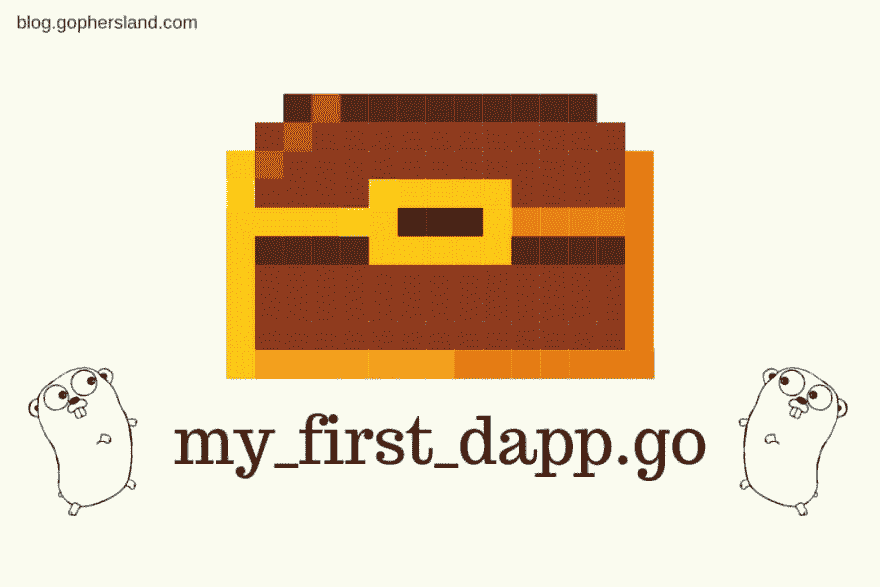

# 新教程:在 GoLang 开发您的第一个区块链程序

> 原文：<https://dev.to/web3coach/new-tutorial-develop-your-1st-blockchain-program-in-golang-1eh8>

一个充满围棋编程的周末！

多么疯狂的周末。周四刚纹了第一个纹身，然后花了整个周末为你们地鼠写了一个新教程！

更新:

我把教程改成了辅导课。可以在: [https://web3.coach](https://web3.coach) 申请