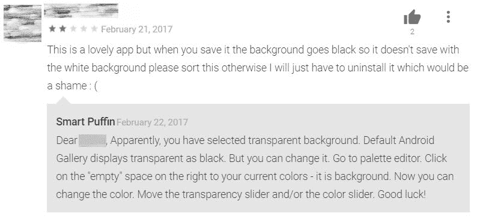
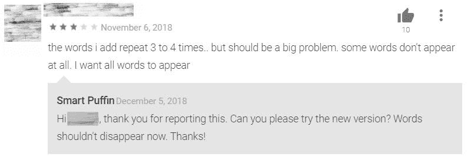
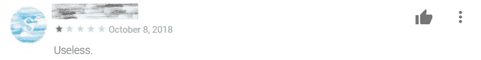
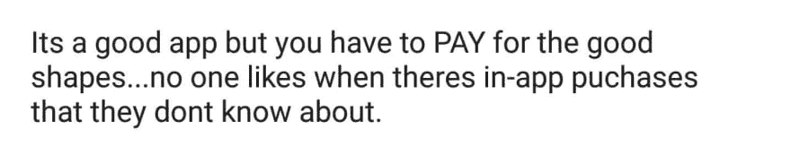
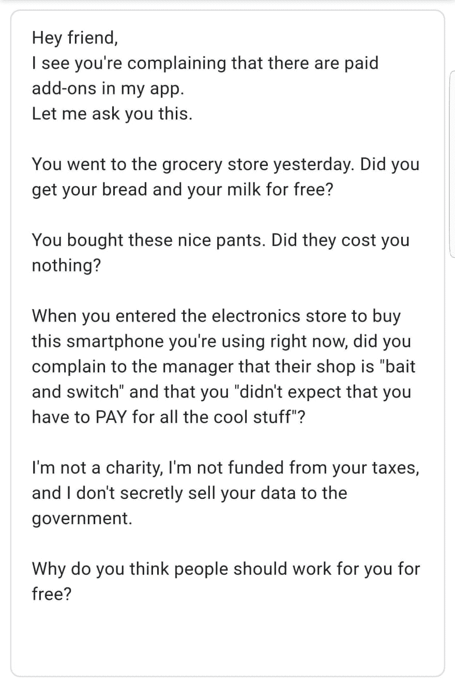
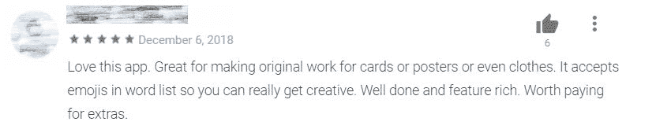

# 我如何处理糟糕的用户反馈

> 原文：<https://dev.to/ice_lenor/how-i-deal-with-bad-user-feedback-3437>

*这篇文章最初发表在我的博客[smartpuffin.com](http://smartpuffin.com/bad-user-feedback/)上。*

* * *

我们都知道这种感觉。你把宝贵的时间花在开发一个牛逼的项目上，把它打磨到完美，小心翼翼地为你的用户铺开。

然后他们告诉你:

> ★☆☆☆嘘！史上最烂应用！请勿使用！！！11

我的 WordCloud 应用程序在 Google Play 上有 170 万用户和 5000 条评论。平均复习分 4.5★。这意味着许多用户喜欢这款应用，但有些用户不喜欢。

我以前害怕差评！第一次是一场噩梦。我害怕阅读所有的评论，害怕会有负面的评论。当我看到一个人时，我常常会花几天时间感到痛苦和不公平。

但我不能永远感到痛苦。所以过了一段时间，我制定了这些规则，并开始遵循它们。

## 建设性的差评

当评论有建设性时，我通常会回复。

如果他们不明白如何使用某个特定的功能，我会为他们写一个说明。

它还可以帮助其他可能遇到相同问题的用户。这是很有价值的反馈——如果很多人不清楚，也许我应该重新考虑这个特性或它的用户界面。

如果他们期望一个不存在的特性，我会解释并承诺将来会考虑。

这并不意味着我会添加所说的功能。或许，不符合我的产品愿景，又或许有技术上的限制。所以我不保证会实施——我只保证会考虑。尽管如此，这仍然是有价值的反馈，有时这些想法真的很好——尽管它们让我难过了一小会儿。

## 破坏性的评论

如果评论是“史上最差应用！！111”，我不回复。回复没有任何意义。我学会了厚着脸皮面对这些类型的评论。有些人就是想在网络上负面。它没有说任何关于你，你的产品，或它的质量。无论如何，对任何应用程序来说，不管它有多棒，总会有一定比例的评论是这样的。

## 抱怨东西不免费的评论

有时唯一的抱怨是应用程序中的一些功能是付费的。

或者像这样:

对于这样的评论，我一般不会回复。我不能以任何方式帮助用户。这只意味着我的产品不适合他们。

我只贴过一次答案，在这里:

## 正面评价

当人们发现我的工作很有用时，我感到很温暖！

对于 Google Play 上的此类评论，我通常会回复“谢谢”或什么都不回复，因为有时候评论太多了——但我真的很感谢它们。

不过我会回复所有的邮件。电子邮件意味着一个人花时间亲自给我发信息，我很感激。

有一次，我甚至从一个快乐的用户那里得到了一份实物礼物。这让我太高兴了！..

## “这与我的应用无关”评论

现在，一个有趣的故事。我有时会得到关于 ***其他*** 应用的差评:)。

有一堆模仿我的“冒名顶替”应用程序。它们有相同的名字和相似的用户界面，但是充斥着许多烦人的广告，而且经常不起作用。因此，人们下载它们，尝试使用，失败，生气，并为我的应用程序键入评论，因为当你搜索“词云”时，它在 Google Play 中位于顶部。

我甚至收到了一些在其他平台***上使用这些冒名顶替者应用程序的人的电子邮件，比如 iOS，而我的应用程序只支持 Android。(目前为止。)***

我对这些评论或这些应用程序无能为力——谷歌和苹果在对抗它们方面帮不上什么忙。我感到安慰的是，我的应用程序太棒了，值得复制:)。