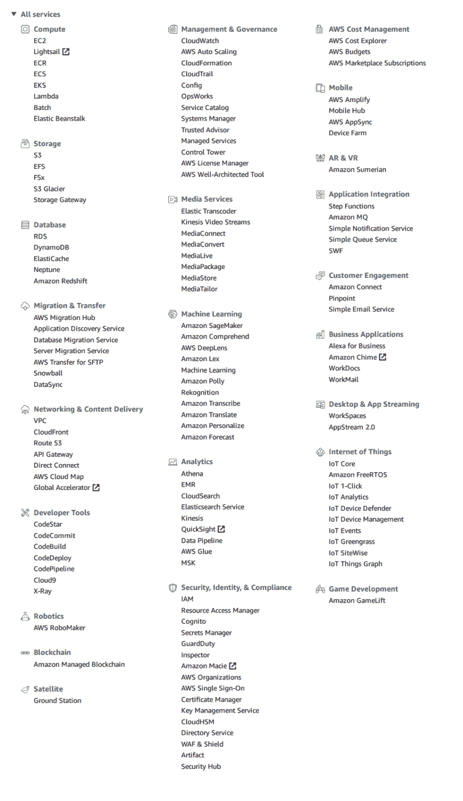

# AWS API + CLJS

> 原文：<https://dev.to/royalaid/aws-api--lambda--cljs-29ca>

# 建筑在自己的肩膀上

[之前](https://dev.to/royalaid/cljs-s-lambda-697)我们构建了一个简单的 AWS Lambda。今天，我们将乱搞 AWS 节点 SDK 和 DynamoDB。这篇文章的主要目的是展示 Clojurescript 和 Javascript 之间更严重的互操作。

# AWS 服务

[](https://res.cloudinary.com/practicaldev/image/fetch/s--2rgv3hy6--/c_limit%2Cf_auto%2Cfl_progressive%2Cq_auto%2Cw_880/https://thepracticaldev.s3.amazonaws.com/i/vfypyrxsekhw72m659co.png) 
AWS 为许多不同的业务需求提供了许多服务，入门真的很难。在开始写这个博客之前，每当我需要在工作中使用 AWS 时，我都很紧张。同事们围着无意义的首字母缩略词转来转去。如果你以前没有使用过 AWS,“检查代码管道中的代码构建步骤，看看 S3 或 IAM 是否有问题”是没有意义的。幸运的是，跨越这个障碍真的不需要花超过几个小时的谷歌搜索和四处打探，希望这篇文章能帮助任何试图参与 AWS 生态系统的人。只是为了引导我们的探索，我们将使用 DynamoDB，但如果其他东西看起来很酷，我强烈建议您查看介绍项目和文档！

# 🍖真正的肉🍖

对于这篇博文的示例代码，我移植了 Node SDK 的[创建表](https://docs.aws.amazon.com/amazondynamodb/latest/developerguide/GettingStarted.NodeJs.01.html)、 [CRUD 操作](https://docs.aws.amazon.com/amazondynamodb/latest/developerguide/GettingStarted.NodeJs.03.html)和[删除表](https://docs.aws.amazon.com/amazondynamodb/latest/developerguide/GettingStarted.NodeJs.05.html)。

## 链接到回购

##  [皇家援助](https://github.com/royalaid) / [影子-节点-AWS](https://github.com/royalaid/Shadow-Node-AWS)

<article class="markdown-body entry-content container-lg" itemprop="text">

## [shadow-cljs](https://github.com/thheller/shadow-cljs) 的 Node.js 示例

### 发展

使用热重装进行监视编译:

```
yarn
yarn shadow-cljs watch app
```

开始程序:

```
node target/main.js
```

### 取代

启动一个连接到当前运行程序的 REPL，`app`为`:build-id`:

```
yarn shadow-cljs cljs-repl app
```

### 建设

```
shadow-cljs release app
```

编译到`target/main.js`。

你可能会在[http://doc.shadow-cljs.org/](http://doc.shadow-cljs.org/)上找到更多配置。

### 步伐

*   将`shadow-cljs.edn`添加到配置编译中
*   编译 ClojureScript
*   运行`node target/main.js`启动应用程序并连接重新加载服务器

### 许可证

用它

</article>

[View on GitHub](https://github.com/royalaid/Shadow-Node-AWS)

## 工具

我们显然需要一些工具:

*   [AWS CLI](https://aws.amazon.com/cli/) 我们需要 CLI，因为它为我们提供了进入 AWS 的授权，更多关于设置 CLI 的信息[在此](https://docs.aws.amazon.com/sdk-for-javascript/v2/developer-guide/setting-credentials-node.html)
*   [NPM](https://docs.npmjs.com/downloading-and-installing-node-js-and-npm) / [纱](https://yarnpkg.com/en/)(用于包管理和使用 Shadow-CLJS CLI)
*   [Shadow-CLJS](https://shadow-cljs.github.io/docs/UsersGuide.html#_standalone_via_code_npm_code) (我们选择 CLJS 构建工具主要是因为它让[消费 npm deps 变得超级容易](https://shadow-cljs.github.io/docs/UsersGuide.html#_using_npm_packages))

## CLJS VS JS

###### 注意:我基本上已经将 JS 移植到了它的字面上，但不是惯用的，CLJS 的等价物。我将使用这段代码来帮助更好地理解这两种语言之间的关系，以及如何从另一种语言中调用一种语言。当使用 CLJS 作为主要语言时，我不会*像这样*编码。

在这篇文章中，我将只分解例子`createTable`，因为任何例子之间的唯一区别是`params` var 和`dynamodb` / `docClient` fn 调用。

### JS 为参考

```
var AWS = require("aws-sdk");

AWS.config.update({
  region: "us-west-2",
  endpoint: "http://localhost:8000"
});

var dynamodb = new AWS.DynamoDB();

var params = {
    TableName : "Movies",
    KeySchema: [       
        { AttributeName: "year", KeyType: "HASH"},  //Partition key
        { AttributeName: "title", KeyType: "RANGE" }  //Sort key
    ],
    AttributeDefinitions: [       
        { AttributeName: "year", AttributeType: "N" },
        { AttributeName: "title", AttributeType: "S" }
    ],
    ProvisionedThroughput: {       
        ReadCapacityUnits: 10, 
        WriteCapacityUnits: 10
    }
};

dynamodb.createTable(params, function(err, data) {
    if (err) {
        console.error("Unable to create table. Error JSON:", JSON.stringify(err, null, 2));
    } else {
        console.log("Created table. Table description JSON:", JSON.stringify(data, null, 2));
    }
}); 
```

### CLJS

```
(ns  server.create-table  (:require  ["aws-sdk"  :as  AWS]))  ;; Our var AWS = require statement  (AWS/config.update  #js{:region  "us-east-1"})  ;; first example of js interop, the translates to the AWS.config.update above, the AWS/ bit is used for accessing the CLJS "Namespace" for the AWS SDK  (def  dynamo  (AWS/DynamoDB.  #js{:apiVersion  "2012-08-10"}))  ;; Second example of interop and shows constructor invocation. It can also be written as (def dynamo (new AWS/DynamoDB  #js{:apiVersion "2012-08-10"})) because the . is shorthand for new  ;;Additionally def is the CLJS equivalentish of var but isn't used as often as in Clojure/script  (def  params  (clj->js  {:TableName  "Movies",  :KeySchema  [{:AttributeName  "year",  :KeyType  "HASH"}  {:AttributeName  "title",  :KeyType  "RANGE"}],  :AttributeDefinitions  [{:AttributeName  "year",  :AttributeType  "N"}  {:AttributeName  "title",  :AttributeType  "S"}],  :ProvisionedThroughput  {:ReadCapacityUnits  10,  :WriteCapacityUnits  10}}))  (defn  invoke  []  (.createTable  dynamo  params  #(if  %1  (js/console.error  "Unable to create table. Error JSON:"  (js/JSON.stringify  %1  nil  2))  (js/console.log  "Created table. Table description JSON:"  (js/JSON.stringify  %2  nil  2)))))  ;; This is the one difference from the AWS example code above, the actual call to AWS is wrapped in a function so it can be call from node.js proper. 
```

这种模式贯穿了其余所有的例子。

## Node.js REPL 来电

如果你想自己测试代码，你可以从一个节点调用

```
npx shadow-cljs compile app
cd target
node 
```

然后在 repl 中一次

```
var m = require('./main.js');
m.aws.createTable() //Other options include getItem, createItem, readItem, deleteTable, deleteItem, updateItem, updateItemConditionally, atomicInc
//Inside of the Shadow-CLJS config is a mapping between the CLJS fn's to the m.aws object 
```

# 🎉🎉🎉

我们做到了！如果您有任何问题或反馈，请联系推特或 Clojurians [Slack](https://clojurians.slack.com/) 或 Zulip 上的 [@royalaid](https://dev.to/royalaid)