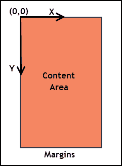
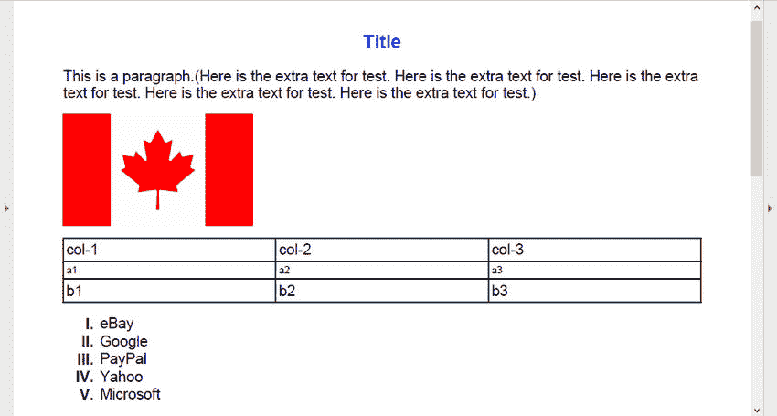

# 以编程方式在 Java 中创建 PDF

> 原文：<https://dev.to/eiceblue/programmatically-create-pdf-in-java-2o6b>

## 概述

Java Spire.PDF 是一个类库，允许你直接从你的 Java 程序创建 PDF 文档，而无需安装任何额外的软件。使用这个库可以很容易地创建 PDF 文件。只需创建一个 *PdfDocument* 对象，根据需要创建尽可能多的 *PdfPageBase* 对象，在页面上绘制字符串、图像、表格、列表和任何其他元素，然后保存文档。

在这篇文章中，我将举例说明如何创建一个包含标题、段落、图像、编号列表和表格的 PDF，以及如何将它们排列在 PDF 页面的适当位置。

## 开始前

从网页[https://www.e-iceblue.com/Download/pdf-for-java.html](https://www.e-iceblue.com/Download/pdf-for-java.html)下载 Java 版 Spire.PDF。下载内容包含两个 jar，应该在 Java 项目中引用它们。

## 坐标系

Spire.PDF 生成的页面由页边距和内容区域组成。坐标系统遵循以下规则。

*   坐标系的原点(0，0)表示内容区域的左上角。
*   x 轴向右延伸，y 轴向下延伸。

[](https://res.cloudinary.com/practicaldev/image/fetch/s--jnfjjz-G--/c_limit%2Cf_auto%2Cfl_progressive%2Cq_auto%2Cw_880/https://thepracticaldev.s3.amazonaws.com/i/2s01a409txk0fe7l4qnl.png)

## 创建自定义函数

Spire.PDF 本身提供了有用的类和方法，如 *PdfPageBase* 类、 *drawString* 方法和 *drawImage* 方法，它们与页面设置一起工作，根据特定坐标编写文本和添加图像。为了使代码更容易阅读，我在下面预定义了五个自定义函数来执行不同的任务。

*   绘图标题

在 PDF 上绘制标题时，您可能需要对齐文本。基于*拉带*创建的 *drawTitle* 函数就是这样一个函数，允许水平对齐文本，例如居中。

```
public static void drawTitle(PdfPageBase page, String text, PdfFont font, PdfBrush brush, float x, float y, PdfTextAlignment alignment) {
    //set the text alignment via PdfStringFormat class
    PdfStringFormat format = new PdfStringFormat();
    format.setAlignment(alignment);
    //draw title on the page
    page.getCanvas().drawString(text, font, brush, x, y, format);
} 
```

*   绘图段落

*drawParagraph* 函数不同于 *drawTitle* ，尽管它们采用相似的参数。这个函数是基于 *PdfTextWidget.draw* 方法创建的，返回一个*pdflayoutsult*类的对象，该对象包含正在绘制的元素的边界信息。通过这样做，您将能够知道当前段落在哪里结束，以及从哪里开始绘制下一段内容。

```
public static PdfLayoutResult drawParagraph(PdfPageBase page, String text, PdfFont font, PdfBrush brush, float x, float y) {
    //create a PdfTextWidget object
    PdfTextWidget widget = new PdfTextWidget(text, font, brush);
    //set the PdfLayoutType to Paginate to make the content paginated automatically
    PdfTextLayout layout = new PdfTextLayout();
    layout.setLayout(PdfLayoutType.Paginate);
    //create a rectangle where the paragraph will be placed
    Rectangle2D.Float rect = new Rectangle2D.Float(0, y, (float) page.getClientSize().getWidth(), (float) page.getClientSize().getHeight());
    //draw paragraph on the page
    PdfLayoutResult layoutResult = widget.draw(page, rect, layout);
    return layoutResult;
} 
```

*   drawImage(绘制图像)

*drawImage* 函数是原始方法的简单重载。这个函数不会返回一个*pdflayoutsult*对象。为了知道下面的内容从哪里开始，你需要通过 *PdfImage* 对象获得图像高度，然后计算 Y 坐标。

```
public static void drawImage(PdfPageBase page, PdfImage image, float x, float y) {
    //draw image on the page
    page.getCanvas().drawImage(image, x, y);
} 
```

*   可拉的

使用 *drawTable* 函数在 PDF 页面上绘制表格时，需要在 String[][]数组中指定表格数据。这个函数还返回一个*pdflayoutsult*对象，帮助我们获得表格的位置和大小。

```
public static PdfLayoutResult drawTable(PdfPageBase page, String[][] dataSource, PdfFont font, float x, float y) {
    //create a PdfTable object
    PdfTable table = new PdfTable();
    //specify cell padding
    table.getStyle().setCellPadding(2);
    //set font
    table.getStyle().getDefaultStyle().setFont(font);
    //fill the table with sample data
    table.setDataSource(dataSource);
    //draw table on the page
    PdfLayoutResult layoutResult = table.draw(page, new Point2D.Float(x, y));
    return layoutResult;
} 
```

*   drawSortedList

最后一个函数 *drawSortedList* 与 *drawTable* 非常相似，除了它采用一些独特的参数，如列表内容、顺序标记和列表缩进。

```
public static PdfLayoutResult drawSortedList(PdfPageBase page, String listContent, PdfOrderedMarker marker, PdfFont font, PdfBrush brush, float x, float y, float indent) {
    //create a sorted list based on the list content
    PdfSortedList sortedList = new PdfSortedList(listContent);
    //set the properties of the list
    sortedList.setFont(font);
    sortedList.setBrush(brush);
    sortedList.setIndent(indent);
    sortedList.setMarker(marker);
    //draw list on the page
    PdfLayoutResult layoutResult = sortedList.draw(page, x, y);
    return layoutResult;
} 
```

## 使用代码

调用这些自定义函数，您将能够在 PDF 页面的适当位置绘制元素。

```
import com.spire.pdf.graphics.*;
import com.spire.pdf.lists.*;
import com.spire.pdf.tables.PdfTable;

import java.awt.*;
import java.awt.geom.Point2D;
import java.awt.geom.Rectangle2D;

public class CreatePdf {

    public static void main(String[] args) {

        //create a PdfDocument object
        PdfDocument doc = new PdfDocument();
        //add a page
        PdfPageBase page = doc.getPages().add();
        //create two solid brushes
        PdfSolidBrush brush1 = new PdfSolidBrush(new PdfRGBColor(Color.BLUE));
        PdfSolidBrush brush2 = new PdfSolidBrush(new PdfRGBColor(Color.BLACK));
        //create two fonts
        PdfFont font1 = new PdfFont(PdfFontFamily.Helvetica, 15f, PdfFontStyle.Bold);
        PdfFont font2 = new PdfFont(PdfFontFamily.Helvetica, 12f);
        //initialize x, y coordinates
        float x = 0;
        float y = 0;
        //title
        String title = "Title";
        //align text to center via PdfTextAlignment class
        PdfTextAlignment alignment = PdfTextAlignment.Center;
        //draw title on the center of the page
        drawTitle(page, title, font1, brush1, (float) page.getClientSize().getWidth() / 2, y, alignment);
        y = y + 30;
        //paragraph text
        String paragraph = "This is a paragraph.(Here is the extra text for test. " +
                "Here is the extra text for test. Here is the extra text for test. " +
                "Here is the extra text for test. Here is the extra text for test.)";
        //draw paragraph on the page
        PdfLayoutResult layoutResult = drawParagraph(page, paragraph, font2, brush2, x, y);
        y = y + (float) layoutResult.getBounds().getHeight() + 10;
        //load an image file
        PdfImage image = PdfImage.fromImage("C:\\Users\\Administrator\\Pictures\\flag-of-Canada.png");
        //draw image on the page
        drawImage(page, image, x, y);
        y = y + (float) image.getPhysicalDimension().getHeight() + 10;
        //define sample data
        String[] data = {"col-1;col-2;col-3",
                "a1;a2;a3",
                "b1;b2;b3"};
        String[][] dataSource = new String[data.length][];
        for (int i = 0; i < data.length; i++) {
            dataSource[i] = data[i].split("[;]", -1);
        }
        //draw Table on the page
        layoutResult = drawTable(page, dataSource, font2, x, y);
        y = y + (float) layoutResult.getBounds().getHeight() + 10;
        //create an order marker
        PdfOrderedMarker marker = new PdfOrderedMarker(PdfNumberStyle.Upper_Roman, new PdfFont(PdfFontFamily.Helvetica, 12f, PdfFontStyle.Bold));
        //define list content
        String listString = "eBay\nGoogle\nPayPal\nYahoo\nMicrosoft";
        //draw list on the page
        drawSortedList(page, listString, marker, font2, brush2, x, y, 10);
        //save to file
        doc.saveToFile("CreatePdf.pdf");
    }

} 
```

生成的 PDF 文件如下所示。
[T3】](https://res.cloudinary.com/practicaldev/image/fetch/s--lVwQGC5q--/c_limit%2Cf_auto%2Cfl_progressive%2Cq_auto%2Cw_880/https://thepracticaldev.s3.amazonaws.com/i/qgvyl8eknuadzqq0wv4c.jpg)