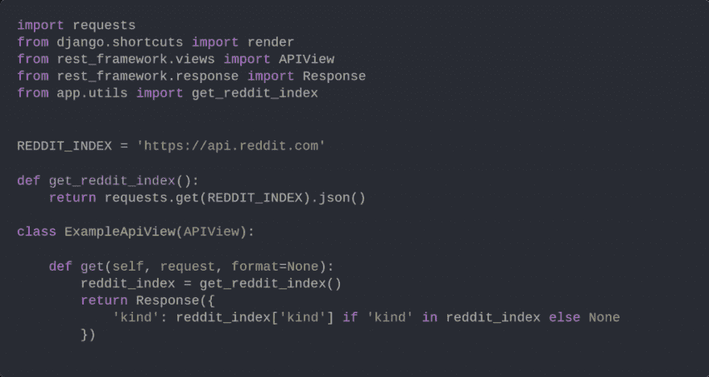
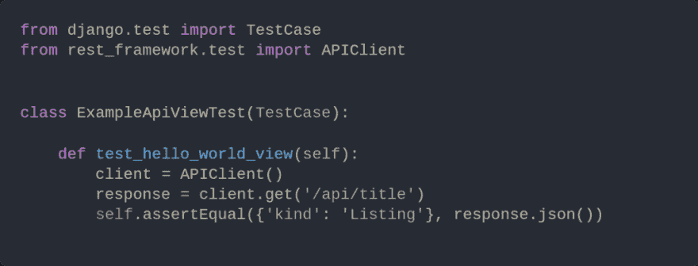
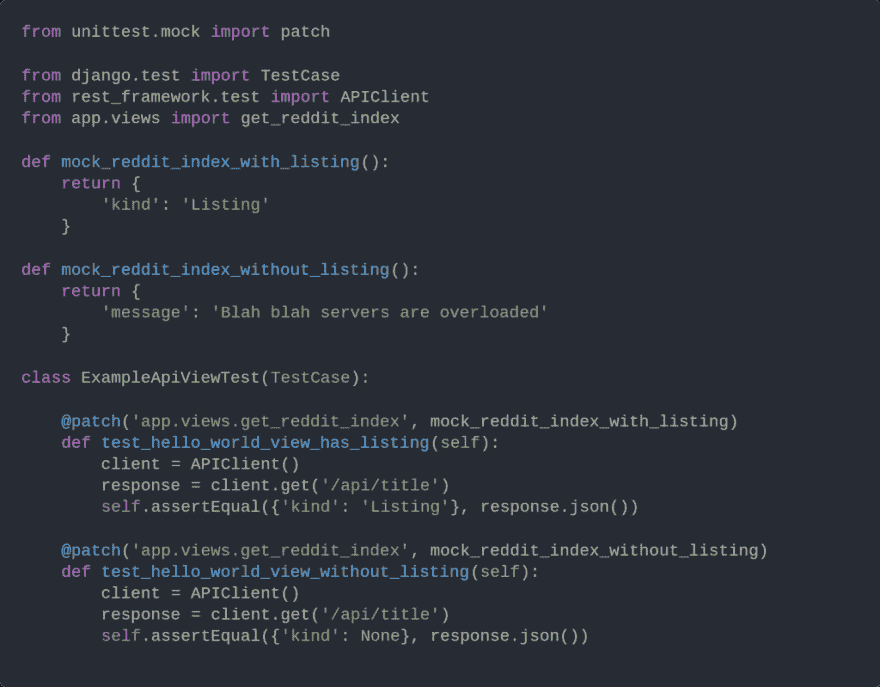

# 使用 Django 和补丁进行有效的 Python API 测试

> 原文：<https://dev.to/zeevo/effective-python-api-testing-using-django-and-patch-1amj>

今天，我想简单展示一下如何有效地测试 Django API。本质上，我们想要实现的是测试和控制我们的应用程序如何处理来自外部 web APIs 的特定响应的能力。一个程序可能会调用几个不同的 API，比如 Reddit 或 Google，我们希望在测试中捕捉这些响应。更重要的是，不管我们使用的 API 的状态如何，我们的测试每次都能通过。

## 如何？

通过使用补丁。

Patch 是库`unittest.mock`中的装饰者。它允许我们用*模拟*对象替换程序中的属性，并断言我们的程序如何运行。让我们来看看。

这里我们有一个使用我的[项目启动器](https://shaneoneill.io/starters/)生成的简单 Django API。它向 Reddit 的 API 查询信息，并向客户机返回一个简单的 JSON 有效负载。

当然，还有一个相应的测试:

但是等等——如果 Reddit 的 API 宕机了怎么办？我们的测试会失败。单元测试不应该因为别人的应用程序而失败。不管其他系统的状态如何，它们应该总是通过。我们也无法可靠地捕捉到(1) Reddit 正常，以及(2) Reddit 关闭。为此，我们需要使用 Patch 通过一个模拟函数来取代我们对 Reddit API 的调用。

让我们使用补丁重写我们的测试:

我们现在再也不会因为外部系统不工作而失败，因为不管实际状态如何，我们的视图总是会收到我们想要测试的内容。

我们可以使用`lambda`关键字来提高模拟的可读性和组织性。我很少发现`lambda`的恰当用法，所以值得强调一下。以下是重新编写的最终测试:

## 我们来总结一下

我们希望在测试中捕获我们的 API 响应。所以我们用了 unittest。然而，有时我们的 API 依赖于其他系统，导致依赖性和间歇性故障的可能性。为了解决这个问题，我们使用补丁。补丁允许我们篡夺底层功能，并实现我们自己的测试功能。然后，我们使用 lambda 关键字来内联定义我们的模拟，以获得更好的可读性。

感谢阅读和快乐的黑客！