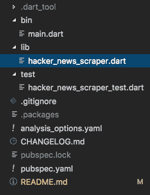
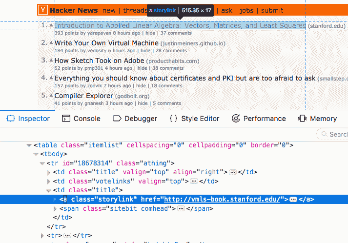
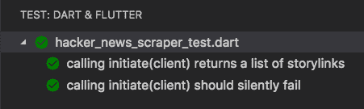

# 用 Dart 编写您的第一个 Web Scraper

> 原文：<https://dev.to/graphicbeacon/write-your-first-web-scraper-with-dart-3nn4>

在本教程中，我们将编写一个 web scraper 来查询 Hacker News 主页上的最新文章列表及其 URL。我们将生成一个 JSON 字符串，其中包含基于抓取数据的结果。我们还将通过一些单元测试来介绍这一点！

这将是一个很好的后续，特别是如果你一直想深入研究 Dart 语言和工具的话。

→ [**获取源代码**](https://github.com/graphicbeacon/hacker_news_scraper)

* * *

## 什么是 Web 刮刀？

网页抓取器指的是执行从网站提取数据的任务的脚本。这通常是通过对网页执行 GET 请求，然后解析 HTML 响应以检索所需内容来实现的。

* * *

## 1。生成控制台项目

为您的项目创建一个目录:

```
$ mkdir hacker_news_scraper && cd hacker_news_scraper 
```

Enter fullscreen mode Exit fullscreen mode

使用 stagehand 包生成控制台应用程序:

```
$ pub global activate stagehand # If you don't have it installed
$ stagehand console-full 
```

Enter fullscreen mode Exit fullscreen mode

在`pubspec.yaml`文件中添加 **http** 和 **html** 依赖:

```
dependencies:
  html: ^0.13.3+3
  http: ^0.12.0 
```

Enter fullscreen mode Exit fullscreen mode

http 包为发出请求提供了一个基于未来的 API。 **html** 包包含使用受 DOM 启发的 API 解析 HTML5 字符串的助手。*是 Python 的 **html5lib** 的一个端口。*

并安装添加的依赖项:

```
$ pub get 
```

Enter fullscreen mode Exit fullscreen mode

正确遵循这些说明应该会给您提供下面的文件/文件夹结构:

[](https://res.cloudinary.com/practicaldev/image/fetch/s--j8TuCbe_--/c_limit%2Cf_auto%2Cfl_progressive%2Cq_auto%2Cw_880/https://thepracticaldev.s3.amazonaws.com/i/7u1010djxf6mt1syb5ii.png)

## 2。实现脚本

清空`lib/hacker_news_scraper.dart`的内容，因为我们将从 scratch☝️开始

导入我们安装的依赖项:

```
import 'dart:convert'; // Contains the JSON encoder

import 'package:http/http.dart'; // Contains a client for making API calls
import 'package:html/parser.dart'; // Contains HTML parsers to generate a Document object
import 'package:html/dom.dart'; // Contains DOM related classes for extracting data from elements 
```

Enter fullscreen mode Exit fullscreen mode

在我们的导入之后创建一个函数来包含我们的逻辑:

```
initiate() async {} 
```

Enter fullscreen mode Exit fullscreen mode

**http** 包包含一个用于进行 http 调用的`Client`类。创建一个实例，并对黑客新闻主页:
执行一个`GET`请求

```
Future initiate() async {
  var client = Client();
  Response response = await client.get('https://news.ycombinator.com');

  print(response.body);
} 
```

Enter fullscreen mode Exit fullscreen mode

为了测试这一点，转到`bin/main.dart`并调用`initiate`方法:

```
import 'package:hacker_news_scraper/hacker_news_scraper.dart' as hacker_news_scraper;

void main(List<String> arguments) async {
  print(await hacker_news_scraper.initiate());
} 
```

Enter fullscreen mode Exit fullscreen mode

运行此文件:

```
$ dart bin/main.dart 
```

Enter fullscreen mode Exit fullscreen mode

以下是回应的摘要:

```
<html op="news"><head><meta name="referrer" content="origin"><meta name="viewport" content="width=device-width, initial-scale=1.0"> 
...
...
<table border="0" cellpadding="0" cellspacing="0" class="itemlist">
              <tr class='athing' id='18678314'>
      <td align="right" valign="top" class="title"><span class="rank">1.</span></td>      <td valign="top" class="votelinks"><center><a id='up_18678314' href='vote?id=18678314&amp;how=up&amp;goto=news'><div class='votearrow' title='upvote'></div></a></center></td><td class="title"><a href="http://vmls-book.stanford.edu/" class="storylink">Introduction to Applied Linear Algebra: Vectors, Matrices, and Least Squares</a><span class="sitebit comhead"> (<a href="from?site=stanford.edu"><span class="sitestr">stanford.edu</span></a>)</span></td></tr><tr><td colspan="2"></td><td class="subtext">
        <span class="score" id="score_18678314">381 points</span> by <a href="user?id=yarapavan" class="hnuser">yarapavan</a> <span class="age"><a href="item?id=18678314">8 hours ago</a></span> <span id="unv_18678314"></span> | <a href="hide?id=18678314&amp;goto=news">hide</a> | <a href="item?id=18678314">37&nbsp;comments</a>              </td></tr>
...
... 
```

Enter fullscreen mode Exit fullscreen mode

为了知道要查找什么，我们需要知道如何选择页面上的链接:

[](https://res.cloudinary.com/practicaldev/image/fetch/s--7fNroTQW--/c_limit%2Cf_auto%2Cfl_progressive%2Cq_auto%2Cw_880/https://thepracticaldev.s3.amazonaws.com/i/qp2s6gl4u051ladda4hw.png)

似乎每个链接都在一个表格单元格中，并且具有类“storylink”。这意味着我们可以使用这个 CSS 选择器来遍历这些:`td.title > a.storylink`

在`lib/hacker_news_scraper.dart`中，我们不用在 initiate 函数中打印响应体，而是使用来自 **html** 包的帮助器来解析响应体并选择元素。

```
Future initiate() async {
  var client = Client();
  Response response = await client.get('https://news.ycombinator.com');

  // Use html parser and query selector
  var document = parse(response.body);
  List<Element> links = document.querySelectorAll('td.title > a.storylink');
} 
```

Enter fullscreen mode Exit fullscreen mode

此时，我们现在有了一个`Element`列表，其中每个元素都是一个`a.storylink`项目。`Element`类型[提供了一个类似于 DOM 的 API](https://pub.dartlang.org/documentation/html/latest/dom/Element-class.html) 。

通过一个`for in`循环，我们可以遍历集合:

```
List<Map<String, dynamic>> linkMap = [];

for (var link in links) {
  linkMap.add({
    'title': link.text,
    'href': link.attributes['href'],
  });
} 
```

Enter fullscreen mode Exit fullscreen mode

并返回一个 JSON 编码的输出:

```
import 'dart:convert'; // Do this at the top of the file

Future initiate() {
  ...
  ...
  return json.encode(linkMap);
} 
```

Enter fullscreen mode Exit fullscreen mode

以下是目前为止的完整脚本:

```
// lib/hacker_news_scraper.dart
import 'dart:convert';

import 'package:http/http.dart';
import 'package:html/parser.dart';
import 'package:html/dom.dart';

Future initiate() async {
  // Make API call to Hackernews homepage
  var client = Client();
  Response response = await client.get('https://news.ycombinator.com');

  // Use html parser
  var document = parse(response.body);
  List<Element> links = document.querySelectorAll('td.title > a.storylink');
  List<Map<String, dynamic>> linkMap = [];

  for (var link in links) {
    linkMap.add({
      'title': link.text,
      'href': link.attributes['href'],
    });
  }

  return json.encode(linkMap);
} 
```

Enter fullscreen mode Exit fullscreen mode

运行这个应该会返回类似下面的 JSON 输出:

```
[
  {
    "title":"Introduction to Applied Linear Algebra: Vectors, Matrices, and Least Squares",
    "href":"http://vmls-book.stanford.edu/"
  },
  {
    "title":"Write Your Own Virtual Machine",
    "href":"https://justinmeiners.github.io/lc3-vm/"
  },
  {
    "title":"Verizon signals its Yahooand AOL divisions are almost worthless",
    "href":"https://www.nbcnews.com/tech/tech-news/verizon-signals-its-yahoo-aol-divisions-are-almost-worthless-n946846"
  },
  ...
  ...
] 
```

Enter fullscreen mode Exit fullscreen mode

## 3。编写单元测试

我们的测试将在`test/hacker_news_scraper_test.dart`进行。将其内容替换为以下内容:

```
import 'dart:convert';

import 'package:test/test.dart';
import 'package:http/http.dart';
import 'package:http/testing.dart';
import 'package:hacker_news_scraper/hacker_news_scraper.dart' as hacker_news_scraper;

void main() {
  // Our tests will go here
} 
```

Enter fullscreen mode Exit fullscreen mode

这是我们第一次测试的样子:

```
void main() {
  test('calling initiate() returns a list of storylinks', () async {
    var response = await hacker_news_scraper.initiate();
    expect(response, equals('/* JSON string to match against */'));
  });
} 
```

Enter fullscreen mode Exit fullscreen mode

我们需要为我们的测试稍微重构我们的解决方案。这是因为编写测试将是古怪的，因为**我们将实际调用**黑客新闻网站。

如果黑客新闻不可用，或者我们没有互联网连接，或者故事列表发生变化(它们会发生变化)，我们的测试就会失败。

让我们重构我们的`initiate()`方法调用，期待一个`client`参数，并删除`var client = Client();`声明:

```
// lib/hacker_news_scraper.dart
initiate(BaseClient client) {
  // var client = Client(); // <- Remove this line
  ...
} 
```

Enter fullscreen mode Exit fullscreen mode

**http** 包为其 http 客户端扩展了一个`BaseClient`类型。这也很有用，因为同一个包提供了另一个子类`MockClient`，用于模拟 HTTP 调用，这对我们的单元测试很有用！

返回到`bin/main.dart`并确保`Client`被传入:

```
import 'package:http/http.dart'; // Import the package first!
import 'package:hacker_news_scraper/hacker_news_scraper.dart' as hacker_news_scraper;

void main(List<String> arguments) async {
  print(await hacker_news_scraper.initiate(Client()));
} 
```

Enter fullscreen mode Exit fullscreen mode

好，回到我们的单元测试。

这是第一个使用我们的`MockClient` :
的测试

```
void main() {
  MockClient client = null;

  test('calling initiate(client) returns a list of storylinks', () async {
    // Arrange
    client = MockClient((req) => Future(() => Response('''
      <body>
        <table><tbody><tr>
        <td class="title">
          <a class="storylink" href="https://dartlang.org">Get started with Dart</a>
        </td>
        </tr></tbody></table>
      </body>
    ''', 200)));

    // Act
    var response = await hacker_news_scraper.initiate(client);

    // Assert
    expect(
        response,
        equals(json.encode([
          {
            'title': 'Get started with Dart',
            'href': 'https://dartlang.org',
          }
        ])));
  });
} 
```

Enter fullscreen mode Exit fullscreen mode

`MockClient`实例将闭包作为第一个参数。这个闭包提供了一个请求对象，如果需要，我们可以操纵它。期望从这个闭包返回一个`Future`对象，这就是我们在这里所做的。当在我们的`await client.get(...)`方法中进行调用时，我们将返回一个 HTML 字符串。

`MockClient`实例还接受第二个参数，一个表示响应状态代码的整数。在这种情况下，它是一个`200 OK`。

然后，我们继续在我们的`MockClient`中传递我们的`initiate()`调用。这意味着我们的测试现在是可预测的，并且可以自信地对响应执行断言。

`expect`和`equals`顶级函数是 Dart 团队的**测试**包的一部分。我们之前安装了它，它列在我们的`pubspec.yaml`文件中的`dev_dependencies:`下。

我们使用`json.encode()`方法作为我们期望从操作中得到的编码 JSON 字符串。

我们可以通过做以下事情来运行这个测试:

```
$ pub run test 
```

Enter fullscreen mode Exit fullscreen mode

下面是解决失败场景的第二个测试:

```
void main() {
  ...
  ...
  test('calling initiate(client) should silently fail', () async {
    // Arrange
    client = MockClient((req) => Future(() => Response('Failed', 400)));

    // Act
    var response = await hacker_news_scraper.initiate(client);

    // Assert
    expect(response, equals('Failed'));
  });
} 
```

Enter fullscreen mode Exit fullscreen mode

再次运行`pub run test`。这将失败。

让我们度过这一关。在我们的`initiate()`方法中，让我们在 GET 调用下面添加这个条件:

```
if (response.statusCode != 200) return response.body; 
```

Enter fullscreen mode Exit fullscreen mode

再次运行测试。都应该过去！

[](https://res.cloudinary.com/practicaldev/image/fetch/s--I4yFi0zR--/c_limit%2Cf_auto%2Cfl_progressive%2Cq_auto%2Cw_880/https://thepracticaldev.s3.amazonaws.com/i/vu8lngo0exjncqkip9xv.png)

## 结论

总而言之，我们使用 Dart 团队提供的 **http** 和 **html** 包构建了一个抓取工具，从黑客新闻网站获取最新的提要。然后，我们通过编写一些单元测试来保护自己。

实际上，使用黑客新闻 API 可能会更好😄。也就是说，对于没有官方 API 来遍历内容的网站，您仍然需要这种方法。

我希望这是有见地的，尤其是在用 Dart 编写测试的领域。

→ [**获取源代码**](https://github.com/graphicbeacon/hacker_news_scraper)

我还经营一个 YouTube 频道，教用户用 Dart 开发全栈应用程序。 [**成为订阅者**](http://bit.ly/fullstackdart) 在新视频发布时接收更新。

最后，我几乎完成了 Egghead.io 上的一个免费飞镖课程，预计将在新年发布🎉，所以请密切注意👁️

**喜欢、分享和[关注我](https://twitter.com/creativ_bracket)T3】😍有关 Dart 的更多内容。**

## 进一步阅读

1.  [**http** :一个可组合的、基于未来的库，用于发出 http 请求](https://pub.dartlang.org/packages/http)
2.  [**html**:Dart 中的 HTML5 解析器](https://pub.dartlang.org/packages/html)
3.  [**免费飞镖截屏在 Egghead.io**](https://egghead.io/instructors/jermaine-oppong)