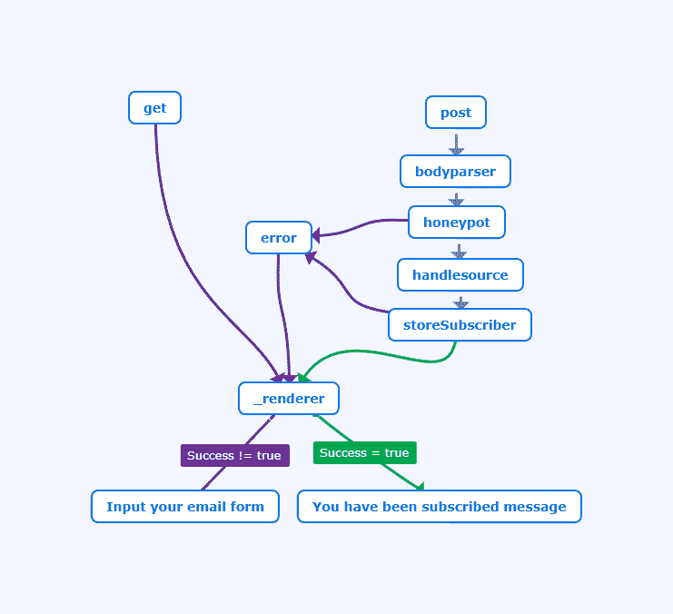

# 《幽灵》中的 XSS

> 原文：<https://dev.to/antogarand/xss-in-ghost-2o6j>

Ghost 是一个专注于出版的平台。它为许多专注于写作的网站提供支持，比如 troyhunt.com 的 [cloudflare 博客](https://blog.cloudflare.com/)、[和 Mozilla VR 博客](https://troyhunt.com)。

由于代码在 [github](https://github.com/TryGhost/Ghost) 上完全开源，我对应用程序进行了安全审计，在订阅功能中发现了一个未经认证的反射 XSS。

打了补丁的版本有`2.4.0`、`1.25.6`和`0.11.14`。如果您运行的是上述修补版本之前的版本，并且启用了订阅者功能，我强烈建议您尽快更新！

这篇文章将从技术上介绍导致这种 XSS 的易受攻击的代码。

# 订户页面中未经认证的 XSS

Ghost 的订阅页面是一个需要通过博客设置中的实验室选项卡手动应用的功能。

更多关于该功能的信息请点击[这里](https://docs.ghost.org/api/handlebars-themes/subscribers/)。

订阅页面容易受到反射 XSS 的攻击，因为可以反射两个已发布的变量:

*   已订阅 _url
*   已订阅 _ 推荐人

这里有一个 POC 表单，用于提醒域，在 demo.ghost.io:

```
<form method="post" action="https://demo.ghost.io/subscribe/" >
   <input type="text" name="confirm" value="x" />
   <input type="text" name="subscribed_url" value="x>" />
   <input type="email" name="email" autofocus="autofocus" value="random@email.invalid"/>
   <button type="submit">POC</button>
</form> 
```

Enter fullscreen mode Exit fullscreen mode

## 漏洞信息

易受攻击的代码在[/core/server/apps/subscribers/lib/helpers/subscribe _ form . js:46](https://github.com/TryGhost/Ghost/blob/2.3.0/core/server/apps/subscribers/lib/helpers/subscribe_form.js#L46)
下

```
hidden: new SafeString(
    makeHidden('confirm') +
    makeHidden('location', root.subscribed_url ? 'value=' + root.subscribed_url : '') +
    makeHidden('referrer', root.subscribed_referrer ? 'value=' + root.subscribed_referrer : '')
) 
```

Enter fullscreen mode Exit fullscreen mode

并在`subscribe_form`模板下渲染，可在[/core/server/helpers/TPL/subscribe _ form . HBS](https://github.com/TryGhost/Ghost/blob/2.3.0/core/server/helpers/tpl/subscribe_form.hbs)获得

SafeString 函数来自[手柄](https://handlebarsjs.com/)，使用户能够将原始的(不安全的)HTML 写入文档。

> [HTML 转义-车把](https://handlebarsjs.com/#html-escaping)
> 车把不会转义车把. SafeString. [...]在这种情况下，您会想要手动转义参数。

在我们的例子中，我们传递的是 [makeHidden](https://github.com/TryGhost/Ghost/blob/2.3.0/core/server/apps/subscribers/lib/helpers/subscribe_form.js#L15) 函数的结果:

```
function makeHidden(name, extras) {
    return templates.input({
        type: 'hidden',
        name: name,
        className: name,
        extras: extras
    });
} 
```

Enter fullscreen mode Exit fullscreen mode

其中 [template.input](https://github.com/TryGhost/Ghost/blob/2.3.0/core/server/helpers/template.js#L30) 是一个 Lodash 模板，没有参数被清理。

```
templates.input = _.template('<input class="<%= className %>" type="<%= type %>" name="<%= name %>" <%= extras %> />'); 
```

Enter fullscreen mode Exit fullscreen mode

对于这个漏洞，extras 参数被染上了`'value=' + root.subscribed_url`，它让我们关闭 input 标签并注入我们自己的 HTML 代码。

## 技术信息

Ghost 将`subsribed_url`和`subscribed_referrer`视为安全变量的原因是这次攻击的有趣之处。

要执行所需的技巧，我们需要了解 Ghost 及其 web 服务器 Express 如何处理请求。

在渲染一个页面之前，ghost 会给一个路径一个要执行的方法列表，每个方法把它的结果发送给下一个。

以下是相关代码，来自[/core/server/apps/subscribers/lib/router . js:98](https://github.com/TryGhost/Ghost/blob/2.3.0/core/server/apps/subscribers/lib/router.js#L98):

```
// subscribe frontend route
subscribeRouter
    .route('/')
    .get(
        _renderer
    )
    .post(
        bodyParser.urlencoded({extended: true}),
        honeyPot,
        handleSource,
        storeSubscriber,
        _renderer
    );

// configure an error handler just for subscribe problems
subscribeRouter.use(errorHandler); 
```

Enter fullscreen mode Exit fullscreen mode

给每个方法的参数是前一个方法的结果或回调参数。

如果参数的类型是`Error`，它将使用`errorHandler`方法，而不是继续下一个方法，然后显示一个错误页面。

下面是 [errorHandler](https://github.com/TryGhost/Ghost/blob/2.3.0/core/server/apps/subscribers/lib/router.js#L33) 函数:

```
function errorHandler(error, req, res, next) {
    req.body.email = '';

    if (error.statusCode !== 404) {
        res.locals.error = error;
        return _renderer(req, res);
    }

    next(error);
} 
```

Enter fullscreen mode Exit fullscreen mode

如您所见，`get`、`post`和`error`路线以相同的`_renderer`方法结束，该方法呈现相同的模板。

订户表单是所有状态使用的模板，有两种状态:

*   一个空状态，带有“输入您的电子邮件”表单。它可能包含错误，如“无效的电子邮件”，以及其他分析内容，如推荐人。
*   发布带有“成功订阅”消息的电子邮件后的填充状态。

可以在[/core/server/apps/subscribers/lib/views/subscribe . HBS:47-68](https://github.com/TryGhost/Ghost/blob/2.3.0/core/server/apps/subscribers/lib/views/subscribe.hbs#L47):
下找到

```
{{^if success}}
    <header>
        <h1>Subscribe to {{@blog.title}}</h1>
    </header>

    {{subscribe_form
        // arguments
    }}
{{else}}
    <header>
        <h1>Subscribed!</h1>
    </header>
    <!-- ... -->
{{/if}} 
```

Enter fullscreen mode Exit fullscreen mode

下面是可视化的工作流程:
[](https://res.cloudinary.com/practicaldev/image/fetch/s--xvgawzsq--/c_limit%2Cf_auto%2Cfl_progressive%2Cq_auto%2Cw_880/https://thepracticaldev.s3.amazonaws.com/i/iep0l10ql9fh9f2m77bp.png)

由于我们被污染的参数被呈现为表单中的隐藏输入，我们需要欺骗服务器在使用我们的 POST 值时呈现输入表单。

呈现易受攻击参数的条件是`success`变量，该变量检查保存新订户时是否出现任何错误。

发帖子的时候，第一个调用的方法是`bodyParsed.urlencoded`，它把我们的身体转换成一个 JavaScript 对象。

第二种方法是[蜜罐](https://github.com/TryGhost/Ghost/blob/2.3.0/core/server/apps/subscribers/lib/router.js#L45)，对这次攻击至关重要。

```
function honeyPot(req, res, next) {
    if (!req.body.hasOwnProperty('confirm') || req.body.confirm !== '') {
        return next(new Error('Oops, something went wrong!'));
    }

    // we don't need this anymore
    delete req.body.confirm;
    next();
} 
```

Enter fullscreen mode Exit fullscreen mode

由于表单有一个隐藏的`confirm`参数，它将确保该参数存在并且其值为空。我推测这是为了防止自动机器人过于频繁地填写垃圾表格。

如果不满足这些条件，它会调用`next`并给出错误消息`Oops, something went wrong!`。由于这是一个错误对象，express 将停止调用下一个方法，转而使用一个 errorHandler。

如果我们没有触发这个错误，并使用正常的工作流，将调用 [handleSource](https://github.com/TryGhost/Ghost/blob/2.3.0/core/server/apps/subscribers/lib/router.js#L58) 函数，并执行以下逻辑:

```
function handleSource(req, res, next) {
    req.body.subscribed_url = santizeUrl(req.body.location);
    req.body.subscribed_referrer = santizeUrl(req.body.referrer);

    delete req.body.location;
    delete req.body.referrer;

    // ...

    next();
} 
```

Enter fullscreen mode Exit fullscreen mode

正如您所看到的，它会用已提交值的净化版本覆盖`subscribed_url`和`subscribed_referrer`。

由于我们没有调用这个方法，而是采用了蜜罐诱饵，我们对`subscribed_url`的取值没有经过净化。

因此，当给“确认”输入一个值时，我们可以呈现表单的正确部分，因为将发送一个错误，该错误将变量`success`设置为`false`。

由于相同的`_renderer`方法被用于所有三个场景，即`get`、`post`和`errors`，它确实向模板提供了请求体，即使我们处于错误场景中。

一旦我们得到表单的渲染代码`subscribe_form.js`，我们的上下文现在就有了之前抛出的错误，还有所有未初始化的提交变量。

结合这个脆弱的模板，我们现在有了反射 XSS 所需的所有步骤！

## 漏洞摘要

与常规途径不同，采用蜜罐诱饵导致的错误不会去除或净化我们的变量。

这导致页面中的被污染变量被打印出来，并引起 XSS 反射！

## 时间轴

*   2018/07/12:原始披露
*   2018/07/17:承认问题:他们提到了 6-8 周的修复时间表。
*   2018/09/01:询问最新情况
*   2018/09/05:他们提到票在他们的错误跟踪平台中丢失了。
*   2018/09/29: [提交部分修复](https://github.com/TryGhost/Ghost/commit/305d13e5c)
*   2018/09/30:针对版本`2.4.0`发布的修复
*   2018/10/07:针对版本`1.25.6`和`0.11.14`发布的修复
*   2018/11/19:通知他们部分、极低风险的旁路。给他们发了我的永久修复建议。

请注意，我从未收到更新，因为他们承认门票丢失，仍然没有听到他们的这一天。

还要注意，Ghost 没有 bug 悬赏计划，所以我没有收到这个漏洞的悬赏。

## 补丁和部分旁路

该漏洞的补丁是[下面的](https://github.com/TryGhost/Ghost/commit/305d13e5c) :

```
function errorHandler(error, req, res, next) {
    req.body.email = '';
    req.body.subscribed_url = santizeUrl(req.body.subscribed_url);
    req.body.subscribed_referrer = santizeUrl(req.body.subscribed_referrer);
    // ... 
```

Enter fullscreen mode Exit fullscreen mode

Ghost 在`errorHandler`上增加了[sanitieurl](https://github.com/TryGhost/Ghost/blob/2.4.0/core/server/apps/subscribers/lib/router.js#L56)验证。

```
function santizeUrl(url) {
    return validator.isEmptyOrURL(url || '') ? url : '';
} 
```

Enter fullscreen mode Exit fullscreen mode

其中`isEmptyOrUrl`通过[验证器](https://www.npmjs.com/package/validator) npm 包检查 URL 是否有效，ghost 检查`isEmpty`部分，如果不为空则调用[验证器](https://www.npmjs.com/package/validator)的`isUrl`方法。

你可能会告诉自己:

> 嘿！一个 url 仍然可以包含一个 XSS，`http://test.com/#><script>`是一个有效的 URL！

你是对的！

从技术上讲，哈希之后的几乎所有内容都是有效的 url，可以包含空格和其他符号。

这在这种情况下不起作用，因为验证器包不允许使用`<>`字符。

支票的相关部分在这里是:

```
export default function isURL(url, options) {
  assertString(url);
  if (!url || url.length >= 2083 || /[\s<>]/.test(url)) {
    return false;
  }
  if (url.indexOf('mailto:') === 0) {
    return false;
  }
  // ... 
```

Enter fullscreen mode Exit fullscreen mode

regex 确保我们不会在 url 中发送小于或大于符号，不管它在哪里。

但是我们能做的是在值中添加空格、引号和其他字符，为标签添加属性。

如果我们看一下注入内容的 HTML:

```
<input class="location" type="hidden" name="location" value=OUR_URL /> 
```

Enter fullscreen mode Exit fullscreen mode

逃避`value`属性是微不足道的。因为该值没有引号，所以添加一个空格是有效的。

如果有引号，由于我们的内容没有对属性位置进行净化，我们可以添加一个引号并继续。

它不像以前那样是一个完整的 XSS 的原因是因为输入类型。

对于常规输入，我们可以将其修改为如下形式:

```
<input class="location" type="text" name="location" value=x  onfocus="alert(document.domain)" autofocus /> 
```

Enter fullscreen mode Exit fullscreen mode

这会触发警报。但是对于一个隐藏的输入，因为它是隐藏的，所以我们不能关注它。这使得拥有一个 XSS 变得更加困难，并且与以前的版本不同，生成的 XSS 需要用户操作。

Garet Hayes 在 PortSwigger 博客上发表了一篇很棒的博文:[隐藏输入字段](https://portswigger.net/blog/xss-in-hidden-input-fields)中的 XSS，其中设置一个`accesskey`属性并触发它确实会启动`onclick`事件，即使该事件是隐藏的。

这里有一个概念证明:

```
<input type="hidden" accesskey="X" onclick="alert(1)"> 
```

Enter fullscreen mode Exit fullscreen mode

有了这个输入，当用户按下 OSX 上的`ALT+SHIFT+X`或`CMD+ALT+X`时，警报就会启动。

这使得它作为输入几乎没有价值，因为用户没有机会手动按下这些键，但它仍然是一个反射的 XSS。

我已经在 11 月 19 日通知了 ghost 此旁路以及推荐的解决方案，但从未收到答复。

# 结论

与 WordPress 和 Joomla 等其他大型内容管理系统不同，Ghost 以出版商为中心，网站上的大多数访问者都没有帐户。在其他 CMS 上，有插件可以创建新的功能，如创建电子商务网站、允许评论或撰写自己的帖子，这允许用户创建帐户。

这将攻击范围限制在公共内容，这在默认情况下会更加安全，因为您不能以访客身份访问大多数内部 API。

总的来说，虽然安全团队确实花了很长时间来解决这个问题，并使用了一个薄弱的解决方案，但来自外部攻击者的应用程序的安全性相当好，因为范围非常有限。

* * *

如果您想了解更多关于安全的知识并了解我的出版物的最新消息，请在 Twitter 上关注我！

下一个帖子将是关于**在 Dev.to** 上多次存储 XSS，是发布平台的一个逻辑 bug 导致的。

* * *

如果你能在任何平台上提供私人节目的邀请，请随时向我发送邀请！你可以通过 twitter 联系我，DM 是开放的。