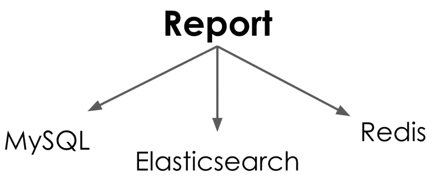

# 防止无用的数据库点击

> 原文：<https://dev.to/molly/preventing-useless-database-hits-2f50>

读完这篇文章的标题后，你们中的许多人可能会想...

[](https://res.cloudinary.com/practicaldev/image/fetch/s--2wlO4Fau--/c_limit%2Cf_auto%2Cfl_progressive%2Cq_66%2Cw_880/https://thepracticaldev.s3.amazonaws.com/i/3xoyf0xcrrhpfn8oja1c.gif)

我已经知道怎么做了。但是让我们等一下，因为它可能没有你想的那么明显。例如，你们中有多少人写过这样的代码？我知道我有！

```
User.where(:id => user_ids).each do |user|
  # Lots of user processing 
end 
```

Enter fullscreen mode Exit fullscreen mode

这段代码看起来很不错，对吧？如果没有 user _ ids，这个块将跳过所有的用户处理。这似乎是一个很好的交易，所以它一定很好。不幸的是，这种假设并不完全正确。我来解释一下原因。

当您执行 where 子句**时，即使数组**为空，实际上也会影响 MySQL。

```
(pry)>  User.where(:id => [])
User Load (1.0ms)  SELECT `users`.* FROM `users` WHERE 1=0 =>  [] 
```

Enter fullscreen mode Exit fullscreen mode

注意 SQL 末尾的`where 1=0`语句。这就是 ActiveRecord 确保不返回任何记录的方式。当然，这是一个快速的`1ms`查询，但是如果您正在执行这个代码块数百万次，那么这个快速查询很容易淹没您的数据库并降低您的速度。那么，如何更新这些代码以提高性能呢？

你有两个选择。第一种方法是，除非万不得已，否则不要运行 MySQL 查找。你可以在执行代码块之前用 Ruby 做一个简单的数组检查。

```
return unless user_ids.any?
User.where(:id => user_ids).each do |user|
  # Lots of user processing 
end 
```

Enter fullscreen mode Exit fullscreen mode

通过这样做，您可以避免无用的数据库访问，并确保您的数据库不会被无用的调用淹没。此外，这也将加快你的代码。假设您运行这个代码 10k 次。运行 MySQL lookup 10k 次需要半秒多的时间。

```
(pry)> Benchmark.realtime do                                                           
>   10_000.times { User.where(:id => []) }                                                    
> end                                                                                          
=> 0.5508159045130014 
```

Enter fullscreen mode Exit fullscreen mode

相反，如果您跳过 MySQL 查询，首先检查是否存在任何 user _ ids，那么运行类似的代码块 10k 次只需要不到百分之一秒的时间！

```
(pry)> Benchmark.realtime do                                                           
>   10_000.times do                                                                            
>       next unless ids.any?                                                                     
>       User.where(:id => [])                                                                   
>   end                                                                                        
> end                                                                                          
=> 0.0006368421018123627 
```

Enter fullscreen mode Exit fullscreen mode

如您所见，不必要地访问 MySQL 次和执行普通的 Ruby 10k 次之间有很大的时间差。这种差异会对应用程序的性能产生重大影响。很多人会看这段代码

```
User.where(:id => user_ids).each do |user|
  # Lots of user processing 
end 
```

Enter fullscreen mode Exit fullscreen mode

他们说的第一句话是“Ruby 很慢”但是这与事实相去甚远，因为我们刚刚看到纯 Ruby 代码要快几百倍！这种情况下 Ruby 不慢，打数据库慢！在您的代码中留意类似这样的情况，您可能正在进行您不期望的数据库调用。

现在有些人可能会看着这段代码，认为我并没有像那样写代码。实际上，我将一堆作用域链接到我的 where 子句

```
users = User.where(:id => user_ids).active.short.single 
```

Enter fullscreen mode Exit fullscreen mode

所以我需要传递空的 user _ ids 数组，否则作用域链会中断。幸运的是，尽管 ActiveRecord 不能很好地处理空数组，但它确实为您提供了一个处理空范围的选项，那就是 none 范围。

[](https://res.cloudinary.com/practicaldev/image/fetch/s--n8i2WnuY--/c_limit%2Cf_auto%2Cfl_progressive%2Cq_auto%2Cw_880/https://thepracticaldev.s3.amazonaws.com/i/bdbygx18s3v7zua0oze8.png)

none 是一个 ActiveRecord 查询方法，它允许您在不查询数据库的情况下返回零记录的可链接关系。让我们来看看它的实际应用。从前面我们知道，带有一组空 id 的 where 子句将命中数据库。

```
(pry)> User.where(:id => []).active.tall.single
  User Load (0.7ms)  SELECT `users`.* FROM `users` WHERE 1=0 AND `users`.`active` = 1 AND `users`.`short` = 0 AND `users`.`single` = 1
=> [] 
```

Enter fullscreen mode Exit fullscreen mode

但是，如果我们将 where 子句替换为 none 作用域，您可以看到没有进行数据库调用，我们仍然可以将作用域链接在一起。

```
(pry)> User.none.active.tall.single
=> [] 
```

Enter fullscreen mode Exit fullscreen mode

在您的框架中寻找这样的工具，它将允许您更智能地处理空数据集。更重要的是，永远不要假设当被要求处理空数据集时，你的框架或 gem 没有进行数据库调用。要想了解更多找到这类电话的技巧，请查看我在日志上的[博客文章。](https://dev.to/molly_struve/live-log-and-prosper--3j65)

## 现实生活应用

这种用 Ruby 来防止数据库命中的概念不仅仅局限于 MySQL 它可以应用于任何类型的数据库！我们在 Kenna 发现它有用的地方是在构建我们称之为报告的时候。每天晚上，我们为客户制作这些彩色的 PDF 报告。

[](https://res.cloudinary.com/practicaldev/image/fetch/s--fWBHAa5l--/c_limit%2Cf_auto%2Cfl_progressive%2Cq_auto%2Cw_880/https://thepracticaldev.s3.amazonaws.com/i/0rdy72pw9sxvi85zrjnx.png)

这些报告从一个报告对象开始，该对象包含构建报告所需的所有信息。然后，为了每天晚上构建这个漂亮的报告页面，我们必须发出 20 多个 Elasticsearch 请求，同时向 Redis 和 MySQL 发出多个请求。

[](https://res.cloudinary.com/practicaldev/image/fetch/s--5u7RWpwr--/c_limit%2Cf_auto%2Cfl_progressive%2Cq_auto%2Cw_880/https://thepracticaldev.s3.amazonaws.com/i/2rsmt06p1z3uculoqlmm.png)

我们做了很多工作来确保所有这些请求都非常快，但是我们仍然花了几个小时来构建报告。最终，保存的报告数量增长太多，以至于我们整晚都无法完成它们。当我和我的团队开始试图找出如何解决这个问题时，我们做的第一件事就是跳进一个控制台，仔细查看我们现有的报告包含了哪些数据。经过一番挖掘，我们发现在我们系统中的 25，000 份报告中，超过三分之一是空白的！！！

```
(pry)> Report.blank_reports.count
=> 10805 
```

Enter fullscreen mode Exit fullscreen mode

这意味着它们不包含任何数据，如果报告不包含任何数据，那么当我们知道它们不会返回任何数据时，发出所有这些 Elasticsearch、MySQL 和 Redis 请求还有什么意义呢？

[](https://res.cloudinary.com/practicaldev/image/fetch/s--z63fKn2I--/c_limit%2Cf_auto%2Cfl_progressive%2Cq_66%2Cw_880/https://thepracticaldev.s3.amazonaws.com/i/5dxhfh04ah6wh9np1nob.gif)

灯泡！如果报告是空的，不要点击数据库！通过跳过没有数据的报告，我们将处理时间从 10 多个小时的**减少到 3 个**。通过添加一行简单的红宝石

```
def build(report)
  return if report.blank?
  # Processing
end 
```

Enter fullscreen mode Exit fullscreen mode

我们能够防止一堆毫无价值的数据库点击，这反过来大大加快了我们的处理速度。这种使用 Ruby 屏蔽数据库请求的策略，我喜欢称之为使用**数据库防护。实际上这很简单，但我认为这是你写代码时最容易忽略的事情之一。每个数据库命中都在使用资源，所以让它们都有价值！**

*如果你对使用 Ruby checkout 防止数据库命中的其他方法感兴趣，我的[缓存为王](http://confreaks.tv/videos/rubyconf2018-cache-is-king-get-the-most-bang-for-your-buck-from-ruby)来自 RubyConf 的演讲启发了这篇文章。*