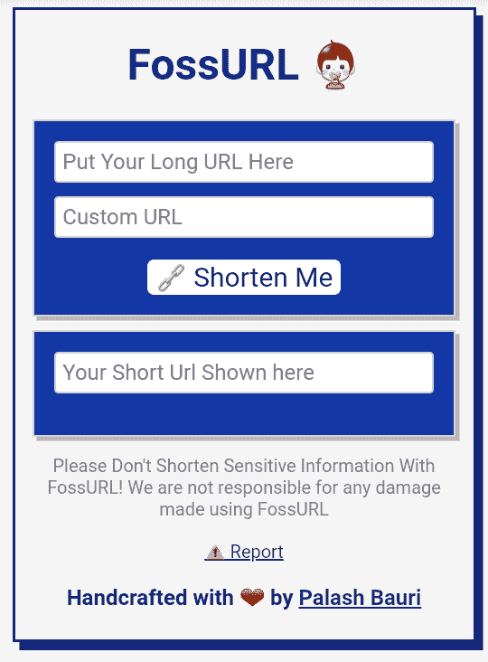

# 在 jsonstore.io : FossURL 的帮助下，它甚至可以托管在 GitHub 页面上

> 原文：<https://dev.to/bauripalash/a-url-shortener-which-can-be-even-hosted-on-github-pages--fossurl-17hi>

你们还记得我以前的文章吗:

 [## 只用 HTML 和 Javascript 构建一个简单的网址缩写器

### 帕拉什·鲍里👻8 月 16 日 187 分钟读取

#urlshortener #javascript #html](/bauripalash/building-a-simple-url-shortener-with-just-html-and-javascript-16o4)

在那篇文章中，我讨论了用 **jsonstore.io 作为数据库**构建自己的 URL Shortener，它甚至可以托管在任何静态站点托管服务上，甚至在 GitHub/GitLab 页面中。

实际上在写那篇文章之前，我构建了一个名为 **FossURL** 的 URL 缩短器，这篇文章包含了最少的代码块来构建你自己的 URL 缩短器的基本框架。

##  [ bauripalash ](https://github.com/bauripalash) / [ fossurl](https://github.com/bauripalash/fossurl)

### 您自己的 Url Shortner，没有任何花哨的服务器端处理和自定义 Url 支持，甚至可以托管在 GitHub 页面上

<article class="markdown-body entry-content container-lg" itemprop="text">

 

#### [<g-emoji class="g-emoji" alias="globe_with_meridians" fallback-src="https://github.githubassets.cimg/icons/emoji/unicode/1f310.png">🌐</g-emoji>打开 fossurl 网站](https://palashbauri.in/fossurl)

### 什么是 Fossurl

Fossurl 是一个简单的 url 缩短器，可以免费托管在 Github/Gitlab 页面或静态站点托管服务中，并且不需要您购买任何服务器！

### <g-emoji class="g-emoji" alias="dart" fallback-src="https://github.githubassets.cimg/icons/emoji/unicode/1f3af.png">🎯</g-emoji>目标

实现一个简单的 URL Shortner，它可以在不需要任何服务器端处理的情况下使用，并且**可以托管在静态站点主机上，例如 GitHub/Gitlab 页面**

### <g-emoji class="g-emoji" alias="computer" fallback-src="https://github.githubassets.cimg/icons/emoji/unicode/1f4bb.png">💻</g-emoji>堆栈

*   超文本标记语言
*   半铸钢ˌ钢性铸铁(Cast Semi-Steel)
*   Java Script 语言
*   数据库: [jsonbox.io](https://jsonbox.io) (以前使用 jsonstore，但几次停机迫使我改用 jsonbox)

### <g-emoji class="g-emoji" alias="hammer_and_wrench" fallback-src="https://github.githubassets.cimg/icons/emoji/unicode/1f6e0.png">🛠️</g-emoji> 特色

*   它很快
*   它不需要任何托管服务器
*   您只需运行 repo 并运行脚本就可以使用它

## <g-emoji class="g-emoji" alias="ghost" fallback-src="https://github.githubassets.cimg/icons/emoji/unicode/1f47b.png">👻</g-emoji>想要帮助改进它吗？

#### 步骤:

*   叉此回购
*   在你的设备上克隆[或者在 Gitpod 中打开**T3】**](https://gitpod.io/#https://github.com/bauripalash/fossurl)
*   在 Linux 上`cd`到`src`目录，在 Windows 上做任何需要做的事情把目录改成`src`
*   如果你是…

</article>

[View on GitHub](https://github.com/bauripalash/fossurl)

> 甚至这个项目也是产品搜索的趋势。在这些事件之后，我得到了很少的贡献者，并且做了很多改进！😊感谢全 Contributors❤

### 目标是什么？🎯

实际上，我们的目标是构建一个简单的 URL Shortener，它可以由 GitHub 页面托管，不需要任何昂贵的服务器来托管，我知道它不会**超级安全**，因为一切都在客户端完成。

### 灵感是什么？🌠

啊，实际上没有灵感😂我在寻找一个免费的支持自定义域名的网址缩写，最后我找到了一些服务，但发现这些服务有一些限制，如每天有限的链接创建，有限的点击等等！所以，我决定建立我自己的网址缩写器！现在你可以看到结果了！❤

我可以用 Node、Python 或 PHP 来构建，但我想要一些不同但简单的东西。

### 福苏尔不是什么😑

*   超级涡轮硝基迷人的惊人耀眼的快😉
*   宇宙中最安全的网址缩写😉

### 所谓“2.0 版”有什么新内容😎

*   提高速度
*   受**开发到**启发的新用户界面
*   已删除所有第三方库

### 截图🎉

所以，我想今天就够了，请随意为 FossURL 做贡献，❤，你真是太好了

* * *

如果你喜欢我的作品(我的文章、故事、软件、研究等等),考虑给我买一杯☕咖啡🤗