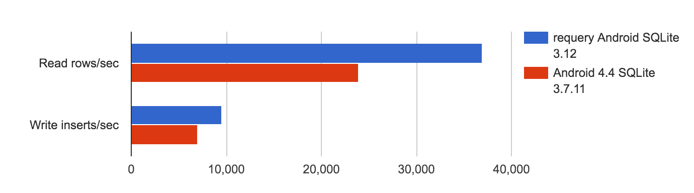

# 制作一个可以在桌面和手机上运行的全文搜索模块(Pt。2)

> 原文：<https://dev.to/craftzdog/making-a-full-text-search-module-that-works-on-both-desktop-and-mobile-pt-2-118l>

[Part 1 在这里](https://dev.to/craftzdog/making-a-full-text-search-module-that-works-on-both-desktop-and-mobile-pt-1-1n9i)。

我是 [Inkdrop](https://inkdrop.app/) 的独立开发者，这是一款面向程序员的减价笔记应用，支持 macOS、windows、linux、android 和 iOS。它是基于桌面平台的 Electron 和移动平台的 React Native 构建的。
正如我在[我们的路线图](https://blog.inkdrop.info/the-roadmap-of-inkdrop-vol-3-a32fc0cc42d)中宣布的那样，我目前正在致力于重建全文搜索功能。

这是我制作进度笔记的第二部分。

* * *

## 在 Android 上使用最新的 SQLite 获得更快的速度

所以 Android 的 sqlite 有点旧，它阻止了我使用 FTS5。但是在这项工作中，让它更有表现力是很重要的。
如何使用..找到了这个:

*   [requery/SQLite-Android:Android SQLite 支持库](https://github.com/requery/sqlite-android)

似乎最新的 SQLite 比内置的要快。听起来不错。

[](https://camo.githubusercontent.com/0e2547cc9b74d87f9f8fccebf2c739e6c7ce6331/687474703a2f2f726571756572792e6769746875622e696f2f73716c6974652d616e64726f69642f706572666f726d616e63652e706e67)

我已经为 react native 做了一个 SQLite 模块:[craftzdog/React-Native-SQLite-2:SQLite 3 Native 插件，用于 iOS、Android 和 Windows 的 React Native。](https://github.com/craftzdog/react-native-sqlite-2)

如果能在我的模块中使用 requery 的 SQLite 库来提高性能，那就太好了。

...在做了一些工作之后，结果是不可能使用，因为`sqlite-android`需要 [`androidx`名称空间](https://developer.android.com/jetpack/androidx/migrate)，但是 react native 使用`android`名称空间。当我试图在 react 本地项目中编译它时，它会产生以下错误:

```
error: cannot access SupportSQLiteDatabase
class file for androidx.sqlite.db.SupportSQLiteDatabase not found 
```

我还发现这个库没有启用 FTS5 扩展进行编译。好吧，我暂时把它放在一边。

## 理解`pouchdb-quick-search`

我需要知道 [pouchdb-quick-search](https://github.com/pouchdb-community/pouchdb-quick-search) 如何维护全文索引。
我猜它在看[变化饲料](https://pouchdb.com/guides/changes.html)。
但是它在哪里存储索引状态呢？

它依赖于提供`_search_query`方法的[pouchdb-MapReduce-no-ddocs](https://github.com/nolanlawson/pouchdb-mapreduce-no-ddocs)。

正如我所猜测的，它在`pouchdb-mapreduce-no-ddocs/src/index.js:534` :
使用`changes`进给

```
 function processNextBatch() {
      view.sourceDB.changes({
        conflicts: true,
        include_docs: true,
        style: 'all_docs',
        since: currentSeq,
        limit: CHANGES_BATCH_SIZE
      }).on('complete', function (response) { 
```

`currentSeq`来自哪里..我猜它存储在一个 id 为`_local/lastSeq` :
的文档中

```
function saveKeyValues(view, docIdsToChangesAndEmits, seq) {
  var seqDocId = '_local/lastSeq';
  return view.db.get(seqDocId) 
```

他们在这里得到最后一个序列:`pouchdb-mapreduce-no-ddocs/src/createView.js:55` :

```
 function registerDependentDb() {
      return sourceDB.registerDependentDatabase(depDbName).then(function (res) {
        var db = res.db;
        db.auto_compaction = true;
        var view = {
          name: depDbName,
          db: db,
          sourceDB: sourceDB,
          adapter: sourceDB.adapter,
          mapFun: mapFun,
          reduceFun: reduceFun
        };
        return view.db.get('_local/lastSeq').catch(function (err) {
          /* istanbul ignore if */
          if (err.status !== 404) {
            throw err;
          }
        }).then(function (lastSeqDoc) {
          view.seq = lastSeqDoc ? lastSeqDoc.seq : 0; 
```

明白了。所以我用同样的方法来记住最后的状态。

## 制作 PouchDB 插件

写了一个空插件:

```
const seqDocId = '_local/lastFTSSeq'
const CHANGES_BATCH_SIZE = 10

function defaultsTo(value) {
  return function(reason) {
    /* istanbul ignore else */
    if (reason.status === 404) {
      return value
    } else {
      throw reason
    }
  }
}

function getLastSeq(db) {
  return db
    .get(seqDocId)
    .catch(function(err) {
      /* istanbul ignore if */
      if (err.status !== 404) {
        throw err
      }
    })
    .then(function(lastSeqDoc) {
      return lastSeqDoc ? lastSeqDoc.seq : 0
    })
}

function saveLastSeq(db, lastSeq) {
  return db
    .get(seqDocId)
    .catch(defaultsTo({ _id: seqDocId, seq: 0 }))
    .then(function(lastSeqDoc) {
      lastSeqDoc.seq = lastSeq
      // write all docs in a single operation, update the seq once
      return db.put(lastSeqDoc)
    })
}

async function updateFTSIndex() {
  const db = this
  let currentSeq = await getLastSeq(db)

  return new Promise((resolve, reject) => {
    async function complete() {
      await saveLastSeq(db, currentSeq)
      resolve()
    }

    function processDoc(note) {
      // TODO: build index
    }

    function deleteNoteFromIndex(note) {
      // TODO: delete
    }

    function processNextBatch() {
      db.changes({
        conflicts: true,
        include_docs: true,
        style: 'all_docs',
        since: currentSeq,
        limit: CHANGES_BATCH_SIZE
      })
        .on('complete', response => {
          const { results } = response
          if (results.length <= 0) {
            return complete()
          }
          for (let i = 0, l = results.length; i < l; i++) {
            const change = results[i]
            const doc = change.doc
            if (doc._id[0] !== '_' && doc._id.startsWith('note:')) {
              if (!doc._deleted) {
                processDoc(doc)
              } else {
                deleteNoteFromIndex(doc)
              }
            }
            currentSeq = change.seq
          }
          if (results.length < CHANGES_BATCH_SIZE) {
            return complete()
          } else {
            return processNextBatch()
          }
        })
        .on('error', err => {
          reject(err)
        })
    }

    processNextBatch()
  })
}

module.exports = {
  updateFTSIndex
} 
```

这个插件只处理以`note:`开头的文档。

现在，我已经掌握了制作该模块所需的所有知识！