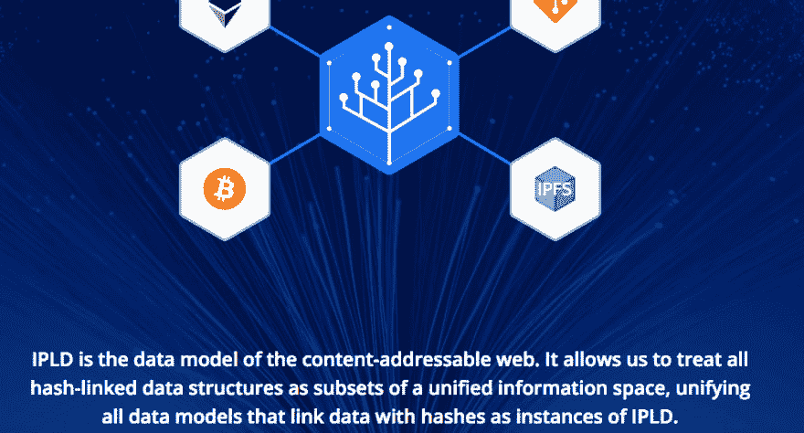

# IPLD:内容寻址网络的数据模型

> 原文：<https://dev.to/chenge/ipld-data-model-of-the-content-addressable-web-47ik>

关于链接散列数据的新思想。

URL 地址->内容地址(哈希)

[https://ipld.io/](https://ipld.io/)

有一个去中心化网络的运动，包括网络之父的一个项目。和其他包括 IPFS，喙浏览器，乳齿象归还权利的数据给用户..